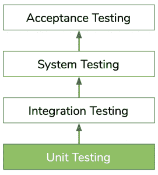
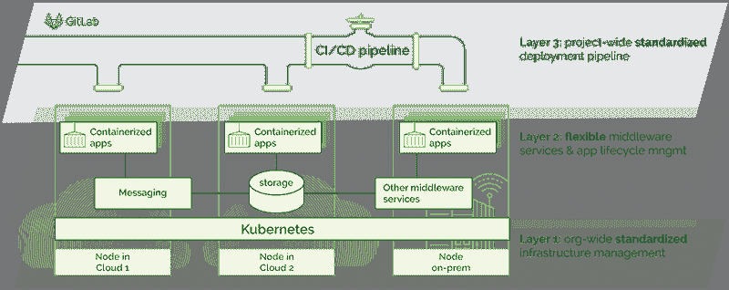
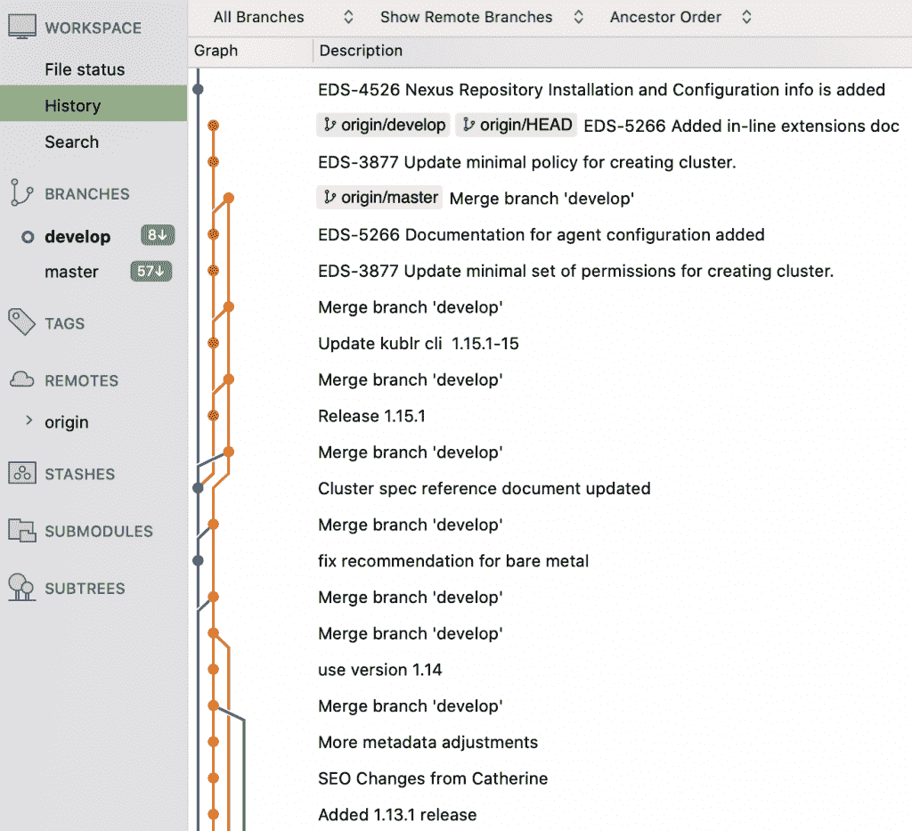

# 开发运维方法的基本构建模块|新堆栈

> 原文：<https://thenewstack.io/demystifying-devops-essential-building-blocks-of-a-devops-approach/>

这篇文章是

[ongoing series](https://thenewstack.io/author/catherine-paganini/)

来自凯瑟琳帕格尼尼，专注于为商业领袖解释 IT 概念。阅读之前的帖子

[here](https://thenewstack.io/primer-understanding-the-cloud-native-impact-on-architecture/)

.

如果您的组织利用技术作为竞争优势，那么应用程序和服务交付的 [DevOps](https://thenewstack.io/category/devops/) 方法是不可避免的。好处实在太多了。无论是创新能力、缩短上市时间，还是提高代码质量和员工满意度，如果你的竞争对手采用了这种能力，你也必须采用。但是，过渡到开发运维企业需要做些什么呢？

[在本文的第一部分](/demystifying-devops-a-peek-behind-the-digital-transformation-curtain/)，我们讨论了 DevOps 与数字化转型的关系。我们探索了它在 [DevOps](/category/devops/) 之前的样子，DevOps 是什么，以及它是如何形成的。

在本文中，我们将稍微深入一些，并概述实现 DevOps 方法需要什么，包括持续反馈的自动化测试、理想的团队结构和架构、集成安全性以及自动化平台和遥测。

## DevOps 的六个基本构件

DevOps 不仅仅是一个技术堆栈。这是一种将文化哲学、组织变革以及新工具和实践的实施相结合的方法。

这听起来像是一个庞大的事业，但是让我们把它分成六个容易理解的组成部分。

### **1。小团队，完全所有权**

传统上，代码开发涉及许多紧密耦合的团队，他们相互依赖来完成工作。等待时间是一个大问题，因为人成为不可避免的瓶颈。

另一方面，DevOps 团队结构鼓励多面手处理较小的功能，并拥有从开发到运营的整个流程。这是因为过度专业化导致多个移交和队列的孤岛，从而导致交付时间延长。这并不意味着高度专业化的工程师已经过时。相反，技术正变得越来越专业化，我们比以往任何时候都更需要专业知识。但是，你不会想要只能在一个领域做出贡献的工程师。这意味着，组织必须鼓励专业学习和成长，这样他们的员工才能成为全面的专家。

### **2。** **持续反馈的自动化测试**

在 IT 中，糟糕的结果通常是由于缺乏快速反馈。对于从事瀑布项目(敏捷之前使用的方法)的开发人员来说，在将代码发送给 QA 进行测试之前，开发一年的代码并不罕见。在游戏进行到这么晚的时候才看到测试结果，意味着开发人员可能一整年都在错误的代码上工作而不自知。可以想象，找到错误的来源并在一年后修复它并不是一件容易的事情。

解决这个问题是 DevOps 的核心。它的目的是在执行工作时提供快速的反馈循环，以便开发人员可以在错误发生时修复错误。这意味着开发人员必须能够自己执行测试，而不是依赖单独的团队来完成。这可以通过自动测试来实现，自动测试可以立即发现问题，因此可以在更多工作完成之前修复问题，并防止开发人员再次重复相同的错误。

> 系统越大，测试或投入生产的变更越多，就越难确定问题出在哪里。

通过立即识别并解决问题，而不是先解决问题，然后再解决问题，学习会得到改善。工作和反馈之间的时间间隔越长，关键信息就越有可能因记忆褪色或环境变化而丢失。

但是在引入新代码后多久测试才能发现问题呢？显然，越快越好。一个成熟的 DevOps 友好的 QA 流程依赖于所有级别的测试——从构建流程中内置的单元测试到 QA 团队运行的手动 QA 测试(仍有一些测试将是手动的)。

单元测试在这里扮演着重要的角色。单元是任何软件中最小的可测试部分，因此也是可以执行测试的最小可行代码。

经验还表明，当开发人员分担质量责任时，结果会改善，学习会加快。然而，要做到这一点，反馈必须在几分钟内出现，而不是几个月。

### **3。松散耦合架构**

在紧密耦合的体系结构中，微小的变化都会导致灾难性的失败。系统变更或更新需要与在该系统上工作的每个人密切协调，因此可能会受到影响。这导致了复杂的变更管理过程。但是即使这样，一旦代码准备好生产，来自其他组的新代码已经被引入。这意味着您不可避免地将您的代码发布到一个不同于您测试它的系统中。系统越大，测试或投入生产的变更越多，就越难确定问题出在哪里。任何变化，不管多小，都代表着风险，管理这个过程压力非常大。

面向 DevOps 的架构使小型团队能够安全快速地实现、测试和部署代码，从而提高生产力和成果。这是通过松散耦合的面向服务的架构(SOA)实现的。松散耦合意味着组件(或服务)被隔离在容器中，因此不受周围变化的影响——它们需要的一切都在容器中。它们严格通过应用程序编程接口(API)进行交互，不共享数据结构或数据库模式。其结果是:一个有界限的上下文，有划分的和定义良好的接口，提高了灵活性和可伸缩性，即使在拥有数千名开发人员的大型企业中，所有开发人员都不断地将代码部署到同一个系统中。

### **4。生产中应用反馈的遥测技术**

当你在生产中有代码时，事情*就会*出错——这是无法避免的。要解决这个问题，你首先需要确定源头，而要做到这一点，你需要数据。

过去，它会一个接一个地重启服务器，直到问题被解决。虽然这听起来很疯狂，尤其是如果您正在处理任务关键型应用程序，但这是让系统重新启动并运行的最快选择。记录和监控工具没有那么复杂，所以它没有必要的遥测技术(即数据)来快速指出可能的来源。重启是恢复服务的最快方式，所以他们就这么做了。

今天，事情发生了巨大的变化。新的日志记录、监控和警报工具有助于 IT 了解影响因素并尽早发现问题，最好是在客户受到影响之前。这些工具持续自动地收集并向监控工具发送测量值和指标。如果出现偏差，系统会发出警报，以便他们进行调查。有了足够的数据点，IT 可以确认服务何时正常运行，并在出现问题时进行标记，以便立即采取纠正措施。设置这些工具并通过仪表板向整个团队可视化遥测是 DevOps 的一个关键方面。

### **5。持续的全组织学习**

尽管我们的目标是在问题被部署之前捕捉到它们，但是错误确实会溜走。这就是为什么开发人员必须能够自我诊断问题，解决问题，并在整个组织中分享经验教训。对于后一种情况，您需要开发一个学习系统，在其中捕获错误和预防措施，并在整个 IT 部门进行访问，目标是成为一个有弹性的组织。

### **6。DevSecOps:在您的 DevOps 方法中构建安全性**

DevOps 开始时没有考虑到的一个关键方面是安全性。DevSecOps 趋势正在通过扩展 DevOps 方法并将安全性集成到开发人员和运营人员的日常工作中来纠正这一问题。

开发、运营和 infosec 之间的典型人员比例约为 100:10:1。您可能想知道，一个人怎么可能确保一百个人构建的系统是安全的。答案是事后合规检查。一旦代码被开发人员和运营人员认为可以部署，infosec 就会对其进行检查。如果发现了问题——这种情况经常发生——工作就会被送回返工。显然，不断来回发送工作的过程是低效的、昂贵的，并且在团队之间制造紧张。

解决这个问题需要 DevOps 介绍的相同方法。DevOps 确保运营要求从第一天起就已内置。现在必须对安全需求做同样的事情——这是 DevSecOps 的要点。它通过与所有其他自动化运营测试一起运行的自动化 infosec 测试，将开发运维自动化并集成到开发和运营中，从而扩展了开发运维的安全性。此外，infosec 和开发人员在早期就进行合作，以确保从一开始就达到安全性和法规遵从性目标。

## DevOps 入门:您的工具包

要成功实施 DevOps 方法，上述所有领域都是关键。虽然 DevOps 是关于小团队的，他们从头到尾都在开发小功能，鼓励他们从错误中学习，并在整个组织中分享，但如果没有合适的 DevOps 工具包，这一切都是不可能的。您需要:

1.  将你的应用程序容器化，并开始重构它们，这样它们就会被慢慢分解并彼此分离。
2.  **构建云原生基础设施平台**，您的应用将在该平台上运行，这允许按需创建环境。
3.  **用自动化测试构建部署管道**，以验证代码按计划运行。
4.  **在所有平台内建立集中的记录和监控工具**以收集准确的遥测数据。

因此，第一步是让您的遗留应用程序与云本机兼容。你需要把它们装箱，并开始分解它们。没有必要重建它们。相反，您将首先开始重构小而安全的组件，一旦您有了信心，您将转向更关键的部分。其余的可以保持原样，因为你开始(但集装箱！).然后，您可以按优先顺序迭代地重构它们。(要了解关于这种方法的更多信息，请阅读[这篇关于传统应用程序现代化的文章](/modernize-legacy-applications-keep-update-re-write-needs-re-written/)。)

这就引出了下一步，构建您的企业平台:

### **用于提高开发效率的集中式 DevOps 平台**

为了支持 DevOps 团队结构，需要一套全新的集中式平台和服务。开发人员必须能够独立地创建类似生产的环境、运行测试和部署代码——所有这些都应该(理想地)是自动化的，并且可以随需应变。任何团队都不应该依赖 QA 或运营来继续他们的工作。DevOps 的一个关键目标是消除人的瓶颈。

开发和维护这些平台和工具是真正的产品开发，需要时间和资源——特别是如果你做得对的话。但是，正如 DevOps 年度报告一次又一次证明的那样，这种努力是值得的。

### 类似 Kubernetes 的按需生产环境

传统上，开发人员必须向运营团队请求试运行或测试环境——这种请求会排在一个(长)队列中。等待几周，有时甚至几个月来获得一个环境是完全正常的。

类似按需生产的环境消除了这一瓶颈。通过 UI，开发人员可以根据需要构建环境。这些已由运营部门预先配置，以模拟生产参数，从而能够在类似生产的条件下进行开发和测试。这是通过基础架构管理平台实现的，该平台远远超出了按需创建环境的范畴。虽然它的主要目标是确保可靠、安全的应用程序部署，但它也应该为开发人员提供自助服务能力。你希望测试和生产的条件是一样的，记得吗？因此，应该使用相同的工具包来创建所有的环境。

如果你经常与它交谈，你可能听说过 Kubernetes。这正是它适合的地方。Kubernetes 是当今大多数云原生架构的核心。Kubernetes 是一个具有不可思议吸引力的开源项目，它运行在您的整个基础设施上，管理底层资源，就像某种数据中心操作系统一样。(要了解更多信息，请参考我们的 [Kubernetes 初级读本](https://thenewstack.io/primer-how-kubernetes-came-to-be-what-it-is-and-why-you-should-care/)。)

IT 可以在内部构建这样一个平台(由于资源限制和缺乏内部专业知识，大多数公司都不这么做，因为 Kubernetes 对大多数公司来说还是个新手),也可以选择一个供应商支持的平台。例如，Kublr 是一个[企业级的 Kubernetes 平台](https://kublr.com/)，它不会损害 Kubernetes 固有的灵活性和开放性。无论你选择哪一个 Kubernetes 平台，永远不要牺牲这些关键特征——它们将使你能够适应市场需求。

### 构建部署管道或持续集成、持续交付(CI/CD)

在 IT 中，多个开发人员通常并行处理系统的不同部分。每个开发人员都在他们自己的“分支”上工作，这些分支最终必须与版本控制“主分支”集成，在将所有开发人员的所有更改推入生产之前，这些更改将被合并(见下图，不同的开发分支和蓝色的主分支)。开发人员在他们自己的分支上工作的时间越长，集成他们的变更就越困难。这是因为当不同的开发人员提交他们的代码时，master 是不断变化的。因此，开发人员等待提交代码的时间越长，主代码的变化就越大，出现问题的可能性就越大。这是**持续集成**解决的痛点。

Kublr 文档页面的不同分支:蓝色是主分支，所有其他的是单独的开发分支。开发人员在他们自己的工作站上工作，并在一天中或一天结束时多次合并他们的更改。

为了缓解这些集成问题，CI 关注两件事:

*   **增加集成频率，减少批量**(提交的代码量)。虽然集成问题是不可避免的——毕竟主模块一直在发展——但是持续地将代码集成到主模块中，会导致早期的问题检测(借助于具有高代码覆盖率的单元测试)。早期检测非常重要，尤其是当您只调试几行代码时。
*   **自动化部署管道**使开发人员能够运行快速、自动化的测试，验证他们的代码与所有依赖项一起工作，并且可以提交给主程序。自动化测试是 CI 的核心，没有它们，就没有 CI。

**连续交付，CI/CD 的**CD 部分，通过自动化的产品验收测试来扩展部署管道，以验证代码处于可部署状态。如果通过，代码将自动投入生产。CD 的目标是使开发人员能够将代码自行部署到生产环境中，并获得即时反馈，从而快速修复任何潜在的问题，而无需进行操作。

为了增加工作流(CI/CD(以及一般的开发运维)的核心目标)，部署应该在没有任何手动步骤或移交的情况下理想地完成。

## 齐心协力

正如我们所看到的，DevOps 是关于文化改变的:小团队从开始到结束致力于小项目，同时关注全球目标。DevOps 工具用于强化这种文化，并加速期望的行为。显然，人类行为的改变是必需的。为了取得成功，你需要完全的领导认同和自上而下的强化。

在技术方面，如果您没有内部专业知识或资源，您可以利用诸如 [Kublr Accelerators](https://kublr.com/monolith-to-microservices/) 等项目，在这些项目中，专家团队将帮助您过渡到新的堆栈并构建所需的平台。无论你做什么，确保你建立一个模块化的，开放的架构。今天的开源、云原生技术提供了一个[巨大的机会来构建灵活的系统](/primer-understanding-the-cloud-native-impact-on-architecture/)，让你能够适应市场需求。不要为了今天的几个月而危及长期的机会。

*像往常一样，非常感谢 [Oleg Chunikhin](https://www.linkedin.com/in/olegch/) 帮助我们获得所有技术细节。*

### 来源:

*   Gene Kim、Jez Humble、Patrick Debois、John Willis 撰写的《DevOps 手册》 (2016)。
*   ….当然，还有 Kublr 团队的聪明才智。

<svg xmlns:xlink="http://www.w3.org/1999/xlink" viewBox="0 0 68 31" version="1.1"><title>Group</title> <desc>Created with Sketch.</desc></svg>