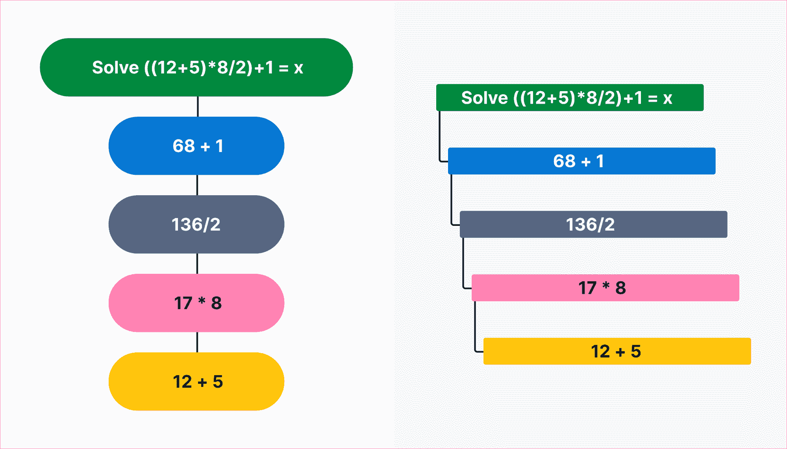
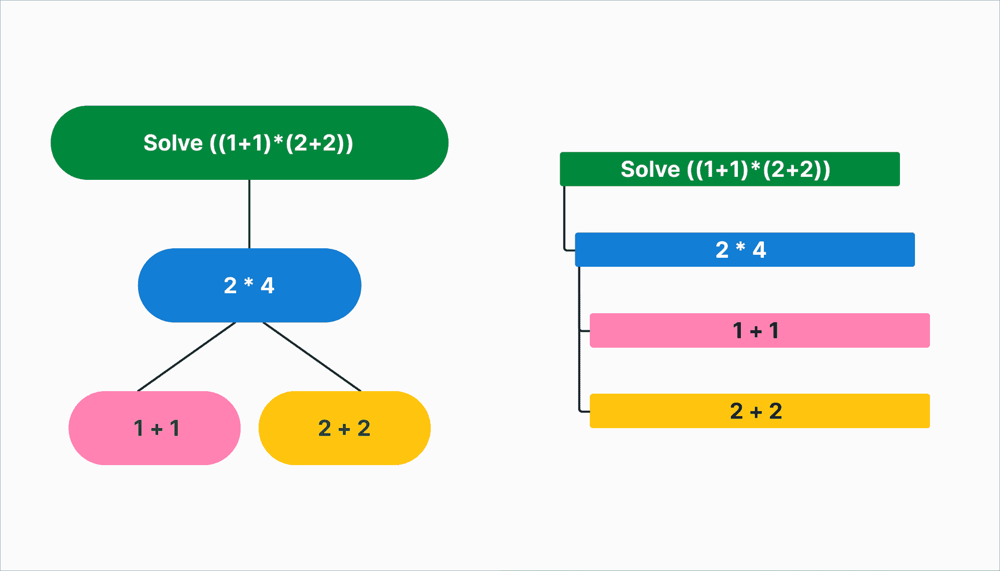

# 揭开 OpenTelemetry 中分布式轨迹的神秘面纱

> 原文：<https://thenewstack.io/demystifying-distributed-traces-in-opentelemetry/>

这是分布式跟踪系列的一部分。要获得本系列的其他文章列表，请查看

[the introductory post](https://thenewstack.io/distributed-tracing-why-its-needed-and-how-it-evolved/)

.

[Lightstep](https://lightstep.com/) 赞助本帖。

 [奥斯汀·帕克

Austin Parker 是 Lightstep 的主要开发人员，也是 OpenTracing 和 OpenTelemetry 项目的维护者。除了他的专业工作之外，他还教授大学课程，谈论 DevOps 和分布式追踪的所有事情，甚至还抽空开了一个播客。Austin 还是 O'Reilly Media 出版的《实践中的*分布式追踪*的合著者。](https://www.linkedin.com/in/austinlparker/) 

又见面了！到目前为止，本系列已经讨论了很多关于分布式系统的内容——它们是什么，它们来自哪里，它们为什么受欢迎，以及它们可能导致的问题。今天，我想深入了解一种可以用来理解它们的特殊技术:分布式跟踪。具体来说，我们将关注分布式跟踪，因为它是由 [OpenTelemetry](https://opentelemetry.io/) 项目实现的，该项目是一个供应商中立的开源系统，用于生成遥测数据。

那么，让我们从头开始。什么是痕迹？跟踪是请求中涉及的所有服务所做工作的表示。跟踪有一些独特的属性——你可以把它们想象成一个没有循环的*树*数据结构。因此，对于每个轨迹，只有一个起点——根跨度*——和潜在的多个叶跨度*。然而，当我们可视化一个轨迹时，我们通常认为它是一个*冰柱图*(或者，一个倒置的火焰图，如果你想这么想的话)**

 **火焰图是可视化分层数据的有用方法。它们通常用于可视化分析数据，如 perf 或 dtrace 的输出，这些分析工具用于收集进程的性能数据，如每个函数调用需要多长时间。*

是什么组成了这些可视化？您可以将跟踪看作是与您的应用程序相关的某种*动作*——比如注册一个新的用户帐户，点击待办事项列表上的“完成”复选框，或者获取一个值表。这些操作中的每一个都可能涉及到应用程序的一个或多个组件执行一些工作，并且这些工作会随着时间的推移而发生。我们称这些较小的部分为*跨度*。在跟踪可视化中，每一行都是一个跨度，其长度对应于它完成的时间量(相对于根跨度)。每个 span 还有一个名称，代表它正在执行的任务。

一个与计算机无关的例子怎么样？我们可以将许多东西表示为轨迹——任何不循环回自身的有序操作都可以绘制成一棵树。以下面的数学等式为例:

((12+5)*8/2)+1 = x

我们可以通过考虑我们的操作顺序来将它表示为一条轨迹:



用树(左)和冰柱图(右)表示的相同轨迹

在这种情况下，我们的根跨度将是我们试图完成的动作(求解 x ),它的每个孩子将代表求解它的一个步骤。每个跨度之间的视觉关系也值得注意——每一步都显式地依赖于它前面的一步(毕竟，如果不先求解前面的每一步，我就无法求解方程的最外面部分)。然而，踪迹也可以模拟可以独立发生的工作——例如，如果我们的等式是((1+1)*(2+2))会怎么样？



请注意，在这些解决我们的方程的可视化中，并行工作的不同之处。

由于最内层求和的结果相互不依赖，它们可以被表示为出现在轨迹的同一层。然而，这些关系通常是从底层的跟踪数据中推断出来的，可以从附加到每个跨度的元数据中得到一些帮助。这就是跟踪的真正力量发挥作用的地方——创建丰富的、充满细节的、可以关联和分析的范围的能力使分布式跟踪成为如此有用和必要的工具。

那么，*真实的*轨迹中有什么呢？嗯，看情况吧！痕迹可以很简单，也可以非常复杂。它们可以显示几个或几千个操作。关于轨迹要记住的是，轨迹的复杂程度取决于它所代表的工作。每个轨迹都是从跨度中构建的。正如我前面所说的，这些跨度应该代表发生在*一个*服务和唯一一个服务中的一个不同的工作单元。至少，一个 span 将包含几个必需的属性:它的名称，唯一标识 span 的 *span 上下文*，以及开始和结束时间戳。范围还可能包含属性—这些是用户可配置的元数据，有助于您以后对范围进行分类、排序、过滤和搜索。一个区间可以包含事件，这些事件是关于区间生命周期内发生的事情的带时间戳的消息。span 还包含一些特定于 span 的元数据，比如它们的父 span 的标识符，或者一个值来指示 span 是代表客户端还是服务器正在完成的工作。

## 打开遥测、跨度和您

我们将使用 [OpenTelemetry](https://opentelemetry.lightstep.com/) 作为本文以及本系列其余部分描述更多技术概念的基础。但是请记住，虽然其中一些是特定于那个项目的，但是这里的核心概念和思想通常可以转移到其他基于 span 的分布式跟踪系统。

让我们通过想象一个来自 web 服务器的 span 看起来像什么来稍微具体地讨论这个问题。我们可以将 web 服务器的工作抽象为一个程序，它在给定的网络端口上监听请求，并用请求的数据或错误消息来响应它们。对于 web 服务器来说，span 看起来像什么？最简单的是一个跨度，代表从服务器收到请求到完成向客户机发送响应的所有工作。这些时刻将形成跨度上的开始和结束时间戳。我们还需要给 span 一个名称。这个名称应该是我们以后可以用作“分组键”的东西——它需要是人类可读的，并且应该允许我们将特定的*类*跨度分组在一起。如果我们的 web 服务器正在查找文件并将它们返回给客户机，那么建议所请求的路径可能是一个好名字是合理的。考虑到这一点，如果我们用对象符号写出来，我们的基本跨度会是什么样子呢？

```
{  
  “Name”:  “/content/post42.html”,
“spanId”:  <64  bit id>,
  “traceId”:  <128  bit id>,
  “parentSpanId”:  null,
  “startTimestamp”:  <some utc timestamp>,
  “endTimestamp”:  <another utc timestamp,  after startTs>
}

```

可以说，这只是谜题的一半。有一个跨度很好，但是真正有趣的问题是:“我能从中学到什么？”不幸的是，现在你学不到那么多，但比你想象的要多。想知道那个服务器上最流行的网址是什么？你可以收集一周的数据，然后对这个名字进行频率分析。您还想知道每个请求需要多长时间吗？这也很容易获得——您可以使用开始和结束时间戳来计算持续时间。然而，我们真正需要的是添加*属性*和*事件*，以便能够提出更有趣的问题。

属性就是它听起来的样子——一段描述其所属范围的数据。如果您考虑我们这里的示例，我们可能想知道很多数据——我们的响应的状态代码是什么，请求的 HTTP 方法是什么，响应中传输了多少字节，请求的查询字符串中是否有任何参数……等等。属性是这些数据存在的地方。事件可以被认为是离散的…嗯，*事件，*当一个 span 执行时发生的事件。如果我们的 web 服务器碰巧遇到了意外错误，那么这将是一个很好的事件候选。如果我们试图访问一个文件并将其返回给用户，但由于权限不正确而无法访问，该怎么办？那也将是一件好事。事件应该是人类的诊断数据——错误消息、堆栈跟踪，或者仅仅是关于我们的软件中发生了什么的信息性消息。让我们给我们的 span 添加一些属性，看看它是什么样子的。

一切都很顺利的时期:

```
{  
  “Name”:  “/content/post42.html”,
“spanId”:  <64  bit id>,
  “traceId”:  <128  bit id>,
  “parentSpanId”:  null,
  “startTimestamp”:  <some utc timestamp>,
  “endTimestamp”:  <another utc timestamp,  after startTs>,
  “Attributes”:  [
  {  “http.method”:  “GET”  },
  {  “http.status_code”:  200  }
  ]
}

```

事情进展不顺利的一段时间(我们试图访问一个我们无权访问的文件):

```
{  
  “Name”:  “/secrets.html”,
“spanId”:  <64  bit id>,
  “traceId”:  <128  bit id>,
  “parentSpanId”:  null,
  “startTimestamp”:  <some utc timestamp>,
  “endTimestamp”:  <another utc timestamp,  after startTs>,
  “Attributes”:  [
  {  “http.method”:  “GET”  },
  {  “http.status_code”:  403  }
  ],
  “Events”:  [
  {  
“name”:  “could not open file due to insufficient permissions”,
  “Timestamp”:  <utc timestamp>,
  “Attributes”:  [  …  ]
  }
  ]
}

```

现在我们已经添加了这些属性，我们的跨度变得更加有用。我们可以问这样的问题，“成功的最慢的百分之五的 POST 请求是什么”或者“当有人试图访问这个特定的 URL 路由时，发生了多少个 500 错误。”随着我们添加更多的属性，问题的复杂性会增加。在我们提出的问题中，属性变成了副词——重要的修饰语，允许我们从我们的跟踪数据中获得洞察*。*

 *跨度本身并不十分有趣。实际上，单个 span 可以简单地认为是一个结构化的日志语句——它以可重复的、已知的方式描述了一个请求。然而，当您创建越来越多的跨度，并通过*传播*它们的跨度上下文将它们连接在一起时，分布式跟踪就有了用武之地。这是如何工作的，通过什么机制？如何将分布式跟踪添加到现有的或新的软件中？我们将在本系列的下一部分讨论这些问题，敬请关注！

通过 Pixabay 的特征图像。

目前，新堆栈不允许直接在该网站上发表评论。我们邀请所有希望讨论某个故事的读者通过 [Twitter](https://twitter.com/thenewstack) 或[脸书](https://www.facebook.com/thenewstack/)访问我们。我们也欢迎您通过电子邮件发送新闻提示和反馈: [feedback@thenewstack.io](mailto:feedback@thenewstack.io) 。

<svg xmlns:xlink="http://www.w3.org/1999/xlink" viewBox="0 0 68 31" version="1.1"><title>Group</title> <desc>Created with Sketch.</desc></svg>**