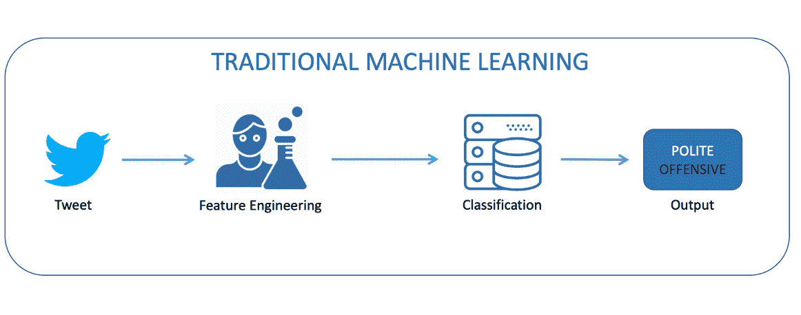

# 揭开机器学习的神秘面纱:ML 如何发现新信息

> 原文：<https://thenewstack.io/demystifying-machine-learning-how-ml-discovers-new-information/>

[Levon Paradzhanyan](https://www.linkedin.com/in/lparajanoff/)

[Levon 是 EastBanc Technologies 的一名软件工程师和架构师，他在软件开发领域已经工作了 14 年多。最近，他越来越多地参与数据科学和人工智能项目。Levon 对当前的技术发展感到兴奋，并热衷于将他们的力量传播给更广泛的商业和 IT 社区。](https://www.linkedin.com/in/lparajanoff/)

*这篇文章是由 [Levon Paradzhanyan](https://www.linkedin.com/in/lparajanoff/) 撰写的系列文章的一部分，该系列文章揭示了数据科学、机器学习、深度学习和人工智能，同时解释了它们如何相互联系。*

在本系列的第一部分中，我们[定义了数据科学，并探讨了数据科学家的角色](https://thenewstack.io/primer-demystifying-data-science/) —包括数据准备、建模、可视化和发现。我们还介绍了与数据科学家密切合作的机器学习工程师的角色。

在本文中，我们将关注机器学习(ML ),并探索计算机如何在没有显式编程或指导学习过程的流程和逻辑的情况下从数据中学习。或者计算机如何从任何数据中发现和学习模式和相关性——不管它来自哪里或关于什么。然后，机器可以使用这些模式和相关性来执行特定的任务，提供预测/描述性分析，或者从不断变化的环境中自主学习。ML 能做的事情真是太神奇了！

在高层次上，ML 使用特殊的算法和统计分析来基于样本数据(通常是历史数据，称为训练数据)创建 ML 模型。这些 ML 模型用于对新数据进行预测或决策，而无需显式编程。

ML 可以迫使计算机从数据中学习，而无需编程或指导学习过程的流程和逻辑。它可以从数据中发现和学习模式和相关性，无论数据来自哪里或数据是关于什么的。它可以使用这些模式和相关性来执行特定任务，提供预测/描述性分析，或者从不断变化的环境中自主学习。

ML 的主要目标是使计算机的学习过程自动化，消除人工干预。ML 的用例意义深远，功能强大。

## 机器学习与数据科学

**数据科学**是多个学科的广义术语，帮助数据科学家从商业角度收集和理解数据。它还包括清理、转换和准备用于构建预测性或描述性 ML 模型的数据。

**然而，机器学习**是一套算法和统计分析，允许创建计算机用来学习的 ML 模型，而无需显式编程或指导学习过程。

通过这种方式，机器学习帮助数据科学家分析数据，并创建预测/描述模型。换句话说，机器学习是数据科学的一项功能，也是数据科学家在数据处理方法中用来解决特定任务或问题的重要工具。

## 机器学习——学习方法

计算机可以通过多种方式从数据中学习。机器学习算法分门别类。这里仅举几个例子让你了解一下:

### **监督学习**

在这种方法中，人类专家充当教师，并用正确的答案(预期输出)丰富训练数据。计算机根据正确的答案学习模式。这种类型的训练数据也称为标记数据。这种方法产生了一个预测模型。

### **无监督学习**

在这种情况下，计算机从排除正确/期望答案的未标记数据中学习。你可以猜到，这里不需要老师。这种方法主要用于发现数据中的模式，并发现新的有意义的见解。

### **特征学习**

提高 ML 模型性能的最可靠的方法之一是用尽可能多的数据来训练它。但是挖掘标记数据可能是一个非常昂贵和耗时的过程。如果您可以访问大量未标记的数据，那么您可以使用特征学习技术来实现新特征的自主发现，而不是手动设计它们。在 ML 中，特征被定义为单个可测量的属性或被观察现象的特征。

正如我们所见，ML 是一组算法和统计分析，用于创建 ML 模型，允许计算机在没有特定指令的情况下进行学习。我们区分有监督的、无监督的和特征学习，但是还有许多其他的学习类别。然而，ML 仍然需要一个数据科学家来完成诸如手动识别和创建新特征的任务。你的模型的好坏取决于它所基于的假设。因此，你需要一个专家来确保它得到适当的训练。

在我们的下一篇文章中，我们将探索深度学习和人工智能，以及它如何使计算机在没有人类干预的情况下进行学习，达到接近人类的性能，有时甚至超过人类。

通过 Pixabay 的特征图像。

<svg xmlns:xlink="http://www.w3.org/1999/xlink" viewBox="0 0 68 31" version="1.1"><title>Group</title> <desc>Created with Sketch.</desc></svg>