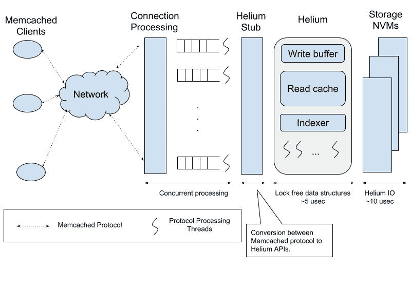
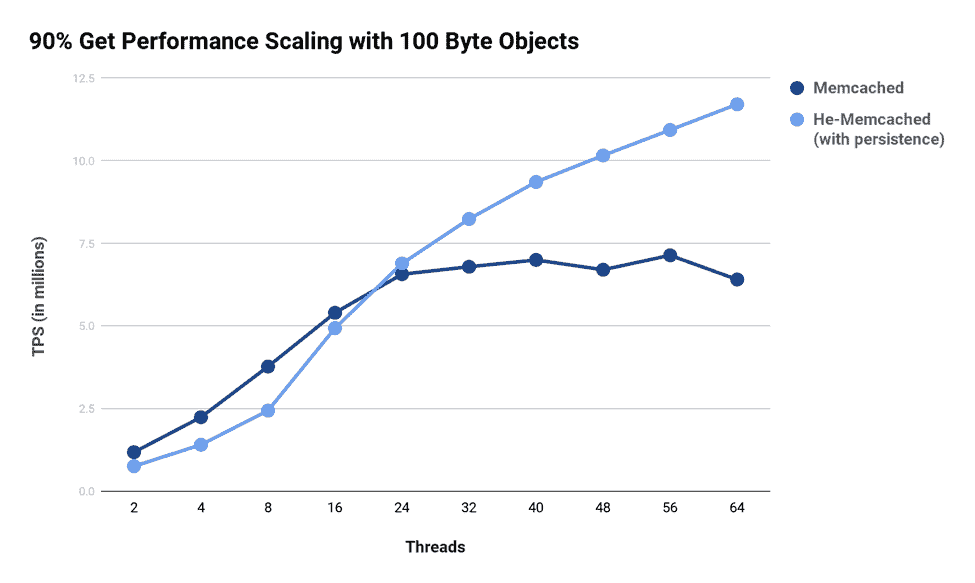
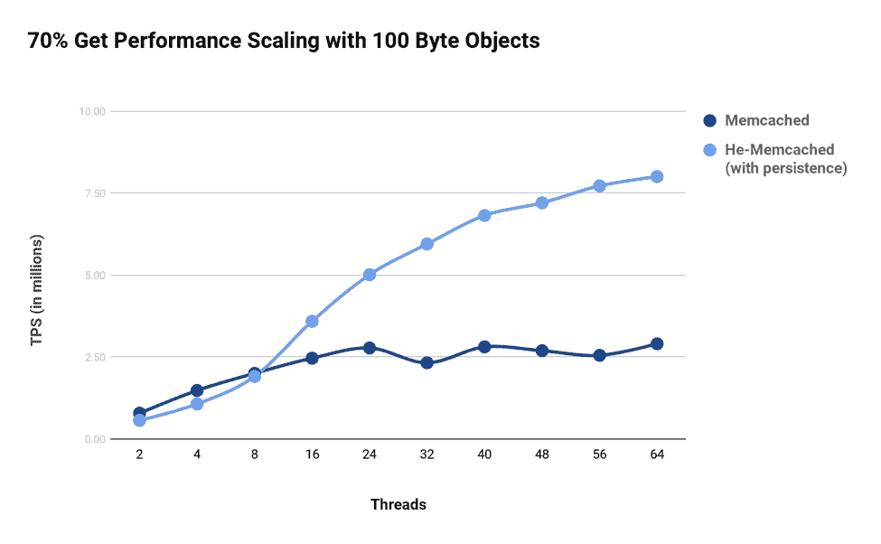

# 使用非易失性内存的密集 Memcached

> 原文：<https://thenewstack.io/dense-memcached-non-volatile-memory/>

 [西达尔特(Sid)乔杜里

西达尔特(Sid)乔杜里是 Levyx 的工程主管，Levyx 是一家总部位于社会的初创公司，致力于高性能计算、快速存储和数据的交叉创新。Sid 的兴趣在于操作系统、存储和基础设施领域。Sid 从加州大学欧文分校获得了计算机科学博士学位。他是闪存、操作系统和嵌入式系统领域研究论文的作者和评论者。](http://www.levyx.com/) 

[Memcached](https://memcached.org/) 是一个流行的内存键值存储，部署在数据库前面，通过[缓存结果](https://en.wikipedia.org/wiki/Memcached)来加速常见查询。作为内存加速器，Memcached 服务器的性能和 RAM 使用在大规模运行时至关重要。以每秒事务数(TPS)衡量的性能直接影响 Memcached 服务器可以处理的并发客户机请求的数量。另一方面，RAM 的使用是以每个对象的内存开销(即元数据开销)来衡量的，它限制了 Memcached 服务器可以缓存的对象数量。针对上述指标优化 Memcached 一直是学术界和工业界积极研究的领域。

改进 TPS 需要扩展 Memcached 服务器实例，这会产生额外的云实例成本和相关的管理开销。改善内存开销需要提供高内存实例，这通常具有较高的成本/小时比率。根据脸书的报告，内存开销对于支配 Memcached 查询的小对象(大约 32 字节的键)尤其重要。另一种方法是构建我们所说的“密集 Memcached ”,它利用了高内核数和非易失性内存(NVM)的优势。

## 密集 Memcached

NVM 的出现提供了一个重新思考 Memcached 架构以提高软件性能的机会。在我们看来,“密集 Memcached”实例可以:

1.  通过高核心数实例进行扩展。例如，Memcached 的当前方法是产生超过 8 个线程的多个服务器实例，以实现性能扩展。
2.  使用内存和 nvm 进行缓存。这支持以亚毫秒级访问延迟访问数百 GB 至数 TB 的存储，同时提供高 TPS。

注意，(I)吞吐量瓶颈和元数据足迹都是由于软件限制造成的，因此可以改进；以及(ii)可以利用高核心数实例和延迟数十微秒的 nvm 的可用性来构建密集的 Memcached 实例。

## 密集内存缓存的设计

我们[利用](https://cloudplatform.googleblog.com/2015/07/Multi-million-operations-per-second-on-a-single-Google-Cloud-Platform-instance.html)氦，我们的键值存储，构建了一个密集 Memcached 的实现。Helium 是一个高吞吐量、低延迟、低内存键值存储，是为现代多核处理器和 nvm 从头开始编写的。核心氦库是一个嵌入式键值存储，因此与 RocksDB 属于同一类别。

我们从一个简单的设计开始，Memcached set 命令存储在内存中，并作为键值对写入到 Helium 中。在 get/read 路径上，首先在缓存中检查一个键，然后在 Helium 数据存储中检查。在这种幼稚的方法中，尽管容量增加带来了额外的好处，但很快就发现 Memcached 是扩展到 32 个线程或更高线程时的瓶颈。Memcached 遇到的伸缩和同步问题是 Memcached 的缓存算法所固有的。此外，这种方法与使用 Memcached 作为后端持久数据库的前端缓存没有太大的不同。

> 硬件的最新趋势提供了重新思考 Memcached 架构的机会，不仅可以提高软件性能，还可以充分利用 nvm 的优势。

在第二种方法中，我们使用 Helium 作为键值存储，前端基本上是 Memcached 网络处理和协议解析。这种方法利用了键值存储和 Memcached 的优势，即 Memcached 的低延迟网络处理路径和命令/协议处理成熟度，以及 Helium 的可伸缩性、低内存索引和快速 IO 路径。

下图显示了使用氦的密集 Memcached 的总体设计。请注意，使用 nvm，如英特尔的 [3D Xpoint(又名英特尔 Optane)和三星](https://www.intel.com/content/www/us/en/architecture-and-technology/intel-optane-technology.html)的 [z-SSD，可以使硬件延迟几十微秒。Helium 的软件开销也在类似的范围内(即几微秒),这使它成为一种有效的解决方案。](https://www.samsung.com/us/labs/pdfs/collateral/Samsung_Z-NAND_Technology_Brief_v5.pdf)

图:氦 Memcached 架构

## 优势

我们将这个版本的密集 Memcached 称为“He-Memcached”，其优点如下。

### 单实例缩放

He-Memcached 的单个实例随着内核/线程数量的增加而扩展。另一方面，由于固有的锁定和同步，Memcached 很难扩展到 8 到 16 个线程。例如，在 90:10 (get:set)的比率下，Memcached 有伸缩性问题，这是由于在写(set)路径上其核心数据结构中的锁定/争用。单个 Memcached 服务器实例的伸缩很重要，因为它支持任何云实例类型的供应。这降低了管理的复杂性，例如分区，从而通过将多个 Memcached 实例聚合到一个统一的内存空间中，更有效地使用服务器内存。

设置:服务器英特尔至强 88 CPUs 存储英特尔 Optane 750 GB10GbE 网络上的 memtier 性能指标评测。

如上图所示，对于以 get 为主的工作负载，Memcached 的伸缩性能是可以忍受的。然而，对于具有更大百分比的集合的工作负载，Memcached 的写路径中的锁争用变得越来越明显。对于一个常见的 70:30 (get:set)比率的工作负载，Memcached 线程伸缩的结果如下图所示。我们可以看到,“密集 Memcached”实施克服了 Memcached 中存在的两种工作负载的扩展问题，同时提供了持久性(在本例中使用了英特尔 3D Xpoint NVMe 存储)。

设置:服务器英特尔至强 88 CPUs 存储英特尔 Optane 750 GB10GbE 网络上的 memtier 性能指标评测。

### 坚持

作为键值存储，氦将存储视为一等公民。将氦作为存储引擎集成到 Memcached 中带来了持久性以及相关的性能优势。例如，使用无锁数据结构和针对 nvm 优化的 I/O 路径，写入氦核以访问索引器(即，密钥)及其相关数据(即，值)。当 NVM 延迟在 10 微秒范围内时，数据访问(软件)开销很重要。无锁索引和优化 NVM 访问的使用导致软件延迟几微秒，与 10 微秒的 NVM 延迟相匹配。

虽然对 NVM 上的对象的这种访问延迟仍然高于内存访问(以纳秒为单位)，但重要的是要注意到— (i)这优于内存缓存未命中，然后通过网络访问数据库，这通常是几毫秒的量级，以及(ii)整体 TPS 是缓存(内存命中)和 NVM(内存未命中)的混合。本质上，目标是使实际数据库成为“二级”未命中，一级和二级未命中是内存和 NVM。

### 降低索引开销

Memcached 的元数据开销是每个对象 56 字节。对于氦，我们将其减少到 22 字节。当缓存数以亿计的对象时，34 字节的开销差异可能会转化为几千兆字节的内存/存储减少。

## 摘要

借助高核心数实例和 nvm(如英特尔 3D XPoint 和三星 Z-SSD)的可用性，开发密集型 Memcached 解决方案非常经济。随着密集 Memcached 实现的发展，我们设想性能瓶颈现在转移到 10 GbE 网络。

总之，大多数收益来自以下方面:

*   Helium 中的无锁索引对于混合的 set-get 工作负载表现良好。
*   删除具有同步和元数据开销的 LRU 列表。
*   移除 GC 和 hash 负载平衡器线程。这由氦的内置 GC 负责。
*   通过使其无锁来简化片分配器。
*   依靠氦作为索引和 IO 路径。
*   使用氦气作为发动机:
    *   用 C 语言编写，因此没有语言内存管理停顿的开销。
    *   绕过文件系统对 nvm 执行直接 IO，以获得最佳延迟。
    *   依赖于现代并行处理最佳实践，如无锁数据结构、自旋锁等。

通过 Pixabay 的特征图像。

<svg xmlns:xlink="http://www.w3.org/1999/xlink" viewBox="0 0 68 31" version="1.1"><title>Group</title> <desc>Created with Sketch.</desc></svg>