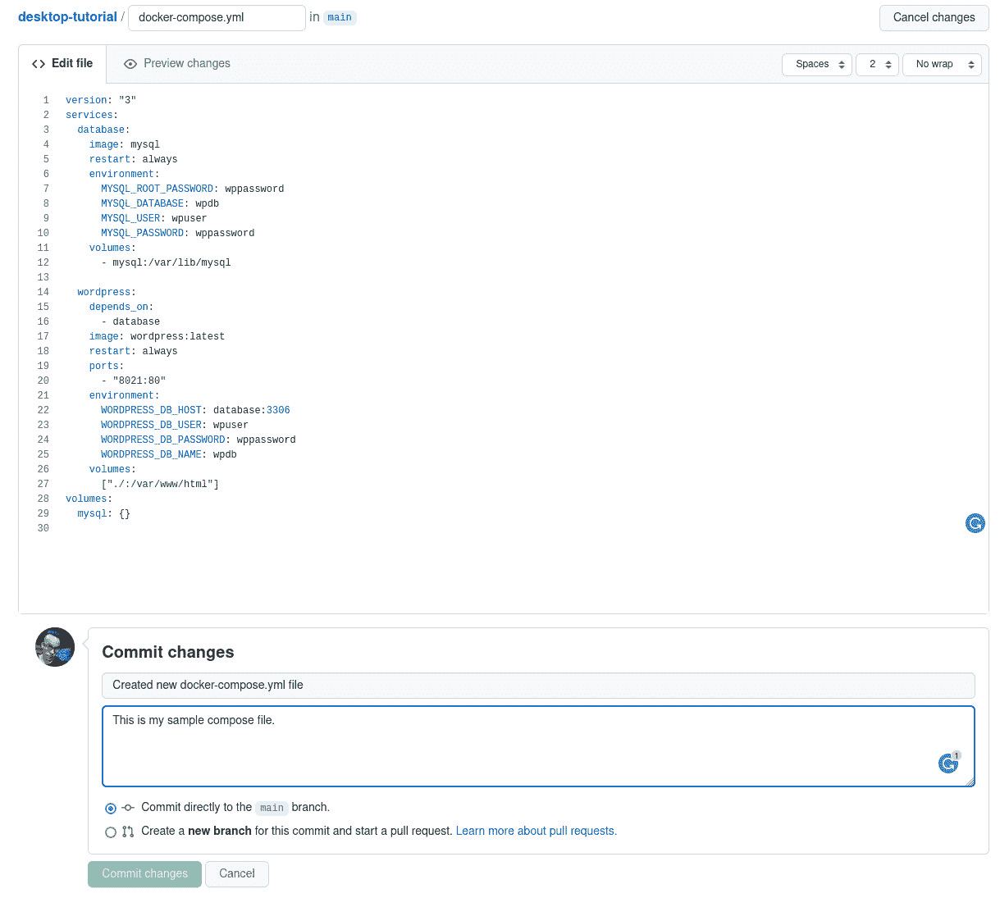
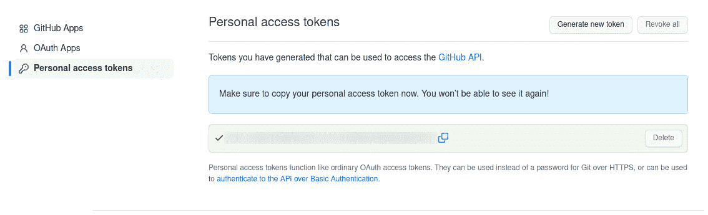
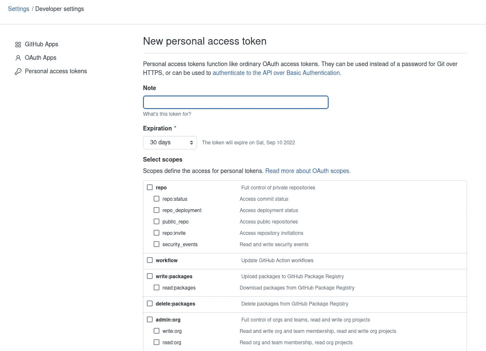
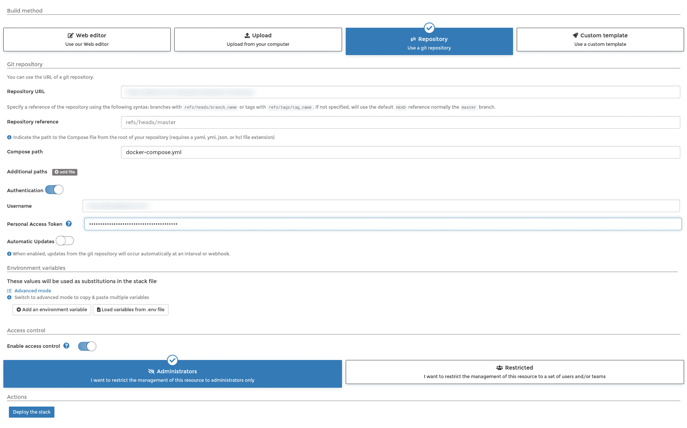
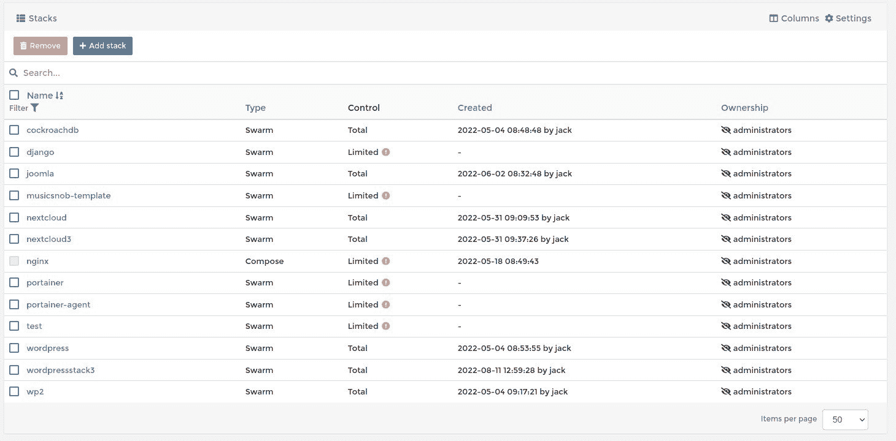

# 从 GitHub 存储库在 Portainer 中部署容器堆栈

> 原文：<https://thenewstack.io/deploy-a-container-stack-in-portainer-from-a-github-repository/>

我已经公开了 [Portainer](https://www.portainer.io/) 是独立 Docker 实例和 Docker Swarm 的首选容器管理器。这个基于 web 的平台是迄今为止用于管理容器化部署的最强大、最灵活、最可靠的 GUI 工具。

我已经向您介绍了 [Portainer](https://thenewstack.io/an-introduction-to-portainer-a-gui-for-docker-management/) ，向您展示了如何[部署全栈应用](https://thenewstack.io/deploy-a-full-stack-application-with-portainer/)，如何[创建和使用卷](https://thenewstack.io/how-to-create-and-use-container-volumes-within-portainer/)，[管理机密](https://thenewstack.io/container-security-manage-secrets-with-portainer/)，如何[添加 Kubernetes 环境](https://thenewstack.io/portainer-how-to-add-a-kubernetes-environment/)，甚至[如何部署 Portainer 的最新版本](https://thenewstack.io/how-to-deploy-the-latest-portainer-release/)。

这一次，我将向您展示一个方便的技巧，您一定会将它添加到您的 [Docker](https://www.docker.com/?utm_content=inline-mention) 容器工作流中。我们要做的是将 Docker compose 文件添加到 GitHub 存储库中，然后使用该存储库在 Portainer 中部署一个完整的堆栈容器。

为了实现这一点，您需要一个 Portainer 的运行实例和一个 GitHub 帐户。在你继续之前，确保你已经准备好了这两样东西。

话不多说，让我们言归正传。

## 准备 Github

我们要做的第一件事是准备 GitHub。有几件事必须处理好。登录你的 GitHub 帐户，我们将把我们的 *docker-compose.yml* 文件添加到一个存储库中。登录后，导航到您想要使用的存储库并点击*添加文件>创建新文件*。我们将使用一个包含以下内容的示例 WordPress 编写文件:

```
version:  "3"
services:
database:
image:  mysql
restart:  always
environment:
MYSQL_ROOT_PASSWORD:  wppassword
MYSQL_DATABASE:  wpdb
MYSQL_USER:  wpuser
MYSQL_PASSWORD:  wppassword
volumes:
-  mysql:/var/lib/mysql

wordpress:
depends_on:
-  database
image:  wordpress:latest
restart:  always
ports:
-  "8021:80"
environment:
WORDPRESS_DB_HOST:  database:3306
WORDPRESS_DB_USER:  wpuser
WORDPRESS_DB_PASSWORD:  wppassword
WORDPRESS_DB_NAME:  wpdb

volumes:
["./:/var/www/html"]
volumes:

```

您可以随意使用上面的合成文件，根据您的需要进行修改，或者使用您自己的合成文件。无论您选择哪种方式，一旦您感到满意，请确保键入必要的提交信息，然后单击 Commit changes ( **图 1** )。



图 1:在 GitHub 中添加我们的示例 WordPress 合成文件。

保存文件后，您需要返回到存储库的根目录，单击代码下拉菜单，然后复制存储库的 HTTPS 链接。稍后将在 Portainer 中使用这个链接。

在离开 GitHub 之前，您需要创建一个个人访问令牌，因为 Portainer 无法使用标准的用户名/密码凭证验证您的 GitHub 帐户。

要创建个人访问令牌，请点击右上角的 GitHub 配置文件图像，并从下拉菜单中选择设置。在“设置”页面上，单击导航左下角的“开发人员设置”，然后单击“个人访问令牌”。在出现的页面上(**图 2** ，点击 Generate new token。



图 2:在 GitHub 中生成新的个人访问令牌。

在出现的页面上，为令牌键入一个注释，然后选择您想要添加的任何必要的作用域(**图 3** )。



图 3:在 GitHub 中配置访问令牌。

配置令牌后，向下滚动并单击生成令牌。然后，您将看到令牌，您需要复制令牌并在稍后使用。

到目前为止，您已经有了一个存储库的 HTTP 链接和一个个人访问令牌。

## 在 Portainer 中配置堆栈

登录 Portainer 并选择您想要使用的环境。单击左侧导航栏中的堆栈，然后单击添加堆栈。在出现的窗口中(**图 4** ，给堆栈一个唯一的名称。



图 4:配置将从 GitHub 中提取的新堆栈。

在资源库 URL 字段中，将 HTTPS 链接粘贴到您的 GitHub 资源库。点按“鉴定”滑块，直到它处于打开位置，然后在“用户名”栏中键入您用来登录 GitHub 的电子邮件地址。最后，将您的个人访问令牌粘贴到个人访问令牌字段中。

您也可以通过将滑块单击到 ON 位置，然后配置回迁间隔(默认为 5 分钟)来启用自动更新。如果您定期更新 GitHub 存储库中的 docker-compose.yml 文件，这对于您的项目可能是必要的。

默认情况下，这个新堆栈仅对管理员可用。如果您想让它只对特定用户可用，请选择“受限”(靠近底部)，然后选择您想要授予哪些用户对堆栈的访问权限。如果您最初忘记这样做，您可以通过编辑堆栈并单击堆栈配置页面底部的更改所有权来更改所有权。

一切就绪后，单击 Deploy the stack 并等待部署完成。您应该不会收到任何错误，您的筹码会列在筹码页面上(**图 5** )。



图 5:我们的 wordpress3 栈已经成功部署。

亲爱的 Docker 朋友们，这就是从 GitHub 存储库中的 Docker compose 文件部署容器堆栈的全部内容。测试这个特性，看看它是否有助于提高您的部署效率。

<svg xmlns:xlink="http://www.w3.org/1999/xlink" viewBox="0 0 68 31" version="1.1"><title>Group</title> <desc>Created with Sketch.</desc></svg>