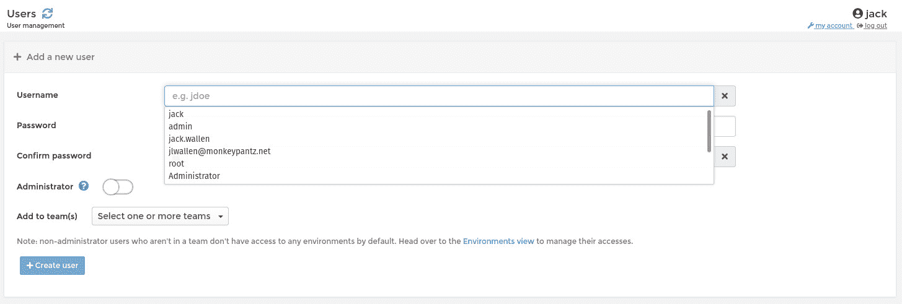
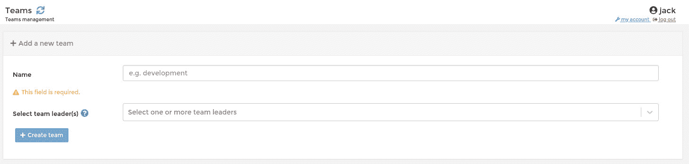
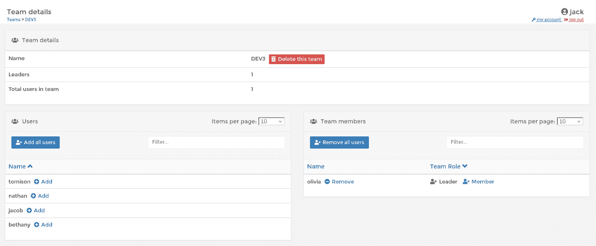
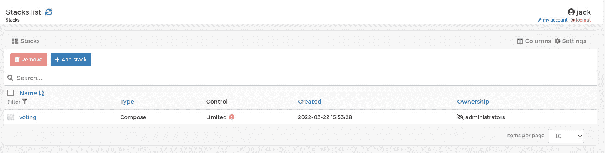
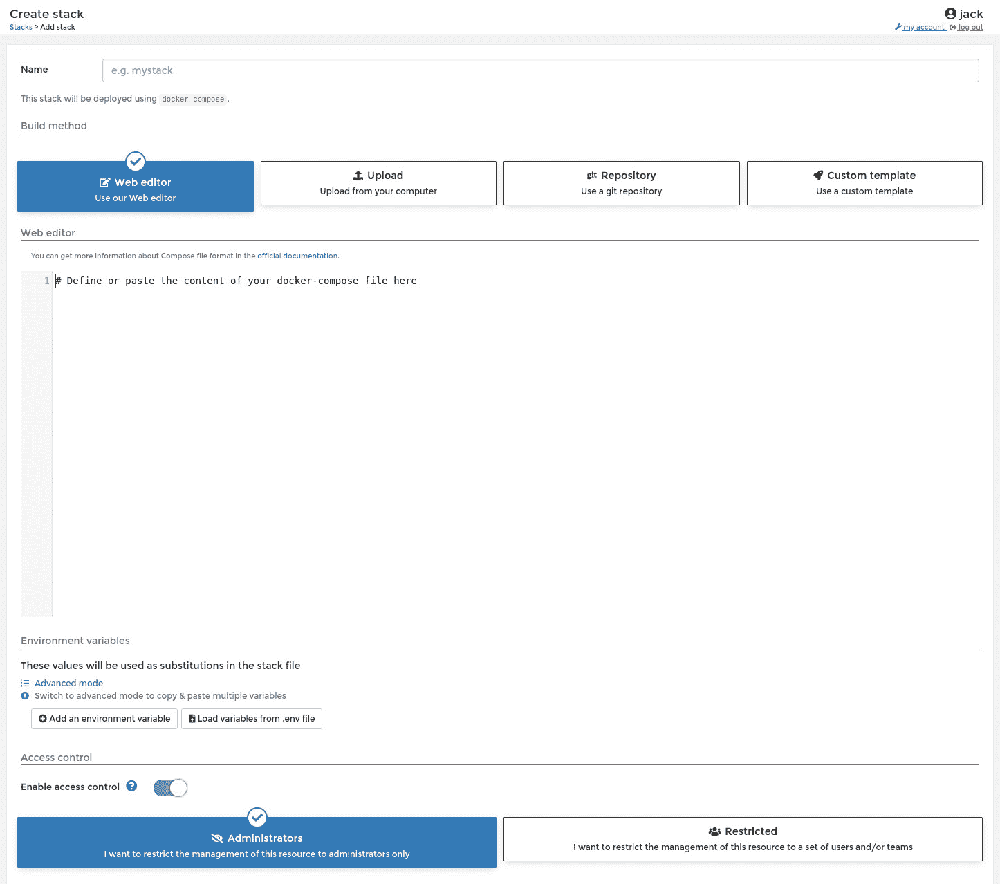
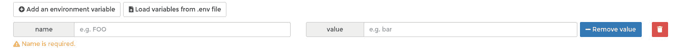
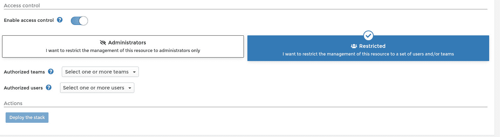
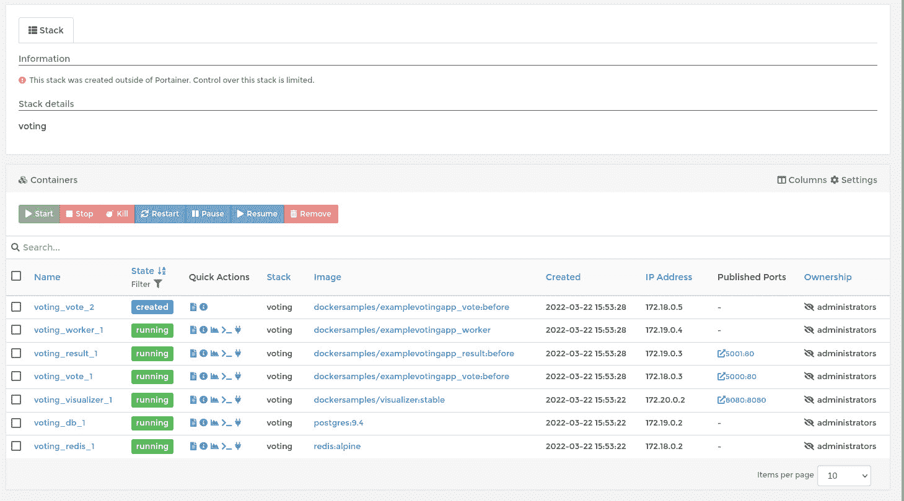

# 使用 Portainer 部署全栈应用

> 原文：<https://thenewstack.io/deploy-a-full-stack-application-with-portainer/>

对于希望以最有效的方式部署和管理其容器化应用程序的容器开发人员来说， [Portainer](https://www.portainer.io/) 容器管理软件应该被视为必备软件。Portainer 允许您管理注册表、映像、网络、事件、卷、主机、环境、日志，甚至全栈应用程序。

没错，这种基于 web 的 GUI 不仅限于单个应用部署。使用 Portainer，您可以创建一个全栈应用程序，甚至可以将该栈分配给团队。

这正是我今天要向您展示的:如何创建团队，向团队添加用户，然后部署一个可由新创建的团队管理的示例全栈应用程序。

为此，您需要 Portainer 的一个[运行实例。仅此而已。你已经准备好了。](https://thenewstack.io/deploy-portainer-for-easier-container-management/)

## 将用户添加到 Portainer

我们要做的第一件事是将一个用户添加到 Portainer 中(该用户将被添加到一个团队中)。要添加用户，请登录 Portainer 并单击左侧导航栏中的 Users。在出现的窗口(**图 1** )中，输入新用户的名称，并输入/确认该用户的密码。

图 1:我们正在向 Portainer 添加一个新用户。

因为我们还没有添加团队，所以不要理会“添加到团队”下拉列表，只需单击“创建用户”即可。

## 将团队添加到 Portainer

创建用户后，单击左侧导航栏中的团队。在新窗口(**图 2** )中，键入新团队的名称，然后从团队领导下拉列表中选择将担任团队领导的用户。

图 2:为 Portainer 创建一个新团队。

单击创建团队保存新团队。要向团队添加更多成员，请单击团队部分下的团队名称。在出现的页面中(**图 3** )，单击与您想要添加到团队中的所有用户相关联的 Add。

图 3:向我们新创建的团队添加用户。

## 部署全栈应用

好了，我们现在已经添加了用户和团队。是时候部署全栈应用程序了。我从 DockerHub 仓库借用了一个示例全栈应用程序，其中包含了许多非常棒的示例，您可以将其用于各种开发和测试项目。您将找到一些部署示例，例如投票应用程序(我将演示的示例)、单个容器部署、简单的 web 应用程序，甚至 Docker Swarm 可视化工具。这是学习如何处理从简单到复杂的部署的好方法。

回到 Portainer 界面，单击左侧导航栏中的 Stacks。在页面上(**图 4** ，点击添加堆栈。

图 Portainer 中的堆栈列表页面。

在下一个窗口中(**图 5** )，给堆栈一个名称(全部小写)。

图 Portainer 中的堆栈创建页面。

您需要选择 web 编辑器(因为我们要从示例中复制/粘贴 docker-compose 文件)。如果您已经在本地机器上构建了全栈应用程序，那么您可以单击 Upload 将 docker-compose 文件添加到 Portainer 中。但是，如果您使用 Git 存储库，请单击该按钮，然后将 Portainer 连接到 GitHub 存储库。

将全栈 docker-compose 文件的内容复制并粘贴到 web 编辑器中。因为我们的示例已经定义了环境变量，所以我们不需要添加它们。但是，如果您正在处理自己的定制 docker-compose 文件，该文件要求您添加环境变量，请单击 Add an environment variable(在 web 编辑器下方)，然后添加名称和值(**图 6** )。

图 6:在 Portainer 中为全栈应用程序添加环境变量。

滚动到页面底部，然后单击受限。这是我们现在可以让我们新创建的团队访问堆栈的地方。从授权团队下拉菜单(**图 7** ，选择我们刚刚创建的团队。如果您还想向单个用户授权，可以从授权用户下拉列表中进行。

图 7:让团队和用户访问我们的新堆栈。

一旦您处理好了一切，Deploy stack 按钮就应该可用了。单击该按钮，Portainer 将开始部署过程。根据您的堆栈的复杂程度，部署可能需要一些时间。

当部署完成时，您可以点击新的堆栈来查看所有组成部分的运行情况(**图 8** )。

图 8:我们的全栈应用程序现在正在运行。

这也是你可以管理堆栈(启动、停止、终止等)的地方。).指出这一点也很重要，因为我们的示例是在 Portainer 之外创建的，所以我们对它没有太多的控制。这说明了一个事实，即您可以在全栈部署的每个步骤中使用 Portainer。您可以创建映像并将其保存在本地注册表中，创建卷和网络以应用于堆栈，等等。

这就是使用 Portainer 基于 web 的 GUI 部署全栈应用程序的全部内容。我强烈推荐这个平台用于您的容器开发，因为它将使它更加高效和协作。

<svg xmlns:xlink="http://www.w3.org/1999/xlink" viewBox="0 0 68 31" version="1.1"><title>Group</title> <desc>Created with Sketch.</desc></svg>