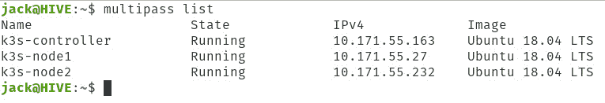

# 使用 Ubuntu Multipass 部署 Kubernetes 桌面集群

> 原文：<https://thenewstack.io/deploy-a-kubernetes-desktop-cluster-with-ubuntu-multipass/>

Canonical 的 [Multipass](https://multipass.run/) 是一个非常简单的部署虚拟机的工具。它与 VirtualBox 或 VMware 完全不同，因为它是一个只有命令行的工具，你只能将基于 Ubuntu 的映像作为虚拟机运行。然而，它在灵活性方面的不足，在易用性方面得到了弥补。

有了这个工具，您可以部署一个 Kubernetes 集群，使您的开发过程变得更加简单。您当然不会使用 Multipass 作为生产环境，但是对于任何喜欢在单台机器上进行开发的人来说，这个平台是最好的。

我想向您介绍使用 Multipass 部署 Kubernetes 集群的过程。我将在 System76 自己的 [Pop 上演示！_OS](https://pop.system76.com/) ，一个基于 Ubuntu 为科学工作而设计的操作系统。如果流行！_OS 不是你的最爱，你可以在任何支持 snap 包的 Linux 发行版上安装 Multipass。您也可以在 macOS 和 Windows 上安装 Multipass，方法是下载。exe 或。来自[多通道下载页面](https://github.com/canonical/multipass/releases)的 pkg 文件。一旦安装了 Multipass，无论平台如何，使用说明都是相似的。

## 安装多通道

在我们安装 Multipass 之前，让我们确保更新和升级我们的系统。为此，请登录，打开一个终端窗口，并发出以下两个命令:

`sudo apt-get update`

`sudo apt-get upgrade -y`

请记住，如果内核升级，您需要重新启动系统，以使更改生效。因此，如果这是一台生产机器，您将希望在重新启动可行的时候运行升级。

随着更新/升级的方式，让我们安装 Multipass。为此，我们将像这样使用 snap 命令:

`sudo snap install multipass --classic --stable`

该命令完成后，Multipass 就安装好了，并准备好部署您的第一个虚拟机。

## 启动您的虚拟机

我们将为我们的 Kubernetes 集群发布三台虚拟机。我将推出一些最少的虚拟机，但您可以根据自己的需要提高规格。我的每个虚拟机都有一个唯一的名称、2 个 CPU、1024MB 内存和 10GB 存储。请记住，您可以根据需要更改配置。

第一个虚拟机将是 Kubernetes 控制器。要启动它，命令应该是:

`multipass launch --name k3s-controller --cpus 2 --mem 1024M --disk 10G`

根据你的网络连接(和你的主机速度)，这将需要 1-5 分钟。

接下来，我们将使用以下命令启动第一个节点:

`multipass launch --name k3s-node1 --cpus 2 --mem 1024M --disk 10G`

最后，我们将使用以下命令启动第二个节点:

`multipass launch --name k3s-node2 --cpus 2 --mem 1024M --disk 10G`

要验证虚拟机是否成功启动，请发出以下命令:

`multipass list`

您应该看到所有三个虚拟机都已就位(**图 1** )。



**图 1:** 我们的虚拟机已经为 Kubernetes 做好了准备。

## 安装必要的软件

此时，事情应该开始变得熟悉了(如果您曾经部署过 Kubernetes 集群)。我们将访问控制器并安装 Docker 和 Kubernetes。使用以下命令访问控制器:

`multipass shell k3s-controller`

使用以下命令更新 apt:

`sudo apt-get update`

现在我们可以用以下命令安装 Docker:

`sudo apt-get install docker.io -y`

使用以下命令启动并启用 Docker 服务:

`sudo systemctl start docker`

`sudo systemctl enable docker`

现在，使用以下命令将当前用户添加到 docker 组:

`sudo usermod -aG docker $USER`

使用以下命令让系统知道新添加的组:

`newgrp docker`

现在是时候安装 Kubernetes 了。我们首先必须使用以下命令添加存储库密钥和存储库:

`curl -s https://packages.cloud.google.com/apt/doc/apt-key.gpg | sudo apt-key add`

`sudo apt-add-repository "deb http://apt.kubernetes.io/ kubernetes-xenial main"`

最后，我们可以使用以下命令安装所有必要的 Kubernetes 工具:

`sudo apt-get install kubeadm kubelet kubectl -y`

打开第二个终端窗口，发出命令:

`multipass list`

记下分配给虚拟机的 IP 地址。

回到 k3s 控制器，发出命令:

`sudo nano /etc/hosts`

在该文件中，添加以下内容:

```
10.171.55.97  controller
10.171.55.142  node1
10.171.55.20   node2

```

确保根据您的*多通道列表*命令输出调整 IP 地址。

使用以下命令关闭交换:

`sudo swapoff -a`

现在是时候使用以下命令在控制器上部署 Kubernetes 了:

`sudo kubeadm init --pod-network-cidr=10.171.55.97/16`

同样，确保将上面的 IP 地址调整为 k3s 控制器的 IP 地址。

这可能需要一些时间。完成后，访问 node1 和 node2，并以与控制器相同的方式安装 Docker 和 Kubernetes。此外，还要确保编辑两台机器上的/etc/hosts 文件。

处理完节点后，回到控制器，您应该会看到 kubeadm join 命令，看起来应该是这样的:

*sudo kube ADM join 10 . 171 . 55 . 97:6443–token 6 latiw . pjq 5 E1 qrgwabrhc 8–discovery-token-ca-cert-hash sha 256:a 8 ebe FBC 70706 DD 31d 016 ea 215 b 947 e 56 baea 354 f 0 D1 d 4927926 af 2e c 564 ea 44*

复制 join 命令。

使用命令访问节点 1:

`multipass shell k3s-node1`

用 kubernetes join 命令连接 node1。完成后，使用以下命令退出节点 1 并访问节点 2:

`multipass shell k3s-node2`

进入节点 2 后，像在节点 1 中一样运行 kubernetes join 命令。完成后，使用 *exit* 命令退出节点 2。

最后的步骤在控制器处返回。如果您不在控制器中，请使用以下命令进行访问:

`multipass shell k3s-controller`

进入后，首先要做的是使用以下命令为集群创建一个目录:

`mkdir -p $HOME/.kube`

接下来，使用命令将配置文件复制到这个目录中:

`sudo cp -i /etc/kubernetes/admin.conf $HOME/.kube/config`

使用以下命令更改配置文件的权限:

`sudo chown $(id -u):$(id -g) $HOME/.kube/config`

最后，使用以下命令将一个 pod 网络部署到集群:

`sudo kubectl apply -f https://raw.githubusercontent.com/coreos/flannel/master/Documentation/kube-flannel.yml`

## 检查集群的状态

此时，我们的两个节点都已加入集群。但是我们怎么能确定呢？在控制器上，发出命令:

`kubectl get nodes`

您应该看到两个节点都已经加入集群，并且列为就绪状态(**图 2** )。


**图 2:** 我们的节点已经加入了我们的 Kubernetes 集群。

现在，您已经拥有了部署了 Multipass 的 Kubernetes 集群，可以开始开发了。

由 [Nareeta Martin](https://unsplash.com/@splashabout?utm_source=unsplash&utm_medium=referral&utm_content=creditCopyText) 在 [Unsplash](https://unsplash.com/s/photos/cluster?utm_source=unsplash&utm_medium=referral&utm_content=creditCopyText) 上拍摄的特征图像。

*目前，新堆栈不允许直接在该网站上发表评论。我们邀请所有希望讨论某个故事的读者通过推特或脸书 T21 与我们联系。我们也欢迎您通过电子邮件发送新闻提示和反馈:[feedback @ thenewstack . io](mailto:feedback@thenewstack.io)。*

<svg xmlns:xlink="http://www.w3.org/1999/xlink" viewBox="0 0 68 31" version="1.1"><title>Group</title> <desc>Created with Sketch.</desc></svg>