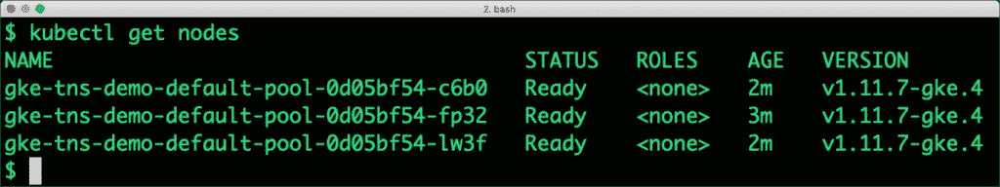
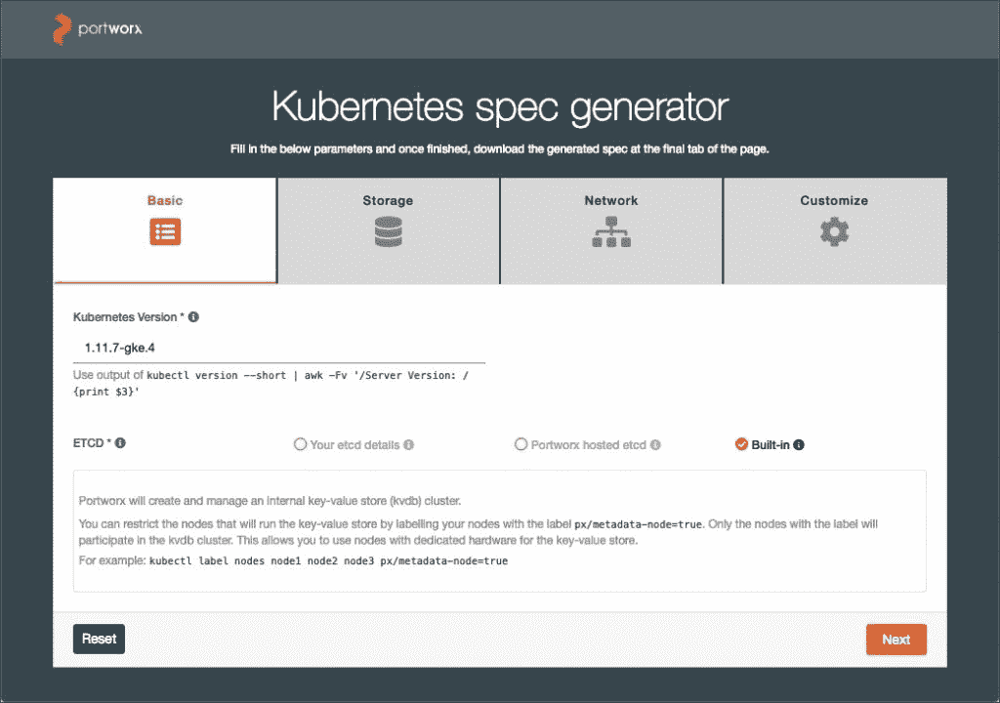
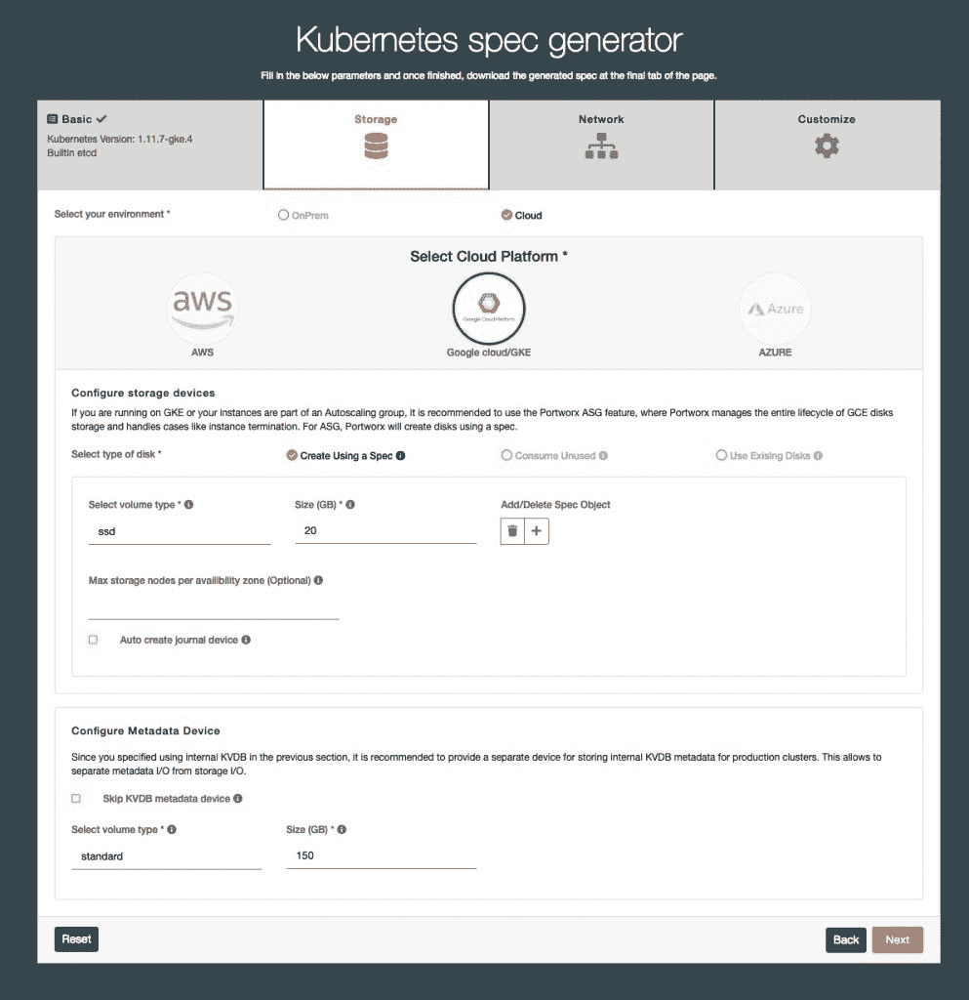
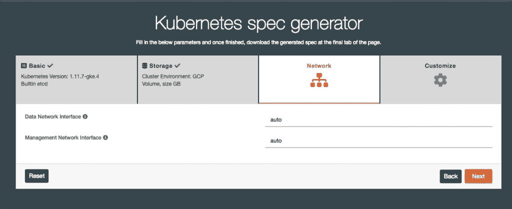
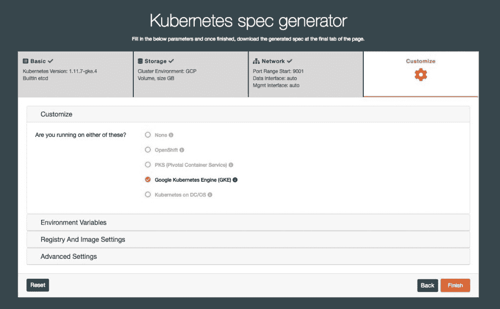
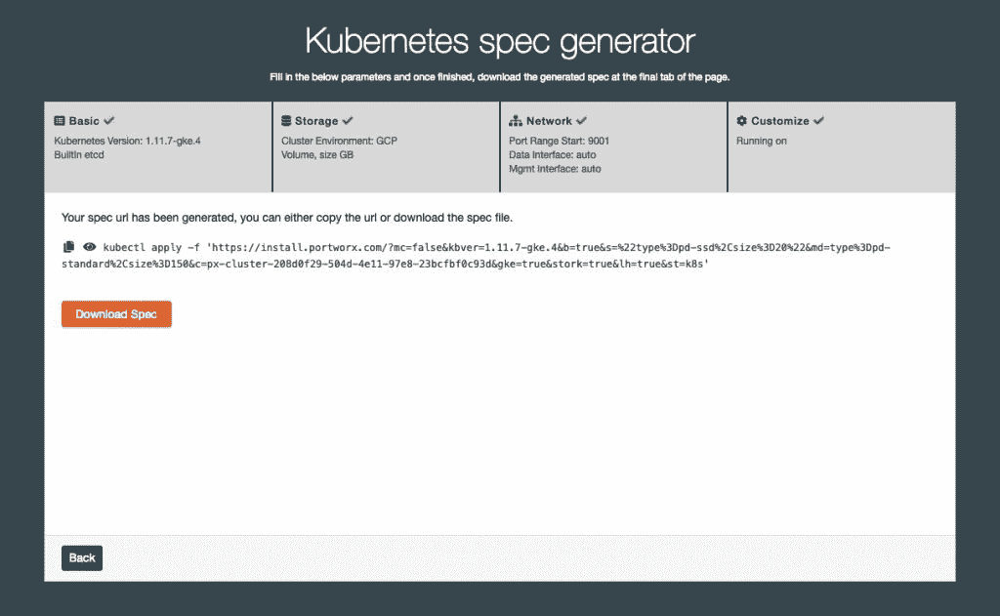
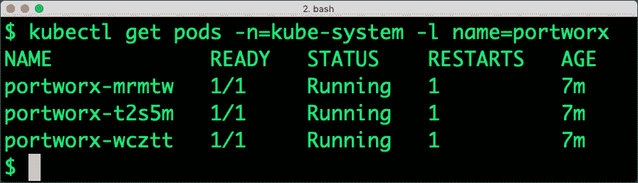
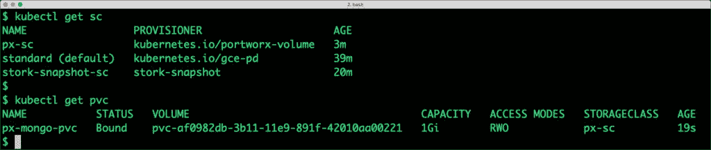
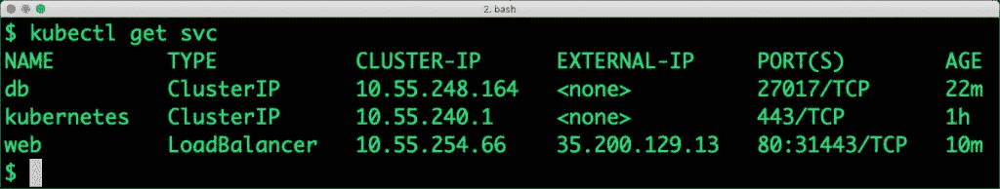
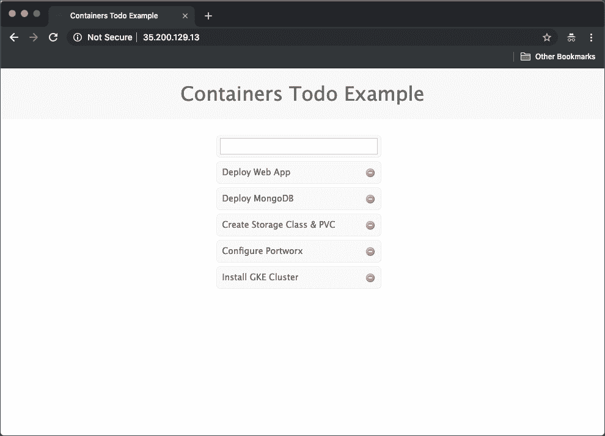

# 使用 Google Kubernetes 引擎 Portworx 部署一个普通的 Web 应用程序

> 原文：<https://thenewstack.io/deploy-a-mean-web-app-with-google-kubernetes-engine-portworx/>

在我以前的一篇文章中，我[介绍了 Portworx](https://thenewstack.io/how-portworx-solves-the-problem-of-running-stateful-workloads-in-containers/) 作为容器本地存储平台。在本教程中，我们将在 Google Kubernetes 引擎中部署和管理 Node.js web 应用程序和 MongoDB 数据库。为了实现 MongoDB 的高可用性，我们将使用部署在 GKE 上的 Portworx 存储集群。

### 启动 GKE 集群

让我们启动一个基于 Ubuntu OS 的三节点 GKE 集群，每个节点连接一个基于 SSD 的 50GB 磁盘。用您自己的 GCP 项目 id 替换该项目。

```
export PROJECT=’<Your GCP Project ID>’
gcloud container  --project  $PROJECT  clusters create  "tns-demo"  \
--zone  "asia-south1-a"  \
--username  "admin"  \
--cluster-version  "1.11.7-gke.4"  \
--machine-type  "n1-standard-4"  \
--image-type  "UBUNTU"  \
--disk-type  "pd-ssd"  \
--disk-size  "50"  \
--scopes  "https://www.googleapis.com/auth/compute","https://www.googleapis.com/auth/devstorage.read_only","https://www.googleapis.com/auth/logging.write","https://www.googleapis.com/auth/monitoring","https://www.googleapis.com/auth/servicecontrol","https://www.googleapis.com/auth/service.management.readonly","https://www.googleapis.com/auth/trace.append"  \
--num-nodes  "3"  \
--enable-cloud-logging  \
--enable-cloud-monitoring  \
--network  "default"  \
--addons HorizontalPodAutoscaling,HttpLoadBalancing,KubernetesDashboard

```

下面的命令用集群的凭证和端点更新 kubeconfig。

```
gcloud container clusters get-credentials tns-demo  \
--zone asia-south1-a  \
--project  $PROJECT

```

让我们将当前用户添加到角色 cluster-admin

```
kubectl create clusterrolebinding cluster-admin-binding  \
--clusterrole cluster-admin  \
--user  $(gcloud config get-value account)

```

验证集群已启动并正在运行。



### 安装 Portworx 存储集群

Portworx 作为守护进程安装在 GKE 的每个节点上。我们可以通过在线工具生成 YAML 规范来安装它。访问 [Portworx 文档页面](http://install.portworx.com)开始。

用下面的命令获取 Kubernetes 的版本。安装工具需要知道发行版的确切版本。

```
kubectl version  --short  |  awk  -Fv  '/Server Version: / {print $3}'

```

Portworx 依靠 etcd 来存储元数据和集群状态。在这个演示中，我们将使用内置的 etcd 集群。


在“Storage”选项卡下，选择“GKE ”,并填充该规范的信息。我们选择 20GB 的 SSD 磁盘作为 Portworx 的专用块存储。由于我们有三个节点，因此我们将获得 60GB 的总存储。



为网络选项卡选择默认值，然后单击下一步。



在最后一个选项卡中，选择 Google Kubernetes Engine 并单击 Finish。



我们准备根据生成的规范安装 Portworx。您可以下载或复制该规范。



切换到终端并运行从等级库生成器复制的命令。安装 Portworx 集群需要几分钟时间。

通过检查在 *kube-system* 名称空间中运行的 Portworx Pods 来验证集群。所有的豆荚都应该在运行。



### 部署 MongoDB

我们将为 Portworx 创建一个复制因子为 3 的 StorageClass。这确保了数据在多个节点上冗余可用。

```
kind: StorageClass
apiVersion: storage.k8s.io/v1beta1
metadata:
    name: px-sc
provisioner: kubernetes.io/portworx-volume
parameters:
 repl: "3"

```

```
kubectl create  -f  px-sc.yaml

```

storage class 就绪后，我们将创建一个持久的卷控制(PVC ), MongoDB Pod 将使用它。

```
kind: PersistentVolumeClaim
apiVersion: v1
metadata:
 name: px-mongo-pvc
 annotations:
 volume.beta.kubernetes.io/storage-class: px-sc
spec:
 accessModes:
 -  ReadWriteOnce
 resources:
 requests:
 storage: 1Gi

```

```
kubectl create  -f  px-mongo-pvc.yaml

```

MongoDB Pod 的存储后端现已准备就绪。



让我们继续创建 MongoDB Pod。

```
apiVersion: extensions/v1beta1
kind: Deployment
metadata:
  name: db
  labels:
    name: mongo
    app: todoapp  
spec:
  strategy:
    rollingUpdate:
      maxSurge: 1
      maxUnavailable: 1
    type: RollingUpdate
  replicas: 1
  template:
    metadata:
      labels:
        name: mongo
        app: todoapp
    spec:
      schedulerName: stork
      containers:
      -  name: mongo
        image: mongo
        imagePullPolicy: "Always"
        ports:
        -  containerPort: 27017
        volumeMounts:
        -  mountPath: /data/db
          name: mongodb
      volumes:
      -  name: mongodb
        persistentVolumeClaim:
          claimName: px-mongo-pvc

```

```
kubectl create  -f  db-pod.yaml

```

为了使 web 应用程序可以访问数据库 Pod，我们将通过基于 ClusterIP 的服务来公开它。

```
apiVersion: v1
kind: Service
metadata:
  name: db
  labels:
    name: mongo
    app: todoapp
spec:
  selector:
    name: mongo
  type: ClusterIP
  ports:
    -  name: db
      port: 27017
      targetPort: 27017

```

```
kubectl create  -f  db-svc.yaml

```

数据库后端现在已经准备好了。是时候部署 web 应用程序了。

### 部署 Node.js Web 应用程序

web 应用程序是一个简单的 todo 任务列表，它保存对 MongoDB 的更改。使用副本创建 web 应用程序的部署。

```
apiVersion: apps/v1
kind: Deployment
metadata:
  name: web
  labels:
    name: web
    app: todoapp
spec:
  replicas: 3
  selector:
    matchLabels:
      name: web
  template:
    metadata:
      labels:
        name: web
    spec:
      containers:
      -  name: web
        image: janakiramm/todo
        ports:
        -  containerPort: 3000

```

最后，我们将通过负载均衡器公开 web 应用程序。

```
apiVersion: v1
kind: Service
metadata:
  name: web
  labels:
    name: web
    app: todoapp
spec:
  selector:
    name: web 
  type: LoadBalancer
  ports:
 -  name: http
 port: 80
 targetPort: 3000
 protocol: TCP

```

检查为 web 应用程序创建的服务，以获取负载平衡器的 IP 地址。



访问 web 应用程序会显示以下用户界面。



在本系列的下一部分中，我将向您展示如何对运行在 GKE 内的 MongoDB 数据库执行故障转移。

Portworx 是新堆栈的赞助商。

通过 Pixabay 的特征图像。

<svg xmlns:xlink="http://www.w3.org/1999/xlink" viewBox="0 0 68 31" version="1.1"><title>Group</title> <desc>Created with Sketch.</desc></svg>