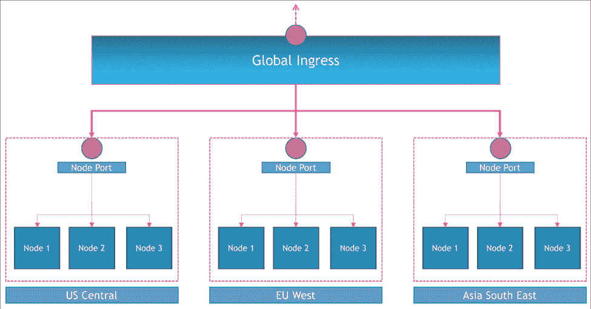
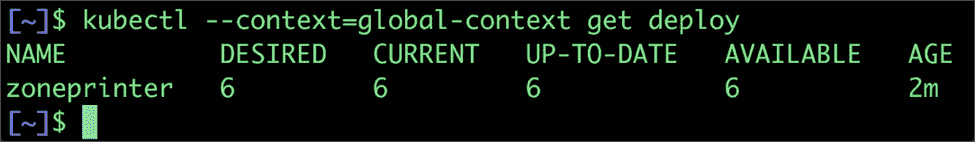
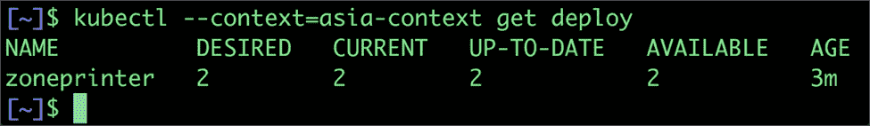
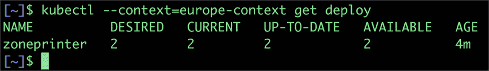
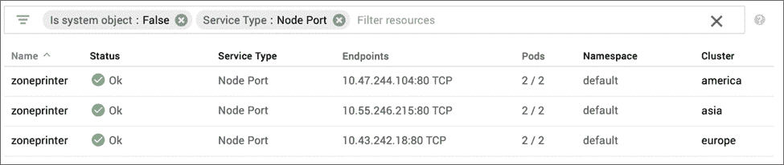
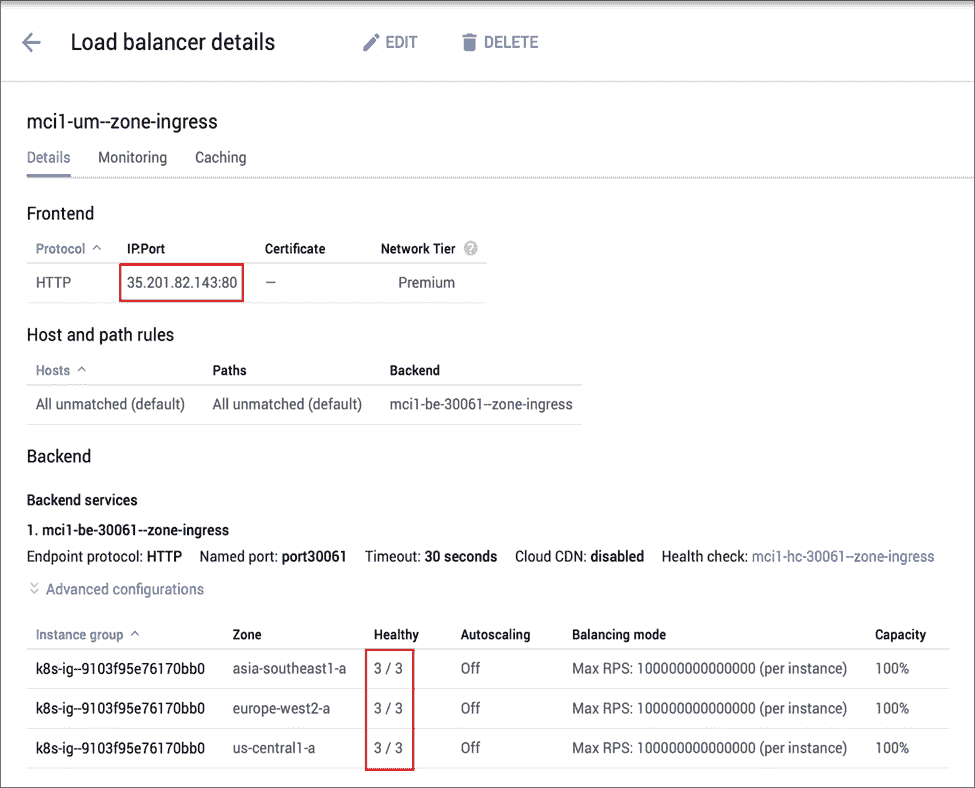
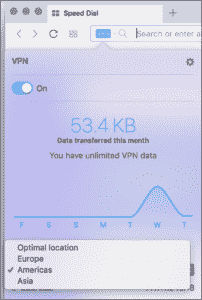
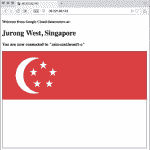
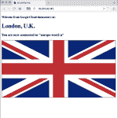
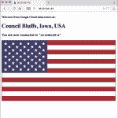

# 在 Google Kubernetes 引擎上部署一个多集群入口

> 原文：<https://thenewstack.io/deploy-a-multicluster-ingress-on-google-kubernetes-engine/>

在本教程的前一部分[中，我们已经通过联邦配置了一个地理上分布的 Kubernetes 集群。现在，我们将在联合集群中部署一个应用程序，并通过全局入口端点公开它。](https://thenewstack.io/configuring-kubernetes-cluster-federation-to-create-a-global-deployment/)

虽然联合控制平面协调跨群集的部署，但我们需要配置一个入口，该入口可以根据用户的位置将流量路由到最近的群集。如果其中一个集群发生故障，入口必须足够智能，以便将请求路由到另一个健康的集群。



在 [Google Kubernetes 引擎](https://cloud.google.com/kubernetes-engine/) (GKE)上，全局入口被配置为 HTTP 负载平衡器，与每个集群上的后端节点端口对话。

[谷歌云平台](https://cloud.google.com/) (GCP)负载平衡为 HTTP(S)请求提供全局负载平衡。客户可以配置 URL 规则，将一些请求路由到一组实例，将其他请求路由到其他实例。请求总是被路由到离用户最近的实例组，前提是该组有足够的容量并且适合该请求。如果最近的组没有足够的容量，则请求被发送到具有该容量的最近的组。

谷歌利用了 GCP 负载平衡器独有的特性。尽管它没有与[g cloud SDK](https://cloud.google.com/sdk/)——GCP 的官方命令行界面——进行原生集成，但谷歌的工程师们发布了 [kubemci](https://github.com/GoogleCloudPlatform/k8s-multicluster-ingress) ，这是一款可以实现全球多集群负载平衡的工具。

一旦您将 *kubemci* 下载到您的 Mac 或 Linux 机器上，您就可以部署和公开应用程序了。

由于 *kubemci* 需要应用程序凭证来访问 GCP 资源，我们将运行下面的命令。

```
$  gcloud auth application-default login

```

应用程序默认凭证(ADC)提供了一种获取调用 Google APIs 时使用的凭证的方法。*g cloud auth application-default*命令组允许您管理机器上用于本地应用开发的活动凭证。

我们还需要将每个集群配置传递给 kubemci。为此，我们将使用凭据创建一个新的配置文件。这将作为工具专用的自定义 kubeconfig 文件。

```
$  KUBECONFIG=$HOME/mcikubeconfig gcloud container clusters get-credentials asia  --zone asia-southeast1-a  --project janakiramm-sandbox

$  KUBECONFIG=$HOME/mcikubeconfig gcloud container clusters get-credentials europe  --zone europe-west2-a  --project janakiramm-sandbox

$  KUBECONFIG=$HOME/mcikubeconfig gcloud container clusters get-credentials america  --zone us-central1-a  --project janakiramm-sandbox

```

不要忘记用您的 GCP 项目 id 替换项目 id。

我们还将为我们的全球入口创建一个静态 IP 地址。

```
$  gcloud compute addresses create  g-ingress  --global

```

基本配置已经完成，我们准备好部署和公开工作负载。

谷歌的工程师们已经开发了一个很好的应用程序，可以打印出服务区域的详细信息。我们将在联邦集群中部署这个示例应用程序。

用以下标记创建一个名为 zone-printer.yaml 的文件:

```
apiVersion:  extensions/v1beta1
kind:  Deployment
metadata:
   name:  zoneprinter
   labels:
     app:  zoneprinter
spec:
   replicas:  6
   selector:
     matchLabels:
       app:  zoneprinter
   template:
     metadata:
       labels:
         app:  zoneprinter
     spec:
       containers:
       -  name:  frontend
         image:  gcr.io/google-samples/zone-printer:0.1
         ports:
           -  containerPort:  80
---
apiVersion:  v1
kind:  Service
metadata:
name:  zoneprinter
   labels:
     app:  zoneprinter
spec:
   type:  NodePort
   selector:
     app:  zoneprinter
   ports:
   -  name:  http
     port:  80
nodePort:  30061

```

这创建了一个有六个副本的部署，并通过节点端口服务公开。

让我们继续将它提交给联合控制平面。

```
$  kubectl  --context=global-context create  -f  zone-printer.yaml

```

这个简单的命令启动了一个编排，将部署推到每个注册的集群中。因为我们需要六个副本，所以每个集群运行两个单元。

您可以通过检查每个集群后面的控制平面来验证这一点。

```
$  kubectl  --context=global-context get deploy

```



全局联合控制平面报告 6 个机架，每个集群中有 2 个机架。

让我们将上下文切换到每个集群。

```
$  kubectl  --context=asia-context get deploy

```



```
$  kubectl  --context=europe-context get deploy

```



```
$  kubectl  --context=america-context get deploy

```


服务也是如此。下面的屏幕截图显示每个集群都有一个分配给 zoneprinter 服务的节点端口。



现在，是时候创建入口对象了。首先，我们将定义入口，然后通过 *kubemci* 工具提交它。注意 *kubemci* 独立于联合集群概念。它可以与多个未联合的独立集群一起使用。我将展示如何将这两者结合起来以公开联合工作负载。

```
apiVersion:  extensions/v1beta1
kind:  Ingress
metadata:
   name:  zoneprinter
   annotations:
     kubernetes.io/ingress.class:  gce-multi-cluster
     kubernetes.io/ingress.global-static-ip-name:  g-ingress
spec:
   backend:
     serviceName:  zoneprinter
     servicePort:  80

```

入口定义有一个注释，将对象与我们之前创建的静态 IP 地址关联起来。注释 *gce-multi-cluster* 是对 GKE 提供一个全局 HTTP(S)负载平衡器的提示。

运行以下命令创建入口对象。

```
$  kubemci create zone-ingress  \
     --ingress=zone-ingress.yaml  \
     --gcp-project=janakiramm-sandbox  \
     --kubeconfig=$HOME/mcikubeconfig

```

这一步会导致一系列配置任务，包括创建负载平衡器、防火墙规则、健康检查和代理。

继续检查 GCP 控制台的运行状况。一旦所有集群都注册到入口，它应该显示所有集群都是健康的。等到您在后端服务部分的健康栏中看到 3/3。通常需要几分钟才能通过健康检查。



期末考试的时间到了。为了验证地理路由功能，我使用了启用了 VPN 的 Opera 浏览器。您可以选择 VPN 的位置来模拟来自不同位置的流量。









根据您的 VPN 位置，您最终会在浏览器中看到不同的输出。该标志和位置指示服务于该请求的 GKE 区。

Kubernetes 正在缓慢但稳步地成为运行高可用性和分布式工作负载的首选。联合集群和全局入口等功能为平台带来了额外的功能。结合全球分布、高度一致的数据库服务，如 Google Cloud Spanner，现在可以运行部署在全球各地的应用程序。

<svg xmlns:xlink="http://www.w3.org/1999/xlink" viewBox="0 0 68 31" version="1.1"><title>Group</title> <desc>Created with Sketch.</desc></svg>