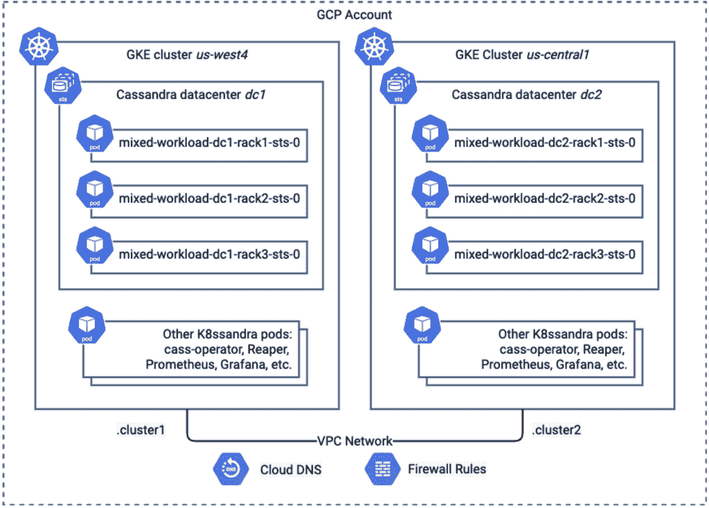

# 在 Kubernetes 部署多数据中心 Cassandra 集群

> 原文：<https://thenewstack.io/deploy-a-multidata-center-cassandra-cluster-in-kubernetes/>

[](https://www.linkedin.com/in/jeffreyscarpenter/)

 [杰夫·卡彭特

杰夫·卡彭特是 DataStax 的软件工程师，他利用自己在系统架构、微服务和 Apache Cassandra 方面的背景，帮助开发人员和运营工程师构建可扩展、可靠和安全的分布式系统。杰夫是奥莱利图书《卡珊德拉:权威指南》和即将出版的《在 Kubernetes 上管理云原生数据》的合著者。](https://www.linkedin.com/in/jeffreyscarpenter/) [](https://www.linkedin.com/in/jeffreyscarpenter/)

最近，我们研究了在使用不同部署拓扑的 [K8ssandra](https://k8ssandra.io/) 的 [Kubernetes](https://kubernetes.io/) (K8s)上部署 [Apache Cassandra](https://cassandra.apache.org/_/index.html) 集群的不同模式。我们已经[探讨了](https://k8ssandra.io/blog/tutorials/deploy-a-multi-datacenter-apache-cassandra-cluster-in-kubernetes/)如何使用独立的 K8s 名称空间在单个云区域中部署具有两个数据中心的 Cassandra 集群，以隔离运营和分析工作负载。

我们还[在多个谷歌云平台(CGP)](https://k8ssandra.io/blog/tutorials/multi-cluster-cassandra-deployment-with-google-kubernetes-engine/) [地区](https://cloud.google.com/compute/docs/regions-zones)跨 K8s 集群部署了Cassandra 集群。这种方法的缺点之一是我们处理网络的方式。具体来说，我们在第一个数据中心使用 Cassandra 节点的硬编码 IP 来引导第二个数据中心，使用 Cassandra 所谓的“[种子节点](https://cassandra.apache.org/doc/latest/cassandra/faq/#what-are-seeds)使用硬编码的 IP 是一种更加劳动密集型的解决方案，并且不能很好地扩展。我们真正需要的是能够用域名服务器(DNS)定位种子节点。

在这里，您将了解如何使用 Google 的云 DNS 服务在两个 Google 云区域[中创建跨越](https://cloud.google.com/kubernetes-engine/docs/how-to/cloud-dns) [Google Kubernetes 引擎](https://cloud.google.com/kubernetes-engine/docs/concepts/kubernetes-engine-overview#:~:text=Google%20Kubernetes%20Engine%20(GKE)%20provides,together%20to%20form%20a%20cluster.) (GKE)集群的 Cassandra 集群，以提供两个 GKE 集群之间的名称解析。在本练习中，我们希望使用同一个网络。因此，我们将在同一个谷歌云项目下的两个独立区域创建 GKE 集群。

术语的快速注释。“集群”这个词在分布式技术中经常使用，当两种不同的分布式技术一起工作时，它会很快变得令人困惑。Cassandra 集群可以跨越多个数据中心，并向外部用户呈现为单个实体，无论正在访问哪个数据中心。Kubernetes 认为一个集群是一个本地数据中心，需要数据中心之间的网络互连来使其成为多集群。结合这两个概念，一个 Cassandra 集群将跨越多个 Kubernetes 集群。希望这有助于澄清一些术语。就这样，让我们开始吧。

## 准备第一个 GKE 集群

首先，您需要一个 K8s 集群，您可以在其中创建第一个 Cassandra 数据中心。我们将展示如何用`gcloud`命令行做到这一点。对于本文中的命令，我们将假设您的上下文设置为具有当前项目、区域和专区。您可以通过运行如下代码来检查设置了哪些值:

```
%  gcloud  config  list

[compute]

region  =  us-west4

zone  =  us-west4-a

[core]

account  =  j.c@abc.com

disable_usage_reporting  =  False

project  =  my-project

```

首先，你需要一个网络:

```
gcloud compute networks create dev-k8ssandra-network

```

然后，要创建您的第一个 GKE 集群，您需要在我们计划使用的区域中有一个子网。我选了`us-west4`。

```
gcloud compute networks subnets create dev-k8ssandra-subnet  <a  href="https://cloud.google.com/sdk/gcloud/reference/compute/networks/subnets/create#--network">--network</a>=dev-k8ssandra-network  <a  href="https://cloud.google.com/sdk/gcloud/reference/compute/networks/subnets/create#--range">--range</a>=10.1.0.0/20  --region=us-west4

```

现在，您可以使用满足 K8ssandra 最低要求的子网和计算规范创建一个 GKE 集群。下面是我的命令在`us-west4`地区使用区域后的样子:

```
gcloud beta container clusters create  "k8ssandra"  --region  "us-west4"  --machine-type  "e2-highmem-8"  --disk-type  "pd-standard"  --disk-size  "100"  --num-nodes  "1"  --network dev-k8ssandra-network  --subnetwork dev-k8ssandra-subnet  --node-locations  "us-west4-a","us-west4-b","us-west4-c"  --cluster-dns clouddns  --cluster-dns-scope vpc  --cluster-dns-domain cluster1

```

还要注意`--cluster-dns*`属性，该属性配置新集群使用具有虚拟专用云(VPC)级别范围的云 DNS 服务，以及域名`cluster1`，我们将能够在下面使用该域名进行域名解析。有关此配置的更多信息，请参见针对 GKE 使用云 DNS 的文档。

这应该会将您的`kubectl`上下文更改为新的集群，但是您可以通过检查`kubectl config current-context`的输出来确定。

*注意:如果您更愿意使用 Terraform 脚本来创建您的 GKE 集群，K8ssandra 项目文档包括对 Google Kubernetes 引擎(GKE)* *上的* [*K8ssandra 的说明，它引用了作为*](https://docs.k8ssandra.io/install/gke/)[*k 8 ssandra GCP Terraform 示例*](https://github.com/k8ssandra/k8ssandra-terraform/tree/main/gcp) *的一部分提供的示例脚本。*

## 创建首个 Cassandra 数据中心

现在，您已经准备好创建第一个 Cassandra 数据中心。首先，您将创建 Cassandra 管理员凭证。为第一个数据中心创建一个名称空间，并在名称空间中添加一个秘密:

```
kubectl create namespace k8ssandra

kubectl create secret generic cassandra-admin-secret  --from-literal=username=cassandra-admin  --from-literal=password=cassandra-admin-password  -n  k8ssandra

```

下一步是为第一个数据中心创建 K8ssandra 部署。这一步你需要安装[头盔](https://helm.sh/)，如 [K8ssandra GKE 文档页面](https://docs.k8ssandra.io/install/gke/)所述。在名为`dc1.yaml`的文件中创建第一个数据中心的配置，确保更改亲缘关系标签以匹配您的 GKE 集群中使用的分区:

```
cassandra:

<strong>auth:</strong>

<strong>superuser:</strong>

<strong>secret:  cassandra-admin-secret</strong>

cassandraLibDirVolume:

<strong>storageClass:  standard-rwo</strong>

clusterName:  multi-region

datacenters:

-  name:  dc1

size:  3

racks:

-  name:  rack1

affinityLabels:

<strong>failure-domain.beta.kubernetes.io/zone:  us-west4-a</strong>

-  name:  rack2

affinityLabels:

<strong>failure-domain.beta.kubernetes.io/zone:  us-west4-b</strong>

-  name:  rack3

affinityLabels:

<strong>failure-domain.beta.kubernetes.io/zone:  us-west4-c</strong>

```

除了请求数据中心中的三个节点之外，此配置还为 GKE 环境(`standard-rwo`)指定了适当的存储类别，并使用关联来指定机架如何映射到 GCP 分区。确保更改引用的区域以匹配您的配置。更多详情请参考[这篇博文](https://k8ssandra.io/blog/tutorials/deploy-a-multi-datacenter-apache-cassandra-cluster-in-kubernetes/)。

使用以下命令部署发布版本:

```
helm install k8ssandra k8ssandra/k8ssandra  -f  dc1.yaml  -n  k8ssandra

```

这导致名为`k8ssandra`的 K8ssandra 版本被安装在名称空间`k8ssandra`中。

与任何 Cassandra 集群部署一样，您会希望等到第一个数据中心完全启动后再添加第二个数据中心。由于您现在将为第二个数据中心创建额外的基础架构，因此您可能不需要等待。但是如果你感兴趣，确保数据中心启动的一个简单方法是观察，直到[星门](https://stargate.io/)舱显示为初始化，因为这取决于卡珊德拉准备好了:

```
kubectl get pods  -n  k8ssandra kubectl get pods  -n  us-west4  --watch  --selector app=k8ssandra-dc1-stargate

NAME READY STATUS RESTARTS AGE

k8ssandra-dc1-stargate-58bf5657ff-ns5r7  1/1  Running  0  15m

```

这是获取配置第二个 Cassandra 数据中心(seeds)所需信息的绝佳机会。为了方便起见，K8ssandra 创建了一个名为 seed service 的无头 K8s 服务，它指向几个 Cassandra 节点，这些节点可用于引导新节点或数据中心进入 Cassandra 集群:

```
%  kubectl  get  svc  -n  k8ssandra  --selector  cassandra.datastax.com/cluster=multi-region

NAME TYPE CLUSTER-IP EXTERNAL-IP PORT(S)  AGE

multi-region-dc1-all-pods-service ClusterIP None  &lt;none&gt;  9042/TCP,8080/TCP,9103/TCP  23m

multi-region-dc1-service ClusterIP None  &lt;none&gt;  9042/TCP,9142/TCP,8080/TCP,9103/TCP,9160/TCP  23m

multi-region-seed-service ClusterIP None  &lt;none&gt;  &lt;none&gt;  23m

```

如果您很好奇，您可以快速查看一下这个服务背后的 pod 的 IP 地址，这些地址被标记为种子节点，使用的选择器与服务使用的选择器相同:

```
kubectl get pods  -n  k8ssandra  -o  jsonpath="{.items[*].status.podIP}"  --selector cassandra.datastax.com/seed-node=true

```

产生如下所示的输出:

```
10.240.0.8  10.240.2.6  10.240.1.10

```

## 准备第二个 GKE 集群

现在，您将需要第二个 K8s 集群来托管位于不同地区的第二个 Cassandra 数据中心。例如，我为我的第二个集群选择了`us-central1`区域。首先，我在那个区域显式地创建了一个子网，作为`dev-k8ssandra-network`的一部分。

```
gcloud compute networks subnets create dev-k8ssandra-subnet2  <a  href="https://cloud.google.com/sdk/gcloud/reference/compute/networks/subnets/create#--network">--network</a>=dev-k8ssandra-network  <a  href="https://cloud.google.com/sdk/gcloud/reference/compute/networks/subnets/create#--range">--range</a>=10.2.0.0/20  --region=us-central1

```

然后，我使用该网络和与第一个集群相同的计算规格创建了第二个 GKE 集群:

```
gcloud beta container clusters create  "k8ssandra-2"  --region  "us-central1"  --machine-type  "e2-highmem-8"  --disk-type  "pd-standard"  --disk-size  "100"  --num-nodes  "1"  --network dev-k8ssandra-network  --subnetwork dev-k8ssandra-subnet2  --node-locations  "us-central1-b","us-central1-c","us-central1-f"  --cluster-dns clouddns  --cluster-dns-scope vpc  --cluster-dns-domain cluster2

```

确保`kubectl`上下文已经更改为第二个数据中心。

## 支持 Kubernetes 集群之间的流量

接下来，您需要创建一个防火墙规则来允许两个集群之间的流量。回想一下您在上面定义的子网的 IP 空间(我使用了`10.0.0.0/20,10.2.0.0/20`，然后获取每个 GKE 集群的 IP 空间。例如:

```
%  gcloud  beta  container  clusters  describe  k8ssandra  --zone  us-west4  |  grep  clusterIpv4Cidr

clusterIpv4Cidr:  <strong>10.240.0.0/14</strong>

%  gcloud  beta  container  clusters  describe  k8ssandra-2  --zone  us-central1  |  grep  clusterIpv4Cidr

clusterIpv4Cidr:  <strong>10.24.0.0/14</strong>

```

使用这些 IP 空间创建允许所有流量的规则:

```
gcloud compute firewall-rules create k8ssandra-multi-region-rule  --direction=INGRESS  --network=dev-k8ssandra-network  --action=ALLOW  --rules=all  --source-ranges=10.0.0.0/20,10.2.0.0/20,10.240.0.0/14,10.24.0.0/14

```

如果需要，您可以创建一个更有针对性的规则，只允许 Cassandra 使用的端口之间的传输控制协议(TCP)流量。

## 添加第二个 Cassandra 数据中心

让我们首先为新数据中心创建一个与 GCP 地区名称相匹配的命名空间。我们还需要创建管理员凭据，以匹配为第一个数据中心创建的凭据，因为密码不会在集群之间自动复制。

```
kubectl create namespace k8ssandra

kubectl create secret generic cassandra-admin-secret  --from-literal=username=cassandra-admin  --from-literal=password=cassandra-admin-password  -n  k8ssandra

```

现在，您将创建一个配置，在新的 GKE 集群中部署一个额外的 Cassandra 数据中心`dc2`。为了使`dc2`中的节点能够加入 Cassandra 集群，需要几个步骤:

*   您已经解决了第一个问题:对两个 GKE 集群使用相同的 Google Cloud 网络意味着新数据中心的节点将能够与原始数据中心的节点进行通信。
*   其次，确保使用与第一个数据中心相同的 Cassandra 集群名称。
*   最后，您需要提供种子服务的完全限定名，以便新数据中心的节点知道如何联系第一个数据中心的节点来加入集群。

这最后一步是谷歌云 DNS 为我们做的工作。根据 Kubernetes 文档，服务的完全限定域名(FQDN)遵循以下模式:

```
my-svc.my-namespace.svc.cluster-domain.example

```

对于我们的目的，服务名是`multi-region-seed-service`，名称空间是`k8ssandra`，域是我们在 Google Cloud DNS 中分配给 GKE 集群的同一个 DNS 域:`cluster1`。因此，我们需要的 FQDN 是:

`multi-region-seed-service.k8ssandra.svc.cluster1`

现在在名为`dc2.yaml`的文件中创建一个配置。这是我的 seed 服务 FQDN 文件的样子。确保为您选择的区域和分区适当地更改亲缘关系标签:

```
cassandra:

auth:

superuser:

secret:  cassandra-admin-secret

<strong>additionalSeeds:  [  multi-region-seed-service.k8ssandra.svc.cluster1  ]</strong>

cassandraLibDirVolume:

storageClass:  standard-rwo

clusterName:  multi-region

datacenters:

-  name:  dc2

size:  3

racks:

-  name:  rack1

affinityLabels:

failure-domain.beta.kubernetes.io/zone:  us-central1-f

-  name:  rack2

affinityLabels:

failure-domain.beta.kubernetes.io/zone:  us-central1-b

-  name:  rack3

affinityLabels:

failure-domain.beta.kubernetes.io/zone:  us-central1-c

```

与 dc1 的配置类似，该配置也使用了亲缘关系。可以使用类似的机架分配来确保 Cassandra 节点均匀分布在剩余的工作节点上。使用如下命令部署发行版:

`helm install k8ssandra k8ssandra/k8ssandra -f dc2.yaml -n k8ssandra`

如果你查看这个名称空间中的资源，使用诸如`kubectl get services,pods`这样的命令，你会注意到有一组与`dc1`相似的 pod 和服务，包括 Stargate、Prometheus、Grafana 和 Reaper。取决于您希望如何管理您的应用程序，这可能符合您的意愿，也可能不符合您的意愿，但是您可以自由地定制配置以禁用任何您不需要的组件。

## 配置 Cassandra 密钥空间

一旦第二个数据中心上线，您将需要配置 Cassandra keyspaces 来跨两个集群进行复制。

**重要提示**:您可能需要首先将您的`kubectl`上下文改回第一个 GKE 集群，例如，使用`kubectl config use-context` 命令。您可以使用`kubectl config get-contexts`列出现有的上下文。

要更新密钥空间，连接到第一个数据中心的一个节点并执行`cqlsh`。

`kubectl exec multi-region-dc1-rack1-sts-0 cassandra -it -n k8ssandra -- cqlsh -u cassandra-admin -p cassandra-admin-password`

使用`DESCRIBE KEYSPACES`列出键槽，使用`NetworkTopologyStrategy`识别键槽。例如:

```
cassandra:

auth:

superuser:

secret:  cassandra-admin-secret

<strong>additionalSeeds:  [  multi-region-seed-service.k8ssandra.svc.cluster1  ]</strong>

cassandraLibDirVolume:

storageClass:  standard-rwo

clusterName:  multi-region

datacenters:

-  name:  dc2

size:  3

racks:

-  name:  rack1

affinityLabels:

failure-domain.beta.kubernetes.io/zone:  us-central1-f

-  name:  rack2

affinityLabels:

failure-domain.beta.kubernetes.io/zone:  us-central1-b

-  name:  rack3

affinityLabels:

failure-domain.beta.kubernetes.io/zone:  us-central1-c

```

通常，你会发现`system_auth, system_traces`和`system_distributed`键区使用`NetworkTopologyStrategy,`和`data_endpoint_auth`，如果你已经启用了星门的话。然后，您可以更新复制策略，以确保数据复制到新的数据中心。对于每个键空间，您将执行如下内容:

`ALTER KEYSPACE system_auth WITH replication = {'class': 'NetworkTopologyStrategy', 'dc1': 3, 'dc2': 3}`

*   **重要提示**:记住为您的应用程序所需的任何密钥空间创建或更改复制策略，以便您在每个数据中心都有所需数量的副本。

退出`cqlsh`后，确保使用`nodetool rebuild` 命令将现有数据正确复制到新的数据中心。

*   **重要提示**:记得把你的`kubectl context`改回第二个 GKE 集群。

需要在新数据中心的每个节点上运行重建。例如:

```
kubectl exec multi-region-dc2-rack1-sts-0  -n  k8ssandra  --  nodetool  --username cassandra-admin  --password cassandra-admin-password rebuild dc1

```

对其他节点`multi-region-dc2-rack2-sts-0`和`multi-region-dc2-rack3-sts-0`重复上述步骤。

## 测试配置

让我们验证第二个数据中心是否已加入群集。为此，您将挑选一个 Cassandra 节点来执行`nodetool status`命令。对节点
执行`nodetool`命令

```
kubectl exec multi-region-dc2-rack1-sts-0  -n  k8ssandra cassandra  --  nodetool  --username cassandra-admin  --password cassandra-admin-password status

```

这将产生类似如下的输出:

```
Datacenter:  dc1

===============

Status=Up/Down

|/  State=Normal/Leaving/Joining/Moving

--  Address Load Tokens Owns Host ID Rack

UN  10.56.2.8  835.57  KiB  256  ?  8bc5cd4a-7953-497a-8ac0-e89c2fcc8729 rack1

UN  10.56.5.8  1.19  MiB  256  ?  fdd96600-5a7d-4c88-a5cc-cf415b3b79f0 rack2

UN  10.56.4.7  830.98  KiB  256  ?  d4303a9f-8818-40c2-a4b5-e7f2d6d78da6 rack3

Datacenter:  dc2

===============

Status=Up/Down

|/  State=Normal/Leaving/Joining/Moving

--  Address Load Tokens Owns Host ID Rack

UN  10.24.4.99  418.52  KiB  256  ?  d2e71ab4-6747-4ac6-b314-eaaa76d3111e rack3

UN  10.24.7.37  418.17  KiB  256  ?  24708e4a-61fc-4004-aee0-6bcc5533a48f  rack2

UN  10.24.1.214  398.22  KiB  256  ?  76c0d2ba-a9a8-46c0-87e5-311f7e05450a  rack1

```

如果一切配置正确，您将能够在集群输出中看到两个数据中心。这张图片描述了您刚刚部署的内容，重点是 Cassandra 节点和网络:



## 下一步是什么

我们正在努力为 K8ssandra 构建一个 [K8s 操作符](https://k8ssandra.io/blog/other/why_k8ssandra_operator_part_1/)，这将有助于支持我们在此描述的拓扑之外的多种拓扑，并且做起来更简单。如果你有兴趣了解更多关于在 K8s 上部署 Cassandra 的信息，或者参与到这个项目中，我们鼓励你在 [GitHub](https://github.com/k8ssandra) 上查看 [K8ssandra](https://k8ssandra.io) 项目，或者在 [K8ssandra 博客](https://k8ssandra.io/blog)上查看其他教程。请随时在[论坛](https://forum.k8ssandra.io/)或我们的 [Discord](https://discord.gg/qP5tAt6Uwt) 频道提出任何问题。

<svg xmlns:xlink="http://www.w3.org/1999/xlink" viewBox="0 0 68 31" version="1.1"><title>Group</title> <desc>Created with Sketch.</desc></svg>