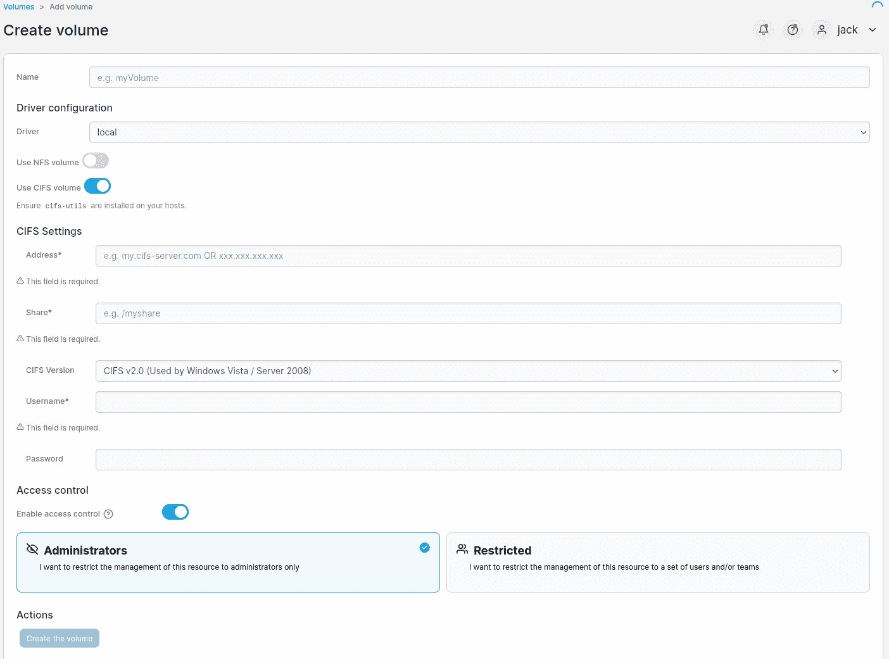
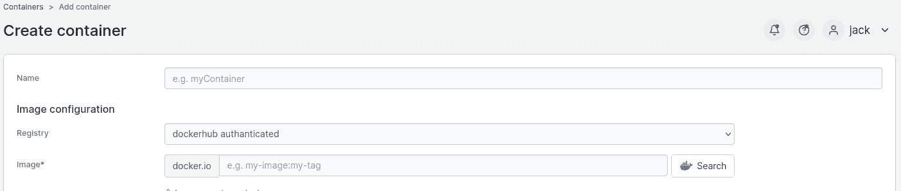
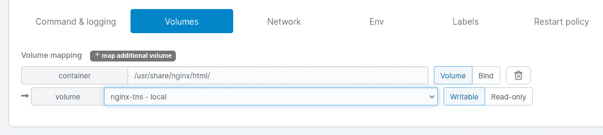
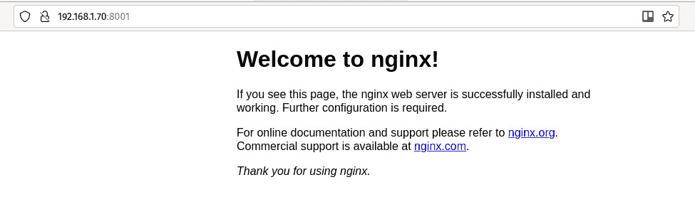
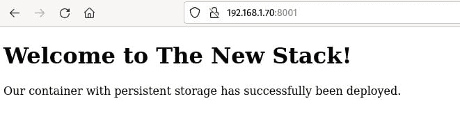

# 用 Portainer 部署持久的 Kubernetes 应用程序

> 原文：<https://thenewstack.io/deploy-a-persistent-kubernetes-application-with-portainer/>

在过去的一年里，我一直直言不讳地说我有多依赖 Portainer 作为我的 T2 集装箱管理平台。但是它不仅对[管理容器](https://thenewstack.io/microk8s-and-portainer-is-the-easiest-way-to-deploy-an-application-on-kubernetes/)来说很棒，它还是一个学习使用容器的细节的优秀平台。

例如，您可以相对容易地做的一件事是部署一个具有持久卷的容器。你为什么需要这么做？考虑一下:您使用 NGINX 容器映像构建了一个网站。您已经仔细构建了容器并构建了网站。如果您在容器中做所有的事情，万一容器发生了什么问题，您可能会丢失所有宝贵的工作。

相反，使用持久存储总是最好的。使用持久存储，您可以将本地机器上的一个驱动器(或者使用另一台机器上的一个 [Samba/CIFS](https://www.samba.org/) 共享)映射到容器中的一个目录。这样，所有数据(比如您构建的站点)在容器内的内部目录和远程(或主机)机器上的外部目录之间保持同步。

到目前为止，这是处理需要维护和保存数据的容器的最佳方式。

用 [Portainer](https://www.portainer.io/) 做这件事的好处是它非常简单。让我告诉你怎么做。

## 你需要什么

要跟进，你需要以下东西:

我将使用 [Pop 上的 Samba 共享创建持久存储！_OS Linux](https://pop.system76.com/) 机器。虽然共享名为 Public，但只能通过我的局域网访问。您肯定会希望对其进行调整以满足您的需求。

如果你很好奇，我的 smb.conf 文件中的共享看起来是这样的:

```
[PUBLIC]
path  =  /home/jack/Public
browsable  =  yes
writable  =  yes
read only  =  no

```

我将使用 Public 中的一个目录，名为 NGINX

就是这样。让我们来看看永久存储器。

## 创建卷

登录您的 Portainer 实例。在部署容器之前，首先必须创建一个卷。为此，请单击左侧导航栏中的“Volumes”。在出现的页面上，单击右上角的 Add Volume。

在添加卷页面中，给卷命名(我已经命名为我的 nginx-tns ),并单击使用 CIFS 卷的开/关滑块，这将打开 CIFS 设置部分(**图 1** )。



图 1:在“CIFS 设置选项”屏幕中，您可以为永久卷创建 SMB 共享。

以下是您需要在 CIFS 部分填写的内容:

*   **地址**:托管 Samba 共享的机器的 IP 地址。
*   **Share** :共享名和可选目录。在我的例子中，应该是 Public/NGINX。
*   **CIFS 版本**:选择 CIFS 3.0。
*   **用户名**:您用来访问共享的用户名。
*   **密码**:有权访问共享的用户的密码。

填写完这些信息后，单击创建要保存的卷。

## 创建具有该体积的容器

创建卷后，就该创建容器并附加卷了。单击左侧导航栏中的容器，然后单击右上角的添加容器。在新窗口中，给容器命名，并在 Image 部分键入 nginx(**图 2** )。



图 2:命名容器并配置要使用的图像。

向下滚动到高级容器设置部分，然后单击卷选项卡。在此选项卡中，单击映射附加卷。

这就有点棘手了。您必须知道容器使用哪个目录来保存数据。在我们的例子中，我们使用 NGINX 映像，它将文档根目录保存在/usr/share/nginx/html/中。因此，在 Container 字段(**图 3** )中键入它，并从 Volume 下拉菜单中选择您刚刚创建的新卷。



图 3:为新容器配置卷。

如果要将容器映射到特定的端口用途，请单击发布新的网络端口，然后配置映射(如外部端口 8001 到内部端口 80)。单击 Deploy Container，NGINX 容器应该部署完毕，没有任何错误。

## 如何测试持久存储

这就是乐趣所在。打开 web 浏览器并指向 http://IP:PORT(其中 IP 是托管服务器的 IP 地址，PORT 是您为容器映射的端口。您应该在浏览器中看到欢迎使用 NGINX 页面(**图 4** )。



图 NGINX 欢迎页面。

不要从容器中访问 NGINX index.html 文件，而是转到托管持久存储的机器，并导航到您映射的目录。我的情况是 Public/NGINX。在该目录中，您应该会看到两个文件:

从该共享中，用文本编辑器打开 index.html 文件。删除该文件的内容，并替换为:

```
&lt;!DOCTYPE html&gt;
&lt;html&gt;&lt;body&gt;
&lt;h1&gt;Welcome to The New Stack!&lt;/h1&gt;
&lt;p&gt;Our container with persistent storage has successfully been deployed.&lt;/p&gt;
&lt;/body&gt;
&lt;/html&gt;

```

保存并关闭文件。刷新浏览器页面，您应该会看到新的 index.html 呈现出来(**图 5** )。



图 5:我们新的 NGINX 欢迎页面。

现在，任何时候你需要改变 NGINX 托管的网站，你只需要从 SMB 共享访问它。而且，如果容器出现任何问题，您仍然可以保持数据完整。

这就是用 Portainer 实现 Docker 容器持久存储的方法。

<svg xmlns:xlink="http://www.w3.org/1999/xlink" viewBox="0 0 68 31" version="1.1"><title>Group</title> <desc>Created with Sketch.</desc></svg>