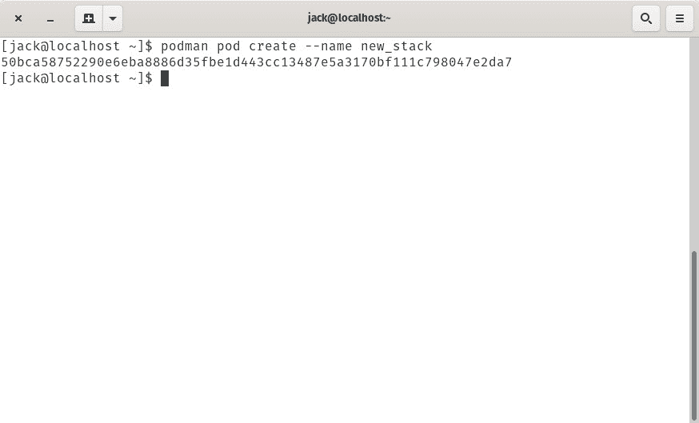
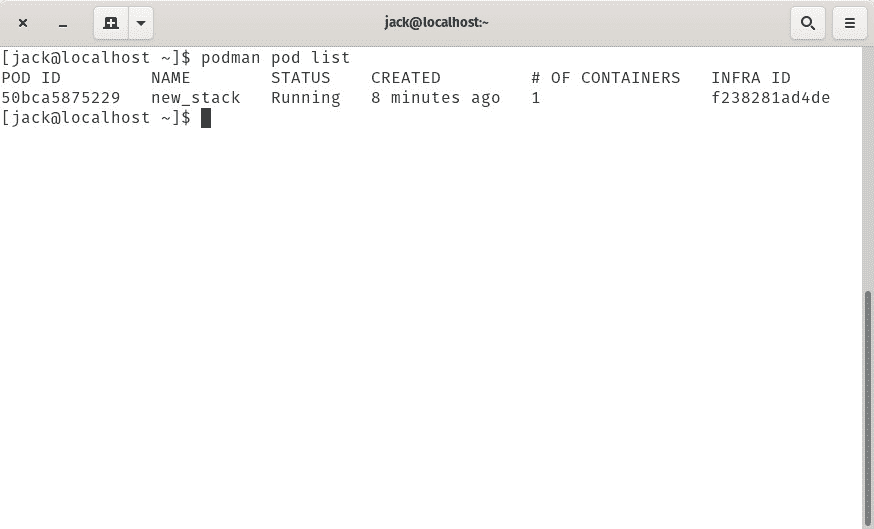
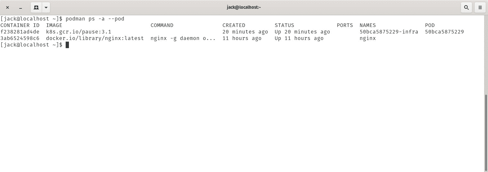
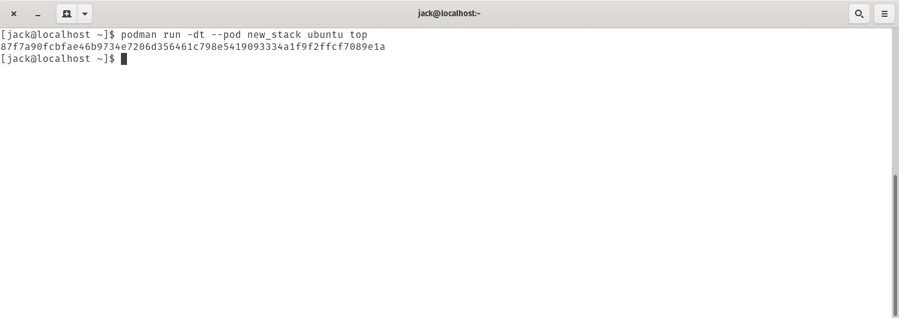
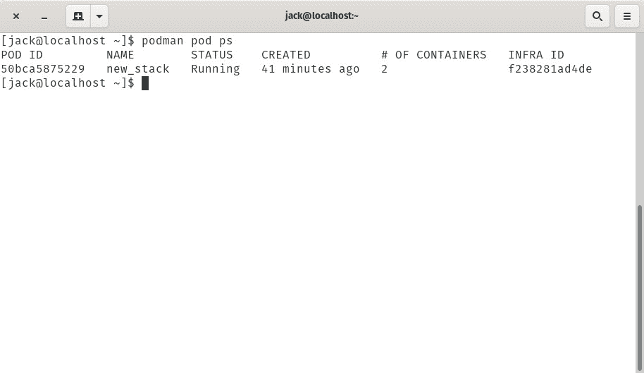
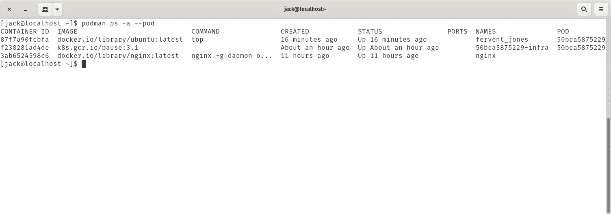
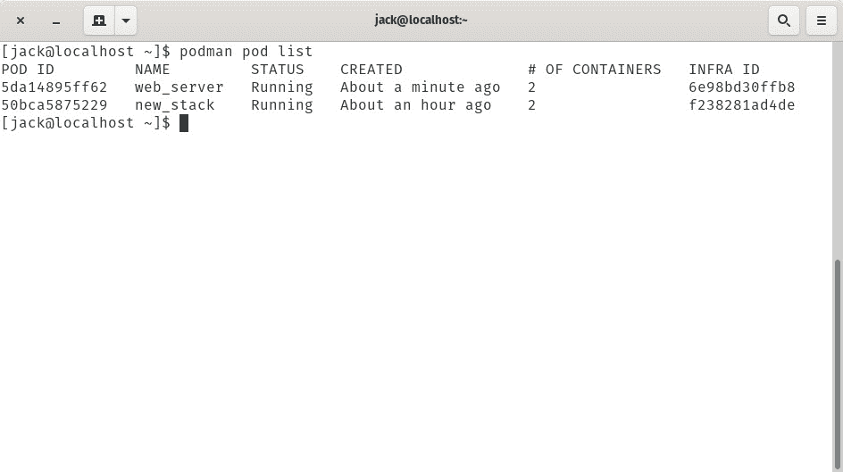

# 用波德曼在森托斯部署一个逃生舱

> 原文：<https://thenewstack.io/deploy-a-pod-on-centos-with-podman/>

如果你最近一直关注开源新闻，你可能听说过 [Red Hat 已经从它的 Red Hat Enterprise Linux (RHEL)和 CentOS Linux 发行版中放弃了 docker 容器](/check-out-podman-red-hats-daemon-less-docker-alternative/)运行时引擎。既然如此，当您需要部署容器时，您会怎么做呢？幸运的是，他们已经创造了一个名为波德曼的替代者。

波德曼和多克很像。就连指挥结构都差不多。然而，在引擎盖下，事情却大不相同。例如，Podman 没有依赖守护进程，而是将容器部署为自己的子进程。

因为它的开发者走了这条路，所以 Podman 必须具备容器协同操作的能力(否则 Podman 系统不会很有用)。想象一下，只能够部署单个容器，而没有其他互连的容器(比如带有 MySQL 数据库的 WordPress 容器)。这个解决方案就是豆荚。pod 是对容器进行分组的一种方式，以便它们可以一起操作。

我将向您介绍在 CentOS 8 上使用 Podman 部署 pod 的过程。

## 你需要什么

使用 Podman 部署 pod 唯一需要的是一个安装了 Podman 的 CentOS 8 运行实例。

### 创建 Pod

我们要做的第一件事是创建一个 pod。基本的命令结构是:

`podman pod create`

如果您在没有任何参数的情况下运行该命令，它将创建一个具有随机名称的 pod。但是，您可能希望为您的 pod 取一个有意义的名称。你可以根据你的容器的功能来命名你的容器，或者一个客户，等等。比方说，我想部署一个名为 new_stack 的 pod。该命令将是:

`podman pod create --name new_stack`

pod 将被创建并向您报告 pod 的 ID(**图 1** )。

**图 1:** 我们名为 new_stack 的新 pod 已经创建。

podman 命令还可以使用其他选项。这些选项是:

*   **–cgroup-parent value**—设置 pod 的父 cgroup。
*   **–infra**—创建一个与共享名称空间的 pod 相关联的 infra 容器。
*   **–infra-命令值** —当 pod 启动时，将自动在 infra 容器上运行的命令(例如“/pause”)。
*   **–红外线图像值** —与 pod 相关联的红外线容器图像。
*   **–标签值** —设置 pod 的元数据。
*   **–标签文件值** —使用由行分隔的标签文件设置 pod 的元数据。
*   **–pod-ID-文件值** —将 pod ID 写入文件。
*   **–发布值** —向主机发布容器的端口(或一系列端口)。
*   **–共享值** —要共享的内核名称空间的逗号分隔列表。

我们可以使用以下命令查看新创建的 pod:

`podman pod list`

这将显示我们新创建的 pod 正在运行，以及它的 ID、名称、状态等等(**图 2** )。

**图 2:** 我们新创建的 pod 已经部署完毕。

在 pod 细节中，您可能注意到它已经包含了一个容器。但是我们还没有在分离舱上安装容器。怎么回事？这个随机容器是一个基础容器。每个吊舱都包括这个红外线容器。这些容器除了睡觉什么也不做。它们的目的是保存与 pod 相关联的名称空间，并允许 Podman 将其他容器连接到 pod。infra 容器的另一个目的是当所有相关的容器都停止时，允许 pod 继续运行。

要查看 infra 容器，发出以下命令:

`podman ps -a --pod`

您应该会看到任何正在运行的 pod，包括标记为-infra 的 infra pod ( **图 3** )。

**图 3:** 我们的 infra pod 是 50bca5875229-infra。

### 添加容器

对于我们的下一个技巧，我们将向新部署的 pod 添加一个容器。请记住，我们将该 pod 命名为 new_stack。这很重要，因为您需要这个名称来将容器部署到这个 pod。我们将使用官方的 ubuntu 映像，并使用它运行 **top** 命令来部署一个容器。这不是一个非常有用的例子，但是它足够简单，可以向您展示如何将容器部署到 pod。该命令将是:

`podman run -dt --pod new_stack ubuntu top`

将返回容器 ID ( **图 4** )。

**图 4**

图 4: 我们已经成功地部署了我们的容器。

我们现在可以使用以下命令检查我们的 pod 是否有多个容器:

`podman pod ps`

我们的 new_stack pod 现在有两个容器(Infra 容器和运行 top 命令的 Ubuntu 容器— **图 5** )。

**图 5:** 我们的 pod 现在有两个容器。

您还可以使用以下命令查看窗格中的各个容器:

`podman ps -a --pod`

你会注意到 Podman 给 Ubuntu top 容器分配了一个随机的名字(在这个例子中，*fierce _ Jones—***Figure 6**)。

**图 6:** 当前运行的所有容器。

### 多合一

Podman 有一个绝妙的技巧，它可以创建一个 pod，并通过一个命令将容器部署到该 pod。假设您想要部署一个 NGINX 容器，将外部端口 8080 暴露给一个名为 web_server 的新 pod 的内部端口 80。该命令将是:

`podman run -dt --pod new:web_server -p 8080:80 nginx`

检查您的新 pod 是否是使用以下命令创建的:

`podman pod list`

您现在应该会看到列出的 web _ server pod(**图 7** )。

**图 7:** 我们新的 web_server pod 已经创建好了，包含两个容器。

## 停止吊舱

让我们停止我们的 pod(及其所有相关的容器)。为此，您需要找到要停止的 pod 的名称。发出命令:

*吊舱员吊舱清单*

您应该会看到一个运行窗格列表，与您之前看到的方式相同。但是，要停止 pod(及其所有关联的容器)，您必须使用 INFRA ID 命令:

*波德曼停止 ID*

其中 ID 是有问题的 pod 的红外线 ID。

然后，您可以使用以下命令重新启动 pod(及其关联的容器):

`podman start ID`

这是使用 pod 和 Podman 的基础。现在，您可以在 RHEL 或 CentOS 8 上的 pod 中部署容器了。

<svg xmlns:xlink="http://www.w3.org/1999/xlink" viewBox="0 0 68 31" version="1.1"><title>Group</title> <desc>Created with Sketch.</desc></svg>