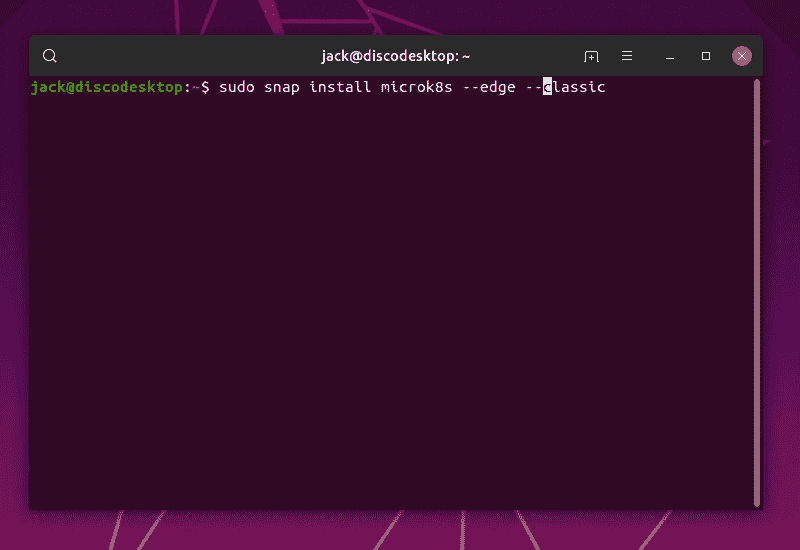
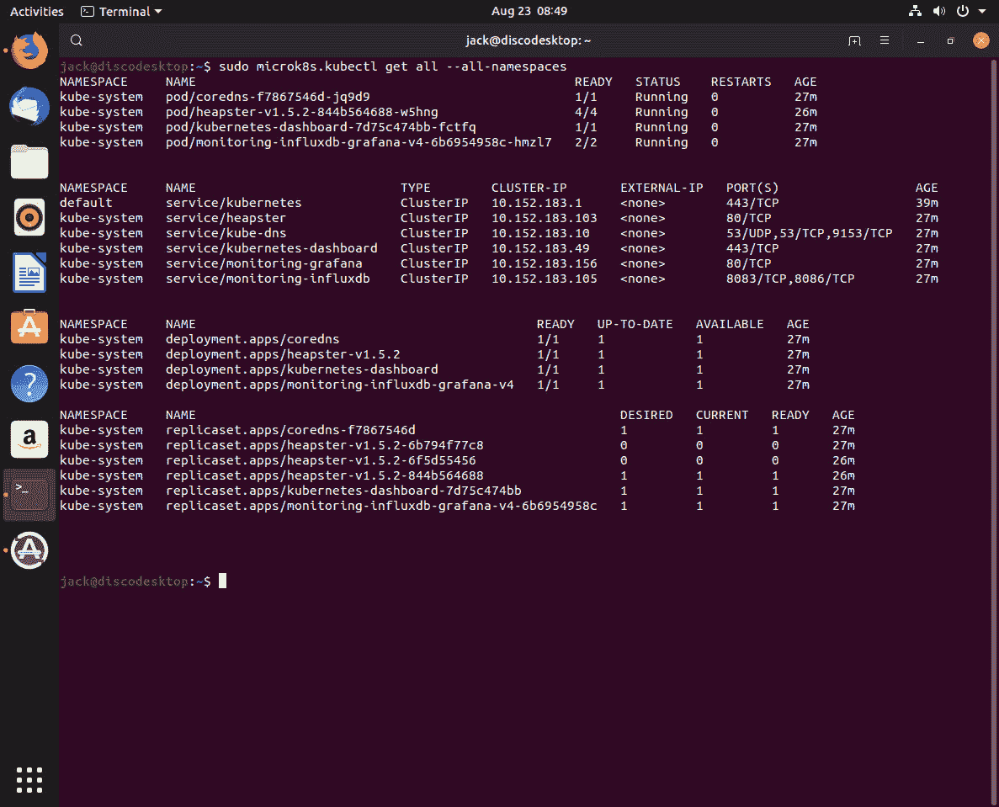
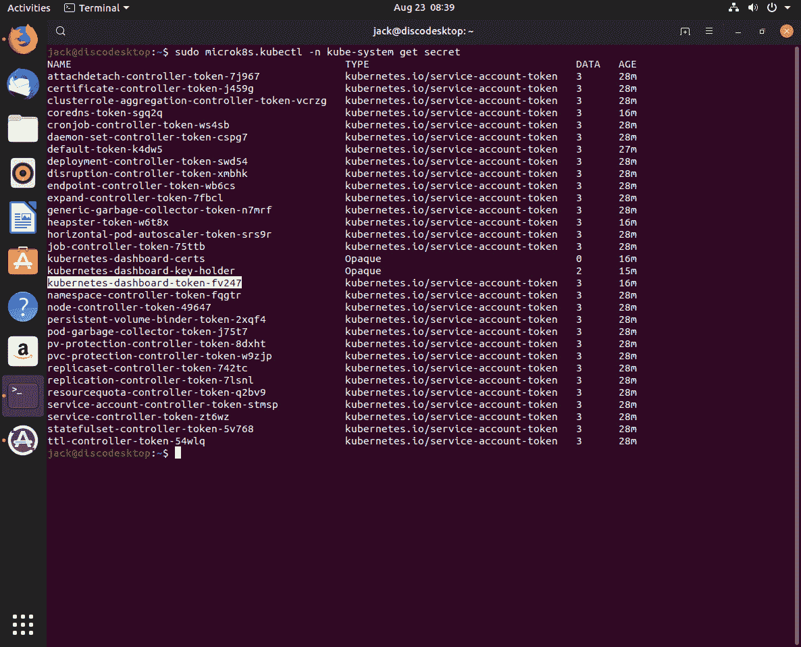
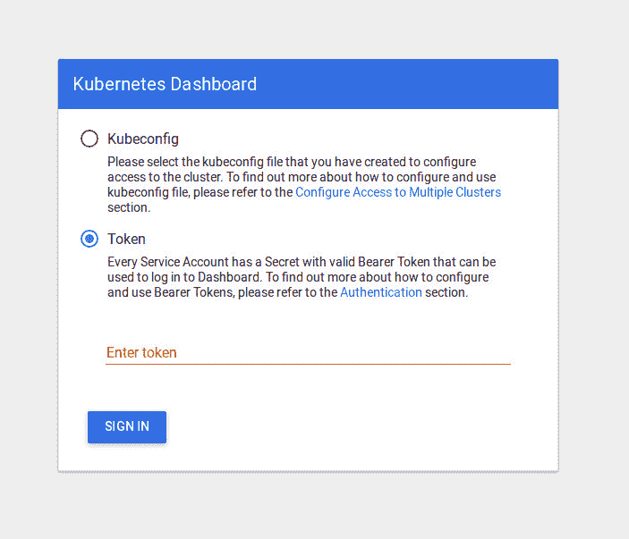
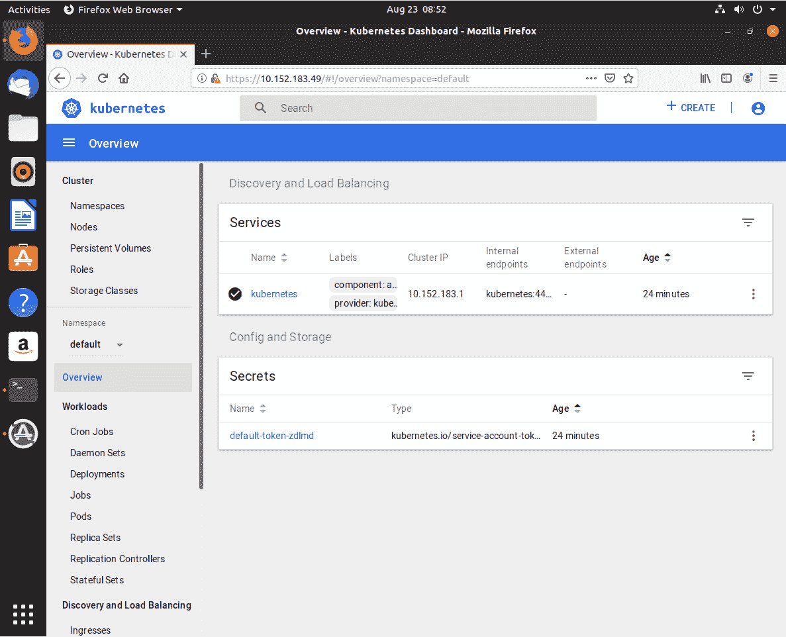
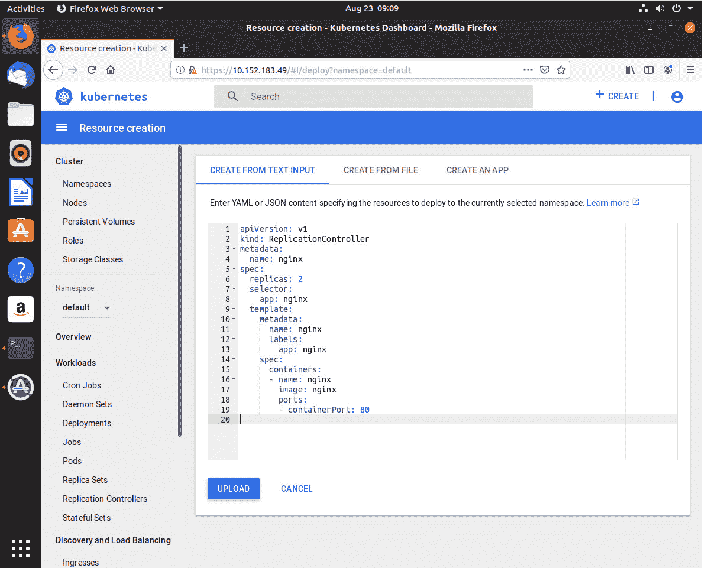
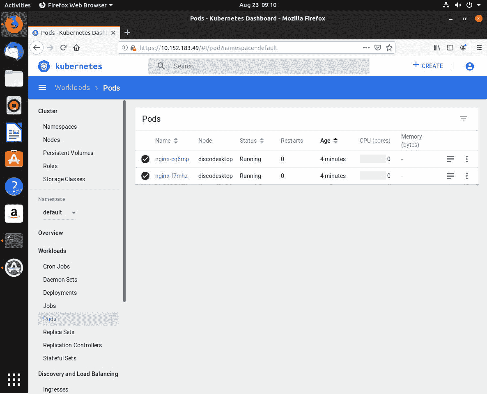

# 使用 MicroK8s 在几秒钟内部署一个单节点 Kubernetes 实例

> 原文：<https://thenewstack.io/deploy-a-single-node-kubernetes-instance-in-seconds-with-microk8s/>

有时候，您可能希望释放 Kubernetes 的单个节点实例。比方说，你正在开发一个应用程序或服务，你需要测试它。在投入生产之前，为什么不在 Kubernetes 测试平台上部署它呢？或者，您可能希望提高 Kubernetes 开发能力。与成熟的 Kubernetes 集群不同，单个节点是开发和测试的最佳实例之一。

但是，如何让单个节点启动并运行呢？有很多方法可以做到这一点。你可以走 Minikube(T4)的路线，或者启动一个标准 Kubernetes 安装的成熟的单节点。或者，你可以利用 [Microk8s](https://microk8s.io/) 。

由 [Canonical](https://ubuntu.com/kubernetes?_ga=2.233961309.29314139.1566920330-940857952.1566920330) 管理，Microk8s 是一个非弹性的、基于 rails 的单节点 Kubernetes 工具，主要专注于离线开发、原型制作和测试。Microk8s 包括以下功能:

*   伊斯迪奥
*   GPGPU 绑定
*   每日构建
*   局部存储器
*   本地注册表
*   更新
*   仪表盘
*   韵律学
*   升级
*   IngressDNS
*   一致的

Microk8s 是作为一个 snap 包创建的，所以为了安装和使用，您必须有一个支持这种特殊的通用打包格式的 Linux 发行版。我将演示如何让 Microk8s 在 Ubuntu Desktop 19.04 发行版上运行。

## 装置

Microk8s 的安装相当简单。但是，在此之前，请确保您的发行版已更新。一旦完成了这个过程，打开一个终端窗口并发出命令(**图 A** ):



图 A:从命令行安装 Microk8s。

`sudo snap install microk8s --edge --classic`

命令完成后，您需要启动 Microk8s。这是通过以下命令完成的:

`sudo microk8s.start`

该命令应该报告服务已经启动并且 pod 调度已经启用。

## 安装附加服务

为了让 Microk8s 发挥作用，您需要安装一些额外的服务。让我们安装到基本服务:kube-dns 和 Microk8s 仪表板。仪表板是一个基于 web 的仪表板，允许您与 Kubernetes 进行交互和管理。Kube-dns 在集群上调度 dns Pod 和服务，并配置 kubeletes 来指示各个容器使用 DNS 服务 IP 地址作为 DNS 解析器。

要安装这两个服务，请返回到您的终端窗口并发出以下命令:

`sudo microk8s.enable dns dashboard`

您还可以启用其他服务，例如:

*   **存储** —允许您利用主机上的存储。
*   **入口** —创建一个入口控制器。
*   **gpu** —启用 nvidia-docker 运行时和 nvidia-device-plugin-daemonset。
*   **istio** —启用核心 istio 服务。
*   **注册表** —部署私有 Docker 注册表。

如果您决定需要额外的服务，在您启动并运行 Microk8s 之后，您可以随时返回并发出 **microk8s.enable** 命令(带有您想要添加的服务)。

一旦您安装了仪表板，您就需要找到可以访问它的地址。为此，发出以下命令:

`sudo microk8s.kubectl get all --all-namespaces`

上面的命令将打印出许多名称空间，以及它们相关的地址。

**图 B**



**图 B:** 定位我们 Microk8s 仪表盘的地址。

寻找与**服务/kubernetes-dashboard 相关的 IP 地址。**

## 访问仪表板

现在您可以打开一个 web 浏览器(在运行 Microk8s 的同一台机器上)并将其指向 https://IP_ADDRESS(其中 IP_ADDRESS 是 kubernetes-dashboard IP 地址)。

此时，您将看到仪表板需要一个令牌来获取访问权。你怎么找到那个令牌的？首先，您必须使用以下命令让 Microk8s 列出所有可用的秘密:

`sudo microk8s.kubectl -n kube-system get secret`

这将生成一个包含所有服务名的列表，并附上它们的秘密名称。如您所见(**图 C** )，Kubernetes 仪表板包含在列表中。



**图 C:** 带有秘密的服务列表。

要检索相关服务的机密令牌，请发出以下命令:

`sudo microk8s.kubectl -n kube-system describe secret kubernetes-dashboard-token-fv247`

确保修改 *fv247* 条目，以匹配与您安装的 Kubernetes 仪表板实例相关联的密钥。

上面的命令将显示一长串字符。复制该字符串，然后返回到 web 浏览器。在仪表板令牌窗口(**图 D** )中，选择令牌，然后将复制的令牌粘贴到输入令牌文本字段。



**图 D:**Kubernetes 仪表板令牌输入窗口。

点击登录，您将在 Kubernetes 仪表板上找到自己(**图 E** )。



**图 E:** 用 GIMP 创建

此时，您可以从基于 web 的仪表板管理 Kubernetes。创建作业、pod、副本集、cron 作业等等。单击右上角的创建按钮，您可以直接编写或粘贴 YAML 或 JSON 文件的内容。例如，假设您想要创建一个 NGINX 部署。将以下内容复制到编辑器中(**图 F** ，点击上传。

```
apiVersion:  v1
kind:  ReplicationController
metadata:
name:  nginx
spec:
replicas:  2
selector:
app:  nginx
template:
metadata:
name:  nginx
labels:
app:  nginx
spec:
containers:
-  name:  nginx
image:  nginx
ports:
-  containerPort:  80

```



**图 F:** 上传用于 NGINX 部署的 YAML 文件。

一旦 YAML 文件被上传，点击**工作负载>窗格**，你应该看到它被列为正在运行(**图 G** )。



**图 G:**NGINX 部署已经启动并运行。

这就是用 Microk8s 启动并运行 Kubernetes 的单个节点实例(以及部署一个简单的 Pod)的全部内容。这个工具可以帮助你立刻开发自己的 Kubernetes 应用程序和服务。

<svg xmlns:xlink="http://www.w3.org/1999/xlink" viewBox="0 0 68 31" version="1.1"><title>Group</title> <desc>Created with Sketch.</desc></svg>