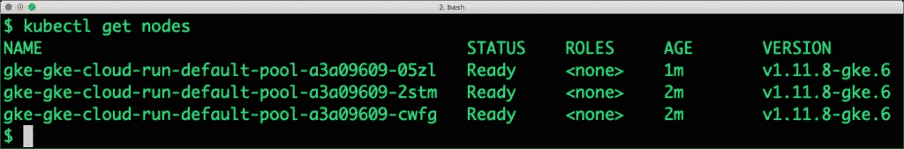
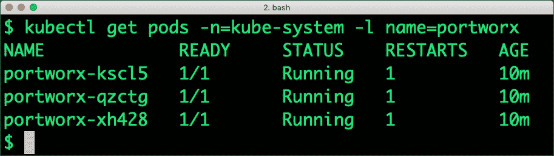
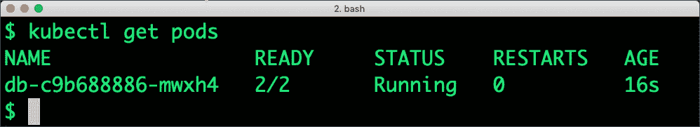
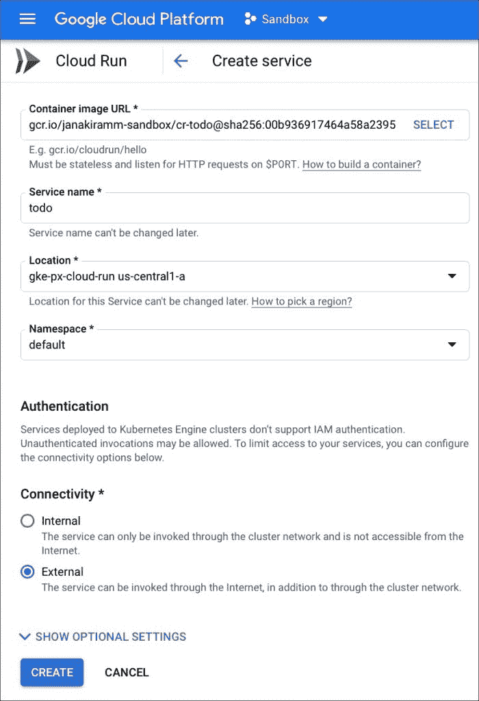
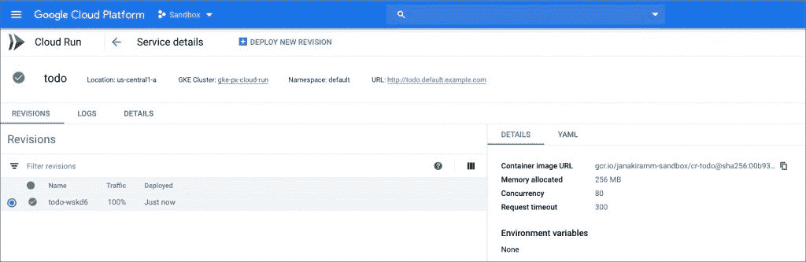
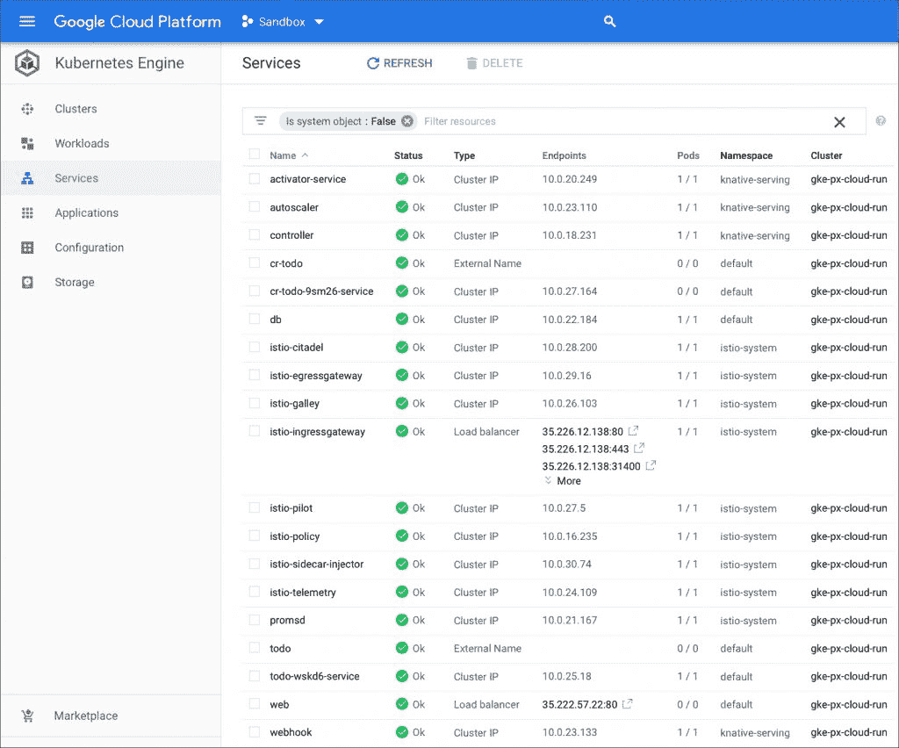
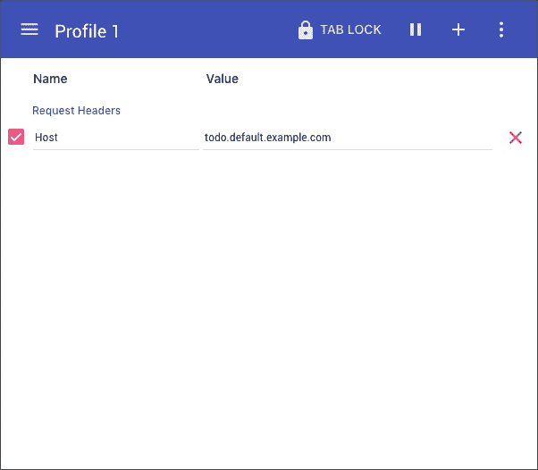
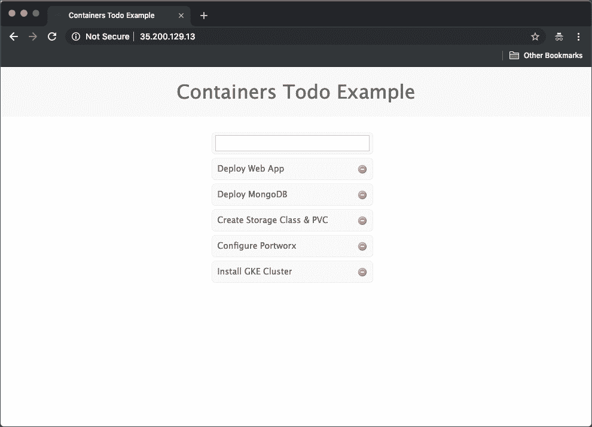
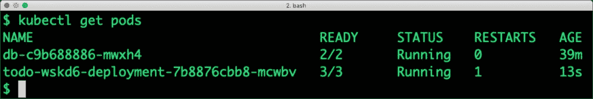

# 使用 Portworx 和 Google Cloud Run 部署弹性 Web 应用程序

> 原文：<https://thenewstack.io/deploy-an-elastic-web-app-with-portworx-and-google-cloud-run/>

*这是[谷歌云运行](https://thenewstack.io/comparison-aws-fargate-vs-google-cloud-run-vs-azure-container-instances/)系列的[最后一部分。在本教程中，我们将探索如何部署云运行服务，该服务与已经部署在](https://thenewstack.io/tutorial-deploying-a-web-application-on-google-cloud-run/)[Google Kubernetes Engine](https://cloud.google.com/kubernetes-engine/)(GKE)集群上的现有服务进行交互。*

当 Cloud Run 服务以现有的 GKE 集群为目标时，它被视为一个经典的 Kubernetes 部署，可以与通过 ClusterIP 公开的内部服务进行对话。

我将采用一种不同于[上一篇教程](https://thenewstack.io/tutorial-deploying-a-web-application-on-google-cloud-run/)中介绍的场景的方法，在该教程中，我演示了无状态云运行服务如何利用 mLab 中提供的 MongoDB 实例。在当前场景中，一个高度可用的 MongoDB 实例在 GKE 集群的默认名称空间中运行。部署为云运行服务的无状态 web 应用程序发现并使用现有的 MongoDB 实例。

下面是该场景的详细演练:

## 步骤 1:启动 GKE 集群

让我们从配置工具和环境开始。将 PROJECT_ID 变量设置为您的 GCP 项目。

```
PROJECT_ID='[your_project_id]'
ZONE_ID='us-central1-a'
GKE_CLUSTER='gke-px-cloud-run'

gcloud config set project  $PROJECT_ID
gcloud config set compute/zone  $ZONE_ID
gcloud services enable container.googleapis.com containerregistry.googleapis.com cloudbuild.googleapis.com
gcloud components update
gcloud components install beta
gcloud components install kubectl

gcloud beta container clusters create  $GKE_CLUSTER  \
  --addons=HorizontalPodAutoscaling,HttpLoadBalancing,Istio,CloudRun  \
  --machine-type=n1-standard-4  \
  --cluster-version="1.11.8-gke.6"  \
  --zone=$ZONE_ID  \
  --image-type  "UBUNTU"  \
  --disk-type  "pd-ssd"  \
  --disk-size  "50"  \
  --enable-stackdriver-kubernetes  \
  --enable-ip-alias  \
  --scopes cloud-platform

```

在这一步结束时，我们有了一个支持 Istio 和云运行的 GKE 集群。



## 步骤 2:在 GKE 集群上安装 Portworx

我们将使用 Portworx 存储引擎为我们的 MongoDB 部署带来高可用性。关于配置 Portworx 的详细步骤指南，请参考我的[过去的教程](/deploy-a-mean-web-app-with-google-kubernetes-engine-portworx/)。

运行以下命令部署 Portworx storage cluster 的试用版。

```
kubectl apply  -f  'https://install.portworx.com/?mc=false&kbver=1.11.8-gke.6&b=true&s=%22type%3Dpd-standard%2Csize%3D50%22&md=type%3Dpd-standard%2Csize%3D150&c=px-cluster-1fee88cb-6efe-4d5d-af6e-578caeac812c&gke=true&stork=true&lh=true&st=k8s'

```

下面的截图证实了 Portworx 已成功部署，并准备好运行有状态工作负载。



## 步骤 3:部署 HA MongoDB 实例

让我们从创建支持复制的 Portworx 存储类开始，它确保了 MongoDB pod 的高可用性。

```
kind:  StorageClass
apiVersion:  storage.k8s.io/v1beta1
metadata:
    name:  px-sc
provisioner:  kubernetes.io/portworx-volume
parameters:
 repl:  "3"

```

```
kubectl create  -f  px-sc.yaml  

```

利用动态预配置，我们将基于上述存储类别创建一个永久卷控制(PVC)。

```
kind:  PersistentVolumeClaim
apiVersion:  v1
metadata:
 name:  px-mongo-pvc
 annotations:
 volume.beta.kubernetes.io/storage-class:  px-sc
spec:
 accessModes:
 -  ReadWriteOnce
 resources:
 requests:
 storage:  1Gi

```

```
kubectl create  -f  px-mongo-pvc.yaml

```

现在，我们准备部署 MongoDB pod。

```
apiVersion:  extensions/v1beta1
kind:  Deployment
metadata:
  name:  db
  labels:
    name:  mongo
    app:  todoapp
spec:
  strategy:
    rollingUpdate:
      maxSurge:  1
      maxUnavailable:  1
    type:  RollingUpdate
  replicas:  1
  template:
    metadata:
      labels:
        name:  mongo
        app:  todoapp
    spec:
      schedulerName:  stork
      containers:
      -  name:  mongo
        image:  mongo
        imagePullPolicy:  "Always"
        ports:
        -  containerPort:  27017
        volumeMounts:
        -  mountPath:  /data/db
          name:  mongodb
      volumes:
      -  name:  mongodb
        persistentVolumeClaim:
          claimName:  px-mongo-pvc

```

由于 pod 由复制的 Portworx 卷支持，删除和重新创建 pod 不会影响数据。基于 Kubernetes (STORK)的存储编排，Portworx 确保将 pod 放在具有包含数据的卷的节点上。

我们现在应该有一个运行在默认名称空间
中的 MongoDB pod



最后，是时候通过 ClusterIP 在内部公开 pod 了。创建以下名为 db 的服务。

```
apiVersion:  v1
kind:  Service
metadata:
  name:  db
  labels:
    name:  mongo
    app:  todoapp
spec:
  selector:
    name:  mongo
  type:  ClusterIP
  ports:
    -  name:  db
      port:  27017
      targetPort:  27017

```

```
kubectl create  -f  db-svc.yaml

```


## 步骤 4:将 Web 应用程序部署为云运行服务

由于 Cloud Run 只能部署包含存储在 Google 容器注册表(GCR)中的映像的容器，所以我们需要将映像推送到 GCR。

您可以从头开始构建映像，也可以从 Docker Hub 中提取映像，对其进行标记，然后将其推送到 GCR。

```
docker pull janakiramm/todo:latest
docker tag janakiramm/todo gcr.io/$PROJECT_ID/cr-todo
docker push gcr.io/$PROJECT_ID/cr-todo

```

容器映像就绪后，我们现在准备将其部署为云运行服务。由于应用程序被编码为通过主机名 DB 来查找 MongoDB，因此我们不需要做任何更改。它“自动地”连接到公开为 DB 的 MongoDB ClusterIP 服务。

我们将使用 GCP 控制台而不是 CLI 来部署服务。这将有助于我们理解所有涉及的选项。



我们从位置下拉列表中选择了 GKE 集群。

绿色勾号表示服务正常且可访问。



## 步骤 5:访问 Web 应用程序

访问 web 应用程序不像 Kubernetes 服务那样简单。我们需要首先获得 Istio 入口网关 IP 地址，然后修改主机头以在浏览器中看到前端。

下面的截图显示，Istio 入口网关的 IP 地址为 35.226.12.138。在我们点击这个 URL 之前，我们还需要修改 HTTP 头以反映主机名 todo.default.example.com。



我们将使用一个 Chrome 扩展， [ModHeader](https://chrome.google.com/webstore/detail/modheader/idgpnmonknjnojddfkpgkljpfnnfcklj?hl=en) ，来操作标题。按照下面的截图添加一个新的标题:



现在，您可以输入入口 IP 地址来查看网页。



与 Kubernetes 不同，Cloud Run 不会让服务永远运行下去。与云运行服务相关的 pod 仅在有请求时启动，并在空闲超时后自动关闭。

当我们通过浏览器点击地址时，Cloud Run 就会实例化 pod。



在幕后，部署的生命周期由 [Knative Serving](https://github.com/knative/serving) 处理。

这个场景演示了如何在 Google Kubernetes 引擎上运行由 Portworx 支持的高可用性有状态服务和由云管理的弹性无状态服务。

*贾纳基拉姆·MSV 的网络研讨会系列“[机器智能和现代基础设施(MI2)](https://mi2.janakiram.com/) ”提供了涵盖前沿技术的信息丰富、见解深刻的会议。[注册](https://mi2.janakiram.com/)参加即将举行的 MI2 网络研讨会，了解如何使用 AWS Greengrass 在边缘运行应用。*

在 [Unsplash](https://unsplash.com/search/photos/build?utm_source=unsplash&utm_medium=referral&utm_content=creditCopyText) 上由 [Randy Fath](https://unsplash.com/photos/ymf4_9Y9S_A?utm_source=unsplash&utm_medium=referral&utm_content=creditCopyText) 拍摄的特征图像。

<svg xmlns:xlink="http://www.w3.org/1999/xlink" viewBox="0 0 68 31" version="1.1"><title>Group</title> <desc>Created with Sketch.</desc></svg>