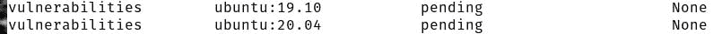
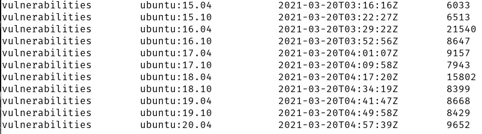
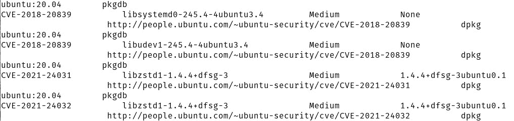

# 部署和使用 Anchore 图像漏洞扫描器

> 原文：<https://thenewstack.io/deploy-and-use-the-anchore-image-vulnerability-scanner/>

无论您使用什么平台，您的容器都是基于图像的。这意味着您的部署的安全性始于映像级别，这是开发人员和操作人员相遇的地方。无论你有多小心，如果你的容器基于包含漏洞的图像，你的应用和服务的安全性将会很弱。作为云原生开发者，你不能允许这样。

那你是做什么的？

大多数情况下，你所做的一切都基于官方图片，那些由知名公司和开发商标记的图片。在很大程度上，你可以相信这些图片。

直到您不能——直到那个漏洞溜走，那个(与您的部署中的每个其他移动部分一起)造成严重破坏的漏洞。

没有真正做好检查这些图像的工作，这完全是一场信任的游戏。你真的想听别人的话吗？大概不会。

那你是做什么的？

您利用可用的工具来扫描这些图像的漏洞。其中一些工具的启动和运行相当具有挑战性。然而，幸运的是，有足够简单的选项可供任何开发人员或管理员使用。一个这样的工具是开源的 Anchore Engine。使用这个命令行工具，您可以扫描您想要使用的图像，找出它是否包含任何已知的 CVE 问题。

我将带你完成安装和使用 Anchore Engine 的过程，这样你就可以从这些图片中去掉猜测。

我将在 Ubuntu Server 20.04 上演示，但是 Anchore Engine 可以在任何支持 docker-compose 的系统上部署和使用。

## 安装 docker-compose

首先要注意的是 docker-compose 的安装。为此，您首先需要安装 docker。登录到 Ubuntu 服务器并发出命令:

`sudo apt-get install docker.io -y`

安装完成后，使用以下命令将您的用户添加到 docker 组:

`sudo usermod -aG docker $USER`

完成后，注销并重新登录。

现在我们可以安装 docker-compose 了。使用命令下载必要的文件:

`sudo curl -L "https://github.com/docker/compose/releases/download/1.28.5/docker-compose-$(uname -s)-$(uname -m)" -o /usr/local/bin/docker-compose`

使用以下命令授予新下载的文件可执行权限:

`sudo chmod +x /usr/local/bin/docker-compose`

您可以使用以下命令验证安装:

`docker-compose --version`

您应该会看到类似这样的内容:

`docker-compose version 1.28.5, build c4eb3a1f`

## 部署锚定引擎

准备好 docker-compose 之后，我们就可以部署 Anchore 引擎了。使用以下命令下载所需的 docker-compose.yaml 文件:

`curl -O https://engine.anchore.io/docs/quickstart/docker-compose.yaml`

下载文件后，使用以下命令部署 Anchore Engine:

`docker-compose up -d`

让服务有时间启动，然后使用以下命令验证 Anchore 引擎正在运行:

`docker-compose exec api anchore-cli system status`

该命令的输出应该如下所示:

`Service apiext (anchore-quickstart, http://api:8228): up`

`Service policy_engine (anchore-quickstart, http://policy-engine:8228): up`

`Service simplequeue (anchore-quickstart, http://queue:8228): up`

`Service analyzer (anchore-quickstart, http://analyzer:8228): up`

`Service catalog (anchore-quickstart, http://catalog:8228): up`

`Engine DB Version: 0.0.14`

`Engine Code Version: 0.9.0`

你可以开始扫描了。

## 同步发动机

用 Anchore Engine 扫描图像并不简单。运行最后一个命令后，Anchore Engine 将开始与引擎同步漏洞数据。要检查同步的状态，请发出以下命令:

`docker-compose exec api anchore-cli system feeds list`

您应该看到 RecordCount 下的所有条目都被列为“None”(图 1)。

图 1:我们的引擎正在与漏洞数据同步。

完全同步将需要一些时间，所以走开或处理一些其他任务。不时检查一下(使用您上次运行的命令)，最终，RecordCount 中的所有数据都将有一个数值(图 2)。

图 2: Anchore 引擎现已同步并准备就绪。

## 扫描图像

让我们扫描一下最新的 Ubuntu 镜像(20.04)的漏洞。要做的第一件事是获取图像内容，并用以下命令提取它:

`docker-compose exec api anchore-cli image add docker.io/library/ubuntu:20.04`

添加图像后，我们使用一组 Anchore 分析器对元数据进行分类，然后对图像进行分析。首先要做的是使用 wait 命令确保映像已经转换为 analyzed，命令如下:

`docker-compose exec api anchore-cli image wait docker.io/library/ubuntu:20.04 `

`The output of the above command should like similar to:`

`Image Digest: sha256:e3d7ff9efd8431d9ef39a144c45992df5502c995b9ba3c53ff70c5b52a848d9c`

`Parent Digest: sha256:b4f9e18267eb98998f6130342baacaeb9553f136142d40959a1b46d6401f0f2b`

`Analysis Status: analyzed`

`Image Type: docker`

`Analyzed At: 2021-03-20T13:00:42Z`

`Image ID: 4dd97cefde62cf2d6bcfd8f2c0300a24fbcddbe0ebcd577cc8b420c29106869a`

`Dockerfile Mode: Guessed`

`Distro: ubuntu`

`Distro Version: 20.04`

`Size: 78632960`

`Architecture: amd64`

`Layer Count: 3`

`Full Tag: docker.io/library/ubuntu:20.04`

`Tag Detected At: 2021-03-20T12:58:34Z`

如果所有数据都已填写，您就可以继续了。您可以使用以下命令找出映像中包含的每一个软件:

`docker-compose exec api anchore-cli image content docker.io/library/ubuntu:20.04 os`

最后，我们使用以下命令运行漏洞扫描:

`docker-compose exec api anchore-cli image vuln docker.io/library/ubuntu:20.04 all`

扫描完成后，它将报告在映像中发现的所有已知 CVE，并相应地报告它们(图 3)。

图 3:最新的 Ubuntu 20.04 映像上最高标记的 CVE 被标记为中等。

现在你知道了。现在，您已经获得了有关图像安全的必要信息，可以采取行动了。如果您发现某个映像包含违反公司安全策略的 CVE(可能会导致问题)，您可以放弃该映像并找到另一个映像，或者等到这些漏洞得到解决(或者自己解决)。

如果经常使用，像 Anchore Engine 这样的工具可以确保您的云原生开发生命周期始终从一个安全的基础开始。

<svg xmlns:xlink="http://www.w3.org/1999/xlink" viewBox="0 0 68 31" version="1.1"><title>Group</title> <desc>Created with Sketch.</desc></svg>