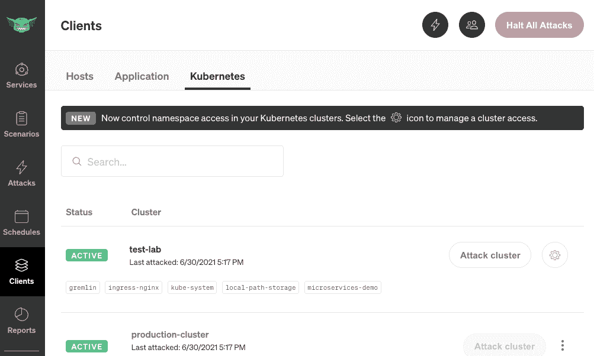

# 使用 AWS CloudFormation 将 Gremlin 部署到亚马逊 EKS

> 原文：<https://thenewstack.io/deploy-gremlin-to-amazon-eks-using-aws-cloudformation/>

[](https://www.linkedin.com/in/andrenewman/)

 [安德烈·纽曼

安德烈是 Gremlin 的技术作家，他在那里写了关于混沌工程的好处和应用。在加入 Gremlin 之前，他是初创公司和 SaaS 提供商的顾问，撰写了关于 DevOps、observability、SIEM 和微服务的文章。他曾在 DZone、StatusCode Weekly 和 Next City 中出现。](https://www.linkedin.com/in/andrenewman/) [](https://www.linkedin.com/in/andrenewman/)

Gremlin 的混沌工程平台现在可以在[亚马逊网络服务](https://aws.amazon.com/?utm_content=inline-mention)’[cloud formation 公共注册表](https://aws.amazon.com/blogs/aws/introducing-a-public-registry-for-aws-cloudformation/)上使用。这使得 AWS 客户和 [Gremlin](https://www.gremlin.com/) 用户可以轻松地发现、部署和管理其 AWS 基础设施中的 Gremlin 代理，特别是其亚马逊 EKS 集群。

在云中运行工作负载时，可靠性至关重要。即使在完全托管的云环境中，仍然有可能出现各种可能导致停机的故障模式。这些中断可能会影响客户信任、收入以及花费在故障排除和事件响应上的宝贵工程时间。可靠性如此重要，以至于它是 [AWS 良好架构框架](https://thenewstack.io/chaos-engineering-now-part-of-aws-well-architected-framework/) (WAF)的支柱之一。借助 Gremlin 和 CloudFormation Public Registry，您可以轻松验证 AWS 部署在各种故障模式下的弹性。

安装 Gremlin 代理使您能够在 EKS 工作负载上运行有针对性的实验，例如:

*   通过模拟大流量来测试自动扩展组(ASG)的配置。
*   通过模拟可用性区域或区域中断来验证区域故障转移和灾难恢复。
*   验证 CloudWatch 配置和警报。
*   确保容器化的工作负载、Kubernetes 资源和[分布式服务](https://www.gremlin.com/blog/announcing-services-discovery-for-tracking-and-improving-service-reliability)能够自动从故障中恢复。

在本教程中，我们将向您展示如何使用 CloudFormation Public Registry 部署 Gremlin，并验证您可以在您的集群上运行实验。您将为 CloudFormation 创建一个 IAM 角色，部署一个 Amazon EKS 集群，激活 CloudFormation 中的 Gremlin 扩展，最后将代理部署到您的集群。

## 它是如何工作的

Gremlin 代理是一个可执行程序，它在主机上编排实验。在 Kubernetes 集群上，它被部署为一个 DaemonSet，这意味着代理的一个实例被自动部署到 Kubernetes 集群中的每个节点。代理检测主机的名称、状态(活动或空闲)、[特定于 AWS 的元数据](https://www.gremlin.com/docs/infrastructure-layer/targets/%23aws)，如可用性区域和地区，以及 Kubernetes 资源(如部署、pod 和 DaemonSets)。然后，在使用 Gremlin web 应用程序、API 或 CLI 运行实验时，这些信息可用于确定特定资源或资源集的目标。Gremlin 代理还可以检测您的主机上运行的进程，使用[服务发现](https://www.gremlin.com/docs/infrastructure-layer/services/)功能可以将这些进程作为目标。

CloudFormation Public Registry 使用 [Gremlin Helm chart](https://github.com/gremlin/helm/) 部署 Gremlin 代理。您不需要熟悉 Helm 来学习本教程，除非您想自己配置图表。

## 步骤 1:为 CloudFormation 创建 IAM 角色

我们的第一步是为 CloudFormation 创建一个 IAM(身份访问管理)角色，这将赋予它必要的权限。此处提供了一个模板[。运行这个模板将会生成一个 ARN (Amazon 资源名称)，您将会在下面的步骤中用到它。](https://github.com/gremlin/CloudFormation-Resources/blob/main/gremlin-agent-helm/execution-role.template.yaml)

接下来，启用`AWSQS::EKS::Cluster`扩展。导航到 CloudFormation 注册表，选择 public extensions，然后搜索“AWSQS::EKS::集群”。单击激活，当提示输入执行角色 ARN 时，使用为 IAM 角色创建的 ARN。


## 步骤 2:部署亚马逊 EKS 集群

接下来，您需要为您的集群提供对 Kubernetes API 的 CloudFormation 访问。您可以使用[这个模板](https://github.com/aws-quickstart/quickstart-amazon-eks-cluster-resource-provider/blob/main/README.md)部署一个新的集群，或者您可以手动将 IAM 执行角色添加到您的集群以授予访问权限。你可以在我们的 [GitHub 库](https://github.com/gremlin/CloudFormation-Resources/tree/main/gremlin-agent-helm)中找到额外的说明。

### 步骤 3:激活 Gremlin 扩展

现在您的集群正在运行，CloudFormation 可以访问 Kubernetes API，下一步是激活 Gremlin 扩展。导航到云形成注册表。在“出版商”下，切换到“第三方”并搜索“Gremlin”，如下所示:


保留详细信息的默认设置，但对于执行角色 ARN，输入您在步骤 1 中生成的 ARN。然后，按“激活分机”:


## 步骤 4:部署 Gremlin 代理

最后一步是部署 Gremlin 代理。这个扩展使用了 [Gremlin 舵图](https://github.com/gremlin/helm/)，它是使用 YAML 模板配置的。作为 Gremlin 代理安装的一部分，您需要使用您的 Gremlin 团队 ID 和基于[秘密的认证](https://github.com/gremlin/helm/blob/master/gremlin/README.md)或基于[证书的认证](https://github.com/gremlin/helm/blob/master/gremlin/README.md)用您的 Gremlin 帐户对其进行认证。对于本教程，我们将使用基于秘密的认证。您还需要为集群提供一个名称:这个名称将用于在 Gremlin web 应用程序中识别集群。

你可以使用下面的 YAML 作为模板。替换以下值:

```
&lt;YOUR-GREMLIN-TEAM-ID&gt;:  The unique ID for your Gremlin team.

&lt;A-NAME-FOR-YOUR-EKS-CLUSTER&gt;:  A  unique name for your EKS cluster.  You’ll use this to identify your cluster in the Gremlin web app and for selecting experiment targets.

&lt;YOUR-GREMLIN-TEAM-SECRET&gt;:  Your Gremlin  <a  href="https://www.gremlin.com/docs/infrastructure-layer/authentication/%23create-a-secret">team secret</a>.

```

AWSTemplateFormatVersion:" 2010-09-09 "

资源:

小淘气:

```
     Type:  "Gremlin::Agent::Helm"

      Properties:
         ClusterID:  aws-cluster-name
         Name:  gremlin-agent
         Namespace:  gremlin

         Values:

            gremlin.secret.managed:  "true"
            gremlin.secret.type:  "secret"
            gremlin.secret.teamID:  "&lt;YOUR-GREMLIN-TEAM-ID&gt;"
            gremlin.secret.clusterID:  "&lt;A-NAME-FOR-YOUR-EKS-CLUSTER&gt;"
            gremlin.secret.teamSecret:  "&lt;YOUR-GREMLIN-TEAM-SECRET&gt;"

```

在 AWS CloudFormation 控制台中，使用此模板创建一个新堆栈，并输入该堆栈的名称。创建堆栈，然后监视 Events 选项卡。部署堆栈后，您将看到一个状态为“CREATE_COMPLETE”的事件:


您可以通过登录 Gremlin web 应用程序、单击 Clients 并选择 [Kubernetes 选项卡](https://app.gremlin.com/clients/kubernetes)来验证 Gremlin 是否已成功部署。您将看到按名称列出的集群及其名称空间。你现在可以通过点击攻击集群按钮来运行实验。



要了解更多关于 Gremlin 的 CloudFormation 集成，请访问我们的 [GitHub 资源库](https://github.com/gremlin/CloudFormation-Resources)。

<svg xmlns:xlink="http://www.w3.org/1999/xlink" viewBox="0 0 68 31" version="1.1"><title>Group</title> <desc>Created with Sketch.</desc></svg>