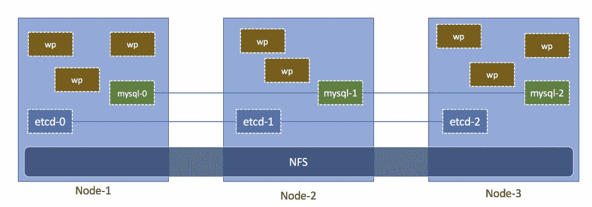
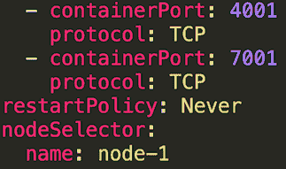
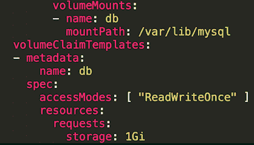
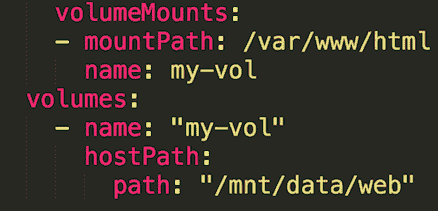

# 在 Kubernetes 1.5 中部署一个高度可用的 WordPress 实例作为 StatefulSet

> 原文：<https://thenewstack.io/deploy-highly-available-wordpress-instance-statefulset-kubernetes-1-5/>

在新的堆栈中，我们涵盖了在 [Kubernetes](/category/kubernetes/) 容器编排引擎上运行[有状态工作负载](https://thenewstack.io/strategies-running-stateful-applications-kubernetes-pet-sets/)的[各种策略](https://thenewstack.io/strategies-running-stateful-applications-kubernetes-volumes/)。本文基于前面讨论的策略和最佳实践，采用实用的方法在 Kubernetes 中部署高度可用的 WordPress 应用程序。我们将涵盖从设置 Kubernetes 集群到配置共享存储到部署有状态应用程序到配置应用程序的自动伸缩的所有内容。

在容器化环境中部署和管理数据库和内容管理系统等传统工作负载需要不同的方法。虽然在 Kubernetes 中打包、部署、管理和扩展当前的云原生应用程序可能很容易，但管理 MySQL 集群或一群 WordPress 容器需要了解存储、网络和服务发现在 Kubernetes 环境中如何工作。我们将在运行一个由 MySQL 和 WordPress 支持的可靠的、高度可用的内容管理系统(CMS)的环境中探索这些概念。

## 高可用性 WordPress 部署的属性

WordPress 是一个依赖于两个持久性后端的有状态应用程序:一个文件系统和 MySQL 数据库。为了确保应用程序的高可用性，我们需要最大化核心 PHP 应用程序、支持文件系统的底层存储层和由 MySQL 支持的数据层的正常运行时间。

当流量增加时，核心 PHP 应用程序应该弹性伸缩以满足负载需求。每个新实例都应该对文件系统具有读/写权限，以便访问和更新内容。文件系统容量应该随着内容的增长而成比例增加。尽管不是完全弹性的，数据层也应该能够按需伸缩。

Kubernetes 和其他容器管理平台支持轻松扩展无状态 PHP 应用程序。然而，扩展存储后端和 MySQL 数据层并非易事。Kubernetes 1.5 中引入的 [StatefulSets](https://kubernetes.io/docs/concepts/abstractions/controllers/statefulsets/) 的概念正好解决了扩展有状态工作负载的问题。我们将利用这一概念来设计我们的部署策略。

## 瞥一眼堆栈

我们应用的数据层将由 [Percona XtraDB 集群](https://www.percona.com/software/mysql-database/percona-xtradb-cluster)提供支持。它是最流行的开源 MySQL 集群技术之一，由 Percona 服务器和[代码师 Galera](http://galeracluster.com/) 提供支持。Percona 的 XtraDB 集群最大的优点是它支持同步、多主复制，这提供了高可用性。MySQL Docker 图片可以在由 Percona 维护的 [Docker Hub](https://hub.docker.com/r/percona/percona-xtradb-cluster/) 上获得。

XtraDB 集群依靠 [etcd](https://coreos.com/etcd/) 来发现新节点。开源 etcd 是一个流行的键值存储，用于共享配置和服务发现。它支持一些著名的分布式计算系统，如 Kubernetes、Cloud Foundry、locksmith、vulcand 和 Doorman。etcd 来自 core OS Inc .，该公司开发了 [Container Linux](https://linuxcontainers.org/) 发行版，并针对容器调度和管理进行了高度优化。

对于共享存储，我们将配置一个[网络文件存储](http://nfs.sourceforge.net/) (NFS)后端，可以从集群的所有 Kubernetes 节点访问它。通过 WordPress 上传的静态内容将存储在分布式文件系统中。这种方法确保了 WordPress 容器是完全无状态的，可以快速伸缩。

我们将使用 Docker Hub 的官方 WordPress 图片来创建 Kubernetes Pods。唯一暴露于外界的端点将是与 WordPress Pods 关联的 HTTP / HTTPS 服务。

[](https://cdn.thenewstack.io/media/2017/01/6a4405e0-architecture.png)

## 为 Kubernetes 运行有状态工作负载做好准备

在 Kubernetes 中创建的[持久卷和声明](http://kubernetes.io/docs/user-guide/persistent-volumes/)可以基于 NFS。它们成为 MySQL 和 WordPress Pods 的存储支柱。在生产场景中，建议 NFS 共享基于在网络优化实例中运行的 SSD 存储。为了进行概念验证，我们将在 Kubernetes 主服务器上配置 NFS。

为了获得更高的可用性，我们将至少运行三个 etcd 实例。我们将使用[节点关联](http://kubernetes.io/docs/user-guide/node-selection/)的概念在一个节点中调度一个且仅一个 etcd Pod。

Percona XtraDB 集群将被配置为 Kubernetes [StatefulSet](http://kubernetes.io/docs/concepts/abstractions/controllers/statefulsets/) 以确保高可用性。StatefulSet 模拟了部署和管理基于虚拟机的集群所涉及的工作流。每个 Pod 都有一个与专用持久存储相关联的稳定、唯一的标识符。它为有状态 pod 带来了[复制集](http://kubernetes.io/docs/user-guide/replicasets/)的灵活性。

为了 WordPress Pods 的弹性伸缩和快速调度，我们将配置一个至少有三个副本的[副本集](http://kubernetes.io/docs/user-guide/replicasets/)。副本集中的每个 Pod 将与 NFS 上装载的一个卷相关联。这种方法使得 WordPress 几乎是无状态的。我们还将为副本集配置[水平 Pod 自动缩放](https://kubernetes.io/docs/user-guide/horizontal-pod-autoscaling/)以支持弹性。

## 建立 Kubernetes 基础设施

本演练帮助您在一组本地运行的漫游机上配置 Kubernetes 集群。只需稍加修改，主流公共云提供商也可以采用同样的方法。

假设你有一台运行 [VirtualBox](https://www.virtualbox.org/wiki/VirtualBox) 和[vagger](https://www.vagrantup.com/)的至少 8GB 内存和 256GB 硬盘的 Mac，你可以在不到 20 分钟的时间内轻松启动一个完全配置的三节点 Kubernetes 集群。只需运行以下命令即可开始。

```
$  export KUBERNETES_PROVIDER=vagrant

$  export NUM_NODES=3

$  curl  -sS https://get.k8s.io | bash

$  cd kubernetes

$  ./cluster/kube-up.sh

```

这将提供四个 Fedora 虚拟机:一个 Kubernetes 主机和三个节点。它还将配置 Kubernetes 命令行界面 [kubectl](https://kubernetes.io/docs/user-guide/kubectl-overview/) 来与集群一起工作。

键入 kubectl get nodes 会显示以下输出。

```
$  kubectl get nodes

NAME                 STATUS     AGE

kubernetes-node-1    Ready      1d

kubernetes-node-2    Ready      1d

kubernetes-node-3    Ready      1d

```

完成后，下一步是基于 NFS 设置共享存储。我们将把主服务器配置为 NFS 服务器，挂载点在所有节点上都可用。

SSH 进入 Kubernetes 主服务器(10.245.1.2)并运行命令来配置 NFS 共享:

```
cd kubernetes

vagrant ssh master

sudo  -i

mkdir  -p  /opt/data

chmod  777  /opt/data

echo  "/opt/data 10.245.1.2/24(rw,sync,no_root_squash,no_all_squash)"   &gt;&gt;  /etc/exports

systemctl enable  --now rpcbind

systemctl enable  --now nfs-server

systemctl start rpcbind

systemctl start nfs-server

mkdir  -p  /opt/data/vol/0

mkdir  -p  /opt/data/vol/1

mkdir  -p  /opt/data/vol/2

mkdir  -p  /opt/data/content

```

SSH 进入每个节点，在引导时运行以下命令自动挂载 NFS:

```
sudo  -i

systemctl start rpcbind nfs-mountd

systemctl enable rpcbind nfs-mountd

echo  "10.245.1.2:/opt/data  /mnt/data  nfs      rw,sync,hard,intr  0    0"  &gt;&gt;  /etc/fstab

dnf  -y  install autofs

echo  "/-    /etc/auto.mount"  &gt;&gt;  /etc/auto.master

echo  "/mnt/data -fstype=nfs,rw  10.245.1.2:/opt/data"  &gt;&gt;  /etc/auto.mount

systemctl start autofs

systemctl enable autofs

```

这一步完成了在节点上的 **/mnt/data** 处为集群提供可用的共享存储。

## 创建持久卷和声明

在我们进一步进行设置之前，让我们创建 MySQL 集群将使用的持久卷(PV)和持久卷声明(PVC)。

我们将首先调配三个基于 NFS 的持久卷。注意，PV 定义包含一个指向 NFS 服务器的指针。路径 **/opt/data/vol/0** 将被显式分配给名为 mysql-pv0 的 PV。剩下的两个 pv1 也附加了序号索引 1 和 2。当我们创建 MySQL StatefulSet:
时，将解释这个约定的重要性

```
apiVersion:  v1

kind:  PersistentVolume

metadata:

 name:  mysql-pv0

spec:

 capacity:

   storage:  1Gi

 accessModes:

   -  ReadWriteMany

 persistentVolumeReclaimPolicy:  Recycle

 nfs:

   path:  /opt/data/vol/0

   server:  10.245.1.2

```

每个 PV 将由一个 PVC 声明，该 PVC 将被映射到 StatefulSet 的 Pod 卷:

```
kind:  PersistentVolumeClaim

apiVersion:  v1

metadata:

 name:  db-mysql-0

spec:

 accessModes:

   -  ReadWriteMany

 resources:

   requests:

     storage:  1Gi

```

执行以下命令来配置存储基础架构:

```
$  kubectl create  -f  https://github.com/janakiramm/wp-statefulset/blob/master/volumes.yml

```

让我们确保 PVs 和 PVC 都已就位:

```
# For brevity we are only printing a few columns

```

```
$  kubectl get pv  |  awk  {'print $1" " $2" " $5" "$6'}  |  column  -t

NAME        CAPACITY   STATUS   CLAIM

mysql-pv0   1Gi        Bound    default/db-mysql-0

mysql-pv1   1Gi        Bound    default/db-mysql-1

mysql-pv2   1Gi        Bound    default/db-mysql-2

```

```
# For brevity we are only printing a few columns

```

```
$  kubectl get pvc  |  awk  {'print $1" " $2" " $3'}  |  column  -t

NAME         STATUS   VOLUME

db-mysql-0   Bound    mysql-pv0

db-mysql-1   Bound    mysql-pv1

db-mysql-2   Bound    mysql-pv2

```

有了基础设施，我们就可以部署有状态应用程序了。

## 部署 etcd

我们将配置分布式键值存储的 3 个实例，等等。因为每个实例需要独特的配置，所以它将被打包成一个具有专用服务的 Pod。服务端点将被 [RAFT 共识协议](https://raft.github.io/)用于内部通信。我们还将为 MySQL 集群公开一个内部端点来与 etcd 集群对话。为了测试 etcd 部署，我们还将公开一个节点端口。

为了确保没有两个 etcd 实例放在同一个节点上，我们将使用节点关联性。在此之前，我们需要为每个 Kubernetes 节点添加一个标签。以下命令将为节点分配标签。

```
$  kubectl label nodes kubernetes-node-1  name=node-1

$  kubectl label nodes kubernetes-node-2  name=node-2

$  kubectl label nodes kubernetes-node-3  name=node-3

```

每个 etcd 实例的 Pod 定义将具有节点选择器参数，该参数实施节点关联性。



运行以下命令创建 etcd 集群:

```
kubectl create  -f  https://github.com/janakiramm/wp-statefulset/blob/master/etcd.yml

```

我们现在应该有三个 pod 和五个服务。etcd-client 服务仅用于从主机测试 etcd 集群。稍后可以安全地删除它。

```
$  kubectl get pods

NAME         READY        STATUS       RESTARTS AGE

etcd-0        1/1          Running      0             10m

etcd-1       1/1          Running      0             10m

etcd-2       1/1          Running      0             10m

```

```
# For brevity we are only printing a few columns

$  kubectl get svc  |  awk  {'print $1" " $2" " $4'}  |  column  -t

NAME            CLUSTER-IP         PORT(S)

etcd            10.247.97.132      2379/TCP,4001/TCP,7001/TCP

etcd-0          10.247.188.152     2379/TCP,2380/TCP,4001/TCP,7001/TCP

etcd-1          10.247.213.44      2379/TCP,2380/TCP,4001/TCP,7001/TCP

etcd-2          10.247.0.30        2379/TCP,2380/TCP,4001/TCP,7001/TCP

etcd-client     10.247.180.33      2379:30163/TCP

kubernetes      10.247.0.1         443/TCP

```

让我们通过存储和访问值来验证 etcd 配置:

```
$  curl  -L   curl  -L  -X  PUT http://10.245.1.2:30163/v2/keys/message -d value="Hello"

{"action":"set","node":{"key":"/message","value":"Hello","modifiedIndex":4,"createdIndex":4}}

$  curl  -L  http://10.245.1.2:30163/v2/keys/message

{"action":"get","node":{"key":"/message","value":"Hello","modifiedIndex":4,"createdIndex":4}}

```

此步骤成功配置了具有节点关联性的 etcd 集群。我们将使用它来配置 MySQL 集群。

## 部署 Percona 集群

让我们继续部署 3 个 MySQL 实例作为 StatefulSet。在我们启动集群之前，看一下 StatefulSet 定义。请注意 volumeMounts 参数是如何与索赔相关联的。



在对 StatefulSet 进行调度的过程中，Kubernetes 将确保每个 Pod 都映射到一个基于序号索引的索赔。Pod **mysql-0** 将被映射到之前创建的 **db-mysql-0** 。请花一分钟时间来探索 statefullset YAML 文件。

您还会注意到，Percona 集群依赖于我们在上一步中创建的 etcd 服务进行发现。

现在让我们为 MySQL 提供一个三节点 Percona XtraDB 集群:

```
$  kubectl create  -f  https://github.com/janakiramm/wp-statefulset/blob/master/mysql.yml

```

几分钟后，您应该会看到为我们创建的三个 pod。

```
$  kubectl get pods

NAME         READY        STATUS       RESTARTS AGE

etcd-0        1/1          Running      0             10m

etcd-1       1/1          Running      0             10m

etcd-2       1/1          Running      0             10m

mysql-0  1/1  Running  0  4m

mysql-1  1/1  Running  0  4m

mysql-2  1/1  Running  0  4m

```

检查状态集中的一个单元，查看存储和网络配置。我们还可以检查日志，查看 MySQL 实例中的复制配置:

```
$  kubectl describe pod mysql-0

$  kubectl logs mysql-0

```

这一步还包括内部和外部 MySQL 服务的创建:

```
# For brevity we are only printing a few columns

$  kubectl get svc  |  awk  {'print $1" " $2" " $4'}  |  column  -t

NAME            CLUSTER-IP         PORT(S)

etcd            10.247.97.132      2379/TCP,4001/TCP,7001/TCP

etcd-0          10.247.188.152     2379/TCP,2380/TCP,4001/TCP,7001/TCP

etcd-1          10.247.213.44      2379/TCP,2380/TCP,4001/TCP,7001/TCP

etcd-2          10.247.0.30        2379/TCP,2380/TCP,4001/TCP,7001/TCP

etcd-client     10.247.180.33      2379:30163/TCP

mysql            None               3306/TCP

mysql-client     10.247.104.122     3306:32236/TCP

kubernetes      10.247.0.1         443/TCP

```

MySQL 端点是一个无头服务，用于将请求路由到 StatefulSet 的一个 pod。WordPress 将使用它与 MySQL 集群对话。

创建了 **mysql-client** 端点来测试服务。它可以在初始设置后删除。让我们通过将 CLI 连接到 mysql-client 端点来看看 MySQL 集群的运行情况:

```
# Ignoring the warnings generated by the CLI

$  while true;  do mysql  -h  10.245.1.3  -P  32236  -u  root  -pk8spassword  -NBe  'select @@wsrep_node_address'  2&gt;/dev/null;  sleep  1;  done

10.246.24.7

10.246.28.4

10.246.28.4

10.246.76.3

10.246.24.7

10.246.76.3

10.246.24.7

```

无头服务将 CLI 路由至其中一个 pod。每个唯一的 IP 代表一个有状态 Pod 的地址。

这验证了 MySQL cluster 已经启动并正在运行。您还可以通过 SSH 进入 Kubernetes Master vagger box，查看包含 MySQL 数据和日志文件的文件夹(**/opt/data/vol/【0，1，2】**)。

## 部署 WordPress

由于状态已经转移到 NFS 和 MySQL，我们可以将 WordPress Pods 配置为一个复制集。这将为我们扩展应用程序提供灵活性。

让我们创建一个复制集:

```
$  kubectl create  -f  https://github.com/janakiramm/wp-statefulset/blob/master/wordpress.yml

service  "wordpress"  created

horizontalpodautoscaler  "wordpress-scaler"  created

replicaset  "wordpress"  created

```

让我们验证 Pod 的创建:

```
$  kubectl get pods

NAME         READY        STATUS       RESTARTS AGE

etcd-0        1/1          Running      0             10m

etcd-1       1/1          Running      0             10m

etcd-2       1/1          Running      0             10m

mysql-0  1/1  Running  0  4m

mysql-1  1/1  Running  0  4m

mysql-2  1/1  Running  0  4m

wordpress-1rzcr      1/1          Running      0             1m

wordpress-2zdql      1/1          Running      0             1m

wordpress-8h68h      1/1          Running      0             1m

wordpress-gpg8s      1/1          Running      0             1m

wordpress-jxhfk      1/1          Running      0             1m

```

replica set 的每个 Pod 挂载具有读/写访问权限的相同文件系统共享。这将确保上传到 WordPress 的内容对所有的 pod 都是即时可用的。



yml 文件也有一个水平窗格自动缩放器(HPA)的定义，它将自动缩放窗格。

```
$  kubectl get hpa

NAME            REFERENCE            TARGET     CURRENT    MINPODS    MAXPODS    AGE

wordpress-scaler    ReplicaSet/wordpress   50%            0%                5                10               5m

```

发现后端(etcd)、数据库(MySQL)和前端(WordPress)就绪后，让我们继续从浏览器访问它。在此之前，让我们获取服务端点的节点端口。

```
# For brevity we are only printing a few columns

$  kubectl get svc  |  awk  {'print $1" " $2" " $4'}  |  column  -t

NAME            CLUSTER-IP         PORT(S)

etcd            10.247.97.132      2379/TCP,4001/TCP,7001/TCP

etcd-0          10.247.188.152     2379/TCP,2380/TCP,4001/TCP,7001/TCP

etcd-1          10.247.213.44      2379/TCP,2380/TCP,4001/TCP,7001/TCP

etcd-2          10.247.0.30        2379/TCP,2380/TCP,4001/TCP,7001/TCP

etcd-client     10.247.180.33      2379:30163/TCP

mysql            None               3306/TCP

mysql-client     10.247.104.122     3306:32236/TCP

kubernetes      10.247.0.1         443/TCP

wordpress  10.247.85.101  80:31362/TCP

```

```
$  open http://10.245.1.3:31362

```

## 放弃

*   由于 StatefulSet 目前处于测试阶段，因此该架构旨在为 StatefulSet 提供概念验证。它还不能用于生产。
*   要部署 etcd，请考虑 CoreOS 的 [etcd 操作员](https://coreos.com/blog/introducing-the-etcd-operator.html)。
*   NFS 可能不是 I/O 密集型工作负载的理想分布式存储。对于这种类型的部署，建议使用 [Gluster](https://www.gluster.org/) 或 Ceph。
*   [Redis](https://redis.io/) 或 [Memcached](https://memcached.org/) 是存储 PHP 会话的首选。将会话状态移出 WordPress 将使部署更具伸缩性。
*   用户名和密码被硬连线到 YAML 定义中。对于生产部署，请考虑使用 [Kubernetes Secrets](https://kubernetes.io/docs/user-guide/secrets/) 。

<svg xmlns:xlink="http://www.w3.org/1999/xlink" viewBox="0 0 68 31" version="1.1"><title>Group</title> <desc>Created with Sketch.</desc></svg>