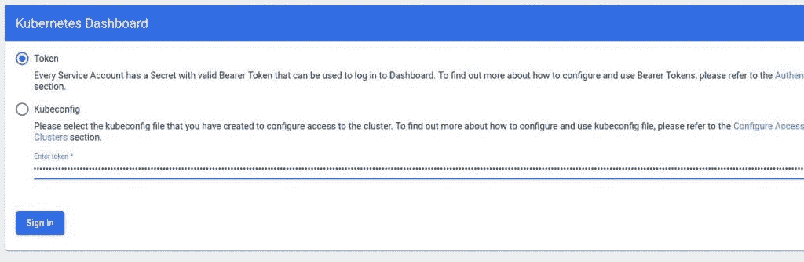
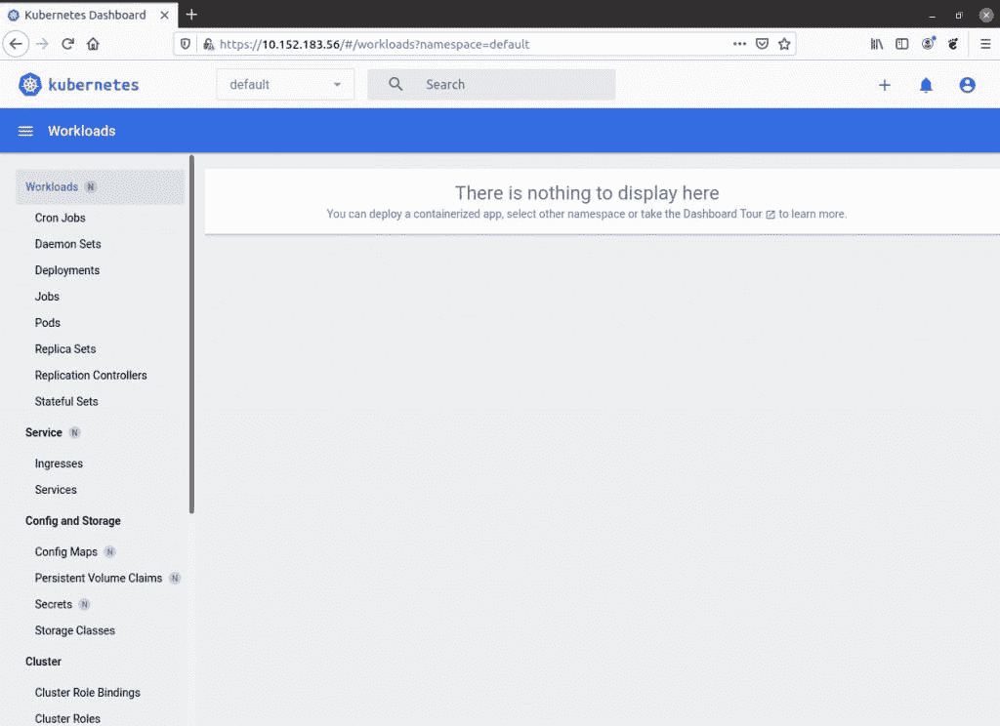
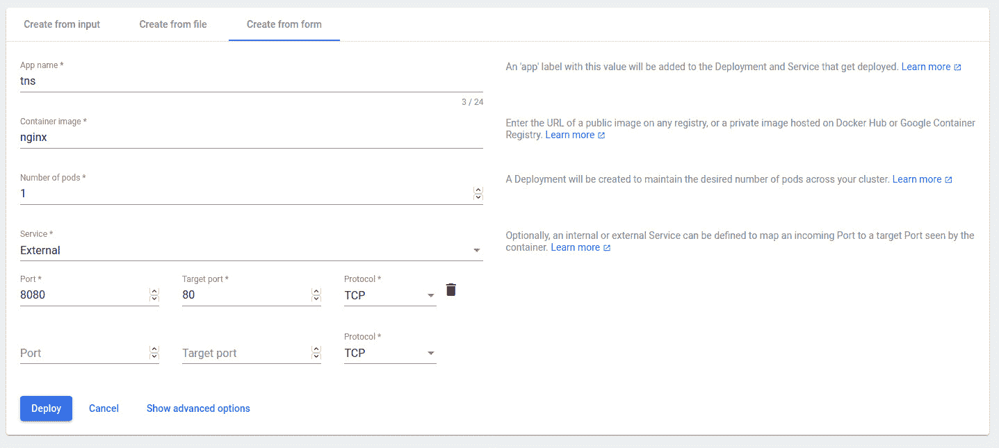
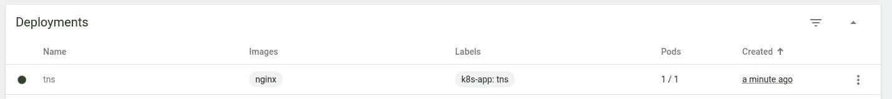
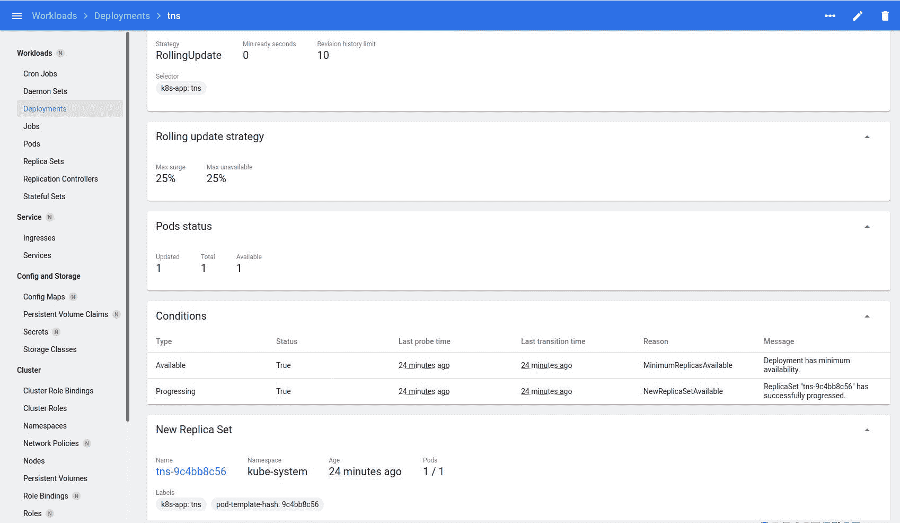

# 为 k8s 开发部署 Microk8s 和 Kubernetes 仪表板

> 原文：<https://thenewstack.io/deploy-microk8s-and-the-kubernetes-dashboard-for-k8s-development/>

因此，您希望开始为 [Kubernetes](https://thenewstack.io/category/kubernetes/) 开发，但您不希望为此部署一个成熟的 Kubernetes 集群。这是一个相当普遍的问题。随着 Kubernetes 取消对 Docker 的支持，您可能会发现许多关于部署不再运行的 Kubernetes 集群的文档。最重要的是，您可能只有一台机器可以使用(因此部署整个集群可能是一个挑战)。

你是做什么的？当您只有一台台式机，并且需要快速启动时，您可以随时转向 [Microk8s](https://microk8s.io/) ，这是一个[云本地计算基金会](https://cncf.io/?utm_content=inline-mention)认证的上游 Kubernetes 平台，您可以在工作站上运行。Microk8s 易于安装和运行，因此您不必浪费宝贵的时间来部署多台服务器。

[https://www.youtube.com/embed/v9KI2BAF5QU?feature=oembed](https://www.youtube.com/embed/v9KI2BAF5QU?feature=oembed)

视频

但是，要明白，Microk8s 并不是供公众使用的应用和服务。这首先应该被认为是一个开发环境。

也就是说，我们要做的是部署 Microk8s 和 Kubernetes 仪表板，这样您就可以享受 GUI 工具来帮助您更有效地工作。

我将在 Ubuntu Desktop 20.04 上演示，所以你至少需要安装并运行那个版本的 Ubuntu Desktop。因为 [Kubernetes Dashboard](https://kubernetes.io/docs/tasks/access-application-cluster/web-ui-dashboard/) 只能从集群内部访问(至少在没有一些重大调整的情况下)，所以 Ubuntu 的实例必须有一个桌面 GUI(所以不要在无头服务器上尝试)。

非常好。我们开始工作吧。

## 安装 Microk8s

我们要做的第一件事是安装 Microk8s。登录到您的桌面，打开终端窗口，发出命令:

`sudo snap install micro8ks --classic`

安装完成后，您必须将您的用户添加到 Microk8s 组，并更改新创建的目录的所有权。首先，使用命令将您自己添加到组中:

`sudo usermod -a -G microk8s $USER`

接下来，您需要使用以下命令让系统知道您已经被添加到新组中(以避免重新启动机器):

`newgrp microk8s`

最后，更改。kube 文件夹，包含:

`sudo chown -f -R $USER ~/.kube`

## 部署 Kubernetes 仪表板

我们现在可以用下面的命令安装 Kubernetes 仪表板(以及一些其他插件):

`microk8s enable dns dashboard storage`

运行此命令后，您需要发现分配给控制面板的 IP 地址。这是通过以下命令完成的:

`microk8s kubectl get all --all-namespaces`

您应该会看到相当多的输出，其中包括一个类似于
的仪表板列表

```
kube-system     service/kubernetes-dashboard           ClusterIP     10.152.183.56     &lt;none&gt;           443/TCP                          21m

```

这告诉我们仪表板和端口的 IP 地址。分配给仪表板的值会有所不同。

您需要等待几分钟，仪表板才可用。如果您在部署 Microk8s 的同一个桌面上打开 web 浏览器，并将其指向 [https://IP:443](https://ip:443) (其中 IP 是分配给仪表板的 IP 地址)，您将需要接受风险(因为仪表板使用自签名证书)。如果连接超时，请再等待几分钟，让服务变为可用。

最终，您会看到仪表板登录窗口(**图 1** )。



图 1:仪表板服务已准备好登录。

在登录仪表板之前，您必须先生成一个身份验证令牌。返回终端窗口，发出命令:

`token=$(microk8s kubectl -n kube-system get secret | grep default-token | cut -d " " -f1) microk8s kubectl -n kube-system describe secret $token`

您将看到一长串字符。复制该字符串，然后将其粘贴到窗口中仪表板日志的文本区域(确保选择令牌)。点击登录，认证成功后，您会发现自己在 Kubernetes 仪表板主窗口上(**图 2** )。



图 Kubernetes 仪表板已经可以使用了。

## 部署容器

点击主窗口左上角的+按钮。在出现的页面上，单击从表单创建，然后填写必要的信息，如图**图 3** 所示。



图 3:部署名为 test 的测试 NGINX 容器。

您应该立即被定向到一个页面，该页面列出了您的新部署(**图 4** )。



图 4:我们新创建的部署已经启动并运行。

单击条目的名称(在本例中为 tns)以查看部署的详细信息(**图 5** )。



图 5:在这里您可以找到大量关于运行 NGINX 容器的信息。

返回终端窗口，发出命令:

`microk8s kubectl get all --all-namespaces`

您应该会看到一个与 tns 容器相关联的 IP 地址。将该 IP 地址(以及端口 8080)复制并粘贴到您的浏览器中，NGINX 欢迎页面应该会出现。

恭喜您，您刚刚部署了 Microk8s 和 Kubernetes 仪表板，作为一个高效简单的 Kubernetes 开发平台。

<svg xmlns:xlink="http://www.w3.org/1999/xlink" viewBox="0 0 68 31" version="1.1"><title>Group</title> <desc>Created with Sketch.</desc></svg>