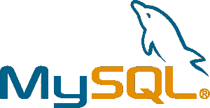
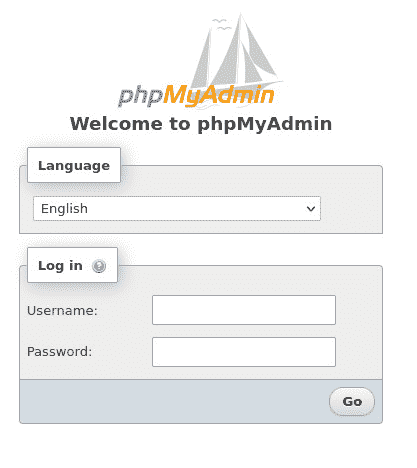
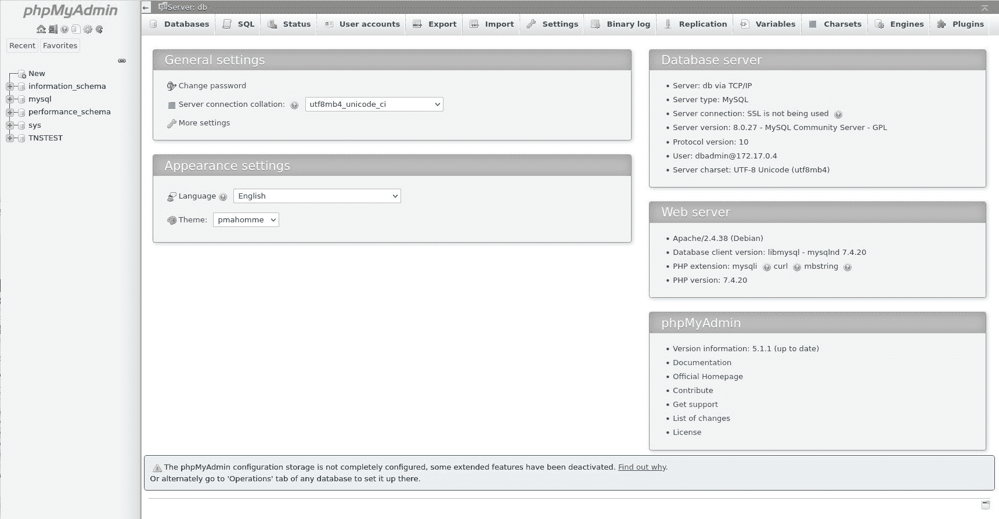
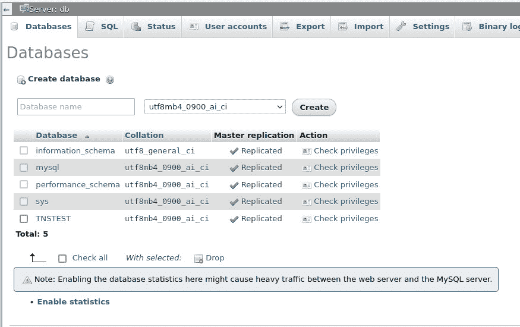
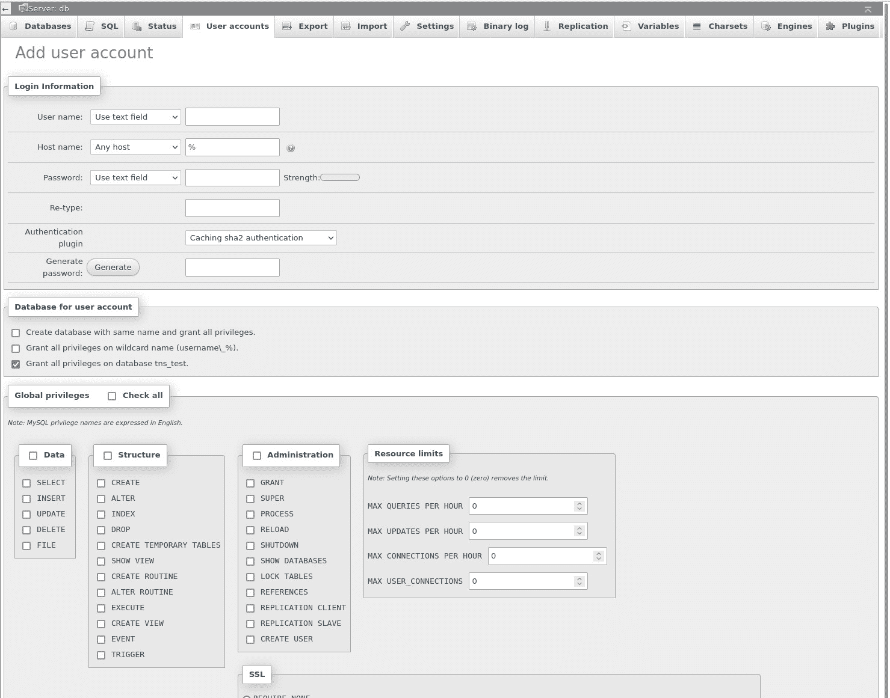

# 用 Docker 部署 MySQL 和 phpMyAdmin

> 原文：<https://thenewstack.io/deploy-mysql-and-phpmyadmin-with-docker/>

数据库是 docker 容器的重要组成部分。如果没有访问数据的能力，您可能会发现这些容器的能力有点不足。为此，您可以通过 Docker 容器部署 MySQL，然后将另一个容器连接到数据库以获取数据。然而，如何用数据填充数据库呢？或者管理数据库呢？您不能只是下载一个 docker 映像，用它部署一个容器，并假设它会神奇地填充您的容器化应用程序所需的数据。

对吗？

现在我们在同一页上，你看到了问题。如何简化容器化数据库的管理？如果您碰巧是一名数据库管理员，那么您可能非常熟悉命令行。但是，如果您的数据库技能不能胜任这项任务，您如何完成所有这些工作呢？

简化容器化的 MySQL 数据库部署管理的一种方法是借助 phpMyadmin。如果您从未听说过这个工具，它是一个基于 web 的 GUI，恰好是 MySQL 和 MariaDB 数据库管理的事实上的标准 UI。

我想带您完成部署 MySQL 容器的过程，然后将 phpMyAdmin 容器连接到该数据库，以便于管理。通过这个过程，您会发现使用 MySQL 数据库容器部署变得更加容易。

我将在 Ubuntu Server 20.04 上演示这一点，但这个过程在任何支持 Docker 的平台上都是一样的。

## 安装 Docker

我倾向于从头开始，所以让我们先启动并运行 Docker。为此，请登录到您的 Linux 服务器并安装必要的依赖项:

`sudo apt-get install ca-certificates curl gnupg lsb-release -y`

接下来，添加官方的 Docker GPG 键:

` curl -fsSL https://download.docker.com/linux/ubuntu/gpg | sudo gpg --dearmor -o /usr/share/keyrings/docker-archive-keyring.gpg`

使用以下命令添加稳定的 Docker 存储库:

`echo "deb [arch=$(dpkg --print-architecture) signed-by=/usr/share/keyrings/docker-archive-keyring.gpg] https://download.docker.com/linux/ubuntu $(lsb_release -cs) stable" | sudo tee /etc/apt/sources.list.d/docker.list > /dev/null`

更新 apt 并安装 Docker:

`sudo apt-get update` `sudo apt-get install docker-ce docker-ce-cli containerd.io -y`

通过以下方式将您的用户添加到 docker 组:

`sudo usermod -aG docker $USER`

注销并重新登录，以便更改生效。

您现在已经准备好部署容器了。

## 部署 MySQL 数据库

我们要做的第一件事是为 MySQL 创建一个卷，这样我们的数据将保持持久，以防容器失败。要创建名为 mysql-volume 的卷，发出命令:

`docker volume create mysql-volume`

准备好卷后，我们现在将部署 MySQL 容器(名为 tns_mysql)并将其连接到卷。我们的命令将如下所示:

`docker run --name=tns_mysql -p3306:3306 -v mysql-volume:/var/lib/mysql -e MYSQL_ROOT_PASSWORD=PWORD -d mysql/mysql-server`

其中 PWORD 是一个强/唯一密码。

下面是对上述命令的解释:

我们在标准 MySQL 端口 3306(内部和外部)上运行`tns_mysql`容器，将我们的 mysql-volume 卷连接到容器中的/var/lib/mysql 目录，为 admin 帐户创建一个强密码，并以守护模式(使用-d 选项)运行容器(基于从 [DockerHub](https://hub.docker.com/) 中提取的`mysql-server`映像)。

该命令应该返回一个容器 ID(一长串随机字符)，这意味着您的 MySQL 容器已经成功部署。

## 如何部署 phpMyAdmin 容器

现在，我们可以部署 phpMyAdmin 容器了。记住，我们将它连接到我们的 MySQL 容器(名为`tns_mysql`)。我们需要做的第一件事是用以下内容为 phpMyAdmin 创建一个卷:

`docker volume create phpmyadmin-volume`

准备好我们的卷后，让我们使用以下命令部署 phpMyAdmin 容器:

`docker run --name tns-phpmyadmin -v phpmyadmin-volume:/etc/phpmyadmin/config.usr.inc.php --link tns_mysl:db -p 82:80 -d phpmyadmin/phpmyadmin`

对上述命令的解释是:

我们正在部署一个名为 tns-phpmyadmin 的容器，使用 phpmyadmin-volume 卷，将其连接到/etc/phpmyadmin/config . usr . Inc . PHP phpMyAdmin 文件，将其与外部端口 82 和内部端口 80 上的 tns_mysql 数据库链接，以守护模式(使用-d 选项)运行该容器，并将其基于最新的官方 phpMyAdmin 映像。

## 如何访问 phpMyAdmin

好了，我们现在准备访问我们的容器化的、基于 web 的 MySQL GUI。确保您知道托管服务器的 IP 地址(可以使用命令 *ip a* 找到)。打开 web 浏览器并指向 http://SERVER:82(其中 SERVER 是托管服务器的 IP 地址)。

您将看到 phpMyAdmin 登录(**图 1** )。

图 phpMyAdmin 容器启动并运行，准备就绪。

使用部署 MySQL 容器时使用的用户名 root 和密码登录。然后，您应该会发现自己在 phpMyAdmin 主页面上(**图 2** )。

图 phpMyAdmin 主页已经准备好了。

事情是这样的，您可能不希望在您的容器中使用 root 帐户，因为那将是一个安全噩梦。让我们创建一个新数据库和一个有权访问该数据库的新用户(供您的容器化应用程序使用)。

在 Databases 选项卡中，键入新数据库的名称，然后单击 Create ( **图 3** )。

图 3:在 phpMyAdmin GUI 中创建新的数据库。

创建数据库后，单击 Privileges 选项卡，然后单击 Add user account。在出现的窗口中(**图 4** ，填写用户名，输入并验证一个强/唯一的密码，然后点击底部的 Go。

图 4:向我们新创建的数据库添加一个新用户。

现在，您已经创建了一个新的数据库，并且关联的用户对该数据库拥有完全的权限。然后，您可以将用户/数据库组合用于您的容器化应用程序，而不用担心使用 MySQL root 帐户带来的安全问题。为了更好地做到这一点，借助世界一流的基于 web 的 GUI，您可以更轻松地管理您的容器化数据库。

<svg xmlns:xlink="http://www.w3.org/1999/xlink" viewBox="0 0 68 31" version="1.1"><title>Group</title> <desc>Created with Sketch.</desc></svg>