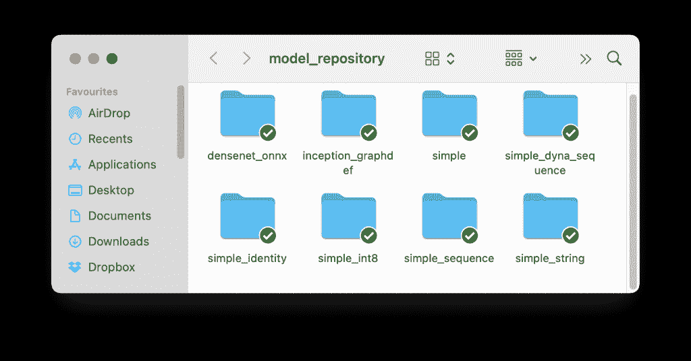

# 使用 MinIO 作为模型存储部署 Nvidia Triton 推理服务器

> 原文：<https://thenewstack.io/deploy-nvidia-triton-inference-server-with-minio-as-model-store/>

本教程是我们构建端到端堆栈以在边缘执行机器学习推理的系列的最新部分。在本系列教程的前一部分中，我们在 SUSE Rancher 的 RKE2 Kubernetes 发行版上安装了 [MinIO](https://min.io/?utm_content=inline-mention) 对象存储服务。我们将通过部署 [Nvidia Triton 推理服务器](https://developer.nvidia.com/nvidia-triton-inference-server)进一步扩展该用例，该服务器将 MinIO 租户视为模型商店。

在本教程结束时，我们将拥有一个完全配置好的模型服务器和注册中心，可以进行推理了。

## 步骤 1-用示例模型填充 MinIO 模型存储

在部署模型服务器之前，我们需要用一些模型填充模型存储或存储库。

首先克隆 Triton 推理服务器 GitHub 存储库。

`git clone https://github.com/triton-inference-server/server.git`

我们现在将运行一个 shell 脚本来将模型下载到本地文件系统，之后我们将把它们上传到一个 MinIO bucket。

运行`server/docs/examples`目录下的`./fetch_models.sh`脚本。

等待所有模型下载到`model_repository`目录中。这可能需要几分钟，取决于您的互联网连接。

让我们使用 MinIO CLI 将模型从`model_repository`目录上传到`models` bucket。这个 bucket 是在上一个教程中创建的模型注册中心租户中创建的。

从`model_repository`目录运行命令，将文件复制到 bucket。

`mc --insecure cp --recursive . model-registry/models`

通过访问 MinIO 控制台检查上传。您应该能够看到复制到`models` bucket 的目录。

我们现在准备将 NVIDIA Triton 推理服务器指向 MinIO。

## 步骤 2 —在 RKE2 上部署 Triton 推理服务器

Triton 预计亚马逊 S3 将作为示范商店。要访问 bucket，它需要一个带有 AWS 凭证的秘密。

在我们的例子中，这些凭证实际上是上一个教程中保存的 MinIO 租户凭证。
创建一个名称空间和其中的秘密。

`kubectl create ns model-server`

`kubectl create secret generic aws-credentials --from-literal=AWS_ACCESS_KEY_ID=admin --from-literal=AWS_SECRET_ACCESS_KEY=7c5c084d-9e8e-477b-9a2c-52bbf22db9af -n model-server`

不要忘记用您的值替换凭证。

现在，创建部署、服务并应用它们。

`kubectl apply -f triton-deploy.yaml`T13`kubectl apply -f triton-service.yaml`

为了使 Triton pod 访问 Minio 服务，我们使用以下命令修复了证书问题:

`cp /var/run/secrets/kubernetes.io/serviceaccount/ca.crt /usr/local/share/ca-certificates && update-ca-certificates`

我们使用标准的亚马逊 S3 约定将 MinIO 桶传递给 Triton—`s3://https://minio.model-registry.svc.cluster.local:443/models/`

最后，检查 Triton pod 的日志，确保一切工作正常。

`kubectl logs triton-59994bb95c-7hgt7 -n model-server`

如果您在输出中看到上述内容，这意味着 Triton 能够从模型存储中下载模型，并通过 HTTP 和 gRPC 端点为它们提供服务。

## 步骤 3 —针对 Triton 运行推理客户端

从克隆 repo 开始，以获得用于推理的代码。

`cd https://github.com/triton-inference-server/client.git`

`cat <> requirements.txt
cat requirements.txt
pillow
numpy
attrdict
tritonclient
google-api-python-client
grpcio
geventhttpclient
boto3
EOF` 

`pip3 install -r requirements.txt`

导航到`client/src/python/examples`目录并执行以下命令

 `python3 image_client.py \
-u TRITON_HTTP_ENDPOINT \
-m inception_graphdef \
-s INCEPTION \
-x 1 \
-c 1 \
car.jpg` 

用 TRITON 服务的主机和节点端口替换 TRITON_HTTP_ENDPOINT。发送一张汽车的图片，你应该会看到下面的输出:

客户端已经调用了 Trinton 推理端点，请求加载模型存储中已经可用的 inception 模型。Triton 进行了推断，并根据分类打印了标签。

恭喜你！您已经成功地部署和配置了由运行在边缘的模型存储支持的模型服务器。

<svg xmlns:xlink="http://www.w3.org/1999/xlink" viewBox="0 0 68 31" version="1.1"><title>Group</title> <desc>Created with Sketch.</desc></svg>