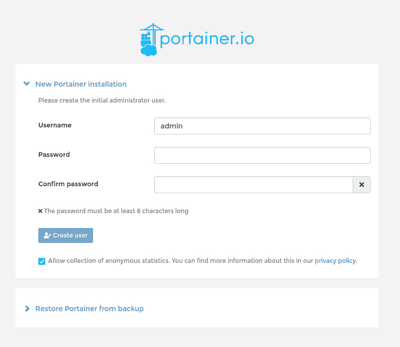
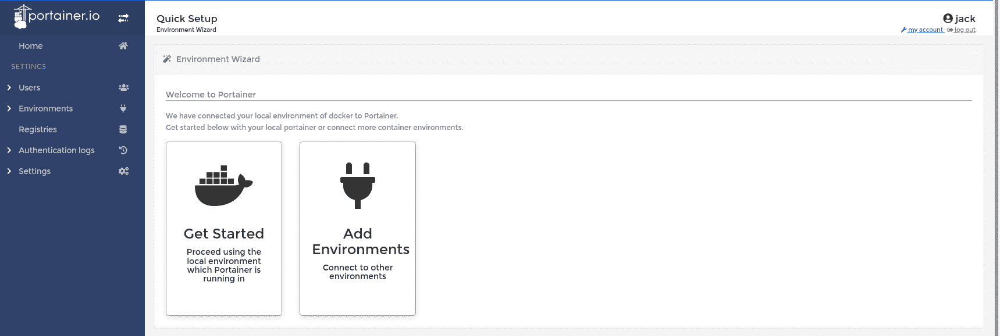
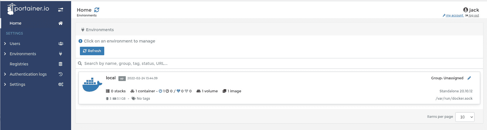
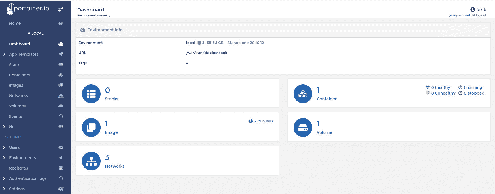

# 部署 Portainer 以简化容器管理

> 原文：<https://thenewstack.io/deploy-portainer-for-easier-container-management/>

管理容器可能是一个真正的挑战。有这么多移动部件和命令要处理，生活会变得有点挑战性。当您扩大部署规模时尤其如此。让您和/或您的开发团队更容易做到这一点的一个方法是使用一个 GUI 工具，它可以从您局域网上的任何地方访问。这样，所有开发人员都可以更加高效、有效和可靠地工作。

完成这项任务的工具之一就是 [Portainer](https://www.portainer.io/) 。这个 GUI 可以部署在 Kubernetes、Docker 之上，或者 Docker Swarm 可以在第三方云主机上无缝工作，或者可以在内部甚至在边缘使用。

Portainer 让您可以完全控制您的容器，允许您提取图像、创建容器、网络和端点，以及创建注册表。对于任何希望使用 GUI 来管理容器的人来说，您可能比 Portainer 做得更差。

我将向您介绍如何部署 Portainer。我将在 Ubuntu Server 20.04 上用 Docker 进行演示，但这个过程可以在任何支持 Docker 或 K8s 的平台上运行。在说明中你必须做的唯一改变是为你选择的操作系统安装 Docker。当然，如果您在云中使用它，很有可能您正在使用 Linux，所以安装应该相当简单。

## 安装 Docker

我们必须做的第一件事是安装 Docker。以前，我会安装标准存储库中的 Docker 版本(带有`sudo apt-get install docker.io -y`)。然而，我们想安装 Docker 的社区版，因为它包含了更多的功能，而且更新更有规律。

因此，要安装社区版，请登录到您的 Linux 服务器，并使用以下命令安装必要的依赖项:

`sudo apt-get install ca-certificates curl gnupg lsb-release -y`

接下来，我们需要为 Docker 添加所需的 GPG 安全密钥，这是通过以下方式完成的:

`curl -fsSL https://download.docker.com/linux/ubuntu/gpg | sudo gpg --dearmor -o /usr/share/keyrings/docker-archive-keyring.gpg`

添加 GPG 后，使用以下命令创建 Docker 存储库:

`echo "deb [arch=$(dpkg --print-architecture) signed-by=/usr/share/keyrings/docker-archive-keyring.gpg] https://download.docker.com/linux/ubuntu $(lsb_release -cs) stable" | sudo tee /etc/apt/sources.list.d/docker.list > /dev/null`

在安装之前，我们必须更新 apt:

`sudo apt-get update`

最后，是时候安装 Docker 引擎了:

`sudo apt-get install docker-ce docker-ce-cli containerd.io`

安装完成后，我们需要将用户添加到 docker 组中。如果你跳过这一步，你将只能使用 *sudo* 与 Docker 一起工作，这是一个你不想冒的安全风险。要将您的用户添加到组中，请发出以下命令:

`sudo usermod -aG docker $USER`

注销并重新登录到服务器，以使更改生效。

## 部署具有持久存储的 Portainer

我们将部署具有持久存储的 Portainer，万一部署出现问题，您仍然可以访问您的数据。

我们必须做的第一件事是创建一个包含数据的卷。使用以下命令执行此操作:

`docker volume create portainer_data`

上面的命令将创建一个名为 *portainer_data* 的卷。我们现在可以部署 Portainer，使用以下命令将其连接到卷:

`docker run -d -p 8000:8000 -p 9443:9443 --name=portainer --restart=always -v /var/run/docker.sock:/var/run/docker.sock -v portainer_data:/data portainer/portainer-ce`

部署命令需要几分钟才能完成。当该命令返回当前正在运行的 Portainer 部署的容器 id 时，打开一个 web 浏览器并将其指向 https://SERVER:9443(其中 SERVER 是您的托管服务器的 IP 地址)。

在随后的屏幕中(**图 1** ，您将被要求创建一个初始管理员用户。

图 1:为 Portainer 创建初始管理员用户。

添加用户名并输入/确认强/唯一密码。完成后，单击创建用户。完成后，您将使用新的用户凭证自动登录，您应该会看到 Portainer 快速设置窗口(**图 2** )。

图 2:新的 Portainer 快速设置窗口比以前的版本更容易。

注意:当您第一次访问 Portainer 站点时，您可能还必须接受安全风险，因为 Portainer 使用自签名证书。那很好，只要接受风险，就不会有任何伤害。

单击开始使用本地环境，或者如果需要连接到远程环境，单击添加环境。单击 Get Started 之后，您应该会看到您的本地环境列表(**图 3** )。

图 3:这里将显示可用的环境。

单击标有 *local* 的列表，您将被转到该环境的仪表板(**图 4** )。

图 4:本地安装的容器引擎的 Portainer 仪表板。

您现在可以轻松地开始创建网络和卷，下载映像和部署容器，甚至添加注册表和其他环境。

## 结论

任何希望提高容器部署效率的人都应该考虑 Portainer。Portainer 具有用户友好的基于 web 的 GUI 和管理部署所需的所有工具，应该被视为容器管理的首选。

有关 Portainer 的更多信息，请查看官方 Portainer 文档。

<svg xmlns:xlink="http://www.w3.org/1999/xlink" viewBox="0 0 68 31" version="1.1"><title>Group</title> <desc>Created with Sketch.</desc></svg>