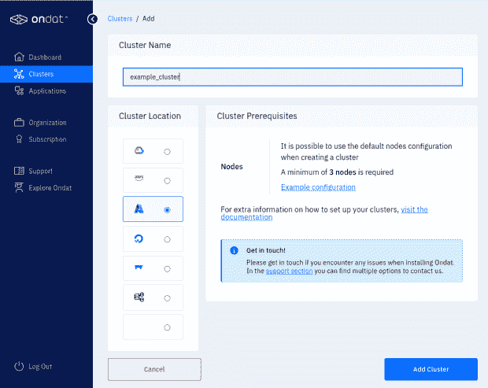
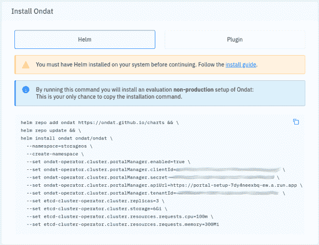

# 使用 Ondat 和 FluxCD 在 Kubernetes 上部署有状态工作负载

> 原文：<https://thenewstack.io/deploy-stateful-workloads-on-kubernetes-with-ondat-and-fluxcd/>

随着 Kubernetes 采用率的不断增长，越来越多的企业采用 GitOps 将工作负载部署到 Kubernetes。部署安全的云本机有状态应用程序需要跨混合和多云环境的高性能。将 Ondat 提供的可扩展、高性能存储与 FluxCD 结合使用，您可以提高安全性并加速软件开发。使用[Weave GitOps Trusted Delivery](https://thenewstack.io/weave-gitops-trusted-delivery-a-road-to-kubernetes-sanity/)部署 Ondat，平台团队可以轻松提供一致性并加快部署 Kubernetes 集群的时间。

GitOps 允许用户使用 git 作为他们的 Kubernetes 清单的唯一来源，从而防止配置漂移，允许在出现问题时轻松回滚，并允许任何工程师以可控、安全的方式对生产进行更改。

在本教程中，我将使用 [FluxCD](https://thenewstack.io/gitops-made-simple-with-flux/) 来管理 Kubernetes 工作负载，并将重点放在我们如何使用这个工具集来实现这一点，但这种方法很容易适应其他解决方案。

有关设置 FluxCD 及其众多功能的更多信息，请随意查看以下链接:

我们遵循与上面最后一个链接中建议的相似的存储库结构方法，所以所有的例子都将基于此。

FluxCD 支持开箱即用的[舵部署](https://thenewstack.io/get-started-with-the-helm-kubernetes-package-manager/)([https://fluxcd.io/flux/components/helm/](https://fluxcd.io/flux/components/helm/))。这也是部署 Ondat 的推荐方法，所以我们将使用这种方法。

## 【Ondat 入门

第一步是[注册 Ondat](https://portal.ondat.io/signup) 并在门户中创建一个[集群对象](https://portal.ondat.io/clusters):



一旦完成，您将获得一个 Helm 命令来在您的集群上安装 Ondat。这是我们下一步的基础。



首先，我们创建一个名称空间，因为我们喜欢将 Helm 对象放在与 Ondat 本身相同的位置:

```
---
apiVersion:  v1
kind:  Namespace
metadata:
  labels:
 name:  storageos
  name:  storageos

```

作为我们的`foundation`目录的一部分，我们定义了以下 HelmRepository 对象:

```
---
apiVersion:  source.toolkit.fluxcd.io/v1beta1
kind:  HelmRepository
metadata:
  name:  ondat
  namespace:  storageos
spec:
  interval:  1m
  url:  https://ondat.github.io/charts

```

以及下面的`HelmRelease`对象:

```
---
apiVersion:  helm.toolkit.fluxcd.io/v2beta1
kind:  HelmRelease
metadata:
  name:  ondat
  namespace:  storageos
spec:
  releaseName:  ondat
  chart:
 spec:
 chart:  ondat
 version:  0.2.1
 sourceRef:
 kind:  HelmRepository
 name:  ondat
 namespace:  storageos
  interval:  5m
  install:
 remediation:
 retries:  3
  valuesFrom:
 -  kind:  Secret
 name:  ondat-secret
 valuesKey:  client-secret
 targetPath:  ondat-operator.cluster.portalManager.secret
  values:
 ondat-operator:
 cluster:
 portalManager:
 enabled:  true
 clientId:  clientID
 apiUrl:  "https://portal-setup-7dy4neexbq-ew.a.run.app"
 tenantId:  tenantID
 etcd-cluster-operator:
 cluster:
 replicas:  3
 storage:  6Gi
 resources:
 requests:
 cpu:  100m
 memory:  300Mi

```

在数值部分，我们可以定义任何需要更改的参数，这些参数在属于 Helm 图表的 values.yaml 文件中可用。([https://github . com/ondat/charts/blob/main/charts/umbrella-charts/ondat/values . YAML](https://github.com/ondat/charts/blob/main/charts/umbrella-charts/ondat/values.yaml))

注意，在上面的例子中，我们将`ondat-operator.cluster.portalManager.secret`的值定义为对 Kubernetes 秘密的引用。Kubernetes 的秘密本身是一个很大的话题，对于这篇博文的讨论来说太大了，但是强烈建议以安全的方式存储这些信息。

您需要从您在门户中看到的 Helm 命令中复制`tenantID`和`clientID`的值，以确保门户管理器能够正确地注册自己。

还要注意，我们已经锁定了图表版本，由于 Ondat 的性质，升级应该小心进行，因此我们建议此时锁定版本。

一旦应用，我们可以使用`flux get all -n storageos`看到 HelmRelease 的状态。

```
NAME                    READY MESSAGE REVISION                                                                SUSPENDED
helmrepository/ondat    True    Fetched revision:  b2b49a5abead5f29bb7622a460c888d64fc8f351dcd5dac60eebd95e2e0a7122      b2b49a5abead5f29bb7622a460c888d64fc8f351dcd5dac60eebd95e2e0a7122        False

NAME                            READY MESSAGE REVISION        SUSPENDED
helmchart/storageos-ondat True    Pulled  'ondat'  chart with version  '0.2.1'.      0.2.1 False

NAME                    READY MESSAGE REVISION        SUSPENDED
helmrelease/ondat True    Release reconciliation succeeded        0.2.1 False

```

我们还可以通过运行`kubectl get storageClass`并检查现在是否有`storageos`的条目来执行额外的检查，以确保我们准备好使用 Ondat。

最后，我们需要将许可证应用到新配置的集群，方法是返回门户网站并[选择我们需要的许可证](https://portal.ondat.io/organization/licences)。至此，我们已经准备好以 GitOps 控制的方式部署有状态工作负载了！

*欢迎参加我们于 11 月 16 日上午 8 点(太平洋时间)和下午 4 点(格林威治时间)举办的在线研讨会，主题是“使用 Ondat 和 Weave GitOps 安全、自信地部署有状态应用”* [*在这里登记*](https://bit.ly/3WolDLU) *。*

<svg xmlns:xlink="http://www.w3.org/1999/xlink" viewBox="0 0 68 31" version="1.1"><title>Group</title> <desc>Created with Sketch.</desc></svg>