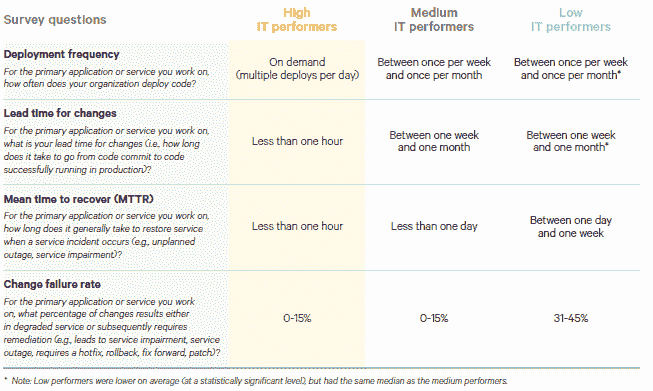

# 部署微服务不一定是一场馅饼大战

> 原文：<https://thenewstack.io/deploying-microservices-doesnt-have-to-be-a-pie-fight/>

这篇文章是探索微服务基础的系列文章中的最新一篇。请每周一回来查看更多的分期付款。

当[将微服务](https://thenewstack.io/migrating-to-microservices/)部署到企业软件环境中时，有很多事情要做，并且从一开始就有[要做出](https://thenewstack.io/path-microservices-getting-ready-asking-questions/)决定。这些决策从完整的数据中心考虑事项延伸到操作系统、容器管理和编排层，最终到达应用程序本身。

隐藏在每一层中的都是角落和缝隙，单一的选择会对性能、应用速度和实际产生的商业价值产生持久的影响。出于这些原因，值得花时间来正确地做出所有这些决定，并且站在一个你的团队充分了解约束和可能性的位置上。

从顶部开始，这些部署的实际位置可能是影响堆栈中其他决策的最大因素。将服务部署到 Amazon Web Services、Microsoft Azure 或 Google Cloud 都有自己的部署选择。例如，亚马逊为[提供了自己的关于这个主题的教程](https://aws.amazon.com/getting-started/container-microservices-tutorial/module-four/)，依靠其应用负载平衡器服务来承担部署的重量。NGINX 也有关于部署策略的建议。这是一种常见的模式，在私有云中也会重复出现。负载平衡器模型允许将流量转移到单独的服务器组，从而使这些组能够按顺序自行更新。随着一个组的更新，它将取代另一个没有更新的组，以这种方式，执行首次展示。

这种部署部署模式的关键在于，它还兼容从成熟的整体应用向更小的细分微服务过渡的分解需求。通过将这些微服务配置到组中，当整体服务从等式中移除时，它们可以联机，从而确保平稳过渡，并防止流经企业服务的数据出现缺口。这也是升级和更新零停机的途径。

从整体上来说，解构单一的应用程序也会给企业带来好处。除了增加灵活性之外，由于可以修改单个微服务而不必担心重新部署整个整体，这种模式还允许企业将其最重要和最困难的应用程序方面替换为同类最佳产品。

许多 monolith 应用程序已经包括支付处理、VOIP 或用户内容存储等内容，并且允许团队将这些方面分解出来，并将其纳入他们的预算中，这要感谢 [Stripe](https://stripe.com/) 、 [Twilio](https://www.twilio.com/) 或 [Filestack](https://www.filestack.com/) ，这意味着更多的工程资源可以集中在业务应用程序的实际差异上。

[Filestack](https://www.filestack.com/) 的首席执行官 Sameer Kamat 表示，运行微服务最重要的因素之一是维持正常运行时间。他的公司提供 API 来接收和管理用户生成的内容。“正常运行时间对我们来说是一个重要因素。这就是可靠性、冗余和负载平衡对我们的重要影响。我们使用自动伸缩是因为我们的一些大客户的业务具有季节性。我们必须扩大规模，适应季节性。12 月份，有一个大高峰。你不能指望你的基础设施必须以一种自动化的方式来处理可扩展性。”

与任何 API 驱动的应用程序一样，微服务是精简应用程序所提供的敏捷性的使能器。由于移动部件更少，依赖于 API 接口而不是操作系统库，理论上，微服务可以用开发人员希望的任何语言编写，并使用任何需要的环境。由于这些因素将仅限于微服务容器，因此该模式允许开发团队内部有更大的灵活性。

Puppet 最新的开发运维现状报告显示，开发运维为 IT 性能带来的优势与以下方面相关:部署频率、变更准备时间、MTTR 和变更失败率(单击图片了解更多信息)。

这并不是说一旦过渡到基于 API 的应用程序，开发就没有任何限制了。API 一旦铺开，其实就无法改变；它只能成长。如果原始功能发生变化，那些为 1.0 版编写的 wild 应用程序将停止工作，导致违反 SLA。

Kamat 说:“API 带来了很多责任，确保它是兼容的，确保它是超级简单的:我们对开发者的全部承诺是，我们将节省你的时间，并提供跨语言的访问。”从架构上来说，我们必须确保非常清楚 API 的任何重大变化。这包括为各种元素构建微服务，并确保它们保持最新。它必须是一个灵活的架构。"

因此，部署微服务需要大量的基础设施来部署这些新服务。负载平衡器、监控系统、流程编排和管理系统以及安全产品都必须在推出 service one 之前准备就绪。

## 和莱纳斯的小人生活在一起

在推出之前要做的早期决定之一就是选择操作系统。过去，通常是在 Red Hat Enterprise Linux 或 Windows 之间做出选择，但随着过去三年向容器的过渡，这种选择变得不那么明确了。尽管有 Windows 支持，Linux 仍然是容器之王，但是您选择的实际 Linux 发行版会对您的微服务的性能和可维护性产生广泛的影响。

> "如果处理得当，微服务最终可以被证明是正确的，并且超越了进一步的优化."

CentOS 和 Red Hat Enterprise Linux 仍然是可行的选择，但也是相当大的发行版。Red Hat 在这方面的让步是 Project Atomic T1，这是一个微型 Linux，除了宿主容器之外，它几乎什么都不做。 [Alpine Linux](https://alpinelinux.org/) 目前拥有最小流行发行版的奖项，但是对于没有经验的用户来说，它可能有一些尖锐的边缘。VMWare 有 [PhotonOS](http://vmware.github.io/photon/) ，Rancher 有 RancherOS。一旦选择了操作系统，就可以进行进一步的定制，因为每个容器操作系统中没有其他依赖项。正如微服务可以用任何旧的编程语言编写一样，它们也可以在团队支持的任何环境中托管。这也允许快速测试新技术，例如 [Nix](https://nixos.org/nix/) :每个微服务都可以是一个孤岛，有绿色的田野，或褐色的过度生长。

这是大规模微服务部署的真正承诺:有了一个良好的容器构造、测试和编排管道，每个应用程序的内部细节都变得受限。构建该应用程序的团队将维护其内部的专家知识，并在需要时共享这些知识，但最终，目标是将每个服务推向固化。甚至骨化。

正如开发人员曾经花费数月时间用汇编语言构建企业服务以确保在大型机中尽可能快地执行一样，微服务利用部署管道来促进快速优化、迭代和反馈。这允许开发团队完全沉迷于细节，而不是不断地为外部变量而烦恼。如果处理得当，微服务最终可以被证明是正确的，并且超越了进一步的优化。

即使没有完美的内部结构，微服务模型的构建也考虑到了 API 本身的固化。与任何 API 一样，版本控制是必不可少的，可以添加新的特性，但旧的特性很少会被删除。当第一次部署微服务时，它会立即成为其他地方的依赖项。这是正常运行时间仍然是部署最重要的焦点的另一个原因。

## 编排大火

协调部署是企业展示其核心 IT 能力的地方。管理员和操作员应该已经迫不及待地尝试最热门的新工具了，比如 [Kubernetes](https://kubernetes.io/) 、 [Terraform](https://www.terraform.io/) 、 [Rancher](https://rancher.com/) 和 Spi.ne

然而，选择编排平台比简单地选择并安装 Kubernetes 要复杂得多。虽然这个广受欢迎的开源项目在过去的一年中赢得了许多追随者，但它仍然是一个复杂的基础设施软件，由天才为天才设计。

整个基于云的微服务架构也需要一些基本的重新学习， [HashiCorp](https://www.hashicorp.com/) 的首席执行官 [Dave McJannet](https://twitter.com/davidmcj) 说。“云所做的一件事是用一种不同于过去模式的运营模式激励人们。它的特点是按需基础设施和零信任网络，意味着以不同的方式投资安全，以不同的方式思考网络；从物理主机网络到服务网络。

虽然新的部署模型与旧的应用服务器模型并行，但基础设施扮演着比过去的系统更重要的角色。“肯定有相似之处。这就是为什么当我们画图时，我们有堆栈的三个元素:核心基础设施，安全层，然后是运行时。那张照片 30 年没变过。问题是，现在在运行时层，而不是应用服务器，也许你正在使用一个容器编排平台，但你仍然有难题的其他部分，”McJannet 说。

他说，今天，团队不再部署应用服务器，而是部署具有滚动更新和自动扩展支持的整个服务。这是一种不同于大多数 IT 部门所习惯的投入生产模式，它要求在部署任何东西之前，微服务的所有基础架构都已就绪。

为此，McJannet 的公司提供了 [Terraform](https://www.terraform.io/) ，这是一种环境供应工具，旨在同时支持多种服务，并将它们互连。McJannet 说，他看到许多客户使用 Terraform 来提供 Kubernetes，因为 Kubernetes 世界扩展到包括新的服务，如 [Istio](https://istio.io/) 和 [GiantSwarm](https://github.com/giantswarm) 。

这是进行适当的微服务部署所需的元思维类型:正如卡尔·萨根所说，“如果你希望从头开始做一个苹果派，你必须首先创造宇宙。”

[谷歌](https://cloud.google.com/kubernetes-engine)、[微软](https://azure.microsoft.com/en-us/?v=17.14)、[木偶](https://puppet.com/)和[红帽](https://www.openshift.com/)是新栈的赞助商。

通过 Pixabay 的特征图像。

<svg xmlns:xlink="http://www.w3.org/1999/xlink" viewBox="0 0 68 31" version="1.1"><title>Group</title> <desc>Created with Sketch.</desc></svg>