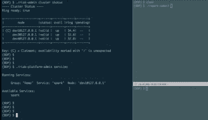
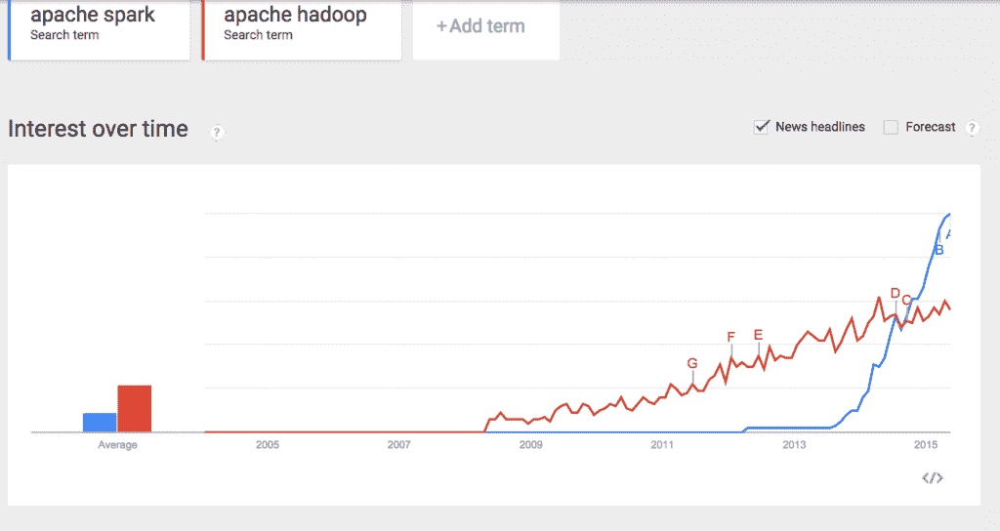

# 使用新的 Basho 数据平台大规模部署服务

> 原文：<https://thenewstack.io/deploying-services-at-scale-using-the-new-basho-data-platform/>

Basho 的新数据平台反映了各种服务，可供任何希望构建利用开源技术的应用程序的开发人员使用，这些应用程序可能包含不同的数据库、分析工具或搜索产品。Basho 通过一种新型的数据平台来迎合这种日益增长的趋势，该平台提供与 [Apache Spark](https://spark.apache.org/) 以及 [Redis](http://redis.io/) 和 [Apache Solr](http://lucene.apache.org/solr/) 的集成，这是一种开源搜索技术。

在上周的 Gluecon 会议上，Basho 的技术营销总监泰勒·汉南(Tyler Hannan)与 New Stack 创始人亚历克斯·威廉姆斯(Alex Williams)坐在一起，观看了数据平台的演示，展示了它如何作为一种控制和简化现代大数据应用技术的创建和分发的方式。Basho 是 Riak 的创造者和维护者，Riak 是一个分布式 NoSQL 数据库和对象存储解决方案。

[https://www.youtube.com/embed/Y6wz7CsQ2gE?feature=oembed](https://www.youtube.com/embed/Y6wz7CsQ2gE?feature=oembed)

视频

泰勒在演示中说，公司已经采用 NoSQL 技术作为单点解决方案。

“由于企业和初创公司都看到了这种采用和部署的价值，他们开始在多模型解决方案中部署它们，人们同时利用键值存储和对象存储。然后他们开始采用更多的技术组件。”

他说，Basho 的数据平台核心服务可以被认为是“一个为各种资源提供可扩展性、分布性和容错性的框架”。这些是管理存储实例(如 Riak KV 和 Riak S2)和服务实例之间的复制和同步的核心服务。

 Tyler 展示了一组运行 Basho 数据平台的实例。他发出了一个 Riak 管理命令——一个集群状态——它显示了一个集群中的三个 Riak 实例。Riak 平台管理命令不仅返回正在运行的服务，还返回可以部署的服务。

Basho 的 [Apache Spark 插件](http://basho.com/products/spark/)集成提供了“像 Riak 一样编写它，像 Spark 一样分析它”的能力，提供了更深入的分析能力。

作为参考，Apache Spark 是一个内存数据分析软件，已经证明非常受欢迎。11 月， [Datanami](http://www.datanami.com/2014/11/21/spark-just-passed-hadoop-popularity-web-heres/) 引用了谷歌趋势，显示 Spark 超越了 Apache Hadoop，这是众所周知的文件分发技术。此后，Spark 继续展现实力。

Tyler 引用了“Key:(C)= claimer”字符串，这是一个共识算法 Riak Ensemble。Riak Ensemble 允许在不使用 Apache 的 Zookeeper 服务的情况下部署 Spark 的大型集群。“实际上，你可以通过 Riak Ensemble 利用 Riak 的关键核心声明功能来做到这一点，”Tyler 说。

接下来，他启动了一个 Spark 作业，该作业从 Riak 读取足球数据，在 Spark 中对该数据运行一系列分析，然后将该数据持久化回 Riak，展示了 Basho 的 Redis 集成如何提供“像 Riak 一样编写它，像 Redis 一样缓存它”的能力，从而实现 Redis 提供的减少的延迟。

> 它采用了 Redis 的高级缓存功能，但使其成为企业级的。

然后，他添加了 Redis 作为平台内的一项服务，还添加了 Basho 数据代理，并使用 Riak 平台管理命令启动了每一项。Tyler 输入 Redis 代理侦听的端口号，然后使用 Redis 命令行界面从 Redis 获取所需的数据密钥。

“它实际上是从 Riak KV 读取的，”他解释说，“但是，重要的是，它将结果保存到 Redis。”

“如果我利用 Redis，我已经有了知道如何与 Redis 对话，以及如何与 Redis 接口的应用程序，”Tyler 说。“我并没有完全改变我的工具集，而是简单地将它指向 Basho 数据平台，这样我就可以享受 Redis 缓存的好处，同时保持 Riak 的持久性。”

总之，泰勒说，“它是可用的；它是可扩展的；很简单。它将我们部署的所有这些不同的应用程序作为现代应用程序堆栈的一部分，从 Redis、Apache Spark 和 [Solr](http://lucene.apache.org/solr/) 开始，它使您能够非常简单地部署和管理它们，并且它可以扩展。”

Basho 是新堆栈的赞助商。

<svg xmlns:xlink="http://www.w3.org/1999/xlink" viewBox="0 0 68 31" version="1.1"><title>Group</title> <desc>Created with Sketch.</desc></svg>