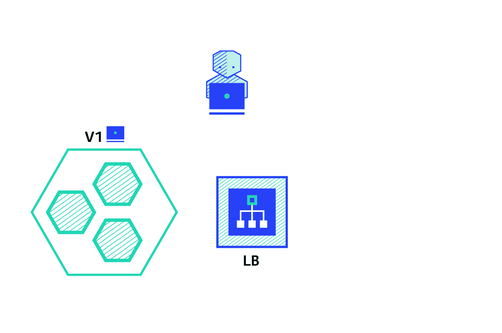

# 应用程序部署的六种策略

> 原文：<https://thenewstack.io/deployment-strategies/>

艾蒂安·特里梅尔

艾蒂安·特里梅尔是集装箱解决方案公司的一名软件工程师。他有应用程序开发背景，对持续交付和云原生基础架构充满热情。

将新的应用程序部署到生产环境中有多种技术，因此选择正确的策略是一个重要的决策，需要权衡变更对系统和最终用户的影响。

在这篇文章中，我们将讨论以下策略:

*   **重建**:版本 A 终止，版本 B 推出。
*   **Ramped** (也称滚动更新或增量):版本 B 慢慢铺开，取代版本 a。
*   **蓝/绿**:版本 B 和版本 A 一起发布，然后流量切换到版本 B。
*   金丝雀(Canary):版本 B 发布给一部分用户，然后进行全面推广。
*   **A/B 测试**:版本 B 在特定条件下发布给一部分用户。
*   **阴影**:版本 B 与版本 A 一起接收真实世界的流量，不影响响应。

让我们来看看每种策略，看看哪种策略最适合特定的用例。为了简单起见，我们使用了 [Kubernetes](https://kubernetes.io) ，并用 [Minikube](https://github.com/kubernetes/minikube) 测试了这个例子。每个策略[的配置和分步方法示例可以在 git 存储库](https://github.com/ContainerSolutions/k8s-deployment-strategies)中找到。

## 再创造

重建策略是一个虚拟部署，包括关闭版本 A，然后在版本 A 关闭后部署版本 B。这种技术意味着服务的停机时间取决于应用程序的关闭和启动持续时间。

优点:

*   易于设置。
*   应用程序状态完全更新。

缺点:

*   对用户的影响很大，预计停机时间取决于应用程序的关闭和启动持续时间。

## 倾斜的

斜坡部署策略包括通过一个接一个地替换实例来缓慢地推出应用程序的版本，直到所有实例都推出为止。它通常遵循以下过程:在负载平衡器后面有一个版本 A 的池，部署一个版本 B 的实例。当服务准备好接受流量时，实例被添加到池中。然后，从池中删除并关闭版本 A 的一个实例。

根据负责渐变部署的系统，您可以调整以下参数来增加部署时间:

*   并行度，最大批量:要推出的并发实例的数量。
*   Max surge:当前数量之外要添加的实例数量。
*   最大不可用数:滚动更新过程中不可用实例的数量。

优点:

*   易于设置。
*   版本是跨实例慢慢发布的。
*   方便有状态的应用程序处理数据的重新平衡。

缺点:

*   推出/回滚可能需要时间。
*   支持多种 API 很难。
*   无法控制交通。

## 蓝色/绿色

蓝/绿部署策略不同于渐变部署，版本 B(绿色)与版本 A(蓝色)一起部署，实例数量完全相同。在测试新版本满足所有要求后，流量在负载平衡器级别从版本 A 切换到版本 B。

优点:

*   即时推出/回滚。
*   避免版本问题，整个应用程序状态一次性改变。

缺点:

*   昂贵，因为它需要双倍的资源。
*   在发布到生产环境之前，应该对整个平台进行适当的测试。
*   处理有状态的应用程序可能很难。

## 金丝雀

canary 部署包括逐步将生产流量从版本 A 转移到版本 b。通常流量根据重量进行分割。例如，90%的请求发送到版本 A，10%发送到版本 b。

当测试缺乏或不可靠，或者对平台上新版本的稳定性缺乏信心时，通常会使用这种技术。

优点:

*   为部分用户发布的版本。
*   便于差错率和性能监控。
*   快速回滚。

缺点:

## A/B 测试

A/B 测试部署包括在特定条件下将用户子集路由到新功能。它通常是一种基于统计数据制定业务决策的技术，而不是一种部署策略。然而，它是相关的，并且可以通过向 canary 部署添加额外的功能来实现，因此我们将在这里简要讨论它。

这种技术广泛用于测试给定特性的转换，并且只推出转换最多的版本。

以下是可用于在版本间分配流量的条件列表:

*   通过浏览器 cookie
*   查询参数
*   地理定位
*   技术支持:浏览器版本、屏幕尺寸、操作系统等。
*   语言

优点:

*   几个版本并行运行。
*   完全控制流量分配。

缺点:

*   需要智能负载平衡器。
*   很难对给定会话的错误进行故障排除，分布式跟踪就成了强制性的。

## 阴影

影子部署包括与版本 A 一起发布版本 B，派生版本 A 的传入请求并将它们发送到版本 B，而不会影响生产流量。这对于测试新特性的生产负载特别有用。当稳定性和性能满足要求时，将触发应用程序的首次展示。

这种技术的设置相当复杂，并且需要特殊的要求，尤其是对于出口流量。例如，给定一个购物车平台，如果您想要对支付服务进行影子测试，您可能最终会让客户为他们的订单支付两次。在这种情况下，您可以通过创建一个模仿服务来复制来自提供者的响应，从而解决这个问题。

优点:

*   使用生产流量对应用程序进行性能测试。
*   对用户没有影响。
*   在应用程序的稳定性和性能满足要求之前，不进行部署。

缺点:

*   昂贵，因为它需要双倍的资源。
*   不是真正的用户测试，可能会产生误导。
*   设置复杂。
*   在某些情况下需要模仿服务。

## 综上

部署新版本的应用程序有多种方式，具体取决于需求和预算。当发布到开发/试运行环境时，重新创建或梯度部署通常是一个好的选择。当涉及到生产时，斜坡或蓝/绿部署通常是一个很好的选择，但是对新平台进行适当的测试是必要的。

蓝/绿和影子战略对预算有更大的影响，因为它需要双倍的资源能力。如果应用程序缺乏测试，或者对软件的影响/稳定性没有多少信心，那么可以使用 canary、a/ b 测试或影子发布。如果您的企业需要在特定用户群中测试新功能，可以根据地理位置、语言、操作系统或浏览器功能等参数进行筛选，那么您可能需要使用 a/b 测试技术。

最后但并非最不重要的是，影子释放是复杂的，需要额外的工作来模拟出口流量，这在调用具有可变动作(电子邮件、银行等)的外部依赖时是强制性的。).但是，当迁移到新的数据库技术并使用影子流量来监控负载下的系统性能时，这种技术会很有用。

下图有助于您选择正确的策略:

根据云提供商或平台的不同，以下文档可能是理解部署的良好开端:

我希望这是有用的，如果你有任何问题/反馈，欢迎在下面评论。

<svg xmlns:xlink="http://www.w3.org/1999/xlink" viewBox="0 0 68 31" version="1.1"><title>Group</title> <desc>Created with Sketch.</desc></svg>