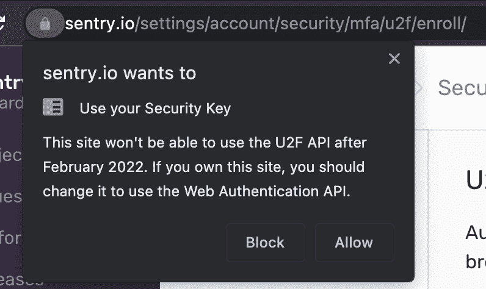

# 从 U2F API 到 WebAuthn 的弃用

> 原文：<https://thenewstack.io/deprecation-from-u2f-api-to-webauthn/>

如果你正在使用 U2F API 来注册和认证你的 U2F 设备，你会注意到一个可怕的情况即将到来:谷歌 Chrome 将在 2 月后不再支持 U2F API:



对于任何在他们的网络应用中使用 U2F API 的人来说，比如我们在 Sentry，他们的使用 U2F 设备启用了 2FA 的用户将无法登录。为了补救这一点，万维网联盟(W3C)和快速身份在线联盟(FIDO)编写了一个闪亮的新规范，将解决我们所有的问题。在这篇博文中，我们将深入探讨从 U2F API 到 WebAuthn 的迁移。

## **WebAuthn**

WebAuthn 是一个 API，它允许 web 服务将强身份验证无缝集成到应用程序中。

 [理查德·马

理查德是 Sentry 的一名软件工程师，也是一名酷装收藏家。](https://www.linkedin.com/in/richardma1998/?originalSubdomain=ca) 

通过 WebAuthn，web 服务可以为用户提供多种身份认证器，例如安全密钥(例如 Yubikeys、Titan 密钥)或内置平台身份认证器(生物识别阅读器)。

此外，所有主流浏览器都支持它——包括 Safari 和 web 平台，前者不支持 U2F API，后者标准化了强认证的集成。你可以在 [WebAuthn 的](https://webauthn.io/)网站上了解更多。

## **从 U2F API 迁移到 web authn**

现在，这就是你们来这里的目的，迁移到 WebAuthn。让我们把它分成两个主要部分:

*   **第 1 部分:使用 WebAuthn 认证现有的 U2F 和新的 WebAuthn 设备**
    *   步骤 1:生成挑战和状态
    *   步骤 2:创建公钥证书数据
    *   步骤 3:验证设备

*   **第 2 部分:向 WebAuthn 注册新设备**
    *   步骤 1:生成挑战和状态
    *   步骤 2:创建公钥证书数据
    *   步骤 3:注册设备

## **第 1 部分:认证**

让我们从身份验证开始，这样现有用户就可以继续登录。这也很重要，因为新注册的 WebAuthn 设备在没有有效的 WebAuthn 登录的情况下无法登录。

为了理解身份验证流程，我们可以看下图:

我们将使用 Python 作为后端 API。 [U2F API](https://github.com/Yubico/python-u2flib-server) 序列(左)与 [WebAuthn](https://github.com/Yubico/python-fido2) 序列(右)非常相似。我们只需替换三个 API 调用:后端的`u2f.start_authentication()`和`u2f.finish_authentication()`，前端的`u2f.sign()`。

让我们从`u2f.start_authentication()`开始，它接收浏览器的应用程序 ID 和当前注册的设备。

U2F API 认证过程从后端生成一个挑战开始，下面显示了一个例子:

```
{
    "appId":  "https://your-webauthn-app.io/2fa/u2fappid.json",
    "challenge":  "VwmGI-4…",
    "registeredKeys":  [
        {
            "appId":  "https://your-webauthn-app.io/2fa/u2fappid.json",
            "keyHandle":  "cxSl4oQ…",
            "publicKey":  "BP4Q8MR…",
            "transports":  [
                  "usb"
            ],
            "version":  "U2F_V2"
        }
    ]
}

```

该挑战被发送到浏览器，在浏览器中`u2f.sign()`将挑战作为输入，并返回一个承诺，该承诺是以下各项的结果:

*   验证调用者的应用程序身份
*   创建客户端数据对象并使用客户端数据
*   应用程序 ID
*   钥匙把手

这将创建一个原始认证请求消息，并将其发送到 U2F 设备。承诺的结果应该是这样的:

```
{
    "keyHandle":  "cxSl4oQ…",
    "clientData":  "eyJ0eXA…",
    "signatureData":  "AQAAAQ4…"
}

```

一旦承诺的结果被发送到服务器，我们就用下面两个参数调用`U2f.complete_authentication()`:原始的挑战数据和新生成的传入的客户机数据对象。此方法将使用参数验证设备，如果成功，将返回设备信息。从那里，服务器可以允许用户通过 2FA 过程。

### 步骤 1:生成挑战和状态

要开始迁移过程，让我们首先用它的对应物替换`u2f.start_authentication()` 。 [WebAuthn API](https://github.com/Yubico/python-fido2) 采用的数据类型与 U2F API 中使用的不太一样。事实上，主要的难点之一是将必要的字段转换成正确的数据类型。

我们希望在遗留的 U2F API 和 WebAuthn 上对用户进行身份验证，因此我们将首先创建一个身份验证服务器。下面将使用 WebAuthn 创建一个向后兼容 U2F API 的认证服务器:

```
webauthn_authentication_server  =  U2FFido2Server(
    app_id=u2f_app_id,  
    rp={
        "id":  “sentry-webauthn.io”,  
        "name":  "Sentry with WebAuthn"}
)

```

您的`app_id`将与之前的值相同。rp 或依赖方是一个包含 ID(URL 的主机名)和依赖方名称的对象。

接下来，我们需要生成一个凭证列表，它与 U2F API 的设备列表相同。请记住，凭证列表将包含 WebAuthn 和 U2F API 注册的设备，并且需要对该列表进行操作。

```
credentials  =  []

for device in self.get_u2f_devices():
    if type(device)  ==  AuthenticatorData:
        credentials.append(device.credential_data)
    else:
        credentials.append(create_credential_object(device))

```

向 WebAuthn 注册的设备具有 AuthenticatorData 类型。对于用 U2F API 注册的设备，我们需要为它们创建一个 AttestedCredentialData 对象，以便与 WebAuthn 兼容。下面是我们编写的函数，它解码必要的参数并创建凭证数据:

```
def create_credential_object(registeredKey):
    return base.AttestedCredentialData.from_ctap1(
        websafe_decode(registeredKey["keyHandle"]),
        websafe_decode(registeredKey["publicKey"]),
    )

```

[功能来源](https://github.com/Yubico/python-fido2/blob/142587b3e698ca0e253c78d75758fda635cac51a/fido2/ctap2/base.py#L250)

这样，我们就可以在我们之前创建的 WebAuthn 服务器上调用 [`register_begin()`](https://developers.yubico.com/WebAuthn/) 来开始注册过程，使用凭证作为它的参数。这将返回一个挑战和状态。

浏览器执行身份验证需要这个挑战，但是我们将只在挑战中使用 PublicKey 对象。此外，您应该将状态存储在会话中，因为以后会需要它。

```
challenge,  state  =  self.webauthn_authentication_server.authenticate_begin(
    credentials=credentials
)
request.session["webauthn_authentication_state"]  =  state
return ActivationChallengeResult(
    challenge=cbor.encode(challenge["publicKey"])
)

```

我们还使用 [FIDO2 CBOR](https://github.com/Yubico/python-fido2/blob/master/fido2/cbor.py) 库对挑战进行了编码，因为我们将使用 JSON 将其发送到前端，JSON 本身不能很好地处理二进制表示。在前端，我们将 JSON 字符串转换回一个字节数组，并对其进行解码，以将挑战返回到其原始形式。

### 步骤 2:为身份验证生成公钥证书

为了替换`u2f.sign()`，我们可以用挑战数据调用它的 WebAuthn 等价物 [`navigator.credentials.get()`](https://developer.mozilla.org/en-US/docs/Web/API/CredentialsContainer/get) 。这个库现在是现代浏览器的原生库，所以不用担心导入任何库。

```
const challengeArray  =  base64urlToBuffer(
    challengeData.webAuthnAuthenticationData
);
const challenge  =  cbor.decodeFirst(challengeArray);

challenge.then(data  =>  {
    webAuthnSignIn(data);
}).catch(err  =>  {
    const failure  =  'DEVICE_ERROR';
    Sentry.captureException(err);
    this.setState({
        deviceFailure:  failure,
        hasBeenTapped:  false,
    });
});

function webAuthnSignIn(publicKeyCredentialRequestOptions)  {
    return navigator.credentials.get({
        publicKey:  publicKeyCredentialRequestOptions,
    }).then(data  =>  {
        // Send to backend
    })
}

```

当调用 [`navigator.credentials.get()`](https://developer.mozilla.org/en-US/docs/Web/API/CredentialsContainer/get) 后承诺被解析，我们需要发送适当的数据到后端完成认证。为了转换从 navigator.credentials.get()获得的 PublicKeyCredential，我们可以通过下面的函数运行它:

```
getU2FResponse(data)  {
    if  (data.response)  {
        const authenticatorData  =  {
          keyHandle:  data.id,
          clientData:  bufferToBase64url(data.response.clientDataJSON),
          signatureData:  bufferToBase64url(data.response.signature),
          authenticatorData:  bufferToBase64url(data.response.authenticatorData),
        };
        return JSON.stringify(authenticatorData);
    }

    return JSON.stringify(data);
}

```

### 步骤 3:验证设备

最后一步，我们可以将原始的挑战和这个新的响应传递给后端。我们需要创建一个凭证列表来验证设备，然后在之前使用以下参数创建的认证服务器上调用`authenticate_complete`:

*   *   **状态**:我们从 start_authentication 开始在会话中存储的值
    *   **凭证**:我们刚刚生成的列表
    *   用于以下内容的 websafe_decode:

*   *   *   **credential_id** :响应对象的“keyHandle”
        *   **client_data** :响应对象的一个“clientData”通过`fido2.client.ClientData`
        *   **auth_data** :通过`fido2.ctap2.authenticatorData`的响应对象的“authenticatorData”
        *   **签名**:响应对象的“signatureData”

```
self.webauthn_authentication_server.authenticate_complete(
    state=request.session["webauthn_authentication_state"],
    credentials=credentials,
    credential_id=websafe_decode(response["keyHandle"]),
    client_data=ClientData(websafe_decode(response["clientData"])),
    auth_data=AuthenticatorData(websafe_decode(response["authenticatorData"])),
    signature=websafe_decode(response["signatureData"]),
)

```

如果这个函数返回 true，那么您现在已经完全通过了身份验证，可以开始工作了！

对于我们的部署，这个特性在一个标志后面，用于管理部署和错误监控。(我们建议使用哨兵😉。)我们独立于注册部署了此功能，因为在发生事故时影响范围有限。恭喜你。迁移的身份验证部分已完成。

## **第 2 部分:注册**

类似于认证，首先，我们来看一下流程:

注册流程几乎与认证流程相同。为了迁移到 WebAuthn，我们需要弃用的三个组件是后端的`u2f.begin_registration()`和`u2f.complete_registration()`，以及前端的`u2f.register()`。再次从`u2f.begin_registration()`开始。这个 API 调用接收 u2f 应用程序 ID 和注册设备列表。这导致以下数据被发送到浏览器以开始注册过程:

```
{
    "appId":  "https://your-webauthn-app/2fa/u2fappid.jso",
    "registerRequests":  [
        {
            "challenge":  "uexgFSl…",
            "version":  "U2F_V2"
        }
    ],
    "registeredKeys":  []
}

```

与`u2f.sign()`类似，`u2f.register()`将获取之前生成的结果，并返回一个承诺，如果设备可注册，该承诺将如下所示:

```
{
    "registrationData":  "BQQ1xlC…",
    "version":  "U2F_V2",
    "challenge":  "Jkh_Tfo…",
    "appId":  "https://your-webauthn-app.io/2fa/u2fappid.json",
    "clientData":  "eyJ0eXA…"
}

```

这个结果和之前生成的挑战一起被发送到后端，u2f.complete_registration()接受两个参数并生成以下数据对象:

```
{
    "appId":  "https://your-webauthn-app.io/2fa/u2fappid.json",
    "keyHandle":  "SnllNGC…",
    "publicKey":  "BIs-gsW…",
    "transports":  [
        "usb"
    ],
    "version":  "U2F_V2"
}

```

您可以保存本词典和设备名称。它们将用于身份验证。就像之前一样，我们把`u2f.begin_registration()`换成它的对应物。我们需要创建一个 FIDO2Server 并从`fido2.server`导入它。我们不需要使它向后兼容，因为所有新设备都将向 WebAuthn 注册。

### 步骤 1:生成 PublicKeyCredentialRpEntity 和 State

我们从导入 [fido2.webauthn 库](https://github.com/Yubico/python-fido2)开始创建 PublicKeyCredentialRpEntity。要创建实体，我们需要传入依赖方的 ID 和名称。对于实体，我们将它传递给 Fido2Server 进行设置。

```
from fido2.server import Fido2Server
from fido2.webauthn import PublicKeyCredentialRpEntity

rp  =  PublicKeyCredentialRpEntity(rp_id,  "Sentry")
webauthn_registration_server  =  Fido2Server(rp)

```

创建服务器时，我们可以选择传入已注册设备的列表，以避免重复注册。

接下来，我们用:

**用户**:包含用户 id、姓名、显示名称
的字典**凭证**:我们刚刚生成的列表
**用户 _ 验证**:正常情况下默认为劝阻

您应该会得到类似这样的结果:

```
{
  "publicKey":  {
    "authenticatorSelection":  {
      "userVerification":  <UserVerificationRequirement.DISCOURAGED:  "discouraged">},
      "challenge":  b"\xe9)#\x86\xfa.\xa9\x82r\x86\xf7\x15e\xb5m\xdc"
 b"\x1dR\xc4\x1b\xdb\xab\x94\x88\xb8\x94\xf43"
 b"b\x03\xab\n",
      "excludeCredentials":  [],
      "pubKeyCredParams":  [
        {"alg":  -7,
 "type":  <PublicKeyCredentialType.PUBLIC_KEY:  "public-key">},
        {"alg":  -8,
 "type":  <PublicKeyCredentialType.PUBLIC_KEY:  "public-key">},
        {"alg":  -37,
 "type":  <PublicKeyCredentialType.PUBLIC_KEY:  "public-key">},
        {"alg":  -257,
 "type":  <PublicKeyCredentialType.PUBLIC_KEY:  "public-key">}],
      "rp":  {"id":  "<$YOUR_APP>",
      "name":  "Sentry"},
      "user":  {"displayName":  "<$YOUR_NAME>",
      "id":  b"\x00",
      "name":  "<$YOUR_APP>"
    }
  }
}

```

将返回如上所示的注册数据。用`cbor.encode()`方法对注册数据进行编码，然后用 base64 编码成一个字符串。

```
publicKeyCredentialCreate  =  cbor.encode(registration_data)
return b64encode(publicKeyCredentialCreate)

```

设置状态，供以后在会话中使用。有趣的是，来自 WebAuthn 的数据与来自 U2F API 的数据完全相同，尽管乍看上去有所不同。WebAuthn 在一个字节数组中设置挑战，在一个 COSE 键对象中设置 clientData(这是一个 [CBOR 映射](https://www.jacobcasper.com/u2f2webauthn.html))，而 U2F API 使用一个编码字符串。

### 步骤 2:为注册生成公钥证书

一旦浏览器接收到注册数据，我们就将字符串转换成缓冲区，并用[这个库](https://github.com/hildjj/node-cbor/tree/main/packages/cbor-web)对其进行解码。这为我们提供了将用作 [`navigator.credentials.create()`](https://developer.mozilla.org/en-US/docs/Web/API/CredentialsContainer/create) :
输入参数的数据

```
challenge,  state  =  self.webauthn_authentication_server.authenticate_begin(
    credentials=credentials
)
request.session["webauthn_authentication_state"]  =  state

return ActivationChallengeResult(challenge=cbor.encode(challenge["publicKey"]))

webAuthnRegister(publicKey)  {
    const promise  =  navigator.credentials.create({publicKey});
    this.submitU2fResponse(promise);
}

```

当来自`navigator.credentials.create()`的承诺被解析时，我们需要在将它再次返回给服务器之前通过`getU2FResponse()` 运行它。

### 步骤 3:注册设备

我们已经到了最后一步，需要从`navigator.credentials.create()`的响应中提取一些数据。以下是`register_complete()`需要的:

*   **状态**:来自用户会话，在 begin_registration()之后设置

*   **client_data** :来自解码数据的 cliendDataJSON，用它创建 ClientData 对象。

*   **证明对象**:对数据的证明对象进行解码，并用其创建证明对象对象。

```
data  =  json.loads(response_data)
client_data  =  ClientData(
    websafe_decode(data["response"]["clientDataJSON"])
)
att_obj  =  base.AttestationObject(
    websafe_decode(data["response"]["attestationObject"])
)

binding  =  webauthn_registration_server.register_complete(
    state,  client_data,  att_obj
)

```

ClientData 应该是这样的:

```
{
    "type":  "webauthn.create",
    "challenge":  "_Uas89Y…",
    "origin":  "https://<$YOUR_APP>",
    "crossOrigin":  false
}

```

证明对象应该是这样的:

```
AttestationObject(
    fmt:  'none',  
    auth_data:  AuthenticatorData(
        rp_id_hash:  h'74cb1ce…5',
        flags:  0x41,  
        counter:  281,  
        credential_data:  AttestedCredentialData(
            aaguid:  h'0000000…',  
            credential_id:  h'63af2c9…',  
            public_key:  {...}
        ),  
        att_statement:  {},  
        ep_attr:  None,  
        large_blob_key:  None
    )
)

```

注册设备数据:

```
AuthenticatorData(
    rp_id_hash:  h'74cb1ce…',
    flags:  0x41,  
    counter:  281,  
    credential_data:  AttestedCredentialData(
        aaguid:  h'0000000…',  
        credential_id:  h'63af2c9…',  
        public_key:  {...}
    )
)

```

这样，您可以保存注册的设备数据。注册过程已完成。就像身份验证一样，这个特性的部署在一个特性标志的后面，以管理部署。因为 WebAuthn 向后兼容 U2F API，所以不需要进行数据库迁移。

## 那是一个包裹

这样，WebAuthn 应该设置好了，您可以从代码库中清除 U2F API。如果你已经做到这一步，我们希望这个指南对你有用。通过一些计划，你可以在 Chrome 把用户锁在你的应用程序之外之前及时完成。万事如意！

我们在岗哨所做的一切都是公开的。在 GitHub 上找到我们。

<svg xmlns:xlink="http://www.w3.org/1999/xlink" viewBox="0 0 68 31" version="1.1"><title>Group</title> <desc>Created with Sketch.</desc></svg>