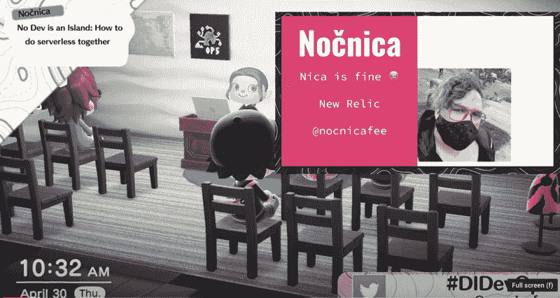

# 荒岛开发总结

> 原文：<https://thenewstack.io/deserted-island-devops-wrap-up/>

[新遗迹](https://newrelic.com/)赞助本帖。

 [诺尼察费

Noč nica 是 New Relic 的开发者拥护者。](https://www.linkedin.com/in/tobyfee/) 

在[荒岛 DevOps](https://desertedisland.club/) 有那么一瞬间，事情看起来似乎不太可能成功。我找不到我的房间，主讲人的麦克风有问题，我的 merch 还没有出现在展位上。

我意识到我在岛上四处游荡，因为我无法相信在这么小的房子里能举行整个会议。当然，在《动物穿越》中，即使你的房子有足够的空间放置几个会议摊位，但从外面看，它仍然像一个小农舍。

有太多的方式可能会出错:如果有人在视频流中失去了连接，数百名注册者将会看到一个两分钟的不可错过的过场动画。摆弄开关控制来移动你的数字化身，同时推进幻灯片和*做你的演讲*有时感觉就像，嗯，在玩杂耍。

但是奇迹般地，所有的事情*都成功了*。

当我挥动我的游戏棒让我的小化身来回踱步时，当其他演讲者的化身笑着、鼓掌并表现出惊讶时，演讲*成功了*。

## 人是关键

最后，一场科技会议的好坏取决于它的演讲者，在荒岛 DevOps 就有一些令人惊叹的演讲。所有这些谈话都有一个共同点:决定你的开发项目成败的是人，以及他们如何组织团队。

## 如何让网上科技活动成功

我想写下我认为是使会议成功的基本要素:

### 找到你的“钩子”

无论你是在《动物穿越》中举办一场技术会议，还是在《龙与地下城》活动中举办一场聚会，你的在线会议对与会者和潜在发言人有一个简单而迷人的吸引力是至关重要的。这应该在推广之前，在演讲人名单之前，当然也是在你想好注册和演讲之前。你的钩子将为会议的其余部分定下基调。

### 短 CFP 可以工作

在会议召开前不到 12 天，为这次会议征集论文的活动就开始了。没有旅行预订，大多数人的时间表很灵活，奥斯汀的活动能够在很短的时间内得到一个强大的发言者阵容。没有必要提前几个月计划一次成功的会议。

### 保持登机灯亮着

注册虚拟聚会时，我经常有一种不祥的感觉。注册表格先问我的名字和电子邮件，然后问我的公司，然后问我公司的行业，然后问我公司的规模，然后问我的电话号码，最后问我经理的电话号码，最后才要求进行 DNA 检验。这种形式令人生厌，而且它们经常按错误的顺序行事:在我见过你的产品或见过你的团队之前，你就要求我成为销售主管。

如果你想要足够多的与会者和参与者，保持注册和签到的便捷是至关重要的。荒岛 DevOps 只需要一个电子邮件地址就可以注册，最终注册人数超过 1000 人！

### 1 名技术人员和 1 名媒体协调员

奥斯汀·帕克创建了这个会议，做了很多推广，我们都聚集在他的岛上。但是在会议之前和会议期间，[凯蒂·法默](https://twitter.com/TheKaterTot)是会议持续进行的“粘合剂”。她介绍发言人，检查简历和代词，批判性地浏览聊天频道，寻找问题，并在最后读给发言人听。[凯蒂的闭幕词非常精彩](https://www.youtube.com/watch?v=L9A6ZauhOhg&list=PLVUQjiv8GtwL-B9AJJ-rNdiDtcU2wo7Gy&index=11)，是这场大获成功的会议的支柱，令人震惊的是，她在上周被解雇后还没有被聘用。[如果你需要发展你的开发社区，直接联系她](mailto:dreadpiratekaty@gmail.com)。

超过 1000 人注册了荒岛 DevOps，但故事比这更大:会议的 twitch 流全天有超过 11000 名观众。一个巨大的成功，美妙的音调和惊人的演讲贯穿始终。如果那天你错过了，不用担心。所有的会谈(包括我的！)现在可以在 YouTube 上看到。

<svg xmlns:xlink="http://www.w3.org/1999/xlink" viewBox="0 0 68 31" version="1.1"><title>Group</title> <desc>Created with Sketch.</desc></svg>