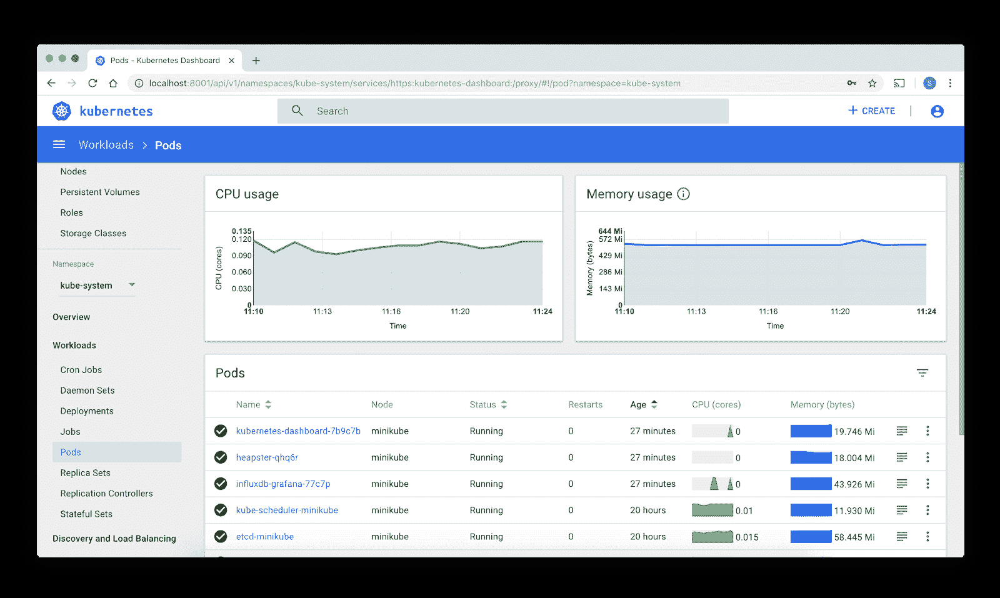
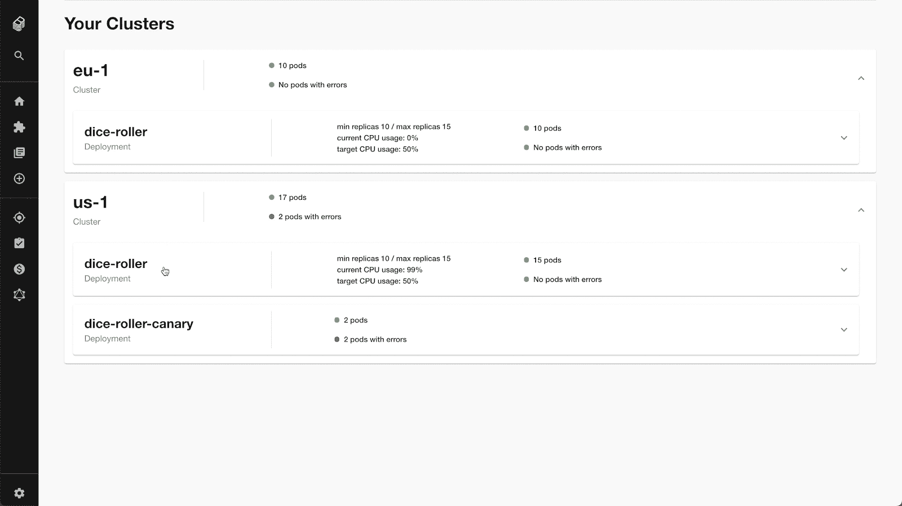
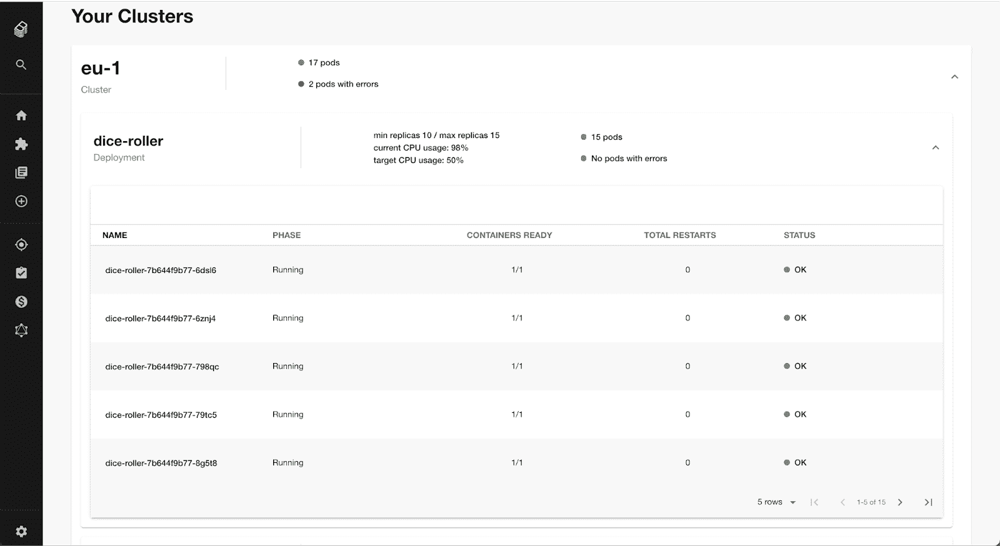

# 为开发者设计更好的 Kubernetes 体验

> 原文：<https://thenewstack.io/design-a-better-kubernetes-experience-for-developers/>

 [马修·克拉克

马修·克拉克是 Spotify 部署团队的高级基础设施工程师。他热衷于开发人员体验，四年来一直在为 Kubernetes 开发开发人员工具。他住在伦敦，原籍北爱尔兰。](https://www.linkedin.com/in/matthewclarke47/?originalSubdomain=uk) 

如果您现在正在构建一个服务，您可能会将其部署为一个容器，该容器位于一个 pod 内，该 pod 位于一个集群内(与一堆不属于您的其他服务一起)，部署在世界各地的不同集群上。很难掌握所有的事情。

但是，尽管 Kubernetes 被广泛采用，所有用于驾驭这种复杂性的工具都专注于集群管理员的需求。这使得像检查服务健康这样简单的事情变得有些复杂。

这就是为什么我们构建了一个专注于服务所有者需求的 Kubernetes 监控工具，并将其作为我们构建开发者门户的开放平台 [Backstage](https://backstage.io) 的核心功能。我们希望让所有开发人员更容易管理部署在 Kubernetes 上的服务。

但首先，我们是如何来到这里的？

## Kubernetes 和 DevOps 的崛起

自 2014 年发布以来，Kubernetes 已经成为最广泛采用的重要开源项目之一。像通过集装箱调度实现自动伸缩和成本优化这样的功能过去很耗时，也很难实现，现在它们已经被大众化了。

与此同时，DevOps 的概念已经成为主流。开发人员现在定期执行传统上由运营专家负责的任务。

因此，虽然日常的工程师可以比以往做得更多，但他们的新权力也伴随着一系列新的责任。

## 新的力量，角色的转变

当我第一次开始使用 Kubernetes 时，集群管理员和服务所有者是同一个人:构建集群的人通常就是拥有集群中运行的服务的人。今天不是这样的。随着 Kubernetes 被广泛采用，Kubernetes 的使用方式也发生了变化，Kubernetes 在组织层面的管理方式也发生了变化。

现在，组织倾向于拥有一个独立的基础设施团队(有时不那么讽刺地称为“DevOps”团队)，他们为功能开发人员和服务所有者构建和维护集群。随着团队变得更加专业化，设置也变得更加先进。例如，基础设施团队可能在多个地理区域建立 Kubernetes 集群，以便减少最终用户的延迟，无论用户在世界的哪个地方。

这对用户来说是更好的体验，在 Kubernetes 存在或没有专门的基础设施团队之前，你可能不会考虑这种优化。但是这也给开发人员带来了生产成本。

## 挫折感也会增加

当您的部署环境达到这种复杂性和规模时，服务所有者的维护开销就会增加。这迫使他们使用多个 kubectl 上下文或多个 ui 来全面了解他们的系统。

这是一笔很小的开销，但随着时间的推移会越来越大，随着服务所有者构建更多的服务并将其部署到更多的地区，开销会成倍增加。仅仅首先检查服务的状态就需要在多个集群中搜索它。这会降低整个公司的生产力(和耐心)。

## 更好的工作工具

我们相信我们可以通过开发工具解决这个问题。但是我们很快发现可用的工具并不合适，因为它们:

*   不太适合部署到多个 Kubernetes 集群，
*   通常要求用户拥有集群范围的权限，或者
*   显示集群上的所有内容，而不关注用户关心的服务。

正如我们经常做的那样，当我们想要解决一个涉及基础设施复杂性的问题时，我们想，为什么不为我们自己开发的门户网站 Backstage 开发一个定制的插件呢？

## 后台 Kubernetes:管理您的服务，而不是集群

Backstage 提供来自 Kubernetes 的重要信息，特别关注开发者的服务。开发人员一眼就能看出:

*   他们在 Kubernetes 上运行的系统的当前状态
    *   包括从多个集群/区域聚集的信息
*   Kubernetes 报告的任何错误
*   系统距离其自动缩放极限有多近
*   容器重新启动

默认的 Kubernetes UI 提供了一个以集群为中心的视图，包括关于您不拥有的软件的信息。(来源:kubernetes.io)

Backstage Kubernetes UI 提供了一个以服务为中心的视图，向您显示服务的状态，无论它部署到多少个集群。以上数字用于说明目的。

只需点击一下鼠标，即可获得有关您的部署的更多详细信息。您可以一目了然地查看自动缩放限制、错误和各个窗格的状态，而无需访问 CLI。以上数字用于说明目的。

您不必花费 20 分钟在 CLI 中尝试跟踪您的服务已经部署到了哪些集群，您只需看一眼就可以获得您需要了解的所有信息。你可以在 [Backstage 博客](https://backstage.io/blog/2021/01/12/new-backstage-feature-kubernetes-for-service-owners)上了解更多关于这些功能的信息。

## 关于您的服务的一切都在一个地方

作为一个独立的监控工具，我们认为 Backstage Kubernetes 可以改善任何部署到 Kubernetes 的开发人员的体验。结合 Backstage 的其他功能，开发人员可以获得构建和管理服务的完整解决方案。

Backstage 的核心是它的[服务目录](https://backstage.io/blog/2020/05/22/phase-2-service-catalog)，它将软件系统的信息聚集在一起，这样你就有了一个一致的用户界面和一个供开发者使用的工具。多年来，Backstage 为 Spotify 的开发者提供了一个地方来查看他们需要了解的关于他们服务的一切(API、文档、所有权等)。).这包括他们服务的当前状态，而不管他们部署了多少个 Kubernetes 集群。

现在 Backstage 是开源的，我们希望在我们内部构建的基础上进行改进，并将 Kubernetes 作为 Backstage 的核心组件提供给任何人，让他们为之做出贡献并从中受益。

## 未来迭代

随着我们继续与社区一起在后台发展 Kubernetes，我们希望为 Kubernetes 资源提供部署和自定义资源定义之外的支持。

虽然在 Spotify 我们目前广泛使用 GKE，但后台的 Kubernetes 直接与 Kubernetes API 通信，因此是云不可知的。它将与其他云提供商合作，包括 AWS 和 Azure，以及托管的 Kubernetes 服务，如 Red Hat OpenShift。

为了在后台贡献或获得更多关于 Kubernetes 的信息，[加入关于 Discord](https://discord.gg/MUpMjP2) 的讨论！

*想了解更多信息吗？马修·克拉克和后台团队正在举办一场 Reddit AMA。从 3 月 2 日开始，在 [r/kubernetes](https://www.reddit.com/r/kubernetes/) 提交您的问题。*

<svg xmlns:xlink="http://www.w3.org/1999/xlink" viewBox="0 0 68 31" version="1.1"><title>Group</title> <desc>Created with Sketch.</desc></svg>