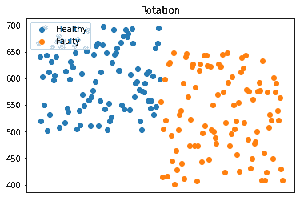

# 为云原生边缘基础架构设计边缘系统

> 原文：<https://thenewstack.io/design-an-edge-system-for-the-cloud-native-edge-infrastructure/>

在[之前的文章](https://thenewstack.io/tutorial-configure-cloud-native-edge-infrastructure-with-k3s-calico-portworx/)中，我讨论了 Rancher 的 [K3s](https://k3s.io/) 轻量级 Kubernetes 发行版、 [Calico](https://www.projectcalico.org/) 联网软件和 [Portworx](https://portworx.com/) 开源云原生存储平台如何成为运行在边缘的现代人工智能(AI)和物联网系统的基础。让我们设计并部署一个在此基础架构上运行的解决方案。

基于监控属于涡轮机的风扇的假设场景，我们将建立预测性维护解决方案，该解决方案将检测风扇中的异常。这是一个参考架构，用于设计和构建利用各种开源和云原生技术的物联网/边缘解决方案。

### 问题陈述

我们需要设计和部署一种解决方案，能够接收来自多个风扇的遥测数据，并使用实时数据流在故障发生前预测故障。该解决方案在低端机器上运行的边缘基础设施上运行，如[英特尔 NUCs](https://www.intel.com/content/www/us/en/products/boards-kits/nuc.html) 。基础设施基于 K3s、Calico 和 Portworx，它们提供了 Kubernetes 集群的核心构建块。

### 解决方案架构

附在涡轮机风扇上的传感器提供当前的转速、振动、温度和噪音水平。该遥测数据流与来自每个风扇的设备 ID 一起作为预测性维护解决方案的输入。


[Mosquitto](https://mosquitto.org/) ，一个流行的开源 MQTT 代理充当传感器的网关和平台的中央消息代理。传感器将遥测数据接收到 Mosquitto 代理的`fan/messages`主题中。

下面是每个粉丝发布到 MQTT 话题的有效载荷。


预测者微服务是粉丝发布的同一遥测信道的订户。对于每个入站数据点，它调用异常检测服务并将结果发布到单独的 MQTT 主题中，`fan/anomaly`。

```
import time
import requests
import random
import datetime
import json
import os
import paho.mqtt.client as mqtt

broker_address  =  os.getenv('MQTT_HOST')
dev_topic  =  os.getenv('MQTT_DEV_TOPIC')
pred_topic  =  os.getenv('MQTT_PREDICT_TOPIC')
scoring_url=os.getenv('SCORING_URL')
d={}

client  =  mqtt.Client("pdm")
client.connect(broker_address)

def on_message(mosq,  obj,  msg):
    rotation=json.loads(msg.payload)["rotation"]
    temperature=json.loads(msg.payload)["temperature"]
    vibration=json.loads(msg.payload)["vibration"]
    sound=json.loads(msg.payload)["sound"]
    telemetry=[rotation,temperature,vibration,sound]
    data={"params":telemetry}

    response  =  requests.post(scoring_url,  json=data)
    fault=json.loads(response.text)["fault"]

    d["deviceID"]=json.loads(msg.payload)["deviceID"]
    d["fault"]=fault

    payload  =  json.dumps(d,  ensure_ascii=False)
    print(payload)
    client.publish(pred_topic,payload)

def on_subscribe(mosq,  obj,  mid,  granted_qos):
    print("Subscribed: "  +  str(mid)  +  " "  +  str(granted_qos))

client.on_message  =  on_message
client.on_subscribe  =  on_subscribe
client.connect(broker_address)
client.subscribe(dev_topic,  0)

while True:
    client.loop()

```

`SCORING_URL`是异常检测推理服务的端点。在 TensorFlow 中训练的深度学习模型通过 Flask web 服务公开。

下面是预测器服务发布到 MQTT 主题的有效负载:


### 训练异常检测模型

具有超过 20，000 个数据点的历史数据集用于训练异常检测模型。


从数据集中可以观察到，风扇在发生故障前几个小时转速会降低。与此同时，振动、声音和温度值增加，表明即将发生故障。

旋转数据的散点图直观地显示了这一点。风扇的转速从正常的平均 600 转降到 400 转。



基于此，我们可以很容易地训练一个简单的 TensorFlow 逻辑回归模型来预测故障风扇。我们首先去掉时间戳和 *deviceID* 列。

```
dataframe  =  pandas.read_csv("../data/fan.csv",  header=None,skiprows=1)
del dataframe[0]
del dataframe[1]

```

在分离特征和标签之后，数据集然后被分成训练和测试数据。

```
dataset  =  dataframe.values
X  =  dataset[:,0:4].astype(float)
y  =  dataset[:,4]
X_train,  X_test,  y_train,  y_test  =  train_test_split(X,  y,  test_size=0.33)

```

然后，我们创建一个具有 4 层的神经网络，进行逻辑回归。

```
model  =  Sequential()
model.add(Dense(60,  input_dim=4,  activation='relu'))
model.add(Dense(30,  activation='relu'))
model.add(Dense(10,  activation='relu'))
model.add(Dense(1,  activation='sigmoid'))
model.compile(loss='binary_crossentropy',  optimizer='adam',  metrics=['accuracy'])
model.fit(X_train,  y_train,  epochs=250,  batch_size=32,  verbose=0)

```

最后，保存并评估模型。

```
model.save("../model")
loss,  acc  =  model.evaluate(X_test,  y_test,  verbose=0)
print('Test Accuracy: %.3f'  %  acc)

```

保存到磁盘的张量流模型由推理服务加载，对预测器微服务发送的数据进行预测。

### 时间序列数据和可视化

通过 [Telegraf](https://www.influxdata.com/time-series-platform/telegraf/) 将 [InfluxDB](https://www.influxdata.com/products/influxdb-overview/) 的一个实例连接到 Mosquitto。这种配置为我们提供了一种优雅的机制，无需编写一行代码就可以将时序数据接收到 InfluxDB 中。

下面是 Telegraf 配置，它将 Mosquitto 与 InfluxDB 连接起来。

```
  [agent]
      interval  =  "10s"
      round_interval  =  true
      metric_batch_size  =  1000
      metric_buffer_limit  =  10000
      collection_jitter  =  "0s"
      flush_jitter  =  "0s"
      debug  =  false
      quiet  =  false
      hostname  =  ""
      omit_hostname  =  true

    [[outputs.influxdb]]

      urls  =  ["http://influxdb:8086"]
      database  =  "fan"
      retention_policy  =  "autogen"
      precision  =  "s"
      timeout  =  "5s"

    [[outputs.file]]
    files  =  ["stdout"]
    data_format  =  "influx"

    [[inputs.mqtt_consumer]]
      servers  =  ["tcp://mosquitto:1883"]
      qos  =  0

      topics  =  [
        "fan/#"
      ]

      insecure_skip_verify  =  true
      client_id  =  ""
      data_format  =  "json"
      name_override  =  "fan"
      tag_keys  =  ["deviceID"]
      json_string_fields  =  ["rotation","temperature","vibration","sound","fault"]

```

现在可以从 InfluxDB 查询时间序列数据。


最后，我们将一个 [Grafana](https://grafana.com/) 仪表板连接到 InfluxDB，为我们的 AIoT 解决方案构建一个漂亮的可视化界面。


在本教程的下一部分，我将讨论基于 K3s、Calico 和 Portworx 的部署架构以及存储和网络考虑事项。敬请关注。

*贾纳基拉姆·MSV 的网络研讨会系列“机器智能和现代基础设施(MI2)”提供了涵盖前沿技术的信息丰富、见解深刻的会议。在 [http://mi2.live](http://mi2.live) 注册参加即将到来的 MI2 网络研讨会。*

<svg xmlns:xlink="http://www.w3.org/1999/xlink" viewBox="0 0 68 31" version="1.1"><title>Group</title> <desc>Created with Sketch.</desc></svg>