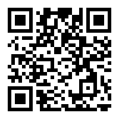
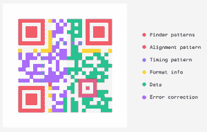
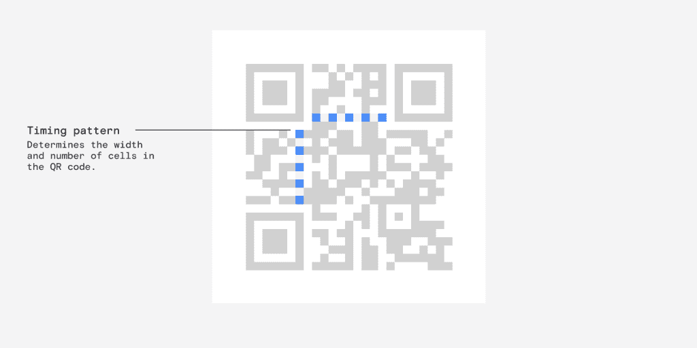
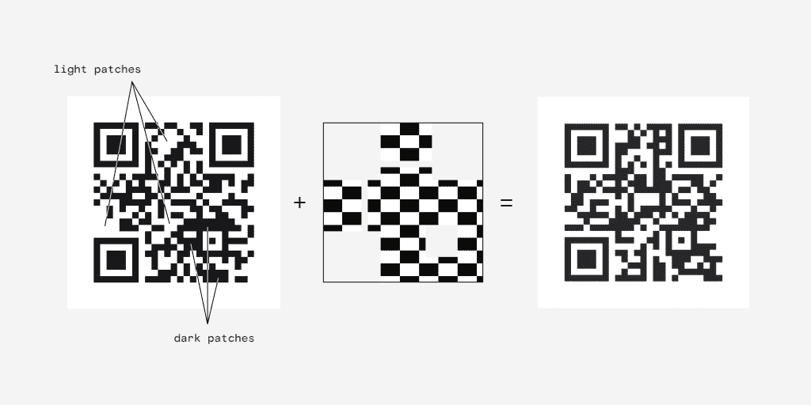
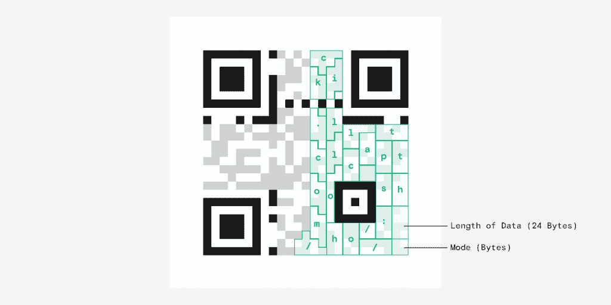

# 像开发人员一样设计:如果你必须重新设计二维码会怎样？

> 原文：<https://thenewstack.io/design-like-a-dev-what-if-you-had-to-redesign-qr-codes/>

尽管二维码无处不在，但它在某种程度上被开发者视为理所当然。快速响应(QR)码是由丰田的一家子公司发明的，用于跟踪整个制造过程中的零件。但是子公司 [Denso Wave](https://www.denso-wave.com/en/technology/vol1.html) 从未行使过他们的专利，所以这项技术可以免费使用。

今天，我们通常使用二维码从墙上、餐巾纸、名片甚至 t 恤上获取冗长的网址；也就是说，任何我们可以拍照的可见表面。感谢 [QRFY](http://qrfy.com) ，这是我为 thenewstack.io 做的一个(它使用一个很短的代码，最终会断开连接——所以尝试一下宜早不宜迟。)

我们来玩一个设计游戏。高级软件设计师应该总是在头脑中经历重新设计来练习他们的分析技能。你的下一份工作很可能从一个你以前从未想过的现有系统开始，尽管你一直在使用它。你认为二维码的外观和行为如何？你会如何从头开始设计它？你将如何测试它？

但首先，条形码不能传递二维码能传递的东西是什么？条形码在一个表面上横向延伸，在你当地的超市里它们足够有效。但是表面上的光线对比会使它们很难从某个角度阅读。在超市自助结账时，你可以晃动一包蒸粗麦粉，直到它扫描完毕——但你不能用仓库里的包装箱做到这一点。

在了解二维码的实际工作原理之前，让我们总结一下我们认为应该在二维码中寻找什么的原则:

*   它需要在不同的光线条件下和不同的表面上都能很好地工作。
*   它需要某种程度的纠错，所以轻微的损坏不会使它无用。
*   由于它不能自动更新，它必须有相当多的元数据；例如版本信息。

## 理解模式

好，所以你必须知道代码在哪里，不在哪里。也就是说，在读取容器中的内容之前，检测容器的位置和边界。你可能已经注意到了那些包含点的大方块。这些构成了**取景器模式**。如果你看到里面有一个点的小方块，那就是**校准图案**。这允许确认图像的角度和方向。

一个优秀的开发人员会意识到元信息的重要性。随着项目年龄的增长，这变得越来越重要，因为不同的变化和版本激增。

在二维码的情况下，阅读器必须计算出内容持有者有多大。从取景器方格到取景器方格与内侧水平交叉的点构成**定时图案**。这些告诉读者单个模块有多大，整个二维码有多大——称为版本。请注意，这些出现在两个地方。

我从未见过像右边这样的二维码，但它在系统内是可描述的！

冗余在任何系统中都有一个有趣的位置，尤其是对于那些存在于荒野深处的系统。按理说，二维码需要有不止一种方法来访问其数据，以防一小部分代码被遮挡。冗余和纠错有助于实现这一点——试着在图像的一小部分模糊的情况下阅读顶部的代码。

**格式信息**存储在取景器图形周围的条带中并重复。该格式存储关于掩码的信息，以及纠错的级别和类型。

大多数开发人员应该对遮罩很熟悉，但是这里的应用有点不同。因为当暗区域和亮区域平衡时，图案效果最好，所以我们的想法是去除扰乱图案的较大的亮区域或暗区域。当在创建过程中对代码应用蒙版时，任何落在白色部分下的点都将被保留，而任何落在黑色部分下的点都将被反转。因此，当回读代码时，可以重新应用掩码以将代码返回到其原始状态。应用各种遮罩，看哪一个达到最佳效果；并且这被存储在格式模式中。

这乍一看有点奇怪，但它代表了软件是可控的，但外部条件是不可控的思想。这种毫无疑问的复杂性仍然有助于创造一个更可靠的最终产品。塑造数据本身，使其更好地与工具链的其余部分一起工作，这是您为了增强现有解决方案而做的事情——您最初从未想过要这样做。

纠错级别控制代码的密度。通过增加信息的密度，冗余增加，当代码被覆盖时，恢复信息变得更容易；但是整个图像更复杂。这就是预期用例出现的地方——在表面可访问且接近的地方，低密度的简单代码是完全可靠的。否则，相信校正策略会变得更方便。

## 数据呢？

那么在这一切之后，**数据**本身在哪里呢？奇怪的是，它从右下方蜿蜒前进(传统的日本阅读方向是从右向左)。

另一边的剩余区域用于数学**误差修正**。Reed-Solomon 码是一种用于音乐 CD 的纠错方法，但它最初是为了对抗卫星通信中的噪声而开发的。仍然有各种各样的策略可以采用——无论是找出全部或部分错误，并重新阅读代码，比较冗余区域，还是计算更正。

所以我们有它。一个简单的前提，但是包含了任何必须适应环境的项目的正常复杂性。这让我们想到了设计师必须具备的最后一个品质:同理心。欣赏别人为使某样东西变得实用而做的工作，起初可能很难理解，但耐心地拆开它是理解它的唯一方法。

(我想写关于二维码设计的文章已经有一段时间了，但是丹·霍利克的这篇[文章促使我开始写作；并提供了一些优秀的图片，我为本文借用了这些图片。)](https://typefully.com/DanHollick/qr-codes-T7tLlNi)

<svg xmlns:xlink="http://www.w3.org/1999/xlink" viewBox="0 0 68 31" version="1.1"><title>Group</title> <desc>Created with Sketch.</desc></svg>