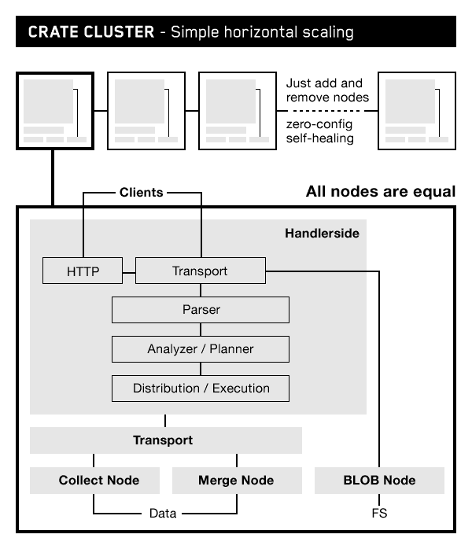

# 我们如何将 CrateDB 设计为面向物联网的实时 SQL DBMS

> 原文：<https://thenewstack.io/designed-cratedb-realtime-sql-dbms-internet-things/>

 [约多克·巴特洛格

约多克·巴特洛格创立了 CRATE Technology GmbH。于 2013 年，并在出任首席执行官后出任首席技术官及执行董事。在担任可爱系统的首席执行官后，Jodok 曾担任德国 VZnet networks: MeinVZ 和 SchuelerVZ 的首席技术官。他曾担任 Sevenload GmbH 的首席技术官和 StudiVZ 的首席技术官。](https://crate.io/) 

随着物联网的兴起，我们正在进入“物数据”时代。在其中，物联网应用程序处理由数百万个传感器生成的数据，并对其进行实时分析，以监控和控制我们驾驶的联网车辆、我们操作的机械和我们居住的智能城市。对于软件开发人员来说，这意味着出现了一种新的数据库工作负载，一种*必须*提供以下功能的工作负载:

*   每秒摄取数百万个数据点，
*   实时查询数据，
*   处理各种各样的物联网数据结构，
*   执行复杂的查询，如时间序列、地理空间、文本搜索和机器学习，
*   在边缘和云中处理数据。

物联网是一种新的数据工作负载。 [Gartner 研究表明](http://www.gartner.com/smarterwithgartner/transform-your-business-with-iot-analytics/)物联网将给我们带来新的数据量、数据和查询复杂性以及集成挑战。DBMS 基准的独立标准制定者 TPC 正在为物联网定义一种新的混合工作负载基准[。](http://www.tpc.org/tpcx-iot/default.asp)

在 [Crate.io](https://crate.io/) ，我们设计了 CrateDB 来处理物联网数据。以下是我们为支持新的物联网工作负载而做出的 DBMS 设计选择:

### 架构:分布式、无共享、容器本地

CrateDB 在一个无共享的架构中运行，作为一个由相同配置的服务器(节点)组成的集群，这些服务器可以无缝地相互协作。写和查询操作的执行自动分布在集群中的节点上。

增加或减少数据库容量只是添加或删除节点的简单事情。我们在“简单”的部分下了很大功夫，随着集群大小的变化，自动执行分片、复制(用于容错)和数据的重新平衡。CrateDB 诞生于容器时代，允许你在[微服务](/category/microservices/)环境中通过 Docker 或 [Kubernetes](/category/kubernetes/) 等容器编排平台轻松扩展和管理它。

### 访问:SQL

我们选择 SQL 作为数据访问语言，以使 CrateDB 易于主流开发人员采用。大家都懂 SQL 它功能强大，而且易于集成。CrateDB 与大多数 SQL 工具兼容，通过 PostgreSQL wire 协议、JDBC、ODBC 和 REST 接口进行接口。

分布式 SQL 引擎很难构建。用了几年时间才达到 ANSI SQL 兼容性的可行水平，支持连接、聚合、索引、子查询、用户定义函数等等。我们用 NoSQL 中常见的一些好东西充实了 SQL，比如全文搜索、地理空间查询和嵌套的 JSON 对象列。

### 存储和索引:NoSQL 风格

CrateDB 的真正魅力在于它如何将熟悉的 SQL 与 NoSQL 数据库的可伸缩性和数据灵活性结合起来。我们通过在我们自己和其他开源 NoSQL 技术的基础上构建我们的分布式 SQL 引擎而不是传统的关系型 DBMS 技术来实现这一点。

CrateDB 使用以下开源项目的部分内容来构建其物理基础:

*   [Lucene](https://lucene.apache.org/) ，用于存储和索引，包括文本搜索和地理空间。
*   [Elasticsearch](https://github.com/elastic/elasticsearch) ，用于无主集群和事务日志。
*   [Netty](https://netty.io/) ，用于节点间的异步、事件驱动、全网状网络。

CrateDB 被打包成一个单独的二进制文件，安装和启动都很简单。

### 模式:动态

CrateDB 的 SQL-NoSQL 架构的另一个好处是模式灵活性。传统的关系模式是僵化的，改变它们是痛苦的。CrateDB 中的每个关系记录都存储为一个 JSON 文档，这些记录可以动态地改变结构。

例如，一家全球包装制造商从其每条生产线上的 900 种不同类型的传感器收集数据。在 SQL Server 中，他们将数据存储在 900 个不同的表中，每个传感器类型一个表。搬到 CrateDB 后，他们将所有的读数都存储在一个表中。简单多了。查询执行速度提高了 40 倍。

### 写作:高速插入

物联网系统接收机器生成的数据流。我们决定采用最终一致的、非阻塞的数据插入模型。这使得 CrateDB 可以在查询数据的同时，在每个节点上每秒插入数万个数据点。

数据的持久性和一致性也很重要，我们采取措施解决这些问题，尽可能减少对性能的影响。为了确保数据的持久性，我们实现了[预写日志](https://en.wikipedia.org/wiki/Write-ahead_logging)。为了一致性，CrateDB 包括记录版本控制、[乐观并发控制](https://en.wikipedia.org/wiki/Optimistic_concurrency_control)和表级**刷新频率**设置，这迫使 CrateDB 数据定期(每 *n* 毫秒)保持一致。

### 查询:通过内存中的列索引进行实时查询

实时数据库通常要求所有数据都放在主存中，但这限制了您可以管理的数据量。我们没有数据量限制的实时性能解决方案是在每个节点上实现驻留内存的列字段缓存。缓存告诉查询引擎该节点上是否有满足查询标准的记录，以及这些记录位于何处；这都是以内存速度执行的。

分布式查询处理也有助于提高性能，查询规划器可以非常明智地决定哪些节点最适合执行不同的聚合和连接。

### 平台:Java，在边缘还是在云中

物联网数据处理通常是分布式的，从云数据中心到远程站点，甚至到设备上。DBMS 的可移植性使得云和边缘架构更容易实现，所以我们用 Java 写了 CrateDB。因此，CrateDB 可以在任何地方运行，在数据中心的 JVM 上或远程运行，如果互联网网络延迟开销不可容忍，或者如果数据需要在通过管道传输到中央云实例进行更大规模的处理之前进行聚合。

## 下一步是什么？

物联网在发展，CrateDB 也在发展。我们当前的开发重点包括增加对更丰富的数据库内分析的支持，并将物联网接口构建到 CrateDB 中，支持通过 MQTT 进行直接的设备到数据库集成，以实现更简单的物联网应用架构。

CrateDB 是开源的，可以在 crate.io 下载[。](https://crate.io/download/)

lissa Algora 在 [Unsplash](https://unsplash.com/?utm_source=unsplash&utm_medium=referral&utm_content=creditCopyText) 上拍摄的特写图像。

<svg xmlns:xlink="http://www.w3.org/1999/xlink" viewBox="0 0 68 31" version="1.1"><title>Group</title> <desc>Created with Sketch.</desc></svg>