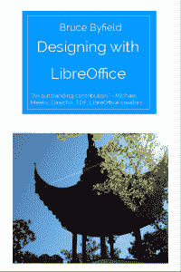
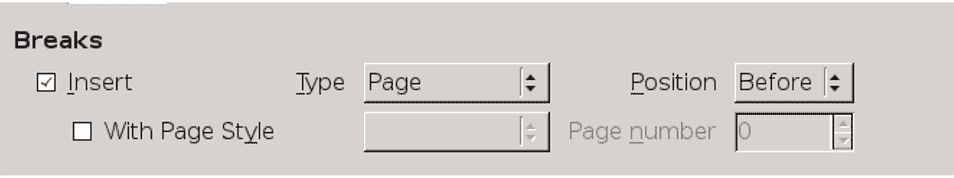
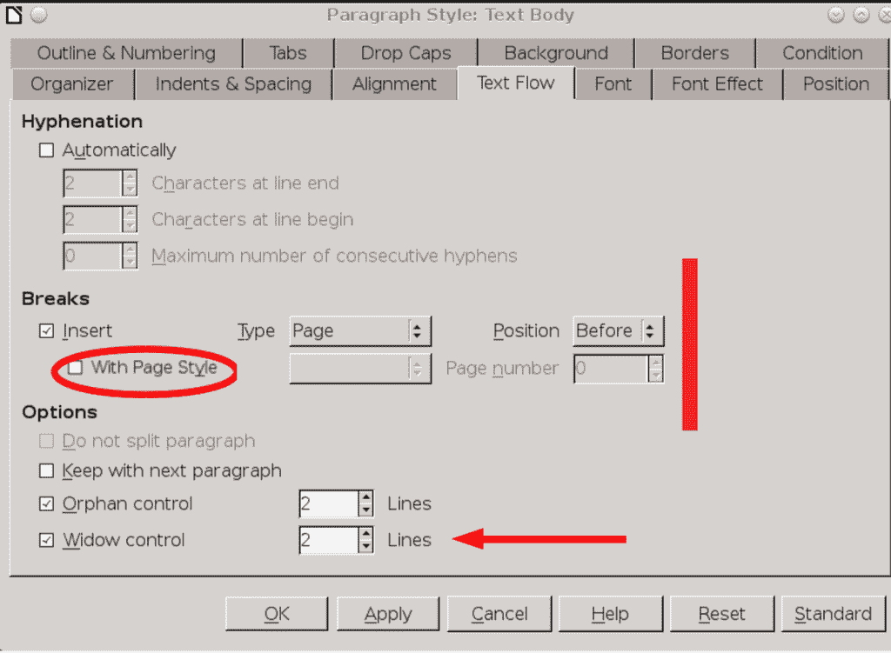
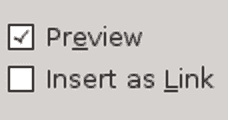

# 使用 LibreOffice 进行设计:在图形编辑器中准备图像

> 原文：<https://thenewstack.io/designing-libreoffice-preparing-images-graphics-editors/>

与 [LibreOffice](https://www.libreoffice.org/) 本身提供的工具相比，  图形编辑器是一种更通用、更可靠的准备图像的方式。像 [GIMP](https://www.gimp.org/) 和 [Krita](https://krita.org/) 这样的编辑器可以在 LibreOffice 运行的所有操作系统上免费下载。

在编辑图像之前，请测量可能显示图像的所有页面的左右(或内外)边距之间的距离。您可以通过从每种页面样式的**页**选项卡上给出的页面宽度中减去垂直边距来确定该距离。在调整图像大小时，您将需要这种度量。如果某些图像太大，无法以此尺寸清晰显示，请考虑为它们添加横向页面样式。

您可以通过右击并选择**使用外部工具**编辑，或直接从图形编辑器中打开图像。如果图像已经打开，右键单击以复制它，然后将其粘贴到图形编辑器中的新文件中。

图形编辑器允许你改变图像的大小和颜色，还可以做很多其他的操作。但是，每个图像都需要四个操作:

*   设置图像的分辨率和打印尺寸。
*   决定裁剪图像或添加指示器以指向特征。
*   设定自然边界。
*   清理图像。

## 设置图像分辨率

对于在线文档，72 DPI(每英寸点数)的分辨率通常就足够了。对于硬拷贝，请使用至少 300 DPI 或 600 DPI 或更高的分辨率进行高质量打印。

分辨率最好在图形编辑器中设置。许多图形编辑器会显示实际尺寸和打印尺寸，以多种不同的格式显示，包括像素、磅、英寸和百分比。获得最高分辨率是一种权衡:分辨率越高，图像的实际或打印尺寸就越小。大多数图像可以放大 50 %,但很少有图像可以放大到 200%而不严重失真，除非它们非常简单。尝试找到最佳的折衷方案。

大多数编辑在 72 DPI 的屏幕上工作。如果您正在制作原始图形，一个解决方案是将所有内容的大小设为所需大小的三倍，然后将其缩小到 3oo DPI 的正确大小。

## 使用裁剪或指示器

编辑图片有助于读者了解应该关注什么。您有两个主要选择:裁剪或添加指示器。

裁剪是将图像缩小到必要的程度。留下一些背景，这样读者就能找到你在讨论什么。一些作者在裁剪后的图像周围放置锯齿状边缘，就好像它是从页面上撕下来的一样，这是一种生动的努力，但很耗时。

段落样式的“文本流”标签的裁剪图像。

相比之下，指示器通过明亮的颜色吸引人们对图像部分的注意，而且它们显然不是界面的一部分。

指示器的类型包括条形、箭头和椭圆形。条形和箭头是最快插入的，而添加椭圆形通常需要使其填充区域透明，以便它所包围的图像部分可见。

选择一种类型的指示器，记下它的颜色和尺寸，以便可以一致地使用它们。

提示:您还可以在图形编辑器中添加箭头、线条、方框或标注等指示器，或者通过使用**视图>工具栏>绘图**来添加指示器。

当读者跟随你的讨论时，你想让他们容易地发现的元素，指示器引起他们的注意。

## 设置自然边界

您可以在 LibreOffice 中为图像添加边框。然而，自然的边界也同样有效。如果可能，裁剪图像，使其所有边缘的颜色与文档背景的颜色不同。

例如，一些操作系统或桌面主题会在对话框窗口周围放置阴影。包括阴影，你有一个自然的边界，不需要更多的关注。

## 清理图像

作为图像编辑的最后一步，去除任何不必要的混乱。例如:

*   如果你拍摄了一个菜单的屏幕截图，把背景中任何不相关的文本和对话框都涂白。
*   检查背景中可能意外侵犯某人隐私的细节。
*   如果可能，裁剪图像中的任何空白区域。
*   看看你是否能提高特别暗或亮的图像的对比度。
*   试验图像大小，使其不大于易读性所需的大小。

## 插入图像

在整个 LibreOffice 中，如果您遵循以下最佳实践，框架通常不会那么麻烦:

*   格式化和写入完成后添加对象。物体不太可能四处移动。如果可能，格式化框架样式，而不是单个框架。
*   如果可能，格式化框架样式，而不是单个框架。
*   添加对象后立即进行调整，而不是以后。如有必要，先试验确切的设置，记下所有设置。然后删除实验并再次添加帧，在添加帧时应用设置。
*   不要复制和粘贴框架或对象。如果要移动对象，请删除一个帧并从头开始。
*   切勿通过拖动对象来调整其大小或位置。使用右键菜单。
*   永远不要用空格或空行来定位对象。相反，总是使用样式。
*   如果你想让一个图像跟随另一个，把它们放在带有不可见边框的表格中，或者在图形编辑器中创建一个
    单个图像。

这些预防措施在 Writer 中似乎比在 Calc、Draw 或 Impress 中更可靠。

## 选择链接或嵌入

当您使用 **INSERT > IMAGE** 从文件管理器中选择图像时，LibreOffice 默认将该图像作为文档文件的一部分嵌入。

然而，在某些版本的 LibreOffice 中，你可以选择使用文件管理器左下角的**插入链接**框。如果您选择此选项，您的文档将在每次加载时使用图像的原始文件。

“作为链接插入”选项位于“插入图像”窗口的左下方，很容易被忽略。

LibreOffice 默认嵌入图像的事实表明，其最初的程序员认为嵌入是最简单的解决方案。事实上，专业作家和设计师一直在争论这两种方法。嵌入和链接都有优缺点。你更喜欢哪个，与其说是对或错，不如说是你更喜欢如何工作以及别人更喜欢如何接受你的工作的问题。

要考虑的优缺点包括:

提示:**改变图像**可能不起作用，如果你不得不尝试换入一个与原始图像同名的图像。相反，删除原始图像，然后插入替换图像。

<svg xmlns:xlink="http://www.w3.org/1999/xlink" viewBox="0 0 68 31" version="1.1"><title>Group</title> <desc>Created with Sketch.</desc></svg>