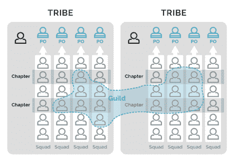

# 为可伸缩性设计组织:构建可伸缩的结构

> 原文：<https://thenewstack.io/designing-organizations-for-scalability-building-the-structure-to-scale/>

 [路易斯·戈梅斯·德·阿布雷乌

路易斯·戈梅斯·德·阿布雷乌是一名科技企业家、作家兼首席技术官。2008 年，他联合创立了薪资软件公司 Nmbrs，以首席运营官和开发总监的身份负责技术运营。一路走来，他创办了其他企业，如 Grappster 和 Wallylabs，参与了许多创业活动，并且是《价值愿景》的作者。](http://visiontovalueframework.com/) 

《全球企业家精神监测》的全球报告显示，每秒钟有超过三家企业诞生，或者说每年有大约 1 亿家企业诞生。任何人都可以创业，每个人都在创业。这些业务越来越多地基于软件，SaaS、PaaS 和其他结构与使用软件作为业务基础的组织(脸书、亚马逊、优步等)一起出现。).同一份报告显示，超过 70%的这些企业继续失败。

作为几个基于软件的组织的联合创始人，包括 Nmbrs、WallyLabs、Grapster 和一个将于今年晚些时候宣布的新兴企业，我在扩展组织方面有很多经验。我最近还写了一本书，书名是《从[视觉到价值](https://www.amazon.com/Vision-Value-Structure-Companies-Products/dp/170301541X)》我对他们每个人的看法都是一样的。初创公司被迫做出短期决策，牺牲长期稳定性，赶在资金耗尽之前满足最低可行产品(MVP)。当快速增长过程中出现成长的阵痛时，组织会创建快速和临时的解决方案。

虽然有很多书提倡尽可能快地增长，但我更喜欢提倡可持续增长。这样做意味着使用为长期利益而设计的方法，创建一个经得起未来考验的运营结构。更重要的是，扩展意味着在开始扩展之前要注意可能会破坏增长的摩擦点和问题。

## 建立坚实的基础

坚实的基础是支持任何增长所必需的。但是到底什么是“坚实的基础”？对于大多数组织来说，基础代表了领导力、团队结构、客户服务以及管理资金、质量、客户满意度、员工和功能等资源的结构。一个良好的基础使得交付成为可能，即使是在你成长的时候，因为你需要的基本要素已经到位。这是接受种子资金的初创公司面临的最大风险之一，因为你的成长速度可能会超过组织结构所能支持的速度。

**团队组织:**瀑布式、敏捷式、Holacracy 式、精益式、蓝绿色，选项看似无穷无尽。大多数软件公司选择敏捷。无论你选择什么，确保团队管理到位，有结构、过程和工具来支持它。例如，我自己的组织使用敏捷，团队结构基于 [Spotify 模型](https://www.youtube.com/watch?v=4GK1NDTWbkY&feature=youtu.be)，根据团队使用 scrum 和看板。团队实施在早期创业中几乎不存在，但很快成为基本功能的必要条件，如透明度、角色和责任委托以及资产管理。创建以后可以实现的团队结构，即使您当前的结构中有一个人在四个团队中工作。团队组织应该包括发展团队、创建新团队和吸纳新团队成员的策略。比如新人去哪里由谁决定？(运营通常是 SaaS 公司的最佳选择)。谁负责入职？你是否有一个适当的策略来确保新的团队成员花几周时间与导师一起工作，并在已建立的团队中工作，以确保新人永远不会从事新的项目？

**工作管理**:工作必须是透明的、可追踪的、可重复的、可授权的、可拥有的。当出现问题时，你必须知道谁该负责，哪里出了问题，以及如何修复它。大多数组织最终都会实现工作管理工具，通常是以过程管理的形式。像体式和吉拉这样的工具在这里非常受欢迎，但是任何组织都有几十个选项和多种需求，找到自己的很重要。这里，最关键的需求是:

*   工作需要是可见的，并分配给谁来做。
*   每个进程、模块或特性都应该有一个所有者。
*   所有的工作都应该记录在案，希望从第一天开始。
*   整个组织的流程和文档应该是相同的。
*   监控触发器应该与工作和流程相关联，以确保人们对其采取行动。
*   一个人应该最终负责任何项目，以确保完全的问责制。

在早期的组织中，授权和责任是很棘手的，一个人经常被要求身兼数职。但是，您可以通过在管理平台内创建角色、为角色分配职责，然后随着组织的扩展更改角色的所有者来进行折衷。

## 玩长线游戏

在西蒙·西内克的《无限游戏》中，作者介绍了使用策略来长期成功的概念。那些用他们所有的资源开发 MVP，但是没有资源来建立结构的公司正在玩一个短期游戏。将产品投放市场是唯一可见的目标。大约 90 分钟后，游戏结束了。投资于结构、长期战略和持续增长的公司可以“玩”得更久。

这对 SaaS 公司意味着什么？将注意力转向开发和反馈实施的连续循环，支持持续改进，并专注于为客户提供价值。其中最关键的是创建一个结构，允许开发人员作为一个连续过程的一部分来提高客户的价值。在这里，一个跨职能的团队结构——实现 QA 和客户支持——允许开发人员从您与客户最密切的联系中接收反馈，验证开发过程中的质量和功能，并不断推动增加价值的东西。

组织应该对过程、工作方法和工具采取类似的方法。任何过程或工具都应该有一个负责维护和更新它的所有者，包括创建改进和在适当的时候用更好的东西替换它。

## 构建技术堆栈以实现可扩展性

创建一个可扩展的技术堆栈通常需要平衡增长需求和随着客户的到来而快速扩展的需求。在这种情况下，大多数组织可以用最少的投资创建一个 MVP，只要你有一个永久解决方案的策略就可以了。

*   可扩展的基础设施对于支持突然或快速的增长至关重要。云原生服务器和虚拟机等技术使小型组织的扩展变得可行，这些小型组织无法预先投资他们需要的一切，并且预计随着客户开始加入，他们的需求会急剧增加。
*   采用微服务友好的开发方法。大多数小型组织无法承担实施微服务的费用(团队实在是太小了)，但是随着应用程序的扩展，有必要这样做。以一种方式设计整体结构，当时机成熟时，可以很容易地拆分成微服务。
*   自动化。QA、开发管道、安全扫描和监控。对于每个 SaaS 组织来说，在整个组织和应用程序中实现触发器来自动扫描并通知开发人员影响客户体验的事件(页面加载时间、停机时间百分比、处理时间等)是有意义的。).重要的是，在自动化过程之前验证任何过程是至关重要的(一个糟糕的自动化过程并不是更好的过程，它只是发生得更频繁)，建立持续审查和改进的标准，并给予相关团队和产品所有者过程的所有权，以便他们保持相关性。

## 投资你的核心

对现代组织来说，最有趣的概念之一就是简单地投资于你的核心业务，然后将其余的外包出去。在吉姆·C·柯林斯和杰里·l·波尔拉斯所著的《[打造持久的](https://www.amazon.com/Built-Last-Successful-Visionary-Essentials/dp/0060516402)》一书中，作者解释说，像波音、华特·迪士尼和 IBM 这样的公司已经繁荣了几十年，因为它们有强大的愿景、文化和对核心业务的投资。

你能从中学到什么？投资于你的核心业务，将其他业务外包出去。传统上，企业将大部分预算投入到服务器、软件开发、平台和硬件上，而牺牲了核心产品。今天，你很有可能将这些事情外包出去，以获得比你自己更便宜、更快、更好的结果。你不会创建自己的银行平台来处理你的财务，不要觉得你必须开发自己的 IT 服务、打印管理、图形设计、会计和工资单(直到你的组织足够大，有意义)、合规和审计等。

结果呢？你的组织有更多的时间和资源投入到你想擅长的事情上。而开销服务是由想要擅长它们的公司提供的。每个人都赢了。对于现代云服务来说，这一点尤其重要且简单。比如我的组织 Nmbrs 运行在 PaaS 微软 Azure 和虚拟机上。最重要的是，外包提供了终极的可扩展性。云网络和服务器意味着根据需要毫不费力地扩展功能，通常比在组织内部做出改变的成本要低得多。

虽然在扩展之前有许多“痛点”或“关注点”可以改进，但我认为关注特定的点是错误的。无论你现在有什么障碍或摩擦，都将与你一起攀登，攀登最重要的部分不是建立完美的结构，而是消除摩擦点。你必须从整体上审视你的组织，找出你独特的摩擦点，并努力使它们尽可能无缝、无摩擦。关注点应该保持在关键的业务领域，比如法规遵从性或安全性，因为如果出现问题，这些点将造成最大的损害。

当然，这是一个持续的过程，因为你在组织中投入的速度越快，你制造的摩擦就越多，所以组织必须能够监控障碍，作为文化的一部分进行改进，并不断地问:“当我们规模扩大 10 倍时，这还能工作吗？”

<svg xmlns:xlink="http://www.w3.org/1999/xlink" viewBox="0 0 68 31" version="1.1"><title>Group</title> <desc>Created with Sketch.</desc></svg>