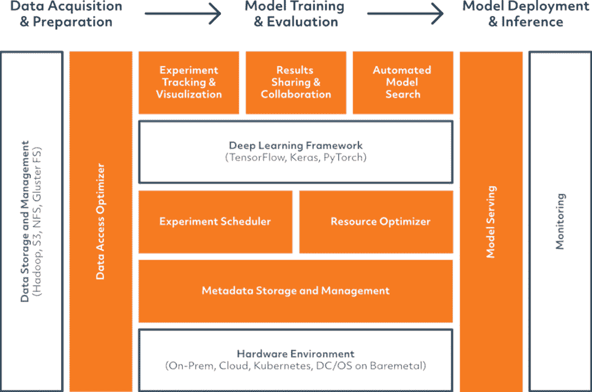

# 坚定的人工智能承诺端到端的流程编排和模型管理

> 原文：<https://thenewstack.io/determined-ai-promises-end-to-end-orchestration-and-model-management/>

就研究和拥有专业知识的组织可以实现的目标而言，[机器学习](https://thenewstack.io/category/machine-learning/)领域继续快速发展，但从主流更容易采用、操作和从中获得价值的意义上来说，它是否正在成熟？

试验数据模型以获得最适合您的数据的迭代过程既耗时又昂贵，因为在 GPU 驱动的基础架构上进行培训需要花费精力和专业知识来设置和操作。创业公司[的创始人决定 AI](https://determined.ai/) 在加州大学伯克利分校 [AMP 实验室](https://amplab.cs.berkeley.edu/)会面，他们在那里为 Apache Spark 进行分布式机器学习，并创建了 [Spark MLlib](https://spark.apache.org/mllib/) 可扩展机器学习库。联合创始人 Evan Sparks 告诉 New Stack，这个想法是为了更容易地创建组织需要的“人工智能原生”基础设施，以推动深度学习开发，这种开发目前是谷歌、苹果、亚马逊和微软等公司的专利。

“他们有超级聪明的技术专家为他们工作；他们雇佣了大批理解机器学习原理的博士。他们在硬件上投入了大量资金:谷歌可能是 NVidia 在数据中心方面的头号客户。然后他们构建了这些令人难以置信的内部软件库和功能作为工具，使内部开发人员能够非常非常好地交付这些解决方案，”Sparks 说。“相比之下，全球财富 2000 强的开发人员必须构建一个端到端的机器学习驱动的应用程序，这就像他们在一起敲打石头来生火。他们手工处理很多这种东西。他们没有很好的集中服务来调度 GPU 或分配培训或其他事情，这些公司的工程师都有。”

即使这些公司开源了更多的内部工具，它们也是为拥有专业知识、资源和基础设施的工程师编写的；他们还会对事情如何完成的假设进行编码，这些假设可能不适合其他组织，甚至会使情况变得复杂。“拿张量流上菜。你会想，‘太好了，我可以将它部署在 web 服务后面的容器中，它应该会给出一些关于我的模型执行情况的合理指标。’然后你挖掘那些实际的指标是什么，它是诸如推理延迟和加载库需要多长时间之类的东西，但没有关于我的机器学习性能的东西，所以这最终是人们自己以一种特别的方式做的事情。"

Sparks 认为，端到端平台可以提供更高的性能和集成的体验。他指出，尽管 Kubeflow 很有用，但它是“一个混杂的工具集合，恰好位于同一个空间，这些工具都是开源的，放在一个发行版中，但在设计时并没有考虑到彼此”。

“这是一个非常新的产品领域，因此有机会为这些不同的组件如何协同工作创建一个整体设计。如果您将调度器的设计与超参数训练服务的设计分开，那么您将在性能方面留下很多问题。我们已经采取了这样的方法，让我们考虑一下每个深度学习工程师需要的公共服务集是什么，让我们在强大的分布式系统上建立这些服务。”

虽然不同领域的业务问题和限制可能会有所不同，但 Sparks 认为数据科学家往往有非常相似的工作流程，这决定了人工智能可以在其工具中进行抽象，从模型训练和模型的迭代开发开始。其中一些依赖于创始团队在超参数优化方面已经完成的工作，这比基本方法快 15 倍，比谷歌内部系统在架构搜索和神经网络调整等常见问题上快 5 倍。

> “如果你试图主动调试一个 TensorFlow 模型，而你必须等待六个小时才能看到你是否遇到了同样的错误，这不是很有效率。”

[确定的人工智能平台](https://determined.ai/product/)还处理调度、利用和资源共享:“你如何以容错的方式在研究人员之间共享你的 GPU，以及他们在哪里可以立即访问这些设备？我们如何实现这些模式的快速培训、再培训和探索？”他估计，使用云 GPU 可能比自己购买和操作 GPU 硬件贵十倍；使用消费级 GPU 的差别甚至更大——“我不建议这样做，但很多人都在这样做。”即使只有两三名数据科学家，静态分配资源也是低效的，尤其是当这是以手动和非正式的方式进行时。

“这导致[组织]严重地未充分利用资源。它引起了一大堆痛苦和斗争:哦，我想用它来运行我的实验。哦，出现了一个高优先级的事情，你能控制你的工作，让我进入集群吗？”
在组织已经从手动调度转移的地方，Sparks 经常看到他们使用为高性能计算(HPC)设计的排队系统，一个接一个地运行长时间的作业，这不适合机器学习模型所需的迭代开发。甚至更现代的通用编排系统，如 Kubernetes 或 Mesos，也不能使用有关机器学习模型的指标来实现更细粒度的调度。

“如果你试图主动调试一个 TensorFlow 模型，而你必须等六个小时才能看到你是否遇到了同样的错误，这不是很有效率。或者是‘这是一个需要一周时间来运行的大型作业，我们将为整个星期保留这些资源，让该作业运行，然后当它完成时，我们将释放它们。’我们能够在更高的粒度上做出调度决策。当作业进入时，我们的调度程序处理其中一些资源的时分复用，它负责容错，它负责在作业运行时轻松添加额外的 GPU，包括云 GPU，并将它们作为额外的资源进行调度。"

分布式培训的资源分配也是自动化和抽象化的。“如果我在数据库中发出一个 SQL 查询，我不会考虑连接发生的顺序，”他指出。“我应该只提交我的模型定义及其架构，数据集和系统应该考虑如何对其进行并行化，并有效地分配资源，以便为这项工作确定合适的规模。”他说，由于机器学习的扩展方式，这是最大化吞吐量和最小化训练延迟的最佳方式。

来源:决心艾

“事实证明，这些工作不只是无限扩大；你不能向他们扔更多的 Xeons 并希望模型训练进行得更快，因为存在通信带宽问题和瓶颈。AlexNet 的正确 GPU 数量不同于与 ResNet 不同的 Inception。现在，开发人员正在通过反复试验来解决这个问题，我们的系统可以为他们提供一系列指导。”

保持管道充满数据也是提高培训效率的关键，但存储 I/O 可能是另一个瓶颈，尤其是对于使用 Hadoop 文件系统(HDFS)或云存储的企业网络。“如今，人们将数据集手动复制到本地 SSD 存储中，就在 GPU 旁边。他们为他们培训的每个项目一次性地这样做，并且他们手动管理。这是一个相当简单的缓存问题，我们可以为他们解决。”

编排和调度作业和资源意味着确定的人工智能系统正在收集大量元数据，从模型指标到开发人员使用的代码版本。斯帕克斯说:“我们将这一点纳入模型开发的记录系统中。

这是当您在模型的不同迭代中移动时，系统的不同部分相互反馈的方式的一部分，从而产生端到端的效率。“你运行的第一个训练任务永远不会是一个实际工作的模型:你在一个深度循环中一次做几个月，这就是超参数调整和架构搜索的用武之地。对于这些服务来说，了解调度程序的工作机制是很重要的:您希望它们了解自己所拥有的底层硬件、预算等等。如果你能让他们意识到资源，你就能获得真正的胜利，而不仅仅是手动进行网格搜索或类似的事情。”

部署，尤其是对资源受限的移动设备的部署，也需要成为系统的一部分。如果您在与培训相同的硬件上部署模型，调度程序可以分配一个 GPU 子集用于推理或批量重新评分。“我训练了上百万个实例，但现在我想获得十亿个实例来重写我的搜索数据库，我想在这方面取得进展，但同时继续在模型开发方面取得进展。”

他说，为移动推理压缩模型实际上是一个复杂的再培训工作流程。“这是关于从一个更花哨的模型到在这些设备上实际工作的东西。”

## 高准确度

“研究人员花了所有的时间来担心我如何让这个东西达到尽可能高的精度？”斯帕克斯指出。ResNet 150 可以提供 98%的准确率。“这看起来很棒，只是后来你会发现它有 1200 多万个参数，甚至需要一个高端的 Nvidia GPU 才能在不到 500 毫秒的时间内做出预测。”对于像 Mythic AI[https://www.mythic-ai.com/technology/]这样的客户来说，这是一个问题，他有一个衬衫纽扣大小的推理加速器，可以在非常低的功率下运行，或者是一个基因测序硬件供应商，他局限于实验室已经部署的硬件。

“他们运行决策树和逻辑回归等工具来决定哪些数据应该保留，哪些应该丢弃，通过在实验室中切换到深度学习，他们在管道的特定部分的错误率降低了 50%，这对他们来说是惊人的。但该模型有 1000 万个参数，他们需要将其减少到 4000 个，以满足他们的内存需求。”

坚定的人工智能将自动化量化、修剪和提取等技术，以减少模型大小。它还提供了一些用于架构搜索的实验工具，以展示压缩模型以适应特定设备的利弊。“你可以描述一下模型架构和你想要运行的硬件:内存占用是这样的，模型延迟是这样的，功耗是这样的。这可以让人们专注于足够小的模型，以满足他们的愿望，我们给出了权衡:如果我让它足够小，以适应这个设备，那么召回率和精确度在哪里？”

在某些场景下，数据科学家不需要改变他们的工作流程来利用确定的人工智能。如果您使用像 Keras 这样的框架，您也许能够通过它的 web UI 向平台提交作业，而不需要修改它们。但是，为了进行分布式训练和使用模型分析，您需要使用轻量级 API 和 REST 端点来指定关于您的模型的一些参数。
未来，该平台将进行更多的存储优化，为训练提供更快的数据访问，为训练模型提供特征编目，潜在的自动模型压缩，以及部署、监控和再训练模型。

“我们还希望向协作和服务的方向发展，”斯帕克斯解释说；“支持更复杂的工作流程，其目标不仅仅是‘训练我一个模型，告诉我它的准确性’,而是整体考虑模型开发流程以及它如何适应业务的其余部分。它是关于将[机器学习开发]从研究洞察力转变为“我需要让它在我的数据中心全天候运行，当我需要重新培训我的模型时，它是对我的业务至关重要的 SLA。”"

来自 Pixabay 的 Gerhard Gellinger 的专题图片。

<svg xmlns:xlink="http://www.w3.org/1999/xlink" viewBox="0 0 68 31" version="1.1"><title>Group</title> <desc>Created with Sketch.</desc></svg>