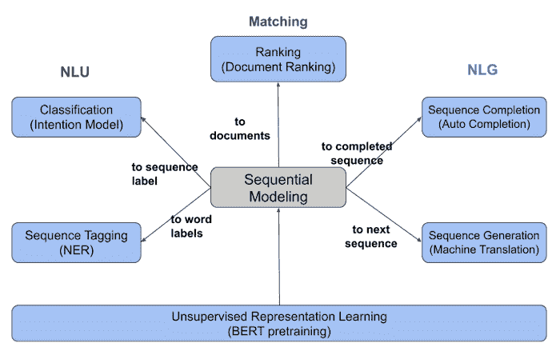
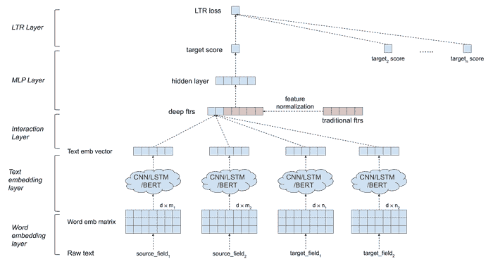

# DeText: LinkedIn 用于自然语言处理的开源深度学习框架

> 原文：<https://thenewstack.io/detext-linkedins-open-source-deep-learning-framework-for-natural-language-processing/>

美国社交网络公司 [LinkedIn](https://www.linkedin.com/) 发布了 [DeText](https://github.com/linkedin/detext) ，这是一个开源的自然语言处理框架，使用深度神经网络来促进搜索和推荐排名、多类分类、查询理解和序列完成等任务。

那么，DeText 为不断增长的机器学习领域增添了什么？正如人们可能想象的那样，让机器理解人类语言并不像最初看起来那么容易——不同的词汇选择和语境都会增加任何特定话语的复杂性。在人工智能领域，[自然语言处理](https://thenewstack.io/recent-advances-deep-learning-natural-language-processing/) (NLP)就是机器用来阅读、理解人类语言并从中推导出意义的东西。众所周知的 NLP 模型包括来自 Transformers 或 BERT 的[双向编码器表示，它允许机器执行机器翻译、语音识别、文本分类等任务。当付诸实践时，这种模型可以从互联网上提取数据进行自动化研究，或者检测虚假信息。](https://towardsdatascience.com/bert-explained-state-of-the-art-language-model-for-nlp-f8b21a9b6270)

不过，根据所使用的人工智能模型，这种任务可能需要相当多的计算能力来执行，这并不奇怪。“DeText 是一个有效利用深度学习模型(如 BERT)来理解文本数据语义的框架，”LinkedIn 高级工程经理[郭炜炜](https://www.linkedin.com/in/weiwei-guo/)通过电子邮件向我们解释道。“它能够执行[词义消歧](http://www.scholarpedia.org/article/Word_sense_disambiguation)并识别类似的单词，如‘软件开发人员’与‘程序员’BERT 模型需要大量的计算时间，因此我们在构建和生产基于 BERT 的 DeText 模型时的重点是简化在商业应用中使用 BERT 的过程。"

## 灵活且可更换

为了解决计算效率低下的问题，DeText 的设计考虑到了灵活性，因此不同的 NLP 模型可以根据不同生产过程的要求按需“交换”。例如，DeText 支持一系列最先进的语义理解模型，如卷积神经网络(CNN)、长短期记忆网络(LSTMs)以及 BERT。

“正是‘可交换性’组件使得 DeText 框架具有广泛的适用性，”郭说。"此外，用户可以方便地搜索最佳的网络结构用于他们的应用."

不同类型的深度自然语言处理任务。

DeText 如何使用神经网络进行排名。

DeText 针对效率进行了优化，因此 DeText 模型可以部署在生产环境中，并且在模块配置方面也提供了高度的灵活性。与 BERT 或其他 NLP 模型相比，这些功能使 DeText 相对更加通用，并且可能更加强大，特别是在微调搜索以及理解特定单词在特定领域中的含义(与相同单词在另一个领域中的含义相反)时。与 BERT 相比，DeText 还提供了一种更有效的方式来对生产环境中的搜索结果进行排名，尤其是在使用预先训练的 BERT 模型的情况下。

“LinkedIn 已经在三个主要应用程序中部署了 DeText 模型:搜索排名、查询意图预测和查询自动完成，”郭解释说。“我们将 DeText 与根据 LinkedIn 数据训练和校准的 BERT 版本一起使用，LiBERT。这是因为 LinkedIn 是一个专业的社交网络，有许多特定领域的关键词。例如，在 DeText 中应用 LiBERT 允许我们将“苹果”的查询与“软件工程师”或“iOS”而不是“水果”相关联。正如你所看到的,“可交换性”使 DeText 成为一个通用的语言理解工具，可以应用于许多不同的任务。此外，用户可以快速尝试所有可能的模型结构，以最大限度地发挥其模型的性能。”

值得注意的是，DeText 是作为开源软件提供的，这意味着其他人可以下载它，并很容易地适应自己的使用。DeText 具有不同的组件，可以通过模板进行修改，如嵌入层、文本编码模型、交互层、特征处理和[多层感知器](https://en.wikipedia.org/wiki/Multilayer_perceptron)(一种前馈[人工神经网络](https://thenewstack.io/playtime-neural-network/))。

郭表示，LinkedIn 希望在未来将 DeText 扩展为一个通用语言理解和生成库，以便它可以执行其他重要的 NLP 任务，如序列标记(预测输入序列中每个单词的标签)、序列生成(从输入序列中创建序列)和无监督表示学习(以便它可以学习语言表示，作为其他深度学习 NLP 任务的基础模型)。

要了解更多，请阅读 LinkedIn 的博客文章，并在 [GitHub](https://github.com/linkedin/detext) 下载 DeText。

图片:由 [Jason Leung](https://unsplash.com/@ninjason?utm_source=unsplash&utm_medium=referral&utm_content=creditCopyText) 通过 Unsplash 拍摄；LinkedIn。

<svg xmlns:xlink="http://www.w3.org/1999/xlink" viewBox="0 0 68 31" version="1.1"><title>Group</title> <desc>Created with Sketch.</desc></svg>