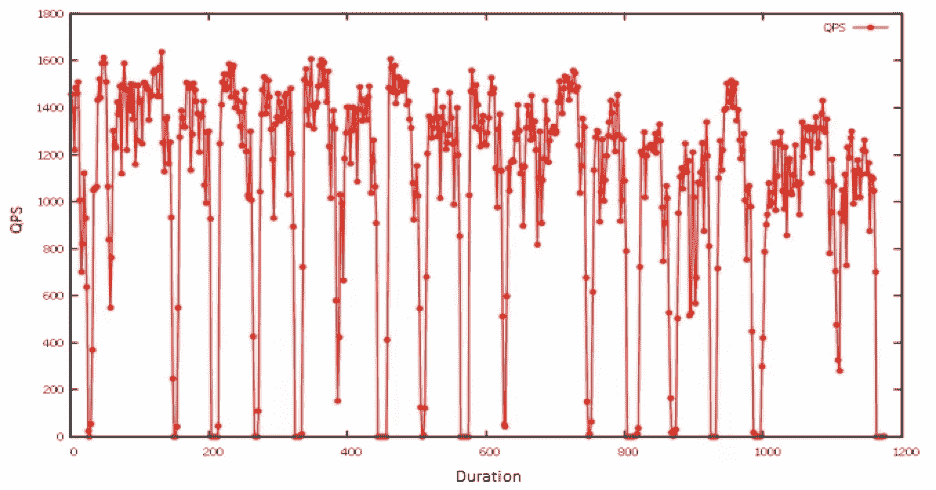
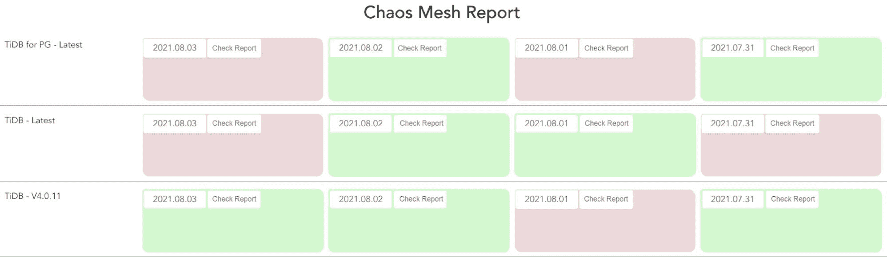
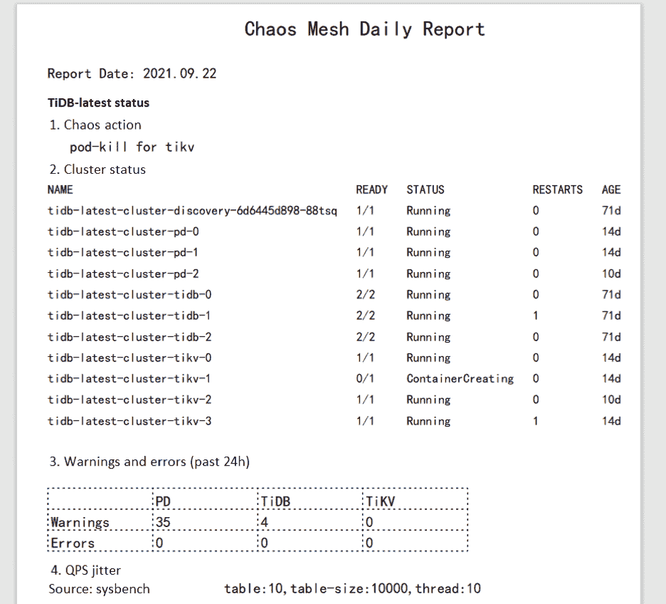

# 为混沌网格开发每日报告系统，以提高系统弹性

> 原文：<https://thenewstack.io/develop-a-daily-reporting-system-for-chaos-mesh-to-improve-system-resilience/>

[](http://www.digitalchina.com/en/)

[李磊是神州数码数据库实验室的高级软件工程师。他热衷于开源、分布式系统和混沌工程。他也是开源项目的积极贡献者，比如 PostgreSQL 的 TiDB。](http://www.digitalchina.com/en/)

[](http://www.digitalchina.com/en/)[](http://www.digitalchina.com/en/)

[Chaos Mesh](https://chaos-mesh.org/) 是一个云原生混沌工程平台，在 [Kubernetes 环境](https://thenewstack.io/category/kubernetes/)上编排混沌实验。它允许您通过模拟网络故障、文件系统故障和 Pod 故障等问题来测试系统的恢复能力。在每次混沌实验之后，您可以通过检查日志来查看测试结果。

但是这种方法既不直接也没有效率。因此，我决定开发一个可以自动分析日志并生成报告的每日报告系统。这样，很容易检查日志并识别问题。

在本文中，我将介绍混沌工程如何帮助我们提高系统的弹性，以及为什么我们需要一个每日报告系统来补充混沌网格。我还会给你一些关于如何建立每日报告系统的见解，以及我在这个过程中遇到的问题和我如何解决它们。

## 什么是混沌网，它如何帮助我们

有了混沌网格，我们可以方便地模拟业务中的极端情况，并测试我们的系统是否完好无损。

在我的公司 [Digital China](http://www.digitalchina.com/en/) ，我们将 Chaos Mesh 与我们的 DevOps 平台相结合，以提供一键式 CI/CD 流程。每次开发人员提交一段代码，就会触发 CI/CD 过程。在这个过程中，系统构建代码，执行单元测试和 SonarQube 质量检查。然后它将图像打包并发布给 Kubernetes。在一天结束时，我们的每日报告系统提取每个项目的最新图像，并对它们执行混沌工程。

模拟不需要任何应用程序代码的改变；混沌网照顾辛苦。它将各种物理节点故障注入到系统中，例如网络延迟、网络丢失和网络复制。它还会注入 Kubernetes 故障，如 Pod 或容器故障。这些错误可能会暴露我们的应用程序代码或系统架构中的漏洞。当漏洞浮出水面时，我们可以在它们对生产造成真正的损害之前修复它们。

然而，发现这些漏洞并不容易:必须仔细阅读和分析日志。这对于应用程序开发人员和 Kubernetes 专家来说都是一项困难的工作。开发人员可能无法很好地与 Kubernetes 合作；另一方面，Kubernetes 专家可能不理解应用程序逻辑。

这就是混沌网格每日报告系统的用武之地。在每天的混沌实验之后，报告系统收集日志，绘制图表，并提供 web 用户界面来分析系统中可能存在的漏洞。

在接下来的小节中，我将解释如何在 Kubernetes 上运行 Chaos Mesh，如何生成每日报告，以及如何为每日报告构建一个 web 应用程序。您还将看到一个系统如何帮助我们生产的例子。

## 在 Kubernetes 上运行混沌网格

Chaos Mesh 是为 Kubernetes 设计的，这也是为什么它可以允许用户针对特定应用向文件系统、Pod 或网络注入故障的重要原因之一。

在早期的文档中，Chaos Mesh 提供了两种在您的机器上快速部署虚拟 Kubernetes 集群的方法: [kind](https://github.com/kubernetes-sigs/kind) 和 [minikube](https://minikube.sigs.k8s.io/docs/start/) 。通常，部署 Kubernetes 集群和安装 Chaos Mesh 只需要一行命令。但是在本地启动 Kubernetes 集群会影响与网络相关的故障类型。

如果您使用提供的脚本通过 kind 部署 Kubernetes 集群，那么所有的 Kubernetes 节点都是虚拟机(VM)。当您将映像脱机时，这增加了难度。为了解决这个问题，您可以在多个物理机器上部署 Kubernetes 集群，每个物理机器充当一个工作节点。为了加快图像提取过程，您可以使用`docker load`命令预先加载所需的图像。除了以上两个问题，你可以按照文档安装 [kubectl](https://kubernetes.io/docs/reference/kubectl/overview/) 和 [Helm](https://helm.sh/) 。

在你安装混沌网格之前，你需要首先创建 CRD 资源:

```
git clone https://github.com/pingcap/chaos-mesh.git
cd chaos-mesh
# Create CRD resources
kubectl apply  -f  manifests/

```

之后，用头盔安装混沌网:

```
# For Helm 2.X
helm install chaos-mesh/chaos-mesh  –name=chaos-mesh  –namespace=chaos-testing
# For Helm 3.X
helm install chaos-mesh chaos-mesh/chaos-mesh  –namespace=chaos-testing

```

要运行一个混沌实验，你必须在 YAML 文件中定义这个实验，并使用`kubectl apply`来启动它。在下面的例子中，我创建了一个混沌实验，使用 [PodChaos](https://chaos-mesh.org/docs/simulate-pod-chaos-on-kubernetes/) 来模拟 Pod 故障:

```
apiVersion:  chaos-mesh.org/v1alpha1
kind:  PodChaos
metadata:
name:  pod-failure-example
namespace:  chaos-testing
spec:
action:  pod-failure
mode:  one
value:  ”
duration:  ’30s’
selector:
namespaces:
–  chaos-demo-1
labelSelectors:
‘app.kubernetes.io/component’:  ‘tikv’
scheduler:
cron:  ‘@every  2m’

```

让我们应用实验:

```
kubectl apply  -f  podfail.yaml

```

### 生成每日报告

出于演示的目的，在这篇文章中，我在一个开源的分布式 SQL 数据库 [TiDB](https://github.com/pingcap/tidb) 上运行了所有的混沌实验。要生成每日报告，您需要收集日志、过滤错误和警告、绘制图表，然后输出 PDF。

### 收集日志

通常，当您在 TiDB 集群上运行混沌实验时，会返回许多错误。要收集这些错误日志，运行`kubectl logs`命令:

```
kubectl logs  &lt;podname&gt;  -n  tidb-test  –since=24h  &gt;&gt;  tidb.log

```

在`tidb-test`名称空间中的特定 Pod 在过去 24 小时内生成的所有日志都保存到`tidb.log`文件中。

### 过滤错误和警告

在这一步中，您必须从日志中过滤错误消息和警告消息。有两种选择:

*   使用文本处理工具，如 awk。这需要熟练理解 Linux/Unix 命令。
*   写个剧本。如果您不熟悉 Linux/Unix 命令，这是更好的选择。

提取的错误和警告消息将用于下一步的进一步分析。

### 画一幅图

对于绘图，我推荐使用 Linux 命令行绘图工具 [gnuplot](http://www.gnuplot.info/) 。在下面的示例中，我导入了压力测试结果，并创建了一个折线图来显示当一个特定的 Pod 不可用时，每秒查询数(QPS)是如何受到影响的。由于混沌实验是周期性进行的，QPS 的数量呈现出一种模式:它会突然下降，然后迅速恢复正常。



QPS 线图

### 生成 PDF 格式的报告

目前，还没有可用的 API 来生成混沌网格报告或分析结果。我的建议是生成 PDF 格式的报告，这样它就可以在不同的浏览器上阅读。在我的例子中，我使用了 [gopdf](https://github.com/signintech/gopdf) ，这是一个支持库，允许用户创建 pdf 文件。它还允许您插入图像或绘制表格，这满足了混沌工程报告的需要。

最后一步是每天在预定的时间运行整个系统。我的选择是 [crond](https://www.linux.org/docs/man8/cron.html) ，这是一个在后台执行 cron 作业的命令行实用程序，用于在每天清晨执行命令。所以，当我开始工作时，有一份每日报告在等着我。

### 构建用于每日报告的 Web 应用程序

但我想让报告更具可读性和可及性。如果您可以在 web 应用程序上检查报告，不是更好吗？起初，我想添加一个后端 API 和一个数据库来存储所有报告数据。这听起来可行，但可能工作量太大，因为我只想知道哪个报告需要进一步的故障诊断。确切的信息显示在文件名中，例如 report-2021-07-09-bad.pdf。因此，报告系统的工作量和复杂性大大降低。

尽管如此，仍有必要改进后端界面，并丰富报告内容。但是现在，一个日常可行的报告系统就足够了。

在我的例子中，我使用了 [Vue.js](https://github.com/vuejs/vue) 来搭建使用 UI 库 [antd](https://www.antdv.com/docs/vue/introduce/) 的 web 应用程序。之后，我通过将自动生成的报告保存到静态资源文件夹`static`来更新页面内容。这允许 web 应用程序读取静态报告，然后将它们呈现给前端页面。详情请查看 vue-cli 3 中的[使用 antd。](https://www.antdv.com/docs/vue/use-with-vue-cli/)

下面是我为每日报告开发的一个 web 应用程序的例子。红牌表示我应该检查测试报告，因为运行混沌实验后会抛出异常。



用于每日报告的 Web 应用程序

单击卡片将打开报告，如下所示。我用 [pdf.js](https://github.com/mozilla/pdf.js) 来渲染 pdf。



PDF 格式的每日报告

## 摘要

混沌网格每日报告系统已经在我们公司运行了四个月。幸运的是，该系统帮助我们在极端情况下发现了多个项目的缺陷。例如，有一次我们将网络重复和网络丢失故障注入到一个应用程序中，并将重复和包丢失率设置为较高的级别。因此，应用程序在消息解析和请求分派期间遇到了意外情况。返回了一个致命错误，程序异常退出。在每日报告的帮助下，我们很快获得了特定错误的绘图和日志。我们使用该信息轻松定位异常的原因，并修复了系统漏洞。

Chaos Mesh 使您能够模拟大多数云本机应用程序可能会遇到的故障。在本文中，我创建了一个 PodChaos 实验，观察到当 Pod 不可用时，TiDB 集群中的 QPS 会受到影响。在分析日志之后，我可以增强系统的健壮性和高可用性。我构建了一个 web 应用程序来为故障排除和调试生成每日报告。您还可以自定义报告以满足自己的要求。

<svg xmlns:xlink="http://www.w3.org/1999/xlink" viewBox="0 0 68 31" version="1.1"><title>Group</title> <desc>Created with Sketch.</desc></svg>