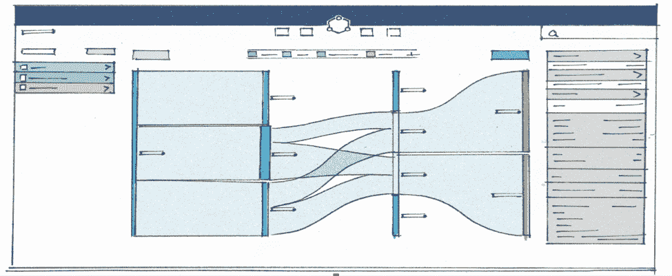
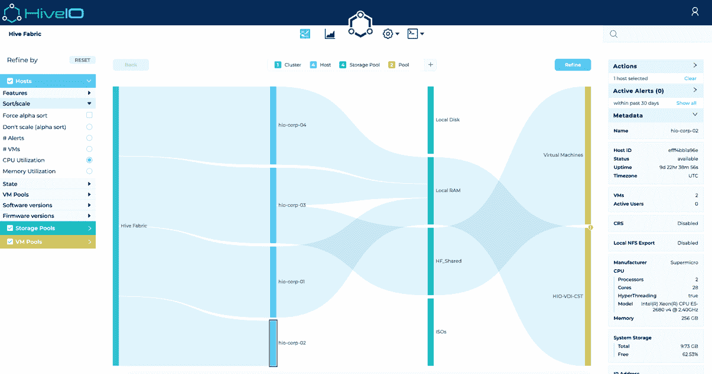
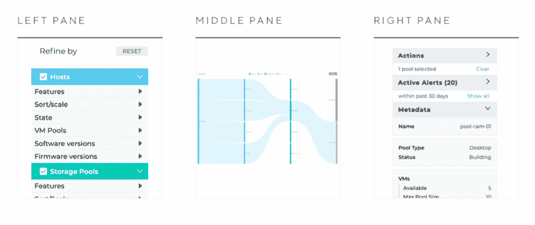

# 开发前瞻性的界面来简化用户体验

> 原文：<https://thenewstack.io/develop-a-forward-thinking-interface-to-streamline-the-user-experience/>

 [托比·柯勒律治，HiveIO 的产品副总裁

托比·柯勒律治是一名技术高管和产品负责人，在构建行业领先的云和虚拟化产品方面拥有超过 15 年的经验。他在全球组织和创业公司都有丰富的经验。他目前是 HiveIO 的产品副总裁。](https://www.hiveio.com/why-hiveio/) 

企业软件平台并不以其最终用户体验而闻名。管理员经常被埋在数百个令人费解的屏幕、选项和菜单中，使得日常管理看起来不可能。其中一个原因是用户界面(UI)通常是平台的最后一部分。由于紧张的发布时间表，一个产品的 UI 组件经常被一个小团队拼凑在一起，以满足快速接近的安装截止日期。

为了打破复杂技术具有有问题的用户界面的循环，软件定义的存储解决方案提供商 HiveIO 与企业开发和用户体验设计咨询公司 CoNarrative 合作，开发了一种可以在两个屏幕中管理整个数据中心的界面。这个快速的概述介绍了激发新 UI 想法的挑战；帮助它实现的技术要求；以及整体的设计和产品化过程。

## 挑战

在更新的 UI 作为 Hive Fabric 7.2 软件更新的一部分引入之前，平台的管理是在逐个主机的基础上进行的，提供了对环境如何运行的有限的跨集群可见性。查找信息很容易，但是很难了解一台主机如何与另一台主机相关联，或者一台主机上的资源利用率如何与群集中的其他主机相关联。

在过去的三年中，随着 Hive Fabric 技术的发展，工具和控制台的数量有机地扩展，以满足客户需求，解决问题，并提供更多的信息和见解。然而，没有保持这些一致性的设计疏忽。随着时间的推移，多个仪表盘、登录和工具变得难以管理和理解。

## 设计和产品化过程

丰富的可视化通常始于仪表板上的搜索结果。在早期设计和原型阶段，HiveIO 决定使用可视化作为 UI 核心来显示整个数据中心，使管理员能够与主机、虚拟机和用户即时交互。在这样一个动态系统中，这是一个明确的方向，并且在整个原型开发阶段以及最终的 Hive Fabric 7.2 版本中都是最佳解决方案。

脱离表格和传统的 UI 构造最初是一个挑战，但 SanKey 图的概念因其灵活性和可扩展性，以及显示大量数据的能力和最重要的洞察力的深度而被接受，这是迄今为止大多数企业应用程序所不具备的。

提供从 30，000 英尺的高度管理整个数据中心的能力，直到虚拟机内运行的单个应用程序的粒度细节，对于减少管理员在日常任务上花费的时间至关重要。这种自动可见性还允许管理员做出数据驱动的智能决策，从而深入了解数据中心优化。

例如，在这里我们可以看到底部的主机(突出显示)处于空闲状态，没有虚拟机在其上运行。这种可见性允许查看者定位可以重新分配的空闲资源，或者可能指向更严重的问题，例如硬件问题。

除此之外，我们还向一些领先的面向消费者的产品创新者学习，如谷歌、苹果和亚马逊。Hive Fabric 非常适合这种搜索功能，它有一个结构化的文档系统，用于存储有关运行系统的配置和元数据，所有这些都可以通过消息总线实时获得。该应用巧妙地引入了上下文搜索，使管理员能够立即搜索任何基础架构组件、虚拟机或终端用户。

除了用于显示面向一次性设置的应用程序的配置项目或区域的磁贴之外，还使用了各种其他组件来使该应用程序非常用户友好，例如用于以上下文敏感的方式捕获配置和部署新桌面池的表单和向导。总的来说，为了保持一致性并允许应用程序在未来扩展，整个应用程序中使用的控件有限。

在新的 UI 中使用了一小组模式，以使其易于获取和使用。一致性是确保良好的最终用户体验的关键，它通过 UI 将信息放在一致的位置，并使将来在应用程序架构确定后添加功能变得简单。这些模式包括:

*   左边的**窗格**用于控制，要么细化可视化工具，要么向用户显示他们在向导或表单中的位置。
*   **中间窗格**显示可视化工具、仪表板或用于配置或部署的表单的主要内容。
*   **右侧窗格**关注警报和信息，一旦在可视化工具中选择了某个对象或在仪表板中深入查看了某个对象，就可以对所选对象执行操作，或者通过元数据查看更详细的信息。

## 技术和架构

用户友好的用户界面不仅仅是视觉上吸引人和有思想的设计。从技术角度来看，为了开发新的 UI，使用的主要编程范例是功能性的、反应性的和声明性的。

Hive Fabric 的 UI 主要是用 CoNarrative 的内部 Javascript 库“framework-x”构建的，这是 React 的一个前端状态管理框架。它的灵感来自 Clojurescript 的 re-frame，是在吸取了用 Redux、MobX 和其他工具构建应用程序的经验教训后设计的。

所有应用程序数据都由一个单一的、不可变的状态原子维护。视图可以访问一个全局的、可导入的“dispatch”函数，它可以用一个事件类型和一个可选的有效负载来调用这个函数。每个事件的处理程序都在 framework-x 中注册，并在其事件消息被调度时被调用。所有处理程序都从调用者那里接收全局状态对象和可选的有效负载。处理程序可以从它们希望的全局应用程序状态的任何部分读取，并且可以返回新的全局状态值。重要的是，效果处理程序可以调度其他事件。

视图可用的所有应用程序状态都是从全局“db”对象中读取的。通常，在客户端状态的存储方式和视图需要它的方式之间有许多转换。Framework-x 通过避免从状态对象派生值，允许更强的反应式编程能力。相反，对函数的订阅被附加到每个组件上。这一点的好处不能低估。当来自 Hive Fabric 的实时数据发生变化时，客户机在一个地方更新状态原子，而不进行任何转换。从那里，如果他们关心的数据的一部分不同，则为视图导出值的功能管道将重新计算。

## 最后的想法

替换现有的 UI 有时甚至比从头开始设计还要复杂。人们习惯了当前 UI 的工作方式。对于它不能做的动作，他们有变通办法。当他们了解系统如何运作时，他们会妥协。一段时间后，他们熟悉周围的路，感觉很舒服。最后，他们陷入“这可以工作”或“这已经足够好了，我们现在不需要改变它”的思维定势中当开始构建新的 UI 时，从尽可能多的不同来源收集尽可能多的信息是很重要的。包括客户反馈；内部团队反馈；研究新技术；和用户专业知识。

HiveIO 和 CoNarrative 之间的合作非常成功，提供了一种在两个屏幕中管理数据中心的新方法，并为未来用户体验和 UI 设计的更多创新奠定了基础。有兴趣了解最终产品背后的技术组件的人，请访问[www.hiveio.com](http://www.hiveio.com)。

通过 Pixabay 的特征图像。

<svg xmlns:xlink="http://www.w3.org/1999/xlink" viewBox="0 0 68 31" version="1.1"><title>Group</title> <desc>Created with Sketch.</desc></svg>