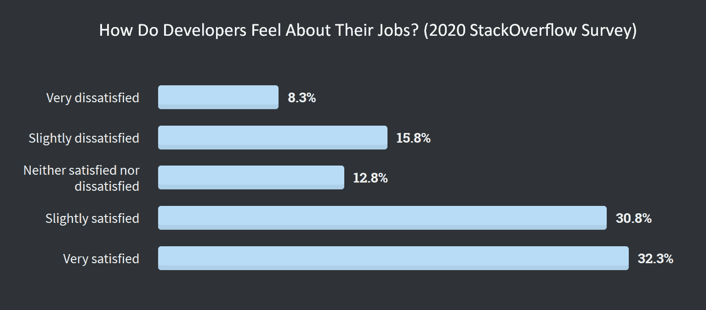

# 开发商不满倍增

> 原文：<https://thenewstack.io/developer-dissatisfaction-doubles/>

根据 StackOverflow 的 [2020 年调查](https://insights.stackoverflow.com/survey/2020)，开发人员的工作不满意度增加了一倍多，从 2019 年的 10.6%至少轻微不满意到最新结果的 24.1%。由于调查是在疫情危机全面爆发之前的 2 月份进行的，开发商的不满情绪现在可能更高了。

这个隐藏的数据块可能是开发人员不满的早期警告。如果是的话，那就记住是什么让开发者开心。薪酬、地点和福利仍然很重要，但除了这些因素，语言、框架和其他将使用的技术是选择新工作时最常被引用的重要因素(51.3%)。女性认为这是一个因素的可能性要低十个百分点。

通常在[开源社区](https://thenewstack.io/non-contributing-developers-expect-companies-to-support-open-source/)中，使用开源和学习新技能的能力体现在 72%的开发人员每年至少学习一门新技术或语言。开发人员反复选择学习一种语言而不是另一种语言，并希望找到评估这一决定的方法。

在这种背景下，关于编程语言流行的解释很快就引起了争议。就像前几年一样，许多人曲解了 StackOverflow 调查中最喜欢、最害怕和最想要的图表。结果基于两个简单的问题:去年使用了哪些语言和技术，以及开发人员希望在来年使用哪些语言和技术。近年来，增加了关于数据库、框架和平台的额外问题。实际采用率变化缓慢。例如，TypeScript 在专业开发人员中的上升，从 2019 年的 25.8%上升到 2020 年的 28.3%，可以认为是一个很大的跳跃。正如我们之前写的那样，离开传统技术的希望通常只是白日梦。如果所有调查对象的愿望都成真，使用 Java 的开发人员将从 2020 年的 38.4%下降到 2021 年的 22.4%。这是不可能的。

几周前，我们就开发者调查的局限性采访了微软首席 Java 产品经理 Bruno Borges。他认为使用运行时的工作负载所利用的容量可以用来衡量语言的重要性。他推测，基于用来运行 JVM(运行 Kotlin、Scala 和许多其他 Java 排列)工作负载的 CPU、内存和存储，语言的流行程度会有所不同。

在一个完美的世界中，你如何衡量编程语言和平台的采用水平？

## 更多推特分析

通过 Pixabay 的特征图像。

<svg xmlns:xlink="http://www.w3.org/1999/xlink" viewBox="0 0 68 31" version="1.1"><title>Group</title> <desc>Created with Sketch.</desc></svg>