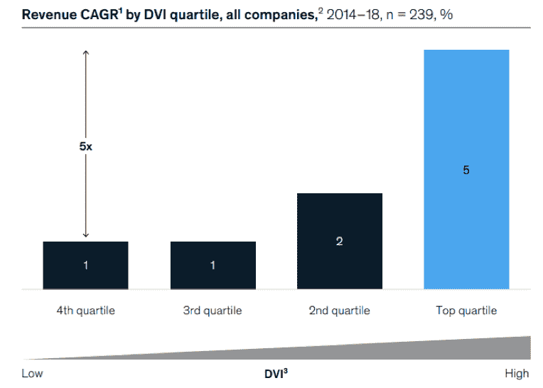
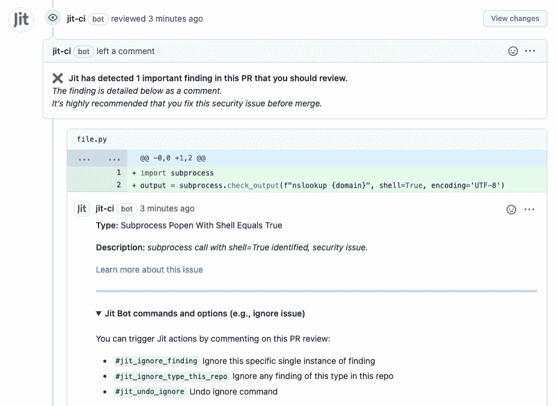

# 开发人员拥有的高速安全性

> 原文：<https://thenewstack.io/developer-owned-security-at-high-velocity/>

许多云托管提供商可能承诺快速交付优秀的产品，加上内置的安全性，但这可能吗？

随着各行各业的数字化转型工作全面展开，很容易看到有针对性的或创新的基于初创公司的软件产品如何创造竞争优势。

但不仅仅是产品本身。公司运送有价值产品的速度对其业务结果有着直接的影响，这种影响在今天比以往任何时候都更大。

开发速度是公司交付优秀软件的速度。

假设所有其他的编码要素是相同的——例如，代码影响和质量——更高的速度是软件交付的主要目标。它建立在更快地向客户交付有影响力的产品并产生高商业价值的基本前提之上。

来自麦肯锡&公司的研究显示，前 25%的高速公司的收入增长率比其他公司高 4-5 倍，创新率高 55%。

资料来源:麦肯锡公司基于 Capital IQ 的数据；开发者速度调查

## 云原生组织如何追逐高流速？

麦肯锡的调查确定，开发者速度涉及 13 个不同维度的不少于 46 个驱动因素。这些驱动因素中只有一小部分与开发人员的才能和组织内的发展直接相关。相反，这些驱动因素中的大部分与敏捷、DevOps、CI/CD、一切作为代码以及尽可能利用开源软件(OSS)有关——这是现代开发公司而不是个人开发者的最佳实践。

一个很好的参考是 Nicole Forsgren、Jez Humble 和 Gene Kim 的书“ [Accelerate](https://itrevolution.com/book/accelerate/) ”,该书展示了良好的工程实践如何对软件质量和速度产生直接影响——在完善的和经过研究的 DORA 度量中进行了量化。

[DevOps](https://thenewstack.io/category/devops/) 本质上是通过增加部署频率和降低变更失败率来缩短交付周期和平均恢复时间的推动者。它们都是更好的自动化流程的副产品，从基础架构到部署后的一切都以代码的形式交付，安全性也为这样的转变做好了准备。

## 有一个缺口…

 [大卫·梅拉梅德

David Melamed 目前是面向开发者的持续安全平台 Jit 的首席技术官和联合创始人，他拥有生物信息学博士学位，在过去的 20 年里一直是一名全栈开发者、首席技术官和技术传道者，主要从事云计算领域的工作。](https://www.linkedin.com/in/mlmd/) 

如今，应用程序安全性正在不断发展，以满足 DevOps 的速度需求和现代软件程序日益增长的复杂性。DevOps 原则和实践正被应用到安全架构和流程中，许多新兴工具正在寻求解决 AppSec 挑战的不同方面。 [DevSecOps 设计模式](https://medium.com/taptuit/shifting-left-devsecops-as-an-approach-to-building-secure-products-3a418fbbafbe)是将安全性左移并将其烘焙到可重复 DevOps 管道中的一个例子。然而，也就是说，“应用程序安全性”大多仅指“代码安全性”，因此只能解决“技术堆栈”的一部分和问题的一部分。

但是，通常这还不够，而且[左移](https://thenewstack.io/the-great-security-shift-to-the-left/)的方法并不能解决产品安全问题。事实上，在许多情况下，“左移”会将许多不好的东西转移给开发人员。

这有几个原因，首先，正如大家在整个软件供应链中看到的那样，今天有更多的攻击面——从您自己的代码到您的应用程序在生产中正常运行所需的所有集成包和第三方。现代应用程序开发正在推动“一切都是代码”

这种方法需要对基础设施、应用软件和数据层进行多层次的安全测试，以防范各种可能的攻击。我们不再只关注应用程序安全性本身，而是关注其他基础设施和服务的配置，它们可能会通过代码成为攻击目标。如果受到损害，这可能会对下游产生重大影响。除此之外，它还伴随着不断变化的威胁形势，每天都有新的发现、CVE 和漏洞被发现。

把所有的东西都向左移动意味着没有空间了。开发周期如此之短，而要处理的事情又如此之多，以至于使用今天的左移工具，您几乎不能触及表面，并且对于大多数资源不丰富的团队来说，实现连续的和最小可行的产品安全性是不可行的。有人说创业吗？

为了使高速开发不以牺牲安全性为代价，安全性不能部分由开发人员管理，而是需要由他们自己拥有。这从第一行代码开始——它必须是“左生”的，而不仅仅是“左移”的。然而，开发人员已经承担了测试、部署和操作的任务，他们如何还能处理安全性并保持速度呢？“民主化”这种能力必须从根本上改变对产品安全性的看法开始。

## 您如何既实现开发人员拥有的安全性，又保持速度？

开始这一旅程需要一种开发本地的但也是开发友好的方法，具有以下特定的组件来帮助增加成功、接受和可重复过程的可能性。

### 最低可行安全性—请自动化

看一看[最低可行安全](https://openviewpartners.com/blog/what-is-minimum-viable-security-mvs/)。MVS 包括:

*   一个定制的、不断更新的、最低可行的安全计划，涵盖威胁形势和产品保护所需的基本安全。与文档或电子表格不同，这个计划需要“在代码中”，并像代码库中的其他代码一样进行管理。
*   嵌入 CI/CD 管道的代码安全自动化流程编排，具有降噪功能。
*   和可操作的结果——只有相关和重要的结果(而不是淹没开发人员的成千上万个威胁的清单),以及上下文中的本地开发环境缓解。

### 开源安全工具

一般来说，尽可能坚持使用开源安全工具来帮助构建您的流程是很好的。它们不仅经常得到更好的维护，而且可以根据您自己的要求进行定制。寻找与您当前的 DevOps 工具和堆栈完美集成的选项。尽管如此，考虑到开源集成并不是没有努力的——您可能也想在这里搜索自动化。(正如一句古老的谚语所说，“如果你的时间毫无价值，Linux 就是免费的。”)

### 开发本地安全环境

要减少认知负荷、上下文切换和知识缺口，需要朝着实现固有安全性发展的方向前进。我们如何做到这一点？通过嵌入工具、配置、测试、通知，以及在开发环境本身中解决安全问题的机会。如果我们要称自己为天生的左派，那么它就需要在开发环境中如此自然，天衣无缝。大多数开发人员不是安全专家，他们需要专注于编码——所以我们需要使安全任务尽可能地对开发人员友好和无摩擦。

## 开发团队中谁是安全冠军？

当团队中的某个人是开发人员，但同时又非常了解安全性时(或者你足够幸运，拥有 DevOps 或 DevSecOps 作为你的工程组织的一部分)，所有这些都更容易实现。你需要一个精通的倡导者来构建和迭代一个天生的安全过程。

## 判决结果？

能否快速交付安全的应用程序？是的，他们可以。

当然，我们必须尽可能地自动化，并为不同类型的项目创建不同的安全策略，以实现真正的最低可行安全，因为正如 Redmonk 所言，“ [DevEx 是安全](https://redmonk.com/rstephens/2022/02/17/devex-is-security/)”。但是平衡开发人员拥有的安全性和产品交付速度的真正挑战是彻底检查安全性过程，以便它们遵循与现在 CI/CD 中的标准类似的设计模式和工具。有了这些知识和您的安全卫士，您就可以从底层开始体验安全了。

<svg xmlns:xlink="http://www.w3.org/1999/xlink" viewBox="0 0 68 31" version="1.1"><title>Group</title> <desc>Created with Sketch.</desc></svg>