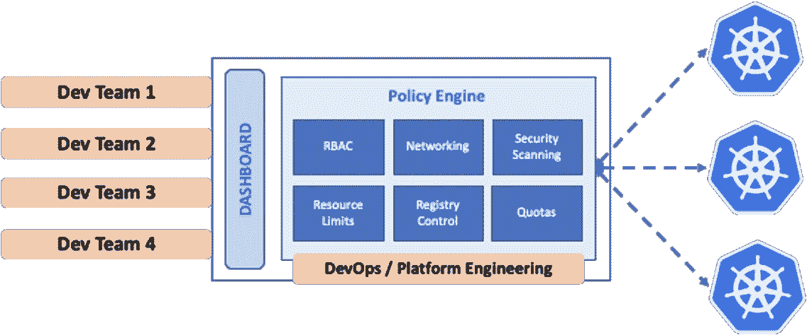

# 开发者平台:Kubernetes 头痛的冰袋

> 原文：<https://thenewstack.io/developer-platforms-the-ice-pack-for-kubernetes-headaches/>

 [布鲁诺安德拉德

布鲁诺是 Kubernetes 开发者平台 Shipa 的 CEO。Bruno 曾在 Juniper Networks、HTBASE、Oracle 和 IBM 担任软件工程职务。](https://www.linkedin.com/in/bruno-a-a369028/) 

大多数转向 Kubernetes 的组织都满怀信心地进入 it 领域。他们认为这是一个经过验证的普遍选择——云本地现代化背后的引擎——并乐观地继续前进。从工程的角度来看，Kubernetes 也是一个完整的平台，具有通用(好的方面)设计，可以处理企业可能需要的任何用例。毕竟，如果每个人都在使用它，工作起来会有多困难呢？

收养 Kubernetes 就像收养一只宠物大象。它需要大量的照料和喂养，而且它越大，吃得就越多。

开发人员兴奋于拥有更现代的应用程序开发能力，而不是发现他们的生产力和整体体验受到无尽的所需 YAML 文件和维护 Kubernetes 细节的影响，尽管这很重要。为了应对开发人员面临的繁重的复杂性，组织越来越多地寻求开发人员平台，旨在抽象出 Kubernetes 的挑战和时间消耗，以改善开发人员体验，回收 YAML 文件等损失的生产力，并加速微服务的大规模采用。

## Kubernetes 阻碍了开发人员的生产力

新的 Kubernetes 采用者对他们的新部署有一个共同的愿景:运营和基础设施团队将全面运营 Kubernetes 集群，而开发人员将使用这些集群轻松运行他们的服务和 pods。然而，这个乌托邦可能与现实相去甚远。

实际上，没有多少 Kubernetes 专业知识的开发人员需要与该技术的许多具有挑战性的界面和细微差别搏斗。增加开发人员的负担降低了生产力，同时增加了压力和挫折感。不用说，迫使开发人员脱离他们的元素，远离应用程序和特性开发根本不是组织在选择 Kubernetes 时所想的。但这是一种普遍存在的副作用，应该列在盒子上。

将开发人员放在创新和做他们最擅长的事情的位置上，对组织有巨大的好处。麻省理工学院的分析发现，当普通工程师能够专注于创新和维护活动时，他们可以为他们的组织增加平均 854，000 美元的市场价值。然而，让同一个工程师只承担非创新性的任务会使其市值缩水近 60 万美元。

不那么可怕:组织正坐拥着提高生产力的巨大机会。在 Stripe 进行的[全球软件工程效率调查中，开发者对其工程团队的生产力进行了 0-100%的评级，平均评级为 68.4%。调查清楚地表明，各行各业的组织都有很大的生产力增长潜力。](https://stripe.com/files/reports/the-developer-coefficient.pdf)

## 开发者平台释放生产力增益

像我们在 [Shipa](http://shipa.io) 建立的开发人员平台允许组织将开发人员从处理他们实际上不需要处理的基础设施挑战中解放出来，同时也简化了开发运维团队的运营。这些平台为自助式 API、工具和服务以及自动化提供了基础，以支持各种云原生部署、监控和持续应用管理方法。通过这样做，组织可以采用开发人员平台来提高开发人员的工作效率和体验。由于开发人员的成本很高，而且通常很难获得，留住人才是一个不小的问题。它们可以降低 Kubernetes 的复杂性，同时还能充分利用其优势。一个开发者平台要取得成功，它必须能够接入 Kubernetes 基础设施，并允许 DevOps 按照所有合规性要求可靠、可预测和安全地运行平台。

图 1:开发者平台如何提高清晰度和生产率

以一个典型的开发团队为例，该团队正在承受 Kubernetes 相关的责任。作为一项持续的实践，团队必须为其维护的每个开发、QA 和生产环境中的每个服务创建和管理 YAML 文件。如果实现得当，开发人员平台可以让同一个团队节省无数的工作时间。开发人员可以专注于运送和运行代码，将支持他们的服务和应用程序的 Kubernetes 集群视为理所当然。

## 您采用开发人员平台的第一步

要开始利用开发者平台，首先要和你的开发团队坐下来，了解他们当前构建、部署、管理和支持大规模应用的方法。然后，计划开发人员平台将如何推动和加速这些过程，并解决当前实践中任何缺失的元素或痛点。在新的开发人员平台模型中清晰地划分职责至关重要，这样开发人员、开发人员和任何其他相关团队都可以清楚地了解他们的目的。这也将有助于推动在组织内倡导开发人员平台。错误的期望和不明确的责任会造成团队间的摩擦；定义明确的职责是成功采用开发者平台的关键因素。

对于与 Kubernetes 合作的开发和运营团队来说，实施开发人员平台提供了巨大的机会来提高生产力，同时引入更明确和有效的实践、控制和治理。当 Kubernetes 本身成为一种事后想法时，开发人员尤其会欣赏他们将获得的体验改善的质量。

<svg xmlns:xlink="http://www.w3.org/1999/xlink" viewBox="0 0 68 31" version="1.1"><title>Group</title> <desc>Created with Sketch.</desc></svg>