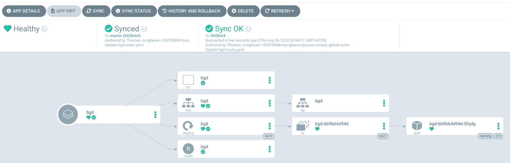
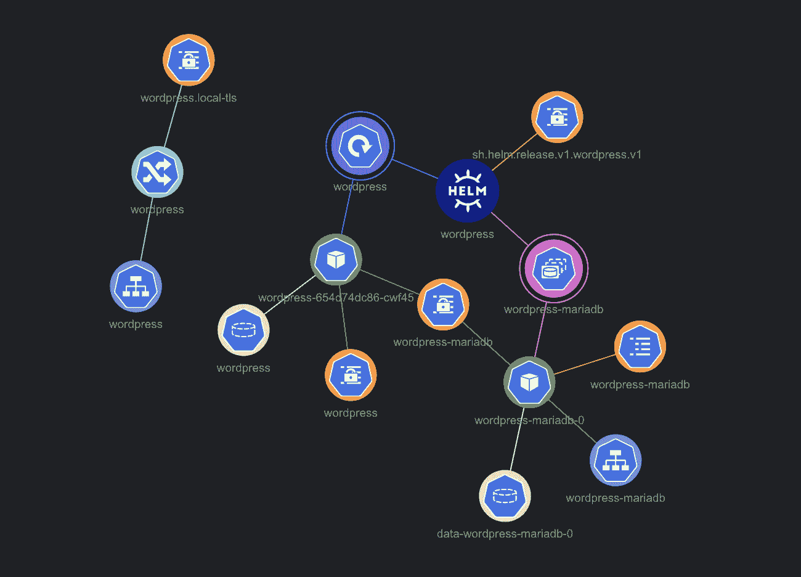
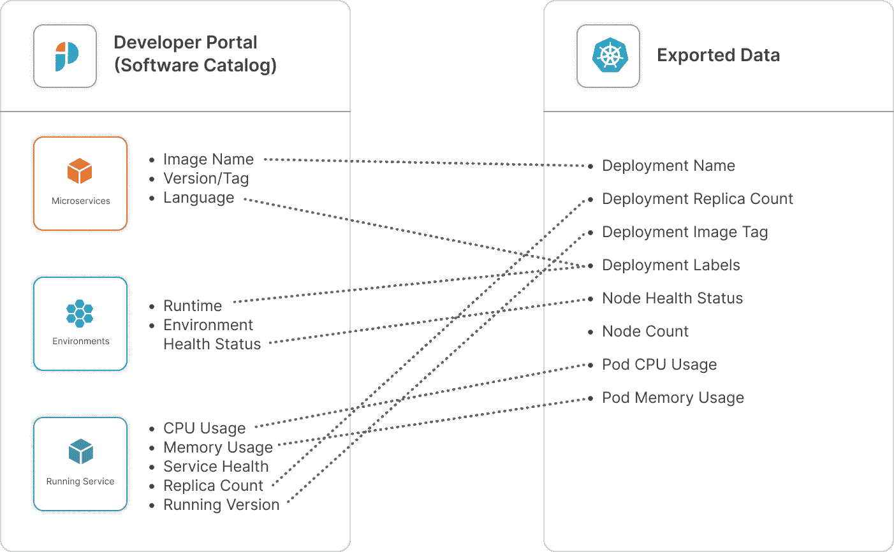
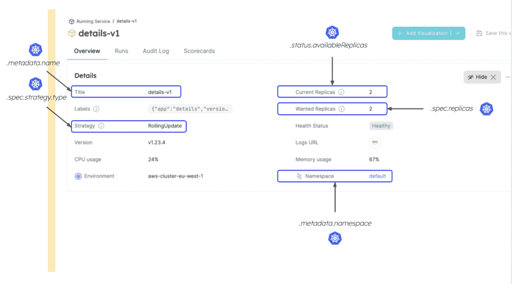
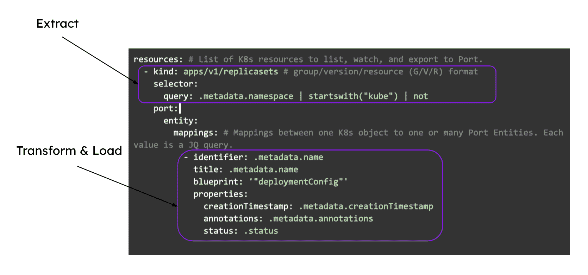

# 开发者门户可以抽象出 Kubernetes 的复杂性

> 原文：<https://thenewstack.io/developer-portals-can-abstract-away-kubernetes-complexity/>

开发人员和 Kubernetes 专业人员说的不是同一种语言。Kubernetes 是关于集群、节点、控制平面、pod、版本和名称空间的。当开发人员说“部署”时，他们不是指管理一个 pod 的一组副本的期望状态的 Kubernetes 对象。但是 Kubernetes DevOps 的专业人士可能认为他们就是这个意思。DevOps 工程师可能将“部署”解释为“运行 pod”，而开发人员将意味着在 CI 管道中运行部署。我们能避免这种巴别塔动态吗？

的确，开发人员必须对 Kubernetes 的概念有一个基本的了解，比如 pod、服务、部署和副本集。他们应该熟悉 Kubernetes API，并且能够使用命令行工具(比如 kubectl)与集群进行交互。但这是有限度的。你不可能什么都是专家，在认知负荷方面是要付出代价的。

我们如何帮助开发人员整理大量的 Kubernetes 数据，以了解他们的应用程序版本、状态、副本数量和负载？

## 不简单:常见的 K8s 可视性解决方案

Kubernetes 的原生 CD 解决方案，如 Argo CD 或 Flux CD，或者像 Lens 或 Rancher 这样的工具是否为开发人员提供了一定程度的 Kubernetes 可见性？

没那么简单。在大多数情况下，大量的 Kubernetes 元数据被转储到内部，结果给开发人员带来了大量不必要的信息。此外，这些工具通常呈现关于单个集群的数据，并且需要一些工作来显示多集群数据并在之后维护这些视图。

这里有一个 Argo CD 示例:

虽然这个图表提供了很好的可视性，但它可能非常吓人，很难一眼就看懂。在图中所有不同的节点中，什么代表我正在运行的实际应用程序代码？作为一名开发人员，我无法控制 K8s 提供的额外基础设施，如何区分我的代码和这些基础设施呢？我的某个微服务出了问题，有什么好的指标？

这个视图不能被编辑或过滤，这使得开发人员很难理解这个图并有效地回答上面列出的问题。

另一个选择是使用特定于 Kubernetes 的工具，如 Lens、K9S 或 Rancher。这些工具为管理 Kubernetes 集群提供了一个更加简化和用户友好的界面。这些工具确实比默认的 kubectl CLI 提供了更好的终端体验。然而，它们仍然需要一些关于 Kubernetes 的知识和经验才能被完全使用，这使得它们对于第一次接触 K8s 的开发人员来说太复杂了。

镜头示例

这不应该是一个惊喜。这些工具是为 DevOps 打造的。它们是为 DevOps 基础设施关系而设计的，而不是为 DevOps 开发者对话而设计的，更不用说开发者所有权了。

## 使用内部开发人员门户克服 K8s 复杂性

你可能听说过平台工程、内部开发者门户或者两者都有。

平台工程通过自动化基础架构运营实现可重用和自助服务功能。它优化了开发人员的体验，提高了开发人员的工作效率。它还将开发运维从票证运营转移到为应用交付构建更好平台的能力。

平台工程方法的核心是内部开发人员门户。内部开发人员门户是开发人员通过类似产品的界面来消费平台团队构建的自助服务操作的地方。

在开发人员门户中，软件目录对于它给组织带来的价值非常重要。这是 K8s 数据可以为开发者转储、抽象和可视化的地方。

可以考虑将 K8s 数据显示在软件目录中，作为“白名单”列出开发人员需要的数据，同时仍然允许更多的 K8s 数据保留在内部，供其他类型的用户使用。这些额外的数据很有价值，因为 DevOps 也需要软件目录。

开发人员门户可以包含您发送给它的任何和所有数据，如果没有正确地抽象、修改和显示给消费者-开发人员，这些数据可能会太多。巧合的是，一个高质量的开发人员门户为您提供了准确的工具来实现适合开发人员的正确抽象，给定他们的角色、经验和组织。

但是等等！K8s 数据如何填充到软件目录中？这就是我们需要数据模型的地方。软件目录从软件目录资产的模式定义开始。在后台它们被称为“种类”(有六个预定义的:组件、API、资源、系统、域和组)，在 Port 它们被称为蓝图。

不管名称如何，这个基本构建块代表了诸如微服务、环境、集群、包等资产。这些定义很重要，因为它们让您创建一个像您一样固执己见的数据模型，并且与工程组织的实际工作方式相匹配。一旦定义了这些模式，数据就会被填充到其中，从而创建实体。在这种情况下，我们将映射和填充 Kubernetes 数据。

传统观点认为，所有 Kubernetes 数据都流向给定的微服务。然而，最好将数据传输到属于蓝图的实体，这些蓝图代表 K8s 集群中的每个逻辑单元或组件，以帮助理解数据，这并不总是微服务。例如，对于一个正在运行的集群，您可以使用一个集群实体，将它与所有可用的名称空间实体相关联，这些实体整齐地显示在一个表中，并查看每个名称空间中部署了哪些服务。

在下面的例子中，我们可以看到 Kubernetes 数据是如何插入到软件目录的正确实体中的。一些数据反映在微服务中，一些反映在环境中，一些反映在运行的服务实体中。在上下文中显示 Kubernetes 数据会更容易理解。

让我们更深入地了解一个正在运行的服务视图。它显示了与开发人员相关的选定 K8s 数据，但不是所有数据。开发者不关心的东西早就被抽象掉了。

正在运行的服务实体统一了来自许多来源的数据。标记的属性来自 Kubernetes。查看诸如当前副本和所需副本之间的比较之类的信息，可以立即帮助开发人员了解他们的服务是否健康，是否能够处理当前负载，以及是否频繁崩溃。诸如策略这样的字段使得在部署新版本时更容易理解服务的可用性。

此外，将 Kubernetes 数据与日志 URL 和从其他来源提供给正在运行的服务的其他信息结合起来，为开发人员描绘了一幅完整的画面。

## 开发者到底需要了解 K8s 多少？

这个问题的正确答案是“视情况而定。”组织各不相同，没有放之四海而皆准的方法来设置软件目录。平台工程师应该理解最适合他们组织的抽象层次，这取决于开发人员 Kubernetes 的专业水平。

用户角色也各不相同。前端工程师需要与基础设施或后端团队不同的抽象。例如，前端工程师可能只关心他们的微服务健康状态，可能需要一个指向包含工件的日志或 S3 桶的链接，而后端工程师可能希望看到 CPU 和内存限制、其实例的活动探测和网络策略。

设计良好的开发人员门户应该允许您为不同类型的角色或团队创建不同的抽象。

## 使用 Kubernetes 出口商

让我们看看 Port 如何使用它的 Kubernetes exporter 将 K8s 元数据反映到一个开发人员门户中。

通常，将元数据纳入目录需要来自各种来源的数据。Git 提供商数据将用于映射多回购、单回购，以反映微服务并反映开发者门户内的 GitOps 运营。这同样适用于吉拉、PagerDuty、Snyk 等工具以及云资源和 CI/CD 工具。

对于 Kubernetes，我们希望引入 K8s API 支持的所有数据来显示正在运行的服务、环境等等。Port 提供了一个开源的 Kubernetes exporter，允许您对 K8s 中的数据执行提取、转换、加载(ETL)到所需的软件目录数据模型中。

它是安装在集群上的舵图。一旦设置完成，它将继续同步更改，这意味着所有更改、删除或添加都会准确、自动地反映在 Port 中。

helm chart 使用 YAML 配置文件来描述将数据加载到开发人员门户的 ETL 过程。这种方法反映了一个黄金分割点，即可能不适用于所有人的过于固执的 K8s 可视化和可能给开发人员门户带来不必要的复杂性的过于宽泛的方法。

*    **提取:**在 K8s 导出器的配置中，可以指定要拉取哪些 K8s 数据。K8s API 中的每个对象都被支持，包括 CRD。在上面的例子中，我们选择了复制集。为了避免数据疲劳，您可以指定一个查询，然后用 jq 编程语言[编写一个过滤模式。在上面的查询中，我们决定只引入不以 kube 开头的名称空间元数据，它们是内部 kubernetes 名称空间。](https://stedolan.github.io/jq/)
*   **Transform:** 在这个部分中，您可以选择您想要向您的软件目录报告什么数据，并执行 jq 操作，以确保它符合您在开发人员门户中想要的表示。
*   **Load:** 这将在软件目录中构建对象体，然后是对象模式。这就像一个 POST 请求，其主体是为 REST API 设计的，但却是为开发人员门户设计的。

## 结论

内部开发人员门户中的软件目录可以通过显示适合他们的适量 Kubernetes 数据来支持开发人员，使他们能够自主和高效地工作。这样做需要考虑软件目录中的数据模型，以及数据开发人员需要什么。

试试 Port 的免费版本[这里](http://getport.io)。

<svg xmlns:xlink="http://www.w3.org/1999/xlink" viewBox="0 0 68 31" version="1.1"><title>Group</title> <desc>Created with Sketch.</desc></svg>