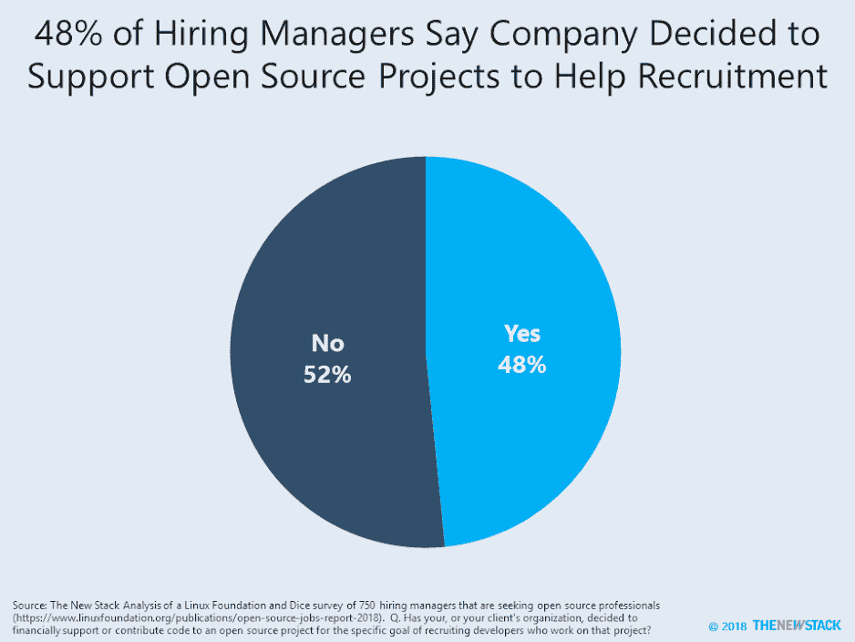

# 开发者招募推动开源资金

> 原文：<https://thenewstack.io/developer-recruitment-drives-open-source-funding/>

最新的 2018 年开源工作报告指出了雇主帮助开发者的几种方式。在这项研究中，Linux 基金会和 Dice 调查了 750 多名招聘开源专业人员的招聘经理。

由于调查的主题，不足为奇的是，几乎一半的招聘经理(48%)说他们的公司决定在财务上支持或贡献开源项目来帮助招聘。尽管这听起来令人难以置信，但质疑招聘经理对开源管理到底了解多少是合理的。由于 57%的招聘经理说他们的公司为开源项目做贡献，粗略计算表明，84%的公司为开源做贡献，至少部分是为了获得新员工。

新的 Stack 和 Linux 基金会已经合作调查社区关于标准化和以编程方式促进开源政策的方法。我们鼓励读者[参与](https://www.surveymonkey.com/r/oss-program11)。

【T2

Linux 基金会是新堆栈的赞助商。

通过 Pixabay 的特征图像。

<svg xmlns:xlink="http://www.w3.org/1999/xlink" viewBox="0 0 68 31" version="1.1"><title>Group</title> <desc>Created with Sketch.</desc></svg>