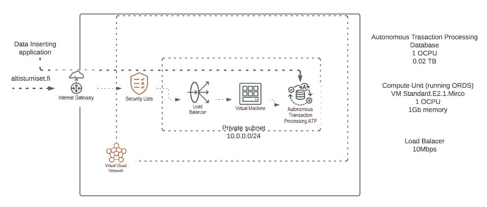
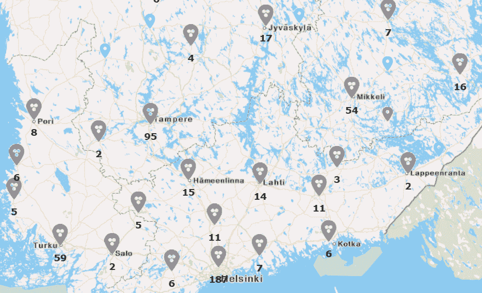

# 开发者策略:如何使用免费云服务

> 原文：<https://thenewstack.io/developer-strategies-how-to-use-free-cloud-services/>

 [杰夫·埃里克森

杰夫是甲骨文公司技术内容总监。你可以在 twitter @erickson4 上关注他，在那里你可能会看到关于禅宗、有趣的科技、足球和公开水域游泳的帖子。](https://www.linkedin.com/in/jeff-erickson-6ba4b41/) 

这里有鱼，有鱼。为了吸引开发者使用他们的平台，云提供商都提供他们的云服务的免费版本。当然，目标是用美味的功能吸引他们，让他们长期成为付费客户。

甲骨文、亚马逊、Azure、谷歌和其他公司的免费服务通常会分解成这样的东西:新客户可以获得数百美元的免费信用，以使用完整版本的云服务，直到他们用完这些信用。现有客户也可以在决定是否购买之前，免费短期使用少量服务进行测试和培训。

但是这些供应商中的许多也在“免费层”中提供他们的服务版本，该版本永远免费。对于开发人员来说，这些功能足够强大，可以用作概念验证项目或正在进行的测试和分析。见鬼，如果你想的话，你甚至可以在其中一些网站上运行 WordPress 或者安装《我的世界》服务器。

这里有三个开发者使用这些永远免费的服务来构建和维护非常有用的应用程序:

## **建立并运营一个数据驱动的网站**

2020 年 9 月，Heli Helskyaho 接到了芬兰志愿者的电话，他们希望在博客中收集新冠肺炎暴露数据，并在 Twitter 上报告。志愿者收集和展示数据的第一次尝试过于费力，所以他们在寻找更好的替代方案。Helskyaho 向他们介绍了 Oracle Cloud 的永远免费层，这将允许他们构建和托管自己的站点，并且不需要资金或许可证。

Helskyaho 的公司 T1 的一些志愿者加入进来，在 Oracle Cloud 上建立了永远免费的 T2 数据库服务 T3。这项免费服务提供了两个数据库，每个数据库有 1 个 OCPU 和 20 GB 存储空间。至关重要的是，数据库服务配备了一个流行的低代码开发环境，称为 Oracle Application Express，或 [APEX](https://apex.oracle.com/en/?source=:ex:pw:::::TNS1&SC=:ex:pw:::::TNS1&pcode=) ，用于构建和托管志愿者设想的基于网络、数据驱动的应用程序。

他们构建了两个应用程序:一个用于插入和维护暴露数据，另一个用于查看数据。数据维护应用程序需要凭证，而用于查看数据的应用程序将对公众开放。

为了方便志愿者，使用 APEX 中的 Data Workshop 将原始数据从 Excel 电子表格拖放到 ATP 数据库中，应用程序会自行完成其余工作。他们是这样建造的。

该团队使用 Oracle APEX SQL Workshop、Oracle SQL Developer 和 Oracle SQL Developer Data Modeler 来设计数据库数据模型并存储数据。剩下要做的就是在数据的基础上构建一个 web 应用程序。使用低代码平台很快就完成了。

Helskyaho 说:“这两个应用程序都是在决定开发后 10 天就投入生产的。”这是一个完美的时机，“因为(新冠肺炎)敞口的数量突然增加。”

在应用程序的第一个版本上线后，该团队进行了几项后续改进。他们为曝光应用注册了一个公共域: [altistumiset.fi](https://altistumiset.fi/) 。通过添加一个永远免费的负载平衡器，并将 web 流量配置为通过 SSL，环境也得到了增强。

图 1 展示了 Oracle Cloud Free Tier 上 altistumiset.fi 的架构。

他们在应用程序中添加了几幅地图，以便最终用户更容易了解芬兰的暴露情况。起初，团队认为添加地图需要一些投资。虽然该团队知道数据库中的空间功能( [Oracle Spatial](https://www.oracle.com/database/spatial/?source=:ex:pw:::::TNS1&SC=:ex:pw:::::TNS1&pcode=) )是免费的，但他们没有意识到如果与 maps.oracle.com API 和可用的 APEX 插件结合使用，地图服务(Oracle Maps Cloud Service)可以完全免费地从 Oracle APEX 应用程序中使用。这使得他们可以免费将地图集成到应用程序中。

图二。位置图显示了该区域中曝光的确切位置和曝光次数。

地图坐标存储在数据库中，当插入地址时，触发器会自动将位置信息添加到表中。然后，地图组件使用该数据在地图上正确定位位置。应用程序中有两种地图:一种是显示确切暴露点的位置图，另一种是用不同颜色显示每个区域相对于其他区域的表现的热图。

只要需要，芬兰志愿者将能够运行该网站。Helskyaho 在这篇博文中更深入地探讨了技术问题。

## **使用免费服务进行持续开发/测试**

这些服务总是免费的，这对初创公司非常有帮助， [retraced](https://www.oracle.com/customers/retraced/?source=:ex:pw:::::TNS1&SC=:ex:pw:::::TNS1&pcode=) 的联合创始人兼首席技术官彼得·梅尔克特说，他的技术帮助服装品牌建立公平和可持续的业务。该公司的平台使用 Oracle 云基础设施中的区块链技术来帮助服装公司验证和交流其供应链中每个步骤的可持续性。

Merkert 的团队从 Oracle Cloud Free Tier 开始，在 Oracle 自治数据库和 [Oracle 区块链](https://www.oracle.com/blockchain/?source=:ex:pw:::::TNS1&SC=:ex:pw:::::TNS1&pcode=)以及其他服务上构建他们的解决方案。知道数据库服务总是免费的，这给了他的团队建立业务的信心。

“因为对于其他所有的云提供商来说，一年后——就在你最终开始获得付费客户的微妙时刻——一大笔账单就来了，”他说。

现在，retraced 已经开始使用付费客户端，它仍然使用免费层的一些元素。

“我们一直在我们的暂存环境中使用免费的负载平衡器，”他说。“我们不断使用免费层 Oracle 自治数据仓库，因为您可以将其直接连接到 Oracle 区块链平台。”

使用自治数据仓库，“SQL 端 JSON 的东西比查询区块链服务更容易、更快。”因为他在一个永远免费的自治数据仓库中存储数据，“有时我们会启动 Oracle 分析云来调查一些事情或将其可视化。”由于 Oracle 云基础架构的弹性，“我只需让它运转几个小时。太神奇了。”

## **建立一个 POS，然后在升级前进行测试**

在芬兰推出新冠肺炎追踪应用的几个月前，加拿大的乔瓦尼·卡尼(Giovani Cani)使用免费层服务来应对疫情向他的企业扔出的曲线球。

Cani 领导着一个团队，为配送中心设计复杂的拖车场，并向加拿大安大略省的 260 多家杂货店运送食品和其他商品。由于新冠肺炎减少了面对面的工作，即使这导致了食品杂货的挤兑，他也需要快速反应，比他当前在云中的应用程序架构允许他做的要快得多。

“构建、测试和部署变更请求可能需要几周甚至几个月的时间，”Cani 说。

为了寻找替代方案，Cani 开发了一个自由层 Oracle 自治事务处理数据库，并开始修补 Oracle APEX。几个小时后，他的团队就有了可行的解决方案。在两天内，他的团队已经构建了一个试点应用程序。

“这相当于花了几个月的时间在另一片云上构建的，”卡尼说。

这款新的应用程序可以让工人用手持设备扫描拖车上的条形码，并快速输入详细信息，如内容、可用性和冷藏状态，从而将工作流程数字化。系统中收集的数据可实时提供给所有配送中心，提高了运营的透明度和责任性。收集到的数据被打上时间戳、地理标记、可搜索并保留用于历史分析。

Cani 说，免费层“使我们能够探索、测试并适应我们的概念验证”。“业务团队对我们能够在如此短的时间内交付的产品印象深刻。然后我们说，‘好吧，现在让我们获得完整的付费版本，并开始扩大用户群。’"

一年后，Cani 的团队仍然使用其在 Oracle 自治数据库和 APEX 的免费层上启动的应用程序，并继续使用免费云服务来尝试 APEX 最新版本中的新功能，然后再决定是否升级。

<svg xmlns:xlink="http://www.w3.org/1999/xlink" viewBox="0 0 68 31" version="1.1"><title>Group</title> <desc>Created with Sketch.</desc></svg>