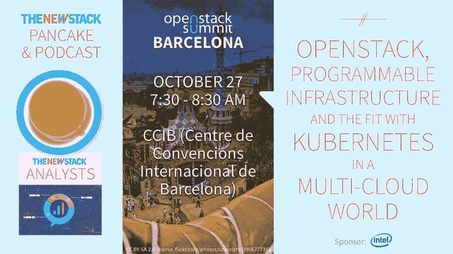

# DevOps 的挑战和“超级鸡”的危险

> 原文：<https://thenewstack.io/developer-super-chickens-enterprises-kryptonite/>

DevOps 已经不仅仅是一个时髦的词，整个科技创业团队都在推动 DevOps 成为解决企业中开发者困境的灵丹妙药。但是转型——无论是组织、文化还是基础设施——都不是一朝一夕就能完成的。

对于许多大公司来说,“开发运维”是一个持续多年的过程。这不是一件容易的事。“我认为简化它会让它看起来像是，‘我们会在上面擦一些 DevOps，明天一切都会好的，’”在欧洲云铸造峰会的[采访](https://www.youtube.com/watch?v=m8l6VsM_UFI)中，[云铸造](https://www.cloudfoundry.org)行业战略[副总裁 Abby Kearns](https://www.linkedin.com/in/abbygregory) 说道。在我们最新一期的 [The New Stack Makers](https://thenewstack.io/podcasts/makers/) 播客中，她与 IBM Blue Box 技术宣传和社区总监 [Kim Bannerman](https://www.linkedin.com/in/kimbannerman) 一起接受了采访:

[devo PS 的挑战和‘超级鸡’的危险](https://thenewstack.simplecast.com/episodes/the-challenge-of-devops-and-the-danger-of-super-chickens)

围绕 DevOps 的神奇思考延伸到组织如何看待 Cloud Foundry 等平台，无论是好是坏。“基本方法更能表明，如果有困难，希望 Cloud Foundry 能够神奇地为他们解决这些问题，但事实并非如此。转型需要组织各个层面的投资和参与。”

相比之下，当 Bannerman 在 12 年前开始她的职业生涯时，术语“人员、流程和工具”开始在今天的技术组织中扎根。Bannerman 指出，虽然企业和大型组织可能希望采用敏捷实践，但如果不伴随着公司文化的变化，他们的计划将会失败。“要改变组织，文化必须改变，人必须改变。工具可以促进变化，也可以不促进变化，但如果人们不接受，它就会失败。”

卡恩斯解释说，致力于改善一个人的组织文化和多样性不是一年只能解决一次的事情。Bannerman 强调了一个事实，即科技行业的许多创业公司似乎都是由赫弗南所说的“超级鸡”组成的

“超级鸡”是鸡群中最强壮、最大、最外向的鸡。人类中的这些性格类型通常是自封的领导者，专注于在任何时候都是发号施令的人，并将自己标榜为行业中的佼佼者。赫弗南解释说，在这项研究中，当这些鸟被放在一起时，完全由“超级鸡”组成的群体以一种壮观的方式适得其反:除了两个幸存者，它们都互相杀死了。

如果这看起来像是你在科技行业的普通一天，这并不奇怪。“当一个团队中有这么多想要控制一切的顶级玩家时，你希望这个团队非常成功，但他们没有，你会坐在一起，互相看着对方，像是在问:‘为什么这样不行？’也许是因为我们需要在所有方面都很强的不同人群，”Bannerman 说。

让一群不同的人组成一个团队是 Kearns 希望今天的组织将关注的事情，尽管许多人已经这样做了。如果没有不同的背景、生活经历和技能，团队成员会犹豫是否要相互挑战，从而阻碍潜在的业务增长。

“如果每个人都在争夺冠军，并且他们只专注于此，他们就不会专注于建立一个稳固的团队，”Bannerman 说。

【T2

[Cloud Foundry Foundation](https://www.cloudfoundry.org/) 是新堆栈的赞助商。

专题图片:金·班纳曼(左)和艾比·卡恩斯。

<svg xmlns:xlink="http://www.w3.org/1999/xlink" viewBox="0 0 68 31" version="1.1"><title>Group</title> <desc>Created with Sketch.</desc></svg>