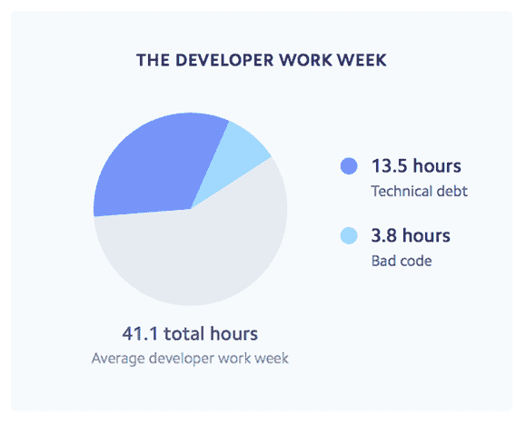
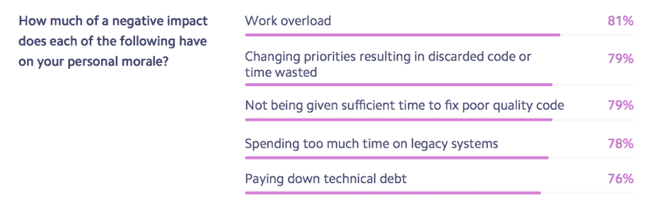
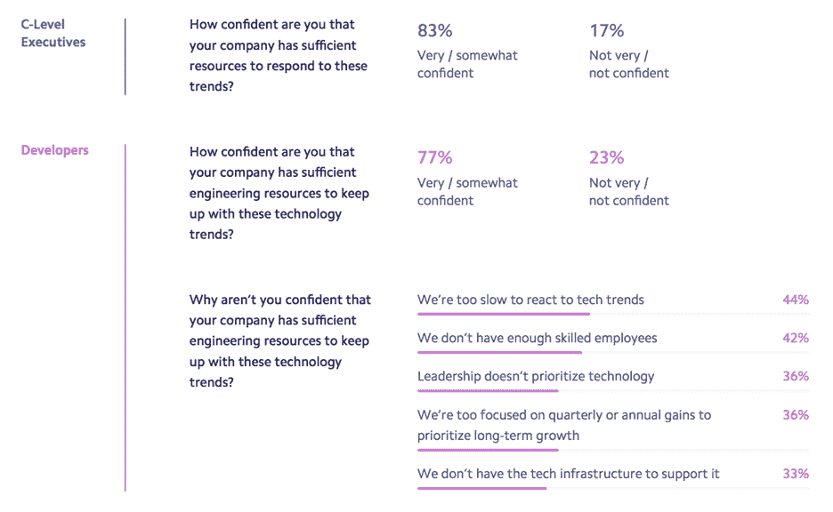

# 开发者人才现在是公司面临的最大挑战

> 原文：<https://thenewstack.io/developer-talent-is-now-the-biggest-challenge-to-companies/>

 [约翰·拉弗勒尔

约翰·拉弗勒尔是 Anaxi 的联合创始人，这是一家软件项目报告公司。他在 B2C 和开发者市场领导产品和营销超过九年。他共同创立了三家有两个出口的创业公司，并两次担任首席执行官，最后一次是在 CodinGame。](https://anaxi.com/) 

*对公司来说，获得开发人员比获得资金更重要！大约 61%的高管认为这是对他们业务的潜在威胁。这是相当激进的，所以我们决定潜心研究这个上个月发表的* [*调查*](https://stripe.com/files/reports/the-developer-coefficient.pdf) *。*

每家公司都不得不向在线服务转型。在这样做的过程中，他们开始面临许多新问题——安全漏洞、贸易关税、复杂的政府法规、日益激烈的全球竞争等。这一切的核心是软件。因此，他们如何部署开发人员可能会成为影响他们未来成功的最大因素。

到 2020 年，美国劳动局估计将有[140 万个新的开发人员职位空缺，而只有 40 万名计算机科学毕业生](https://www.techrepublic.com/article/more-women-developers-hell-yes-says-holberton-school/)来填补这些空缺，所以你可以理解这种能力短缺成为公司最大的挑战。这也解释了为什么工程师的工资水平最近增长如此之快，而且很可能在未来几年继续增长。

### **效率比招聘更重要**

这项调查的重点不是众所周知的人才招聘挑战，而是软件开发效率对公司底线的影响。

如果你有一个由 1000 名开发人员组成的组织，他们的效率降低了 31.6%，就好像你少了 316 名开发人员(嗯…理论上)！

> 难怪开发人员花 32%的时间致力于减少技术债务。

虽然许多人认为缺乏开发人员是主要问题，但这项研究——调查了五个不同国家的数千名 C 级高管和开发人员——发现，如果企业想更快地前进、开发新产品和利用新的和正在出现的趋势，它们需要更好地利用现有的软件工程人才。

当你看一个开发人员的平均一周，大约 4 个小时花在坏代码上，几乎 14 个小时花在技术债务上。这相当于 33%的技术债务和 9.2%的坏代码:总共有 42.2%的时间没有花在构建新代码上！

现在，让我们做一些基本的数学。据估计，美国大约有 350 万开发者。开发人员的平均年薪约为 10 万美元。在这种情况下，效率损失将相当于美国的**1500 亿美元，因此很容易理解为什么工程生产率变得比获得新人才更加重要。**

让我们深入一点，看看这项研究中的*效率损失*意味着什么。

## **效率损失到底是什么？**

在这项研究中，Stripe 调查了 1，000 名开发人员，以便更深入地了解结果。当被问及效率损失的原因时，开发人员强调了三个主要原因:技术债务、不良的优先顺序和构建定制技术(而不是购买第三方技术)。

当被问及效率损失的影响时，以下是他们的投票结果:

这有助于您理解遗留和糟糕的代码是如何成为开发人员日常生活的一部分的。难怪开发人员花 32%的时间致力于减少技术债务。

该研究没有提到的一点是，如果开发人员选择在糟糕或遗留代码的旁边构建新代码，这会影响他们的生产力，因为代码变得比必要的更复杂。因此，实际的效率损失更加明显。

### 公司希望如何面对它

高级管理人员很清楚这个问题，因此将提高开发人员的生产力作为公司的首要任务。

当你看到公司计划增加投资的顶级领域时，前三名都被与开发者挑战相关的问题占据:软件基础设施和技术、R&D 和招聘技术人才(仅排在第三位)。营销、销售和客户服务紧随其后。

请注意，虽然 96%的高管同意提高开发人员的生产力很重要，但只有 43%的人投票支持软件基础设施和技术。所以你可能想知道是否每个人都真的在同一页上。这也是 Stripe 在他们的研究中做得非常好的地方，他们进行了更深入的研究，试图了解被调查的高管和开发人员之间的意见分歧。

### **开发者对此有多大信心？**

同样的问题也被问及高管和开发人员，他们对公司有足够的资源来应对他们所面临的挑战有多有信心。总的来说，情绪是积极的，83%的高管和 77%的开发人员感觉积极。

有趣的是，当你问剩下的 23%的开发人员为什么他们对 it 不*有信心时，他们会提到一些原因，比如技术趋势或工具的采用缓慢、公司内部缺乏竞争力或者公司专注于短期收益。这意味着他们认为高层管理人员对这个问题的理解与他们不同。这就解释了为什么高管们总体上对未来更有信心了。无知是福！*

开发者在公司内部的影响力越来越大。虽然开发人员可能没有购买外部工具或服务的预算，但是管理人员高度重视他们的生产力，因此有动力满足他们的要求。他们不会违背开发人员对任何能够提高他们生产力的工具的选择。

这让我相信，对任何生产力工具使用自下而上的走向市场策略都是有效的，因此开发人员可以影响购买 SaaS 工具的最终决定，并且与自上而下的方法相比，大大缩短了销售周期。

### **总结**

我认为这次调查的收获是认识到开发人员是大多数公司的重要资源，必须给予这种宝贵的资源尽可能多的生产机会。任何不足都会导致整个企业的失败。

通过 Pixabay 的特征图像。

<svg xmlns:xlink="http://www.w3.org/1999/xlink" viewBox="0 0 68 31" version="1.1"><title>Group</title> <desc>Created with Sketch.</desc></svg>