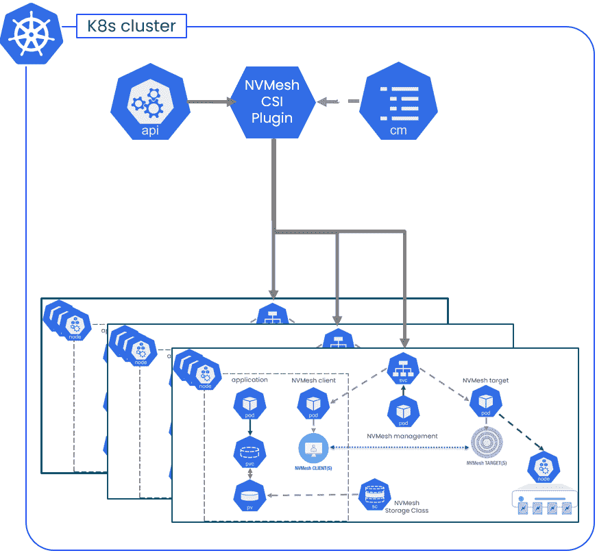

# 固态容器的开发速度-本机 CI/CD

> 原文：<https://thenewstack.io/developer-velocity-with-solid-state-container-native-ci-cd/>

[Kirill Shoikhet](https://www.linkedin.com/in/kirill-shoikhet-5a30441/)

[Kirill Shoikhet 是 Excelero Storage 的首席技术官，为 IO 密集型工作负载提供软件定义的存储，包括其旗舰 NVMesh 解决方案，可在 Kubernetes 上本地运行。他拥有 23 项企业数据中心管理基础技术专利。](https://www.linkedin.com/in/kirill-shoikhet-5a30441/)

有了新冠肺炎，远程工作的效率成了许多组织的首要任务。随之而来的是确保持续集成和交付(CI/CD)部署在最高级别执行的挑战。

一级网络公司在满足使 CI/CD 基础设施的所有元素具有可伸缩性、高性能和容器原生性的看似不相容的要求方面的经验特别有启发性，因为许多组织在疫情后重新思考开发过程。

在远程工作环境出现之前，我们与之合作的这家一级公司的开发人员使用配备快速本地 NVMe 闪存的物理服务器来运行他们的例行 CI/CD 任务，如编译、构建和本地测试。随着开发组织转向远程工作，最初的计划是为每个开发人员分配专用的物理资源，以防止他们浪费宝贵的开发人员时间。然而，很快就发现这种方案使得资源使用效率极低，因为系统长时间处于闲置状态。

解决方案是创建一个大型可扩展的服务器池，开发人员可以从中为特定任务分配虚拟资源。在数万台服务器的规模下，该组织中成熟的控制环境变得必不可少。Kubernetes 是一个自然的选择，它不仅允许一个久经考验的环境，还允许一种将公共云资源作为突发选项甚至混合部署模式的方法。

## 一个关键焦点

促进向 Kubernetes 迁移的主要要求定义如下:

1.  性能—提供足够的性能，以便开发人员的体验可以与 COVID 时代之前的裸机服务器体验相媲美。
2.  可扩展性—该解决方案应该能够扩展到每个集群数千台服务器，以满足预期的峰值需求。
3.  大规模容错和高可用性—系统应能有效处理计算、网络和存储故障。
4.  可维护性—应该可以在不关闭集群的情况下升级系统，同时提供 24×7 服务。

整体性能的关键是该项目的存储方面。组织要么陷入典型挑战的泥沼，要么利用创新来实现更高的效率，从而获得令人印象深刻的竞争优势。

Kubernetes 部署通常会提出容器就绪存储与容器原生存储的问题。两者都使用容器存储接口(CSI)来消费，但是后者是通过 Kubernetes 部署和控制的，不需要任何外部实体。当类似裸机的存储性能至关重要，并且通常需要满足整体用户体验要求时，容器原生存储(CNS)解决方案不能胜任任务是一种常见的误解。

## 避免 CNS 中的数据路径问题

该组织利用我们的 [Excelero NVMesh](https://www.excelero.com/product/nvmesh/) 容器原生软件定义的存储系统为 web 级应用提供低延迟分布式数据块存储。它实现了跨任何网络的共享 NVMe，支持任何本地或分布式文件系统。该系统旨在用于超过 100，000 个节点的大型数据中心，避免了数据路径的任何集中化功能，支持将 NVMe 直接应用于数据路径。(图一)。客户端是完全独立的，不需要跨客户端通信。它的智能客户端也可以直接与目标通信。这减少了网络跳数和通信线路的数量，使得该模式对于大规模环境是可接受的，其中连接的数量是域大小的小倍数。

图一。容器本地存储软件解决方案。

## 高性能的特权容器

当在 Kubernetes 下运行时，该方法能够在 CNS 领域实现高性能。这是通过使用特权容器控制客户端和目标设备驱动程序的部署来实现的，从而使数据路径不受 Kubernetes 环境的容器化特性的影响，并将所有控制和管理平面组件移至基于本地容器 API 的操作。最终的部署如下图所示。(图二)。它是容器原生的，同时保留了裸机存储软件的性能特征。

图二。Kubernetes 存储架构。

在第 1 层 web 公司的生产环境中，应用程序级性能比裸机高 15%-20%，因为存储软件将几个远程 NVMe 驱动器聚合在一个虚拟卷中，呈现给运行应用程序的用户容器。

下一个挑战是为如此关键的运营部分提供最高级别的可用性和容错能力。存储与计算的内在逻辑分离支持在应用服务器出现故障时在计算节点之间移动客户端工作负载。一个可以理解的后续问题是，当出现罕见的边缘情况或存储集群问题时，该体系结构将如何处理存储节点的滚动安全或定期升级，或者防止停机。为了缓解这一问题，该组织决定使用类似云的部署模型，如下图所示。(图 3)。

图 3。使用 Kubernetes 集群的类似云的部署模型。

这个设计遵循了来自[亚马逊网络服务](https://aws.amazon.com/?utm_content=inline-mention)的一篇关于故障隔离的[论文中非常清晰地概述的原则。巨大的库贝内特斯星团充当“局部区域”一个可用区域可以有几个这样的本地区域。每个子集群是这样的本地区域中的一个小区。同一个 Kubernetes 集群中的几个逻辑上独立的单元提供了以下好处:](https://docs.aws.amazon.com/wellarchitected/latest/reliability-pillar/use-fault-isolation-to-protect-your-workload.html)

1.  它们限制了存储网络的规模，允许更低的延迟。
2.  存储相关问题的“爆炸半径”是有限的，以防万一。
3.  能够独立升级存储集群，不会出现任何解决方案停机，也不会出现滚动更新经常带来的性能下降。

CSI 架构有一个固有的限制，即每个 Kubernetes 集群只有一个成员。部署团队使用 Kubernetes ConfigMap 功能来克服这个问题。这允许协调用户容器的部署，以及存储子集群中相应的持久卷的分配。

## 对其进行测试

生产推广的准备工作用了几个月的时间来完成，以便使用几个小集群来完善一切。然后，该系统开始运行，每个本地区域包含 650 个计算节点。每个本地区域有 16 个单元，每个单元有 4 个存储节点。随着这项服务越来越受欢迎，出乎意料的是，下一组 16 个区域仅在一周内就部署完毕。通用硬件的使用意味着这“只是”大规模软件部署的问题。

## 总拥有成本

虽然该组织没有完成对 CI/CD 存储系统的正式总体拥有成本(TCO)分析，但下面是一个示例，我们可以对具有相同挑战的类似环境进行粗略计算。企业中典型的开发人员平均有 10%的时间使用私有基础设施。该企业在世界各地都有开发人员。共享基础架构的平均利用率为 50%，这意味着成本降低了 5 倍。运行时间减少 20%是另一个效率节约。最后，与按开发人员分配基础设施的情况相比，用户还可以灵活地升级和维护损坏的系统，而不会损害用户的利益。

## 摘要

从数据中心运营者的反馈来看，大规模高效部署共享基础设施是一个长期存在的问题。总拥有成本方面的回报可能令人震惊。Kubernetes 是管理应用程序和应用程序生命周期的一个很好的工具，对于这样的环境来说很容易。如果处理得当，Kubernetes 可以处理大量复杂的调度，并提供一个可伸缩的、甚至是弹性的、容错的环境。然而，如果用户的体验受到伤害，他们会理所当然地抱怨。导致人们等待的缓慢会适得其反。稳定的性能是关键，而存储是这种稳定性能的重要组成部分。

容器原生存储系统可以通过熟练处理数据路径问题来消除存储性能问题，并且不会增加熟悉 Kubernetes 的 DevOps 领导者的复杂性。通过支持单元式分区体系结构，根深蒂固的容错能力还支持关键系统的大规模容错和可维护性。

这家网络公司的经验表明，在 CI/CD 系统中忍受低效率或采用复杂解决方案的企业应该考虑迁移到 Kubernetes，通过消除存储问题来简化高效扩展。

<svg xmlns:xlink="http://www.w3.org/1999/xlink" viewBox="0 0 68 31" version="1.1"><title>Group</title> <desc>Created with Sketch.</desc></svg>