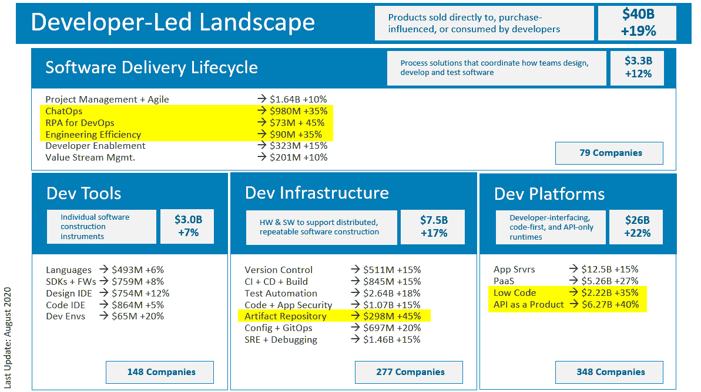

# 开发商再次掌权

> 原文：<https://thenewstack.io/developers-are-in-charge-again/>

“开发商，开发商，开发商！”20 年前，史蒂夫·鲍尔默在微软的一次会议上反复喊着这个词，他的衬衫被汗水湿透了。他以他一贯的过度兴奋的方式表明，开发人员对他的公司至关重要。

今天，我们可以对鲍尔默在 YouTube 上视频窃笑，但实际上，他说得很对:开发人员对软件创新至关重要。然而，有时我们会忘记这一点。在网络时代，风险资本家占据主导地位。在 web 2.0 时代，企业家们争相利用“用户生成的内容”。在移动时代，*每个人*都在社交媒体算法的控制之下。当然，开发商参与了每个时代，但其他力量也在推动市场，无论是投资者的贪婪还是“影响者”的虚荣

 [理查德·麦克马努斯

Richard 是 New Stack 的高级编辑，每周撰写一篇专栏文章，探讨云计算原生互联网的未来。此前，他在 2003 年创立了读写网，并将其打造为全球最具影响力的科技新闻和分析网站之一。](https://twitter.com/ricmac) 

在云原生时代，这一切都变了——开发人员再次走到了前台。当亚马逊在 2006 年推出它的第一个云服务时，如果你仔细听，你会听到一个微弱的口号“开发者，开发者，开发者！”再次启动。但如果你错过了，当 Docker 在 2013 年推出 containers 时，这首歌是一个响亮而有节奏的脉冲。

开发者再次成为主导者，部分原因是当前时代的复杂性(我们*需要*开发者来驾驭云)。但也是因为现在应用的大规模。如果没有云服务和分布式计算，像网飞或 Spotify 这样的消费者服务不可能像今天这样高效。

有一个人很早就注意到了这种转变，那就是泰勒·朱厄尔，他现在是戴尔技术投资公司的董事总经理。朱厄尔提出了一个名为[开发人员主导的前景](https://tylerjewell.substack.com/p/the-developer-led-landscape-20-08-28)的论文，该论文分为 22 个主要部分——包括应用服务器、开发人员支持、代码集成开发环境和 CI + CD +构建。他还提供了一个 [GitHub 知识库](https://github.com/TylerJewell/DevLandscape/)，列出了论文中的每一家公司和产品，映射到类别、细分市场和专业领域。

图片来自泰勒·朱厄尔

我采访了朱厄尔，询问他的论文，为什么开发者对这个时代如此重要，以及他关注哪些新兴的开发主导型市场。

## 论文的发展

我一开始问开发者主导的景观的灵感是什么，他是什么时候提出来的？

“我一直对开发工具和创造它们的企业有点着迷，”他回答道。但多年来，他注意到市场上对开发商业务的“矛盾心理或鄙视”。他看到了一个机会，所以他成为了一名专注于开发者工具的投资者。

起初，他的投资理论被表述为一个简单的公式:“软件需求的增长速度将超过软件开发商生产软件的速度。”这个想法是需要更多的开发工具来帮助开发人员跟上软件的需求。

但是他知道他需要进一步定义他的论题；还有什么比创办自己的开发者工具公司更好的方式呢？因此在 2012 年，朱厄尔创立了[Codenvy](https://codenvy.com/)——一家为开发团队提供云工作空间的公司。

《新堆栈》在 2015 年 10 月首次写到 Codenvy [，指出“Codenvy 在 2013 年开始使用 Docker，使其成为最早采用容器技术的公司之一。”显然，朱厄尔和他的商业伙伴很早就抓住了云计算的浪潮。这一势头一直持续到 2017 年年中，当时 Codenvy 被红帽](https://thenewstack.io/containers-disrupting-devops-infographic/)收购[。](https://thenewstack.io/red-hat-acquire-codenvy-integrate-ide-openshift-io/)

时间快进到 2020 年，朱厄尔又开始全职投资，这次是在戴尔技术投资公司担任董事总经理。在这个职位上，他决定完全充实并公开他的论点，即开发者工具是一个巨大的(并且仍在增长的)市场。

“十多年来，我一直在构建一个数据库，”他解释道，“从中我们可以得出许多有趣的趋势和结论，现在是时候发布、分享并使用这些趋势和数据来帮助其他人理解价值主张了。”

## 朱厄尔发现了哪些趋势？

朱厄尔数据集中最大的发现之一是，开发者平台业务的总收入“是工具和基础设施总收入的 2.5 倍”

在他的 GitHub 知识库中，朱厄尔将开发者平台定义为“开发者接口、代码优先、纯 API 运行时”这些产品和服务包括应用服务器、平台即服务(PaaS)、低代码和 API 即产品。在开发主导的领域中有 348 家这样的公司，如 Twilio(作为产品的 API)、Vantiq(应用服务器)、OutSystems(低代码)和 Cloudflare(在无服务器子类别中作为其 Workers 产品的 PaaS 列出)。

API 作为一种产品增长尤为迅速，根据朱厄尔的计算，年增长率为 40%。我问他在推动这种增长的 API 方面注意到了什么趋势？

他指出，用于通信、fintech 和 healthcare 的 API 在 API 市场中占据主导地位(上文提到的 Twilio 属于通信子类)。但是他发现最有趣的 API“是做得最少的”。他说，他遇到过至少 50 种左右的 API，它们“只做一件事，而且做得很好。”

地址验证、视频图像修改和电子邮件转发是他遇到的几个例子。

另一个快速增长的开发工具部门是工件存储库，同比增长 45%。顾名思义，这些公司提供软件代码库。这方面的市场是由开发人员现在对“可重用模块”的依赖程度的根本性变化驱动的。在他的论文中，朱厄尔写道，在世纪之交，“80%的新应用程序是定制代码，20%来自可重用组件。”但是现在，根据他的分析，“在 2020 年，20%的应用程序是定制代码，80%来自可重用模块。”

朱厄尔的戴尔技术资本是人工制品库市场领导者之一的早期投资者。这家以色列公司最近进行了首次公开募股，目前在纳斯达克价值 75 亿美元。根据朱厄尔的说法，JFrog 的 Artifactory 产品因其两种“独特品质”而“主导”了市场。

“一个是他们不偏向任何特定的编程语言或构建系统，所以他们是不可知论者，支持各种不同的模块和库。他们真的是第一个这样做的人。第二，您可以在任何类型的环境中使用它——云[或]内部。在[JFrog]之前，这是一个难题。”

## 开发人员对 Kubernetes 的看法

开发商主导的局面没有显示出增长放缓的迹象。事实上，当我问朱厄尔关于 Kubernetes 和开发人员对它的复杂性的感受时，他暗示对开发人员来说有一个很大的机会。

“这是 50 年来我们第一次有基础设施模式的转变，这种转变出现在开发者模式转变之前，”他说。

他说在 2013 年到 2014 年容器和 Kubernetes 出现的时候，还没有一个面向微服务的编程范例。这有助于解释为什么开发人员难以适应 Kubernetes。至于现在正在出现哪些开发范例，朱厄尔将[反应式](https://www.reactivemanifesto.org/)架构称为最有前景的架构之一。

“这是一种方式，开发者可以通过它来创建有状态的应用程序，扩展它们并在 Kubernetes 上运行它们，”朱厄尔谈到 Reactive 时说(必须指出，Reactive 是戴尔技术公司另一项资本投资 Lightbend 的一项举措)。他称[反应基金会](https://www.reactive.foundation/)，它是 Linux 基金会的一部分，“CNCF 的开发者伙伴”【云本地计算基金会】。

他还引用了事件驱动架构和无服务器作为在 Kubernetes 世界中帮助开发者的另外两个趋势。

## 准备唱诵…

2020 年的开发者前景有很多令人兴奋的地方，尤其是现在 Kubernetes 正变得“[无聊](https://thenewstack.io/kubecon-pancake-breakfast-why-your-k8s-stack-should-be-boring/)因为云基础设施是坚实可靠的，所以云原生社区开始更加关注在其上构建什么。

我只是希望，在今年 11 月的 [KubeCon + CloudNativeCon](https://events.linuxfoundation.org/kubecon-cloudnativecon-north-america/) 虚拟会议上，有人会从他们的家庭办公椅上跳起来，带头高呼:“开发者，开发者，开发者！”

<svg xmlns:xlink="http://www.w3.org/1999/xlink" viewBox="0 0 68 31" version="1.1"><title>Group</title> <desc>Created with Sketch.</desc></svg>