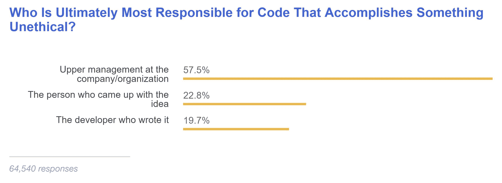

# 开发商有道德却不负责？

> 原文：<https://thenewstack.io/developers-ethical-not-responsible/>

问一个人他或她是否是种族主义者，答案几乎总是否定的。问一个开发人员他们在编写代码时是否考虑过道德因素，只有 6%的人说没有。如果每个人都像他们自我报告的那样行事，那么世界将会充满和平与爱。

基于超过十万名受访者，StackOverflow 的[开发者调查 2018](https://insights.stackoverflow.com/survey/2018) 呈现了一个更复杂的现实。如果他们被要求为不道德的目的编写代码，59%的人会说不，但另外 37%的开发人员不确定他们是否会遵守。在另一个问题中，只有大约 5%的人说他们绝对不会报告不道德的代码问题。但是大多数人只能发出警报了。

【T2

当被问及谁对代码完成的事情负有最终责任时，几乎 58%的人将责任推卸给上层管理人员。只有 20%的人认为真正的开发商是罪魁祸首。换句话说，开发人员可能会说出来，但可能难以将自己的责任内化。

这指出了人工智能领域更广泛的含义。在同一项调查中，49%的人表示，创造人工智能的人主要负责考虑其后果，只有 28%的人认为政府或监管机构有责任。即使他们正在考虑其后果，总的来说，73%的开发人员表示，他们对人工智能的可能性更感兴趣，而不是担心它的危险。

正如 Circonus 的 Theo Scholossnagle 和 Anne Currie 在最近的播客中所转述的那样，考虑软件伦理是很重要的，并且应该整合到开发人员的日常工作中。除了会议上的讨论，伦理上的考虑应该成为正式决策过程以及日常选择的标准。关于什么是道德的，也许会有不同的看法。也许会做出一个集体决定，最终负责的是政府而不是个人。重要的是，在人们对技术的社会影响承担责任之前，伦理需要有一席之地。

通过 Pixabay 的特征图像。

<svg xmlns:xlink="http://www.w3.org/1999/xlink" viewBox="0 0 68 31" version="1.1"><title>Group</title> <desc>Created with Sketch.</desc></svg>