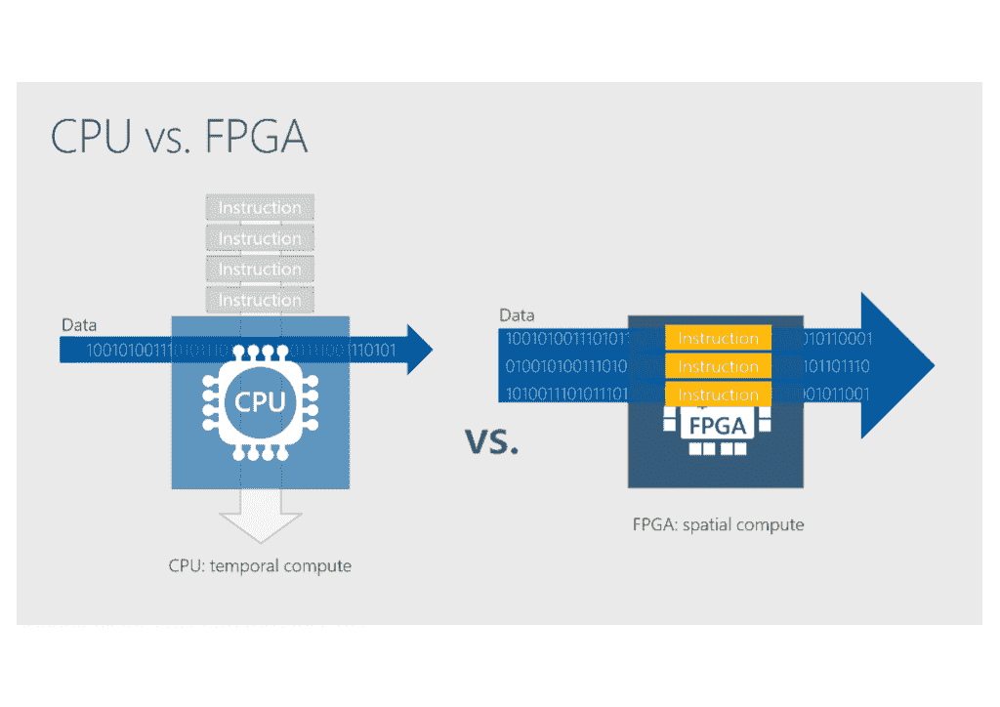
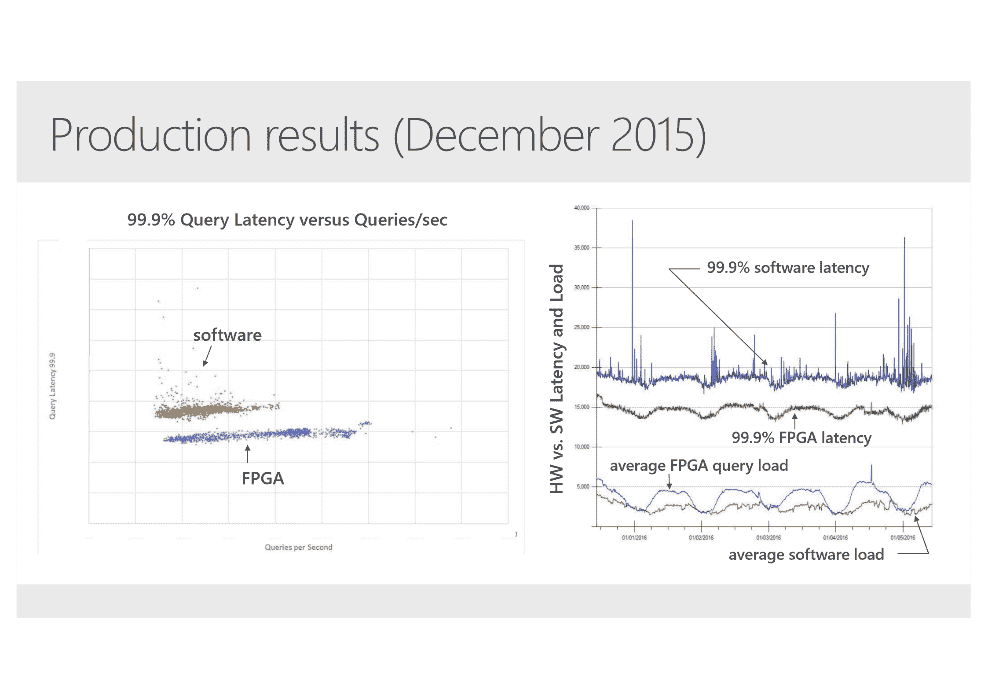
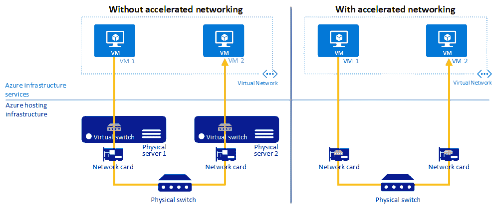
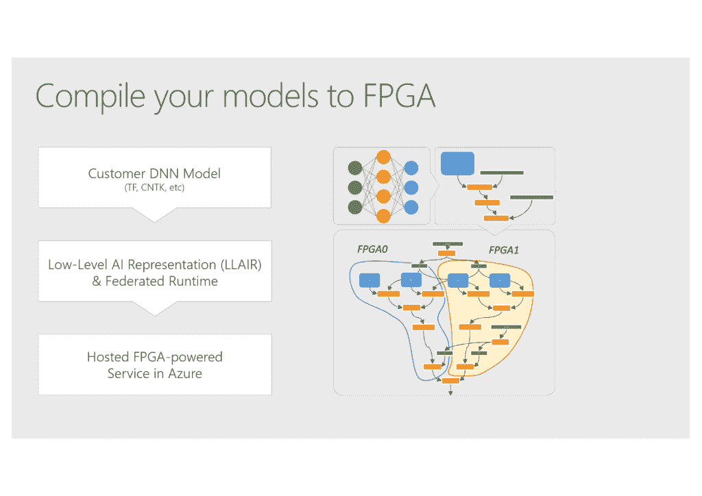
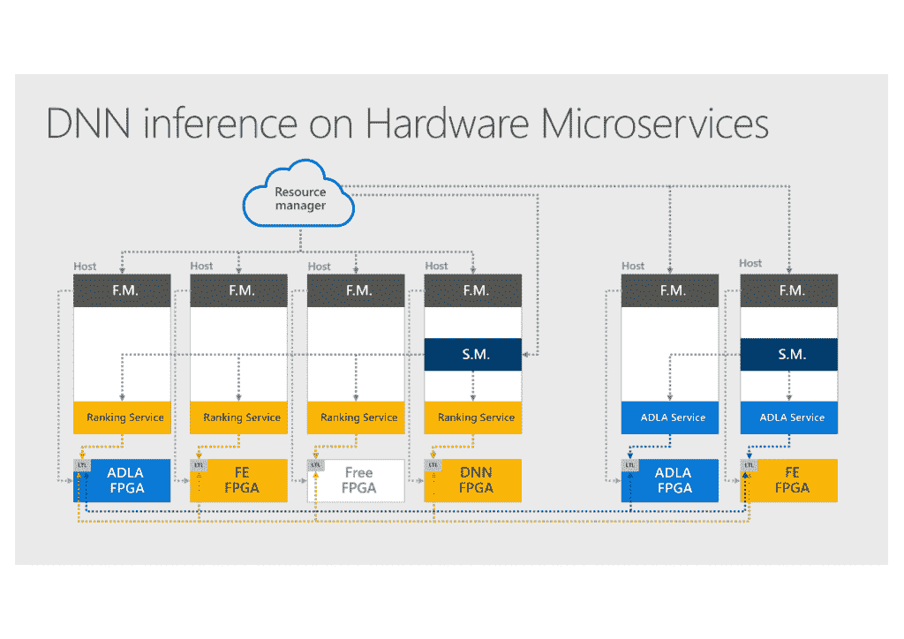

# FPGAs 和基于云的“硬件微服务”新时代

> 原文：<https://thenewstack.io/developers-fpgas-cloud/>

在今年早些时候微软 Build 大会的主题演讲中，微软人工智能和研究负责人 Harry Shum 暗示，在某个时候，微软 Azure 云服务将允许开发人员访问现场可编程门阵列(FPGAs)。Azure 首席技术官 [Mark Russinovich](https://twitter.com/markrussinovich) 也谈到了 Azure expose“[FPGA]在未来的某个时候为你提供服务。”

FPGA 驱动的未来会是什么样子，开发人员将如何使用它？

FPGAs 无论如何都不是一项新技术；传统上，它们被保留给专门的应用，在这些应用中，随着非常苛刻的算法的发展，对可以更新的定制处理硬件的需求超过了对硬件编程的复杂性。

对于处理器，Russinovich 向新堆栈解释说，“一般来说，你的通用目的越多，你就越灵活，你可以向计算引擎扔越多种程序和算法——但你牺牲了效率。”

组成 FPGA 的门阵列可以通过编程来运行特定的算法，使用逻辑门(通常以查找表的形式实现)、算术单元、执行乘法的数字信号处理器(DSP)、用于临时存储这些计算结果的静态 RAM 以及用于控制可编程模块之间连接的开关模块的组合。一些 FPGAs 本质上是片上系统(SoC)，具有 CPU、PCI Express 和 DMA 连接以及以太网控制器，将可编程阵列转变为 CPU 上运行的代码的定制加速器。

这种结合意味着 FPGAs 可以提供仅针对特定算法的大规模并行性，并且与 GPU 相比功耗低得多。与专用集成电路(ASIC)不同，当您想要改变算法时，它们可以重新编程(这是现场可编程部分)。

FPGAs 比 CPU 有更多的数据并行性。

Russinovich 解释说:“FPGAs 实现了这一点，它们可以非常快速地并行处理数据流。“它们像 GPU 或 CPU 一样是可编程的，但旨在这个并行低延迟世界中进行推理和深度神经网络等工作；如果您需要进行在线语音识别、图像识别，那么低延迟真的非常重要。”

缺点是编程和重新编程是用复杂的低级硬件定义语言完成的，如 [Verilog](http://www.verilog.com/) 。[初创公司 ReconfigureIO 的首席执行官罗布·泰勒](https://twitter.com/robtaylor78)告诉新的堆栈，没有多少硬件工程师熟悉这些，reconfigure io 计划通过让开发人员用 Go 编程 FPGAs 来提供云中的硬件加速。

大多数 FPGA 开发发生在处理器开发公司。非常不同的编程模型，你实际上是在配置硬件，这对于习惯于高级语言的开发人员来说是一个挑战。

“作为一名软件工程师，你可以开始编写简单的硬件，但编写有能力的硬件需要几年的学习才能正确，”泰勒说。[在极少数情况下](https://electronics.stackexchange.com/questions/293915/vhdl-that-can-damage-FPGA)，对 FPGA 编程可能会永久损坏它，尽管对硬件编程的工具链应该会提供警告。

泰勒认为，这是 FPGAs 从未成为主流的原因之一。“这是做 FPGA 工程的成本。如果你只能雇几个昂贵的工程师，你能做的就只有这么多了。你最终得到的是非常垂直的特定解决方案，而你得不到云计算带来的创新。”

尽管如此，泰勒认为 FPGAs 是解决一系列问题的好办法。“任何移动中的数据，你都可以处理它，得到答案，做出反应，或者在其他地方分享答案。你可以在 FPGA 上构建一个内存数据库，以惊人的速度进行统计分析，而无需接近 CPU。”这种应用可能包括图像和视频处理、实时数据分析、广告技术、音频、电信甚至软件定义网络(SDN)，他指出这“仍然是一种巨大的资源消耗。”

重新配置的方法使用 [Go 通道](https://gobyexample.com/channels)，泰勒说这符合 FPGA 管道的模型，“但我们正在研究一个中间层，我们希望它是标准的和开源的，让人们可以使用他们想要的任何随机语言。”

编程的复杂性是亚马逊网络服务 [FPGA EC2 F1 实例](https://aws.amazon.com/ec2/instance-types/f1/)让您对[Xilinx FPGA](https://www.xilinx.com/products/silicon-devices/fpga.html)进行编程的原因，它的目标客户是那些已经在基因组学、分析、加密或金融服务中使用 FPGA 设备处理垂直工作负载，并希望将这些工作负载带到云中的客户。AWS 实际上为 FPGA 配置提供了[硬件开发套件。像 Ryft](https://github.com/aws/aws-fpga) 这样的一些设备制造商将提供 API 来将 AWS FPGA 实例与他们的分析平台集成，就像他们的 FPGA 设备已经做的那样。

> Azure 内部两个虚拟机之间的带宽，即使每个虚拟机上有 40 千兆网络适配器，也只有每秒 4Gbps 左右；借助 FPGA 加速网络，这一速度可达 25Gbps。

FPGA 供应商开始提供更高级别的编程选项，如 C、C++和 OpenCL。AWS 正在依靠 OpenCL FPGA 编程在未来接触更多的开发人员，尽管这仍然需要大量的专业知识，并且不一定是 FPGA 编程模型的良好匹配。

“这仍然是一种非常深奥的开发环境，”Russinovich 指出；“但我认为趋势很明显，事情将变得越来越容易获得。我想你可以想象在某个时候——我在这里谈论的是一个遥远的未来愿景——开发人员使用不同的语言编写程序，这些工具会查看你的算法，并根据分析或分析确定，如果我们在 FPGA 上运行程序的这一部分，在 GPU 上运行程序的这一部分，在 CPU 上运行程序的这一部分，效率会更高，开发人员只需利用平台提供的最佳功能。

## 智能网络

微软采取了一种完全不同的方法。在 Azure 上，你实际上已经可以使用基于 FPGA 的服务了；你只是不知道你在使用 FPGA——就像你在使用微软的认知服务时不知道你在使用闪存固态硬盘一样。事实上，整个 Azure 网络依赖于 FPGA 支持的软件定义网络。

当微软最初开始将 FPGAs 放入 Azure 时，它是为了将低延迟和高吞吐量扩展到具有非常大的数据量和非常高的流量的系统；必应的索引服务器。最初，这些 FPGAs 有自己的网络连接，但为了简化网络拓扑，微软将它们连接到与它们所在的服务器相同的网卡。一旦 FPGAs 直接连接到这些网卡，它们还可以加速 Azure 用于路由和负载平衡的软件定义的网络。

FPGAs 对 Bing 查询延迟的影响:即使在两倍的查询负载下，FPGA 加速的排序在任何负载下都比软件驱动的排序具有更低的延迟。

就像设计在网卡上的定制硅一样，这些 FPGA SmartNICs 比 CPU 更高效，功耗更低。但是，随着微软改进软件定义的网络堆栈，使其能够与即将推出的 50GB 和 100GB 网络适配器配合使用，FPGAs 可以重新编程——这是定制芯片无法做到的。

这些智能网卡已经实现了流表，这些流表是 Azure 的软件定义网络的基础。将来，他们可能还会实现服务质量或 RDMA，并通过卸载加密计算和错误检查来加快存储速度。

自去年以来，Azure Accelerated Networking 已经在更大的 Azure VM 上可用，适用于 Windows Server 和 Ubuntu，尽管该服务仍处于预览阶段，并存在 Russinovich 所说的“极其罕见的兼容性问题”，所以你必须选择使用它。它也有一些限制，比如如果你想同时在 Windows Server 和 Linux 上使用 Azure，就需要单独的 Azure 订阅。Azure 中两个虚拟机之间的带宽，即使每个虚拟机上有 40 千兆网络适配器，也只有每秒 4Gbps 左右；借助 FPGA 加速网络，速度可达 25Gbps，延迟降低 5 到 10 倍(取决于您的应用)。

FPGA 加速的 SDN 的影响(归功于微软)。

下一步是为开发者构建使用这些 FPGAs 的服务，即使是间接的。Russinovich 解释说:“有多种方法可以让包括我们在内的开发人员使用 FPGAs，只是将它们用于基础设施的增强，这是每个使用我们云的开发人员都会受益的，比如 SDN。“我们希望为开发人员提供深度神经网络[DNN]和推理模型，这些模型易于部署和使用，并且在 FPGA 上运行 DNN，因此他们可以获得最佳性能。例如，他们会在 GPU 上进行培训，然后给我们带来模型。开发人员不知道下面是 FPGAs 他们只是把 DNN 模型交给平台，平台以最有效的方式执行它。

开发者在 Azure 中使用 FPGAs 的不同方式(归功于微软)。

Russinovich 展示了这种构建的优势，他称之为“几十到几百万亿次运算，所以你可以得到真正有效的推断。”在 24 个 FPGAs 而不是 24 个 CPU 上运行相同的机器学习算法，他显示出延迟提高了 150-200 倍，能效提高了约 50 倍。

开发人员已经可以通过微软认知服务 API 利用这一点。“我们已经在 Bing 中实现了这一点，作为认知服务训练和 Bing 指数排名下一级加速的一部分。”

## 硬件微服务

虽然部署在 Azure 中的每个 FPGA 都与 CPU 在同一个主板上，并作为硬件加速器连接到它们，但它们也直接连接到 Azure 网络，因此它们可以以非常低的延迟连接到其他 FPGA，而不是通过 CPU 传输数据来降低速度。

这让您可以更好地利用 FPGAs，并灵活地将它们作为也运行在 CPU 上的分布式应用的一部分进行加速，或者试验您仍在开发的加速算法。Russinovich 告诉我们:“如果你不确定你正在处理的数据的压缩或加密的最佳算法，或者数据形状将随着时间的推移而变化，所以你不想冒险将其烧到芯片上，你可以在 FPGAs 上进行试验并保持敏捷。”

一个管理结构将这些直接连接的 FPGA 协调到应用中，因此用 TensorFlow 或[Microsoft Cognitive Toolkit](https://thenewstack.io/microsoft-adds-python-support-cntk-deep-learning-toolkit/)(CNTK)预训练的模型的 DNN 的不同层可以在不同的 FPGA 上——给你一种在许多设备上分布非常深的网络的方法，这避免了许多 DNN 框架的扩展问题。

跨 Azure FPGA 硬件微服务架构分发 DNN(归功于微软)。

Russinovich 告诉我们:“这是 FPGAs 的一种更为普遍的用途，我们认为在这方面有很多创新的潜力，我们称之为硬件微服务。”“如果你有一大群 FPGAs，它们直接连接到网络，并可通过网络编程，那么你能开发出哪种应用程序，其加速方式是我们在现有的标准硬件上无法实现的？我们首先将该基础设施用于我们的 dnn，但我们认为它将成为一个通用平台。”

他谈到，该结构具有网页搜索排名、深度神经网络、SQL 加速和 SDN 卸载编程。“ [Azure Data Lake Analytics](https://azure.microsoft.com/en-us/services/data-lake-analytics/) 正在考虑将机器学习也推广到 FPGAs 中。”

开发人员最终会编写自己的应用在硬件微服务可重构计算层上运行吗，或者他们会以任何方式广泛使用 FPGAs 吗？Russinovich 预测了开发者使用 FPGAs 的多种方式。

“会有开发者直接利用这些东西，但我认为许多开发者最终会通过利用包含这些东西的库和框架，或者使用 ISV 或开源社区提供的微服务模型来间接利用这些东西。”接下来，他建议可以像容器一样工作。

“如今，在开发者领域，如果我想要一个 REST 前端，我只需拉一个 node.js Docker 容器。我不用自己写，我只是在用。我想你会看到同样的模型，你会说我想要这个算法，我想要它的最有效的部署，我将把它部署在 FPGA 上，即使我没有直接编写进入 FPGA 的代码，甚至可能我从 Docker 存储库中获得它！”

FPGAs 对于有专业知识与之合作的云提供商来说是有意义的，但它们也可能出现在你收集大量数据的地方。“我确实认为 FPGAs 在边缘上有一席之地，因为你会在边缘上进行许多推理。您不必将数据发送到云中，而是在那里进行处理，您可以在 FPGAs 上进行增量训练，并让模型随着边缘使用的数据而发展。”

Russinovich 指出，这还有一段路要走，但正如随着摩尔定律对 CPU 的影响减弱，GPU 成为某些问题的标准开发工具一样，FPGAs 也是如此——无论开发人员是否知道他们在使用它们。

“我们正处于开放它的早期阶段，不仅 Xilinx 和 Altera 等供应商可以使用它，而且正在寻找 FPGAs 高级编程语言的初创公司也可以使用它。我认为我们正处于新一代技术的第一波浪潮中，这是一种技术的重生，它似乎来了又去——每隔五到十年它就会变热，然后逐渐消失，但我认为这次它会一直存在。”

<svg xmlns:xlink="http://www.w3.org/1999/xlink" viewBox="0 0 68 31" version="1.1"><title>Group</title> <desc>Created with Sketch.</desc></svg>