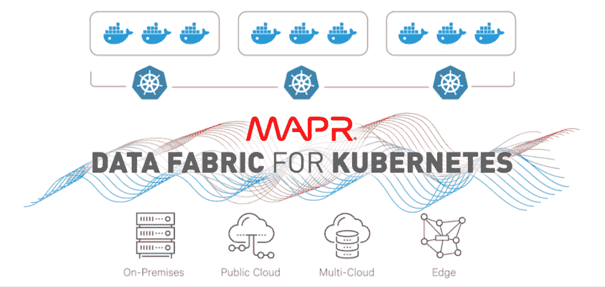

# MapR 的数据平台为 Kubernetes 提供了一个持久存储层

> 原文：<https://thenewstack.io/developers-like-maprs-persistent-storage-kubernetes/>

MapR 最近在其[融合数据平台](https://mapr.com/solutions/data-fabric/kubernetes/)中增加了 [Kubernetes](/category/kubernetes/) 支持，这是值得注意的，但也是意料之中的，因为集装箱化和所有东西的 Kubernetes 都很受欢迎。但 MapR 发布的关键是大数据应用平台如何为使用开源容器编排引擎的开发人员提供持久存储。

这个想法是让开发人员担心他们最擅长什么:在 Kubernetes 上部署应用程序，而不必担心持久存储的数据访问。这是因为持久存储现在已经加载到了 [MapR](https://mapr.com/) 的平台上。

“对持久存储的直接、开箱即用和基于供应商的支持才是最重要的。当企业进行自我整合时，他们会承担整合的风险。考虑到每个活动部件都需要重新测试、潜在的编码、再次测试、首次展示等，还有很多维护工作要做。“[星座研究](https://www.constellationr.com/)的分析师道格·亨舍恩告诉我们。“当供应商从一开始就支持持久存储时，事情就简单多了。”

鉴于容器的短暂性，在传统的庄严平台上开发有状态应用程序当然是一个开发挑战。与此同时，经常需要的持久存储只能为容器上的应用程序增加一个额外的开发障碍，否则当服务器关闭时，这些应用程序可能会被删除。MapR 的解决方案旨在为那些更关心利用 Kubernetes 提供的灵活性和敏捷性的开发人员处理等式中的持久存储部分。

[企业管理协会(EMA)](https://www.enterprisemanagement.com) 的分析师 [John L. Myers](https://www.linkedin.com/in/johnlmyers/) 告诉我们，“MapR 是对那些说‘我们不想做持久存储的事情’的开发者社区的回应。“MapR 的 Kubernetes 公告是关于为应用程序开发人员提供封装数据管理、存储和结构层上发生的一切的自动化功能。相反，他们希望专注于 API，而数据结构是分布式和可扩展的，而不是成为瓶颈。”

事实上，MapR 认为有必要将无状态添加到有状态中，以在分布式平台上部署生产应用程序，在这个平台上可以存储、处理和分析大量数据，[MapR](https://www.linkedin.com/in/suzyvisvanathan/)产品管理总监 Suzy Visvanathan 告诉我们。“要使容器有状态，提供持久存储是关键，同时仍然保留容器的短暂状态。，”Visvanathan 说。“如果没有持久存储，容器将是开发/测试/POC 环境中使用的一种短暂趋势。借助持久存储，客户可以迁移/创建在生产环境中运行的容器化应用程序。”

对 Kubernetes 的支持是在去年 MapR 为有状态应用程序增加了持久存储之后。针对 MapR 数据结构支持，其卷驱动程序为数据库、文件和流提供持久存储卷。当然，这也延伸到了云、边缘和本地存储。还提供了位于 MapR 集群内外的多租户、容器化和非容器化应用程序的计划自动化。在生产用例的容器中部署有状态的应用程序也可以扩展到机器学习管道。跨数据访问支持包括 NFS，S3，HDFS，ODBC。

作为一个涉及交易应用的潜在案例，MapR 的[融合数据平台](https://mapr.com/solutions/data-fabric/kubernetes/)旨在无需不必要的数据复制即可将数据即时提供给存储层，以便实时访问海量数据池。例如，为信用检查、支付和订单执行而分别运行的多个容器可以有一个平台自带的公共存储层。

容器中的应用程序也实时访问存储层。否则，如果您将数据存储在每个容器中，就需要将数据复制扩展到所有这些组件。

“MapR 真正获得了自己的地位，因为现在您可以让地理上分散的应用程序与 Kubernetes 上的分布式数据结构进行对话，并获得他们所需的响应速度。”迈尔斯说。“因此，应用程序开发人员不必为开发找借口或耍花招，因为 MapR 会处理所有这些事情。”

由 [MontyLov](https://unsplash.com/photos/m2TJvN_GRbY?utm_source=unsplash&utm_medium=referral&utm_content=creditCopyText) 在 [Unsplash](https://unsplash.com/search/photos/platform?utm_source=unsplash&utm_medium=referral&utm_content=creditCopyText) 上拍摄的特征图像。

<svg xmlns:xlink="http://www.w3.org/1999/xlink" viewBox="0 0 68 31" version="1.1"><title>Group</title> <desc>Created with Sketch.</desc></svg>